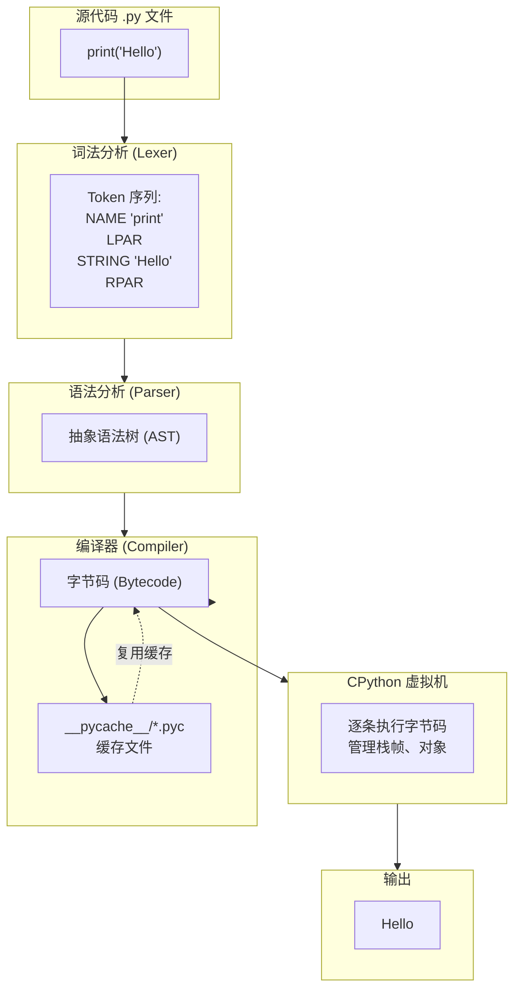
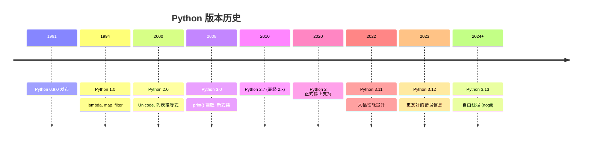
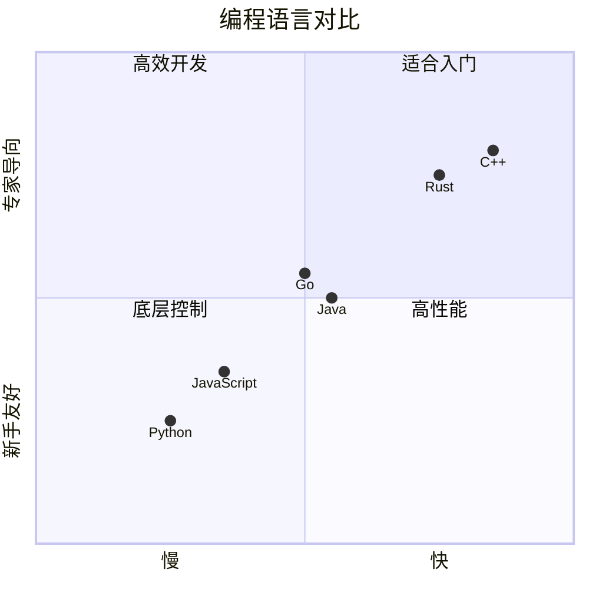

# Python 执行流程



---

# Python 内存模型（基础）

```
                 ┌─────────────────────┐
                 │    内存地址空间      │
                 │                     │
                 │  ┌───────────────┐  │
                 │  │    代码区      │  │
                 │  │ 字节码指令     │  │
                 │  └───────────────┘  │
                 │                     │
                 │  ┌───────────────┐  │
                 │  │    栈区        │  │
                 │  │  ┌─────────┐  │  │
                 │  │  │ 栈帧 1  │  │  │
                 │  │  │ 局部变量 │  │  │
                 │  │  │ 返回地址 │  │  │
                 │  │  └─────────┘  │  │
                 │  │  ┌─────────┐  │  │
                 │  │  │ 栈帧 2  │  │  │
                 │  │  │ ...     │  │  │
                 │  │  └─────────┘  │  │
                 │  └───────────────┘  │
                 │                     │
                 │  ┌───────────────┐  │
                 │  │    堆区        │  │
                 │  │  ┌─────────┐  │  │
                 │  │  │ 对象 A  │  │  │
                 │  │  │ "Hello" │  │  │
                 │  │  └─────────┘  │  │
                 │  │  ┌─────────┐  │  │
                 │  │  │ 对象 B  │  │  │
                 │  │  │   42    │  │  │
                 │  │  └─────────┘  │  │
                 │  │  ...          │  │
                 │  └───────────────┘  │
                 └─────────────────────┘
```

# Python 版本演变



# Python VS 其他语言


