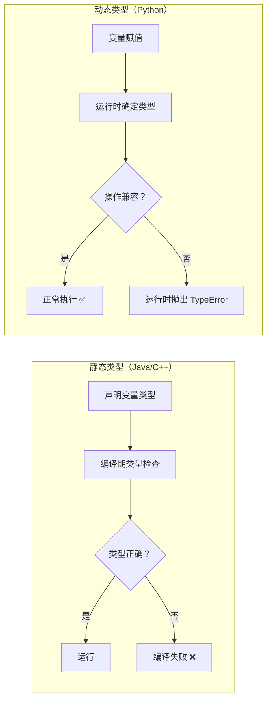
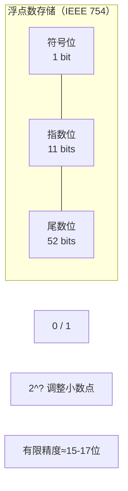
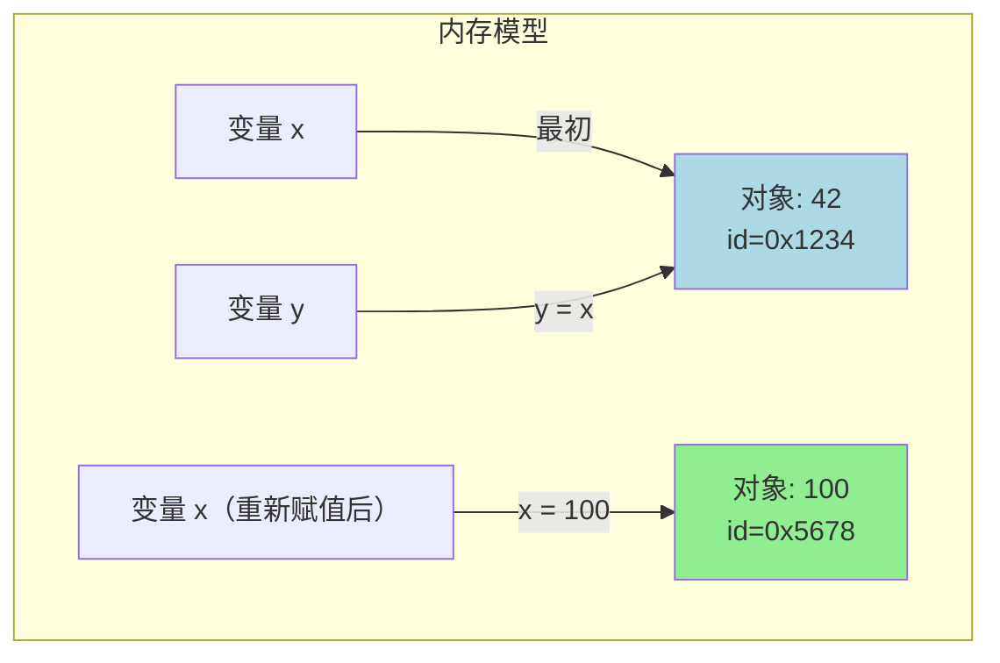

# Day 002 — 变量与数据类型

> Python 编程的基石：理解数据如何在内存中存储与流转

---

## 📋 今日学习目标

- [ ] 理解变量的定义、命名规则与赋值机制
- [ ] 掌握 Python 动态类型系统的核心原理
- [ ] 熟练使用 int、float、str、bool、None 五种基本类型
- [ ] 学会用 `type()` 和 `id()` 探查对象的身份
- [ ] 完成实战：个人信息卡片输出

---

## 一、什么是变量？

### 1.1 概念解释

**变量（Variable）** 是编程语言中用来存储数据的"命名容器"。你可以把变量想象成一个贴了标签的盒子——标签是变量名，盒子里装的是数据。

```python
name = "Alice"   # 变量 name 存储字符串 "Alice"
age = 25         # 变量 age 存储整数 25
```

### 1.2 Python 变量的本质（重要原理解析）

这是 Python 最独特也最重要的特性之一：

> **Python 变量不是"盒子"，而是"标签"**

大多数语言的变量像盒子：
```
┌──────────┐
│  Alice   │  ← 变量 name 是一个容器，直接装着值
└──────────┘
```

Python 的变量像标签：
```
      name           age
       │              │
       ▼              ▼
    ┌──────┐      ┌──────┐
    │Alice │      │  25  │
    └──────┘      └──────┘
    内存对象        内存对象
```

**关键区别**：
- C/Java 等静态语言：变量 = 内存容器，声明时就决定能装什么类型
- Python：变量 = 名字标签，可以贴到任何对象上，运行时决定类型

**赋值语句 `x = 10` 在 Python 中实际发生了三件事**：
1. 在堆内存中创建一个整数对象 `10`
2. 将这个对象的**内存地址**赋给变量 `x`
3. `x` 现在指向（引用）了那个对象

```python
a = 10
b = a       # b 现在也指向 10 这个对象
a = 20      # a 指向新的对象 20，b 仍然指向 10
print(b)    # 输出 10 —— 标签 a 贴到新对象上了
```

这就是"标签比喻"的完美体现。

### 1.3 变量命名规则

Python 的变量命名遵循以下规则：

| 规则 | 说明 | 正确示例 | 错误示例 |
|------|------|----------|----------|
| 字母/数字/下划线 | 只能包含这些字符 | `my_var` | `my-var` |
| 不能以数字开头 | 首字符必须是字母或下划线 | `_var1` | `1var` |
| 区分大小写 | `name` 和 `Name` 不同 | `Name = "A"` | — |
| 不能是关键字 | 不能使用 Python 保留字 | `my_if` | `if` |

**Python 保留字列表**（共 35 个）：

```
False, None, True, and, as, assert, async, await, break, class, 
continue, def, del, elif, else, except, finally, for, from, global, 
if, import, in, is, lambda, nonlocal, not, or, pass, raise, return, 
try, while, with, yield
```

### 1.4 命名风格约定（PEP 8）

Python 社区推荐以下命名规范：

```python
# ✅ 变量和函数：snake_case（小写+下划线）
user_name = "Alice"
def get_age(): pass

# ✅ 常量：UPPER_SNAKE_CASE（全大写+下划线）
MAX_RETRIES = 3
DEFAULT_PORT = 8080

# ✅ 类名：PascalCase（首字母大写）
class UserProfile: pass

# ❌ 不推荐：camelCase（驼峰式，多用 Java）
userName = "Alice"    # 虽然能运行，但不 Pythonic
```

---

## 二、动态类型系统

### 2.1 动态类型 vs 静态类型

Python 是**动态类型（Dynamic Typing）**语言，这是它与 C、Java、Go 等语言最显著的区别。

```python
# Python：同一个变量可以指向不同类型的对象
value = 42          # 现在是整数
value = "Hello"     # 现在变成字符串 —— 完全合法！
value = [1, 2, 3]   # 现在变成列表
```

对比静态类型语言：

```java
// Java：变量类型一旦声明就固定了
int value = 42;     // 声明为 int 类型
value = "Hello";    // ❌ 编译错误！不能把 String 赋给 int
```

### 2.2 为什么 Python 选择动态类型？

**设计哲学：简洁 > 复杂**

Python 的创造者 Guido van Rossum 认为：
- 开发效率比编译期检查更重要
- 程序员应当为自己的类型负责
- "Batteries included" 也包括让语言本身不设限

**动态类型的优势**：
- 代码更简洁，写起来更快
- 泛型/多态自然支持（无需模板语法）
- 更适合快速原型开发和脚本

**动态类型的代价**：
- 运行时可能发现类型错误（本来可在编译期发现）
- IDE 代码补全不如静态语言精确
- 大型项目难以维护（可通过类型注解缓解）

### 2.3 Python 3 的类型注解（现代补救措施）

从 Python 3.5 开始，Python 支持**类型注解（Type Hints）**作为一种"软"类型检查：

```python
def greet(name: str) -> str:
    return f"Hello, {name}"

# 类型注解不会影响运行时行为
# 但可以被 mypy、PyRight 等静态检查工具分析
```



---

## 三、基本数据类型

> Python 中一切皆为对象，基本类型也不例外。

### 3.1 int（整数）

Python 的整数支持任意精度（不像 C 的 int 有 32 位限制）：

```python
a = 42           # 十进制
b = 0b101010     # 二进制 → 42
c = 0o52         # 八进制 → 42
d = 0x2A         # 十六进制 → 42
e = 10_000_000   # 下划线分隔（提高可读性）→ 10000000

# Python 整数没有溢出（Big Integer）
f = 2 ** 1000    # 巨大整数，没问题！
print(len(str(f)))  # 输出 302（302 位数！）
```

**底层原理**：Python 的 int 是一个可变长度的 C 结构体（`PyLongObject`），内部用数组存储每一位（30-bit 一组），因此没有固定范围限制。

### 3.2 float（浮点数）

浮点数用于表示小数，但需要理解它的**精度问题**：

```python
pi = 3.14159
e = 1.0e-5       # 科学计数法 → 0.00001
inf = float('inf')   # 正无穷
nan = float('nan')   # 非数字（Not a Number）

# ⚠️ 浮点数精度问题
print(0.1 + 0.2)          # 输出 0.30000000000000004
print(0.1 + 0.2 == 0.3)   # 输出 False！
```

**为什么有精度问题？**
计算机用二进制存储浮点数的。`0.1`（十进制）= `0.00011001100110011...`（二进制循环），计算机只能截取有限位存储，因此产生误差。



| 场景 | 推荐方案 |
|------|---------|
| 日常计算 | float（够用） |
| 金融/精确计算 | `Decimal` 类型 |
| 科学计算 | float + epsilon 比较 |

### 3.3 str（字符串）

字符串是字符的序列，Python 中用单引号或双引号表示：

```python
s1 = 'Hello'
s2 = "World"
s3 = """多行
字符串"""          # 三引号支持多行

# 字符串长度
print(len(s1))    # 输出 5

# 字符串拼接
s4 = s1 + " " + s2   # "Hello World"
s5 = "Ha" * 3        # "HaHaHa"

# 字符访问
print(s1[0])      # 输出 'H'
print(s1[-1])     # 输出 'o'（负数索引从末尾开始）
```

**字符串不可变性**（重要）：

```python
name = "Python"
# name[0] = "J"    # ❌ TypeError！字符串不可变

# 正确做法：创建新字符串
new_name = "J" + name[1:]   # "Jython"
```

不可变的好处：
- **安全**：字符串用作字典键时不会被意外修改
- **哈希**：不可变对象可以计算固定哈希值
- **线程安全**：不需要加锁
- **内存优化**：相同字符串可以共享内存（字符串驻留）

### 3.4 bool（布尔值）

只有两个值：`True` 和 `False`（注意大小写！）

```python
is_active = True
is_admin = False

# 布尔值其实是整数的子类
print(True + True)      # 输出 2（True=1, False=0）
print(True * 10)        # 输出 10
```

**布尔值的底层**：在 Python 中，`bool` 是 `int` 的子类，`True` 是 `1` 的"特化版本"，`False` 是 `0` 的"特化版本"。

### 3.5 NoneType（空值）

`None` 表示"没有值"或"空"，类似于其他语言的 `null`：

```python
result = None
print(type(result))   # <class 'NoneType'>

# None 不是 False，也不是空字符串
print(None is None)   # True（推荐用 is 比较 None）
print(None == None)   # True（但语义不精确）
print(None == False)  # False
print(None == 0)      # False
print(None == "")     # False
```

> **为什么用 `is None` 而不是 `== None`？**
> `is` 比较两个对象的身份（是否同一对象），`==` 比较值是否相等。
> 由于系统保证只存在一个 `None` 实例（单例模式），`is None` 是标准写法。

### 3.6 类型速查表

| 类型 | 类名 | 示例 | 可变性 | 备注 |
|------|------|------|--------|------|
| 整数 | `int` | `x = 42` | ❌ 不可变 | 任意精度 |
| 浮点数 | `float` | `x = 3.14` | ❌ 不可变 | IEEE 754 双精度 |
| 字符串 | `str` | `x = "hi"` | ❌ 不可变 | Unicode 文本 |
| 布尔值 | `bool` | `x = True` | ❌ 不可变 | int 的子类 |
| 空值 | `NoneType` | `x = None` | ❌ 不可变 | 单例 |

---

## 四、type() 与 id() 函数

### 4.1 type() — 查看对象类型

```python
print(type(42))        # <class 'int'>
print(type("Hello"))   # <class 'str'>
print(type(3.14))      # <class 'float'>
print(type(True))      # <class 'bool'>
print(type(None))      # <class 'NoneType'>

# 类型比较
if type(value) == int:
    print("value 是整数")

# 更 Pythonic 的方式：isinstance()
if isinstance(value, int):
    print("value 是整数")
```

### 4.2 id() — 查看对象身份（内存地址）

每个 Python 对象都有一个唯一的身份标识（可以理解为内存地址）：

```python
x = 42
print(id(x))        # 类似：140712345678912

y = x
print(id(y))        # 完全相同的 id（y 和 x 指向同一个对象）

x = 100
print(id(x))        # 新的 id（x 指向了新对象）
print(id(y))        # 原来的 id（y 仍然指向 42）
```

**小整数驻留（Interning）**：

```python
a = 256
b = 256
print(a is b)       # True — 小整数被缓存重用

c = 257
d = 257
print(c is d)       # False（CPython 实现细节，不要依赖！）

# 永远用 == 比较数值！
```



---

## 五、运算符与类型转换

### 5.1 类型转换

Python 支持显式类型转换和隐式类型转换：

```python
# 显式转换
print(int("42"))          # 字符串 → 整数: 42
print(float("3.14"))      # 字符串 → 浮点数: 3.14
print(str(100))           # 整数 → 字符串: "100"
print(bool(1))            # 整数 → 布尔值: True
print(bool(0))            # 整数 → 布尔值: False
print(bool(""))           # 空字符串 → 布尔值: False
print(bool("Hello"))      # 非空字符串 → 布尔值: True

# 隐式转换（自动进行）
result = 10 + 3.14        # int + float → float: 13.14
print(type(result))       # <class 'float'>
```

**Truthy 和 Falsy 值**：
```python
# 以下值在布尔上下文中被视为 False
bool(False)     # False
bool(None)      # False
bool(0)         # False
bool(0.0)       # False
bool("")        # False（空字符串）
bool([])        # False（空列表）
bool({})        # False（空字典）
bool(set())     # False（空集合）

# 其他所有值都是 True
```

### 5.2 基本运算符

| 类别 | 运算符 | 说明 | 示例 |
|------|--------|------|------|
| 算术 | `+ - * /` | 基本运算 | `10 / 3 → 3.333` |
| 整除 | `//` | 向下取整除法 | `10 // 3 → 3` |
| 取余 | `%` | 求余数 | `10 % 3 → 1` |
| 幂运算 | `**` | 次方 | `2 ** 3 → 8` |
| 赋值 | `=` | 赋值 | `x = 5` |
| 增强赋值 | `+= -= *=` | 运算并赋值 | `x += 1 → x = x + 1` |

---

## 六、实战案例：个人信息卡片输出

### 项目描述

创建一个程序，收集用户的个人信息，然后以漂亮的卡片格式输出。

完整代码在 `code/02-profile-card.py`，核心逻辑预览：

```python
# 个人信息采集
name = "李明"                    # str
age = 28                         # int
height = 175.5                   # float
is_student = False               # bool
dream = None                     # NoneType — 暂时没有回答

# 输出信息卡片
print("=" * 40)
print("         个人名片")
print("=" * 40)
print(f"姓名：{name}")
print(f"年龄：{age} 岁")
print(f"身高：{height} cm")
print(f"学生：{'是' if is_student else '否'}")
print(f"梦想：{dream if dream else '未设定'}")
print("=" * 40)
```

---

## 七、常见陷阱与最佳实践

### 陷阱 1：误认为 Python 变量是"盒子"

```python
# ❌
list1 = [1, 2, 3]
list2 = list1
list1.append(4)
print(list2)  # [1, 2, 3, 4] — 意外修改了 list2！

# ✅ 理解引用后，用 copy()
list2 = list1.copy()  # 或者 list1[:]
```

### 陷阱 2：浮点数比较

```python
# ❌
if 0.1 + 0.2 == 0.3:
    print("精确相等")  # 不会执行！

# ✅
epsilon = 1e-9
if abs((0.1 + 0.2) - 0.3) < epsilon:
    print("近似相等")
```

### 陷阱 3：使用关键字作为变量名

```python
# ❌ 虽然不会报错（IDE 会高亮），但极其糟糕
class = "Python"  # 覆盖了 class 关键字
list = [1, 2, 3]  # 覆盖了 list 内置函数
```

### 陷阱 4：混淆 `is` 和 `==`

```python
# ❌ 错误
a = 1000
b = 1000
print(a is b)   # 可能 False（取决于实现）

# ✅ 正确
print(a == b)   # True
```

---

## 💡 思考题

1. **标签 vs 盒子**：为什么 Python 选择了"标签"模型而不是"盒子"模型？这个设计如何影响 Python 的垃圾回收机制？

2. **字符串不可变性**：Python 字符串被设计为不可变。如果改为可变的，会对日常编程造成什么样的影响？哪些功能会变得不安全？

3. **小整数缓存**：CPython 会缓存 -5 到 256 之间的整数。为什么选这个范围？你可以写个程序找出你本地 Python 实际缓存的范围吗？

4. **None 的哲学**：很多语言有 `null` 并因此导致无数的空指针异常。Python 的 `None` 是什么机制避免了类似问题？（提示：想想当你写 `None.some_method()` 时会发生什么）

5. **动态类型是好是坏**：假设你要开发一个百万行级的金融系统，Python 的动态类型是优势还是劣势？如果 Python 变成纯静态类型，你会失去什么？

---

## 📚 参考资料

- [Python 官方文档 — 数据类型](https://docs.python.org/3/library/stdtypes.html)
- [PEP 8 — 命名规范](https://www.python.org/dev/peps/pep-0008/#naming-conventions)
- [CPython 内部：PyLongObject](https://docs.python.org/3/c-api/long.html)
- [Python Tutor — 可视化代码执行](https://pythontutor.com/)
