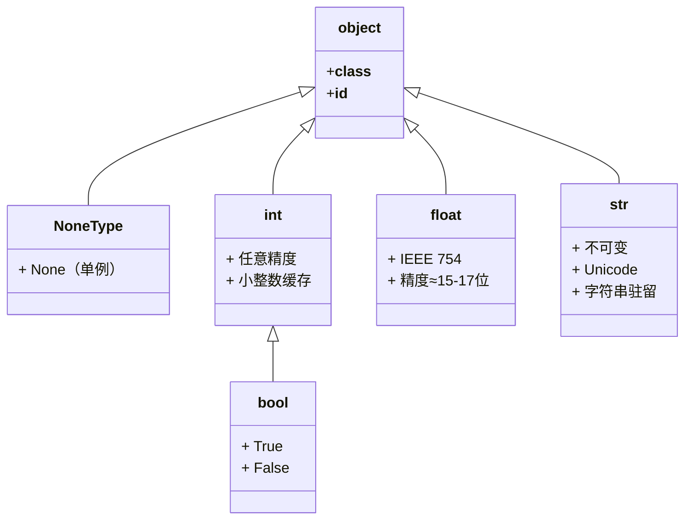
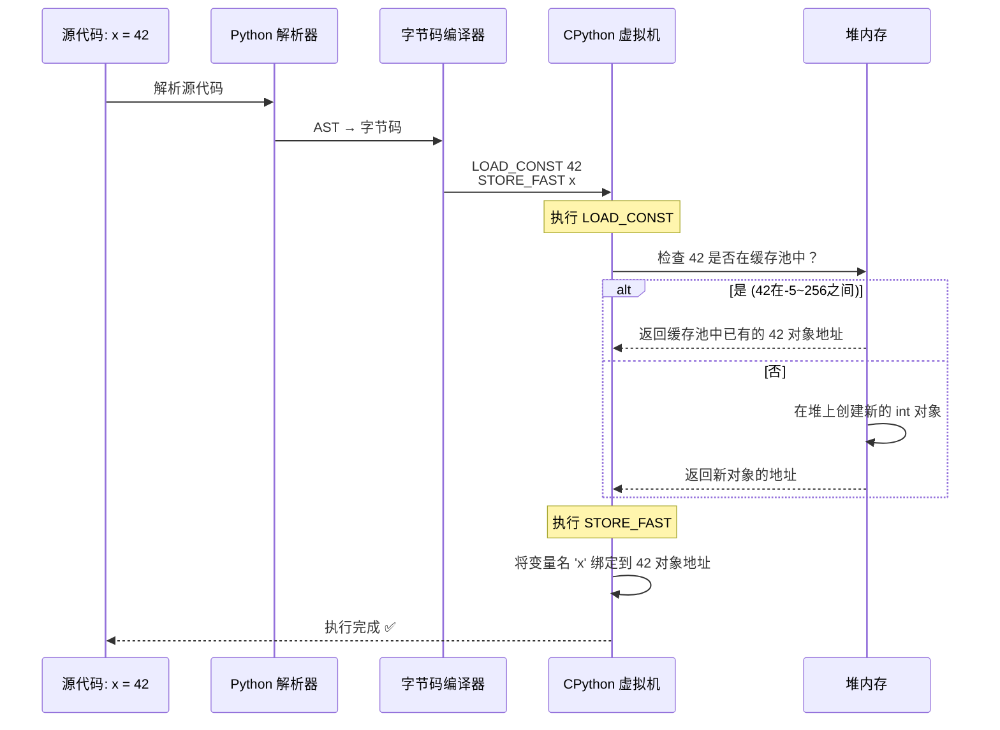

# Day 002 — 图解：变量与数据类型的底层原理

> 一图胜千言：用图示理解 Python 的变量模型

---

## 图 1：变量 = 标签，不是盒子

```ascii
┌─────────────────────────────────────────────────────────────┐
│                     Python 内存模型                          │
│                                                             │
│  变量名（在命名空间中）         对象（在堆内存中）            │
│                                                             │
│      name ──────────────────►  ┌──────────┐                 │
│                                │ "Alice"  │                 │
│                                │  str 对象 │                 │
│      age  ──────────────────►  │  地址:    │                 │
│                                │  0x1000   │                 │
│                                └──────────┘                 │
│                                                             │
│                                 ┌──────────┐                │
│      height ──────────────────► │  175.5   │                │
│                                │ float对象 │                │
│                                │  地址:    │                │
│                                │  0x2000   │                │
│                                └──────────┘                 │
│                                                             │
│      is_student ──────────────► ┌──────────┐               │
│                                │  False   │                │
│                                │  bool对象 │                │
│                                │  地址:    │                │
│                                │  0x3000   │                │
│                                └──────────┘                 │
└─────────────────────────────────────────────────────────────┘
```

**关键洞察**：变量名和对象是完全分离的两件事。变量名只是一个"指针"或"标签"，
指向堆内存中的真实对象。赋值 `y = x` 不会拷贝对象，只是多贴一个标签。

---

## 图 2：动态类型 vs 静态类型

```ascii
┌─────────────────────────────────────────────────────────────┐
│  静态类型（Java/C++）          动态类型（Python）             │
│                                                             │
│  int x = 10;                   x = 10                      │
│  ┌──────┐                      ┌──────┐                    │
│  │  int  │                     │  10  │                    │
│  │  [10] │   类型固定           │  int  │                    │
│  └──────┘                      └──────┘                    │
│                                                             │
│  x = "hi"; // ❌ 编译错误       x = "hi"  // ✅ 合法        │
│                                 ┌──────┐                    │
│                                 │ "hi" │                    │
│                                 │ str  │   类型可以变        │
│                                 └──────┘                    │
│                                                             │
│  优点：编译期发现错误           优点：更灵活、开发更快        │
│  缺点：不够灵活                 缺点：运行时可能出错          │
└─────────────────────────────────────────────────────────────┘
```

---

## 图 3：小整数驻留（Interning）

```ascii
┌─────────────────────────────────────────────────────────────┐
│              CPython 小整数缓存池（-5 ~ 256）                │
│                                                             │
│  启动时预创建：                                              │
│                                                             │
│  ┌────┬────┬────┬────┬────┬────┬────┬────┬────┬────┬────┐  │
│  │ -5 │ -4 │ -3 │ -2 │ -1 │  0 │  1 │  2 │ ...│ 255│ 256│  │
│  └────┴────┴────┴────┴────┴────┴────┴────┴────┴────┴────┘  │
│     ↑     ↑                                      ↑     ↑     │
│     │     │                                      │     │     │
│  ───┘     └─── 所有 = -4 的变量都指向同一个对象 ──┘     └─── │
│                                                             │
│  a = 256                                                   │
│  b = 256                                                   │
│  a is b  → True  ✅  （指向同一个缓存对象）                  │
│                                                             │
│  c = 257                                                   │
│  d = 257                                                   │
│  c is d  → 可能是 False  （每个创建了新对象）                │
│                                                             │
│  ⚠️ 永远用 == 比较数值，不要用 is                           │
└─────────────────────────────────────────────────────────────┘
```

---

## 图 4：Python 数据类型层级结构



> **注意**：`bool` 继承自 `int`，所以 `True` 本质上就是 `1`，`False` 就是 `0`。

---

## 图 5：赋值语句的完整执行流程



---

## 图 6：Python 的"标签"赋值 vs 其他语言的"盒子"赋值

```ascii
┌──────────────────────────────────────────────────────────────┐
│  Python（标签模型）            C 语言（盒子模型）              │
│                                                              │
│  初始：                        初始：                         │
│  a = [1,2,3]                  int a[] = {1,2,3};            │
│  b = a                        int b[] = a; // 编译错误！    │
│                               在 C 中数组不能直接赋值！        │
│  结果：                        正确做法：                     │
│  ┌─────┐                      int *b = a; // 指针           │
│  │ a───┼──┐                   ┌─────┐                       │
│  └─────┘  │  a 和 b 共享对象  │ a───┼──┐                    │
│  ┌─────┐  ├──► [1,2,3]       │ b───┼──┤→ [1,2,3]           │
│  │ b───┼──┘                   └─────┘  │                    │
│  └─────┘                               │                    │
│                                                              │
│  后续：                        后续变化类似，但需要手动管理    │
│  a.append(4)                   所以 Python 更安全、更简洁     │
│  b → [1,2,3,4]  ✅                                           │
└──────────────────────────────────────────────────────────────┘
```

---

## 图 7：浮点数精度问题图解

```ascii
┌──────────────────────────────────────────────────────────────┐
│  十进制 0.1 的二进制表示                                       │
│                                                              │
│  0.1 = 1/16 + 1/32 + 1/256 + 1/512 + 1/4096 + ...（无限循环）│
│      = 0.0001100110011001100110011001100110011...           │
│                                                              │
│  在 IEEE 754 双精度浮点数中，只能用 52 位尾数存储：             │
│                                                              │
│  尾数：0001100110011001100110011001100110011001100110011010  │
│        └────────────────── 52 bits ────────────────────────┘│
│                                                              │
│  截断后，实际存储值 ≈ 0.1000000000000000055511151231257827  │
│                                                              │
│  因此 0.1 + 0.2 ≠ 0.3                                       │
│  实际结果 ≈ 0.30000000000000004                              │
│                                                              │
│  ✅ 建议解决方案：                                            │
│     • 使用 math.isclose() 比大小                              │
│     • 高精度场景使用 decimal.Decimal                         │
│     • 金融计算使用 Decimal 或整数分                           │
└──────────────────────────────────────────────────────────────┘
```

---

> 🖊️ 这些图表帮助你直观理解 Python 变量机制的底层原理。
> 在阅读 README.md 之前先看这些图，可以建立更好的心智模型。
