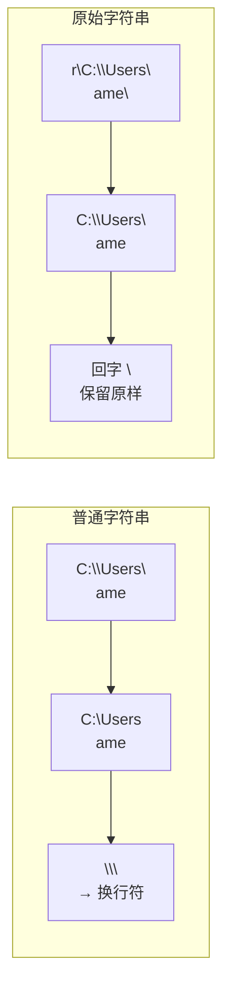

# Day 003 — 字符串深入

> 从"会用"到"懂得"：全面掌握 Python 字符串的底层原理与高阶操作

---

## 📋 今日学习目标

- [ ] 理解字符串不可变性及其设计意义
- [ ] 掌握切片操作的各种高阶用法
- [ ] 熟练运用 f-string、format()、% 三种格式化方式
- [ ] 理解转义字符与原始字符串的使用场景
- [ ] 完成实战：构建文本模板引擎

---

## 一、字符串不可变性（Immutability）

### 1.1 概念解释

**不可变性**指字符串对象一旦创建，其内容就无法被修改。任何"修改"字符串的操作，实际上都是**创建一个新的字符串对象**。

```python
s = "hello"
s[0] = "H"  # ❌ TypeError: 'str' object does not support item assignment
```

### 1.2 原理解析：内存中的字符串

字符串不可变性是 Python 的核心设计决策。让我们看看底层发生了什么：

```
# 执行 s = "hello"
   ┌──────────────┐
   │ 字符串对象     │
   │ value = "hello" │
   │ refcount = 1   │
   └──────────────┘
         ▲
         │
         s

# 执行 s = "hello" + " world"
   ┌──────────────┐     ┌──────────────────┐
   │ "hello"       │     │ "hello world"    │  ← 新对象
   │ refcount = 0  │     │ refcount = 1     │
   └──────────────┘     └──────────────────┘
         ▲                      ▲
         │                      │
       (无引用)                 s (重新指向)
```

**为什么设计为不可变？**
1. **哈希安全性**：字符串常用作字典的键，不可变才能保证哈希值稳定
2. **线程安全**：多个线程可安全共享同一个字符串，无需加锁
3. **内存优化**：Python 会复用相同的字符串字面量（interning），节省内存
4. **缓存友好**：字符串切片操作可以共享底层内存（虽然 CPython 实际上不一定，但理论上允许）

```python
# 证明不可变性：id() 会变化
s = "hello"
print(id(s))        # e.g., 140736524500288

s = s + " world"    # 看起来是"修改"，实际上是创建新对象
print(id(s))        # e.g., 140736524500448  ← 地址变了！
```

### 1.3 字符串驻留（String Interning）

Python 会对某些短字符串进行"驻留"优化——相同的字面量共享同一内存：

```python
a = "hello"
b = "hello"
print(a is b)   # True — 因为驻留优化

# 但运行时创建的字符串不一定驻留
c = "".join(["h", "e", "l", "l", "o"])
print(a is c)   # 可能是 False，取决于实现

# 小整数也会驻留
x = 256
y = 256
print(x is y)   # True

x = 257
y = 257
print(x is y)   # False（超出小整数缓存范围）
```

---

## 二、字符串操作：切片（Slicing）

### 2.1 概念解释

**切片**是从字符串中提取子序列的操作。语法为 `str[start:stop:step]`。

```python
s = "Python Programming"
```

### 2.2 切片原理图解

```
索引（正数）: 0   1   2   3   4   5   6   7   8   9  10  11  12  13  14  15  16  17
           ┌───┬───┬───┬───┬───┬───┬───┬───┬───┬───┬───┬───┬───┬───┬───┬───┬───┬───┐
           │ P │ y │ t │ h │ o │ n │   │ P │ r │ o │ g │ r │ a │ m │ m │ i │ n │ g │
           └───┴───┴───┴───┴───┴───┴───┴───┴───┴───┴───┴───┴───┴───┴───┴───┴───┴───┘
索引（负数）: -18 -17 -16 -15 -14 -13 -12 -11 -10 -9  -8  -7  -6  -5  -4  -3  -2  -1
```

**切片规则**：
- `start` 包含，`stop` 不包含（左闭右开）
- `step` 默认为 1，负数表示反向
- 任何索引都可以省略

### 2.3 切片操作大全

```python
s = "Python"

# 基础切片
s[0:3]       # "Pyt"   — 索引 0,1,2（不含 3）
s[1:4]       # "yth"
s[:3]        # "Pyt"   — 从开头到索引 3
s[3:]        # "hon"   — 从索引 3 到末尾
s[:]         # "Python" — 完整复制

# 步进切片
s[0:6:2]     # "Pto"   — 每隔一个字符取一个
s[1:6:3]     # "yn"

# 负数索引
s[-1]        # "n"     — 最后一个字符
s[-3:]       # "hon"   — 最后三个字符
s[:-2]       # "Pyth"  — 去掉最后两个字符
s[::-1]      # "nohtyP" — 反转字符串 🔥 最常用
s[::-2]      # "nhy"   — 反转后每隔一个取

# 边界情况
s[0:100]     # "Python" — 超出范围不报错，自动截断
s[100:200]   # ""       — 空字符串
s[0:0]       # ""       — 空字符串
```

### 2.4 切片底层实现

切片操作调用的是 `__getitem__` 方法，传入一个 `slice` 对象：

```python
# 这两行等价
sub = s[1:4]            # Python 语法糖
sub = s.__getitem__(slice(1, 4, None))  # 实际调用

# 手动创建 slice 对象
sl = slice(1, 5, 2)
print(s[sl])            # "yh"
```

**性能提示**：短字符串切片很快（O(k)，k 是切片长度），因为 CPython 会复制内存。不要担心切片性能。

---

## 三、字符串拼接

### 3.1 四种拼接方式对比

| 方式 | 语法 | 性能 | 适用场景 |
|------|------|------|---------|
| `+` | `"a" + "b"` | 差（O(n²)） | 少量拼接 |
| `join()` | `"".join(list)` | 好（O(n)） | 大量拼接 |
| f-string | `f"{a}{b}"` | 好 | 格式化+拼接 |
| 隐式字面量 | `"a" "b"` | 最好 | 代码分行 |

### 3.2 为什么 `+` 拼接大量字符串很慢？

```python
result = ""
for i in range(10000):
    result += str(i)  # ❌ 每次循环都创建一个新字符串！
```

**原理**：字符串不可变，每次 `+=` 都会：
1. 计算新字符串长度
2. 分配新内存
3. 复制旧内容到新位置
4. 复制新内容到末尾
5. 丢弃旧字符串

总时间复杂度 = O(1 + 2 + 3 + ... + n) = O(n²)

```python
# ✅ 正确做法
parts = []
for i in range(10000):
    parts.append(str(i))
result = "".join(parts)  # O(n) — 只分配一次内存
```

---

## 四、字符串格式化

### 4.1 三种格式化方式对比

```python
name = "Alice"
age = 25
score = 92.5
```

#### 4.1.1 `%` 格式化（旧式）

```python
# 语法：使用 % 操作符
print("姓名: %s, 年龄: %d, 分数: %.1f" % (name, age, score))
# 输出: 姓名: Alice, 年龄: 25, 分数: 92.5

# 格式说明符
# %s     — 字符串（str() 转换）
# %d     — 整数（int 十进制）
# %f     — 浮点数
# %.2f   — 保留两位小数
# %x     — 十六进制
# %o     — 八进制
# %e     — 科学计数法

# 命名字典
print("姓名: %(name)s, 年龄: %(age)d" % {"name": name, "age": age})
```

**优点**：语法简洁，兼容老代码
**缺点**：类型不安全，参数多时代码混乱

#### 4.1.2 `str.format()`（新式）

```python
# 位置参数
print("姓名: {}, 年龄: {}, 分数: {}".format(name, age, score))

# 索引
print("姓名: {0}, 分数: {2}, 年龄: {1}".format(name, age, score))

# 关键字参数
print("姓名: {n}, 年龄: {a}".format(n=name, a=age))

# 格式化控制
print("分数: {:.2f}".format(score))                    # 92.50
print("分数: {:>10.2f}".format(score))                  # 右对齐，总宽10
print("分数: {:<10.2f}".format(score))                  # 左对齐
print("分数: {:^10.2f}".format(score))                  # 居中对齐
print("进度: {:.0%}".format(0.85))                      # 85%
print("{:>08b}".format(42))                             # 00101010（8位二进制）
```

#### 4.1.3 f-string（Python 3.6+，**推荐**）

```python
# 直接在字符串前加 f，花括号中写表达式
print(f"姓名: {name}, 年龄: {age}, 分数: {score:.2f}")

# 表达式求值
print(f"明年 {name} {age + 1} 岁")
print(f"hello {name.upper()}")
print(f"3.14159 保留两位: {3.14159:.2f}")

# 多行 f-string
info = (
    f"姓名: {name}\n"
    f"年龄: {age}\n"
    f"分数: {score:.1f}"
)

# 等号调试（Python 3.8+）
print(f"{name=}, {age=}")   # name='Alice', age=25

# 进制转换
value = 255
print(f"十进制: {value}, 十六进制: {value:#x}, 二进制: {value:#b}")
# 十进制: 255, 十六进制: 0xff, 二进制: 0b11111111
```

### 4.2 f-string 原理解析

f-string 在**编译时**就被解析为字符串构造代码，不是运行时解释的：

```python
# 你写的代码：
name = "Alice"
msg = f"Hello {name}"

# Python 编译后等价于：
msg = "Hello " + name  # 或使用 BUILD_STRING 字节码（更高效）
```

这意味着：
1. f-string 非常快（编译时优化）
2. 花括号中**不能**使用反斜杠转义
3. 花括号中的表达式在调用时求值

```python
# ❌ 错误：花括号内不能使用反斜杠
# f"Hello {name\n}"   # SyntaxError

# ✅ 正确做法：先用变量保存
newline = "\n"
print(f"Hello{newline}World")
```

**f-string 格式化迷你语言速查**：

```
f"{value:填充字符?对齐方式?宽度?,?分组?精度?类型?}"

对齐方式：< 左对齐  > 右对齐  ^ 居中对齐
精度用于：f 浮点数小数位，s 字符串截断
类型：s 字符串, d 整数, f 浮点数, b 二进制, x 十六进制
```

```python
n = 1234.5678
print(f"{n:>10.2f}")    # 右对齐，总宽 10，2 位小数 → "   1234.57"
print(f"{n:<10.2f}")    # 左对齐             → "1234.57   "
print(f"{n:^10.2f}")    # 居中               → " 1234.57  "
print(f"{n:010.2f}")    # 用0填充           → "0001234.57"
print(f"{n:,.2f}")      # 千分位分隔         → "1,234.57"
print(f"{1234567:,d}")  # 整数千分位         → "1,234,567"
```

---

## 五、转义字符与原始字符串

### 5.1 转义字符详解

**转义字符**以反斜杠 `\` 开头，表示特殊含义的字符：

| 转义序列 | 含义 | Unicode 值 |
|---------|------|-----------|
| `\n` | 换行 | U+000A |
| `\t` | 制表符（Tab） | U+0009 |
| `\r` | 回车 | U+000D |
| `\\` | 反斜杠本身 | U+005C |
| `\'` | 单引号 | U+0027 |
| `\"` | 双引号 | U+0022 |
| `\b` | 退格 | U+0008 |
| `\f` | 换页 | U+000C |
| `\v` | 垂直制表符 | U+000B |
| `\0` | 空字符 | U+0000 |
| `\xhh` | 十六进制字符 | U+00hh |
| `\uhhhh` | 16 位 Unicode | U+hhhh |
| `\Uhhhhhhhh` | 32 位 Unicode | U+hhhhhhhh |
| `\N{name}` | Unicode 字符名 | 如 `\N{SNOWMAN}` → ☃ |

```python
# 基本转义
print("第一行\n第二行")      # 换行
print("列1\t列2\t列3")      # 制表符对齐
print("他说：\"你好\"")      # 引号转义
print("路径：C:\\Users\\name")  # 反斜杠转义

# Unicode 转义
print("\u4e2d\u6587")       # 中文 — 使用 16 位 Unicode
print("\U0001F600")          # 😀 — 使用 32 位 Unicode（超过 BMP）
print("\N{Grinning Face}")   # 😀 — 使用字符名
```

### 5.2 原始字符串（Raw String）

**原始字符串**以 `r` 或 `R` 前缀，让反斜杠保持原样，不做转义处理：

```python
# 普通字符串
normal = "C:\Users\name"      # 问题：\n 会被转义为换行符！
print(normal)                 # 输出不可预测

# 原始字符串
raw = r"C:\Users\name"        # ✅ 完美！
print(raw)                    # C:\Users\name

# 常见使用场景：正则表达式
import re
pattern = r"\d+\.\d+"         # 匹配浮点数 — 用原始字符串避免"反斜杠地狱"
```



### 5.3 反斜杠地狱

不使用原始字符串写正则有多痛苦：

```python
# 没有 r 前缀：需要双层转义！
pattern = "\\d+\\.\\d+"     # 匹配浮点数
# 等价于
pattern = r"\d+\.\d+"       # 清爽多了！

# 更复杂的例子
email_re = r"^[a-zA-Z0-9._%+-]+@[a-zA-Z0-9.-]+\.[a-zA-Z]{2,}$"
# 没有 r 前缀的话...你懂的
```

### 5.4 三引号与多行字符串

```python
# 三引号可以包含多行文本
poem = """
静夜思
床前明月光，
疑是地上霜。
举头望明月，
低头思故乡。
"""
print(poem)

# 使用括号隐式拼接避免多余空格
sql = (
    "SELECT id, name, email "
    "FROM users "
    "WHERE active = 1 "
    "ORDER BY name"
)

# textwrap 处理缩进
import textwrap
print(textwrap.dedent(poem))  # 去掉前导空白
```

---

## 六、字符串内置方法速查

Python 字符串提供了丰富的内置方法，按功能分类：

### 6.1 大小写转换

```python
s = "hello Python"

s.upper()           # "HELLO PYTHON"  — 全大写
s.lower()           # "hello python"  — 全小写
s.capitalize()      # "Hello python"  — 首字母大写
s.title()           # "Hello Python"  — 每个单词首字母大写
s.swapcase()        # "HELLO pYTHON" — 大小写互换

# 特殊的大小写（依赖 locale）
s.casefold()        # 更激进的 lower（处理德语 ß → ss 等）
```

### 6.2 查找与替换

```python
s = "hello world, hello python"

s.find("hello")         # 0   — 首次出现位置（未找到返回 -1）
s.rfind("hello")        # 14  — 最后一次出现位置
s.index("hello")        # 0   — 同 find，但未找到抛 ValueError
s.rindex("hello")       # 14  — 同 rfind，但未找到抛异常

s.startswith("hello")   # True
s.endswith("python")    # True
s.count("hello")        # 2   — 统计出现次数

s.replace("hello", "hi")  # "hi world, hi python"
s.replace("hello", "hi", 1)  # "hi world, hello python" — 只替换第一个
```

### 6.3 拆分与拼接

```python
s = "apple,banana,orange"

s.split(",")           # ["apple", "banana", "orange"]
s.split("," , 1)       # ["apple", "banana,orange"] — 只拆第一刀
s.rsplit("," , 1)      # ["apple,banana", "orange"] — 从右拆

s = "line1\nline2\nline3"
s.splitlines()         # ["line1", "line2", "line3"]
s.splitlines(True)     # ["line1\n", "line2\n", "line3\n"]

# partition：返回三元素元组（分割前，分隔符，分割后）
s = "user:password"
s.partition(":")       # ("user", ":", "password")
s.rpartition(":")      # 从右开始分割

# 拼接（字符串列表 → 字符串）
parts = ["2024", "01", "15"]
"-".join(parts)        # "2024-01-15"
"".join(parts)         # "20240115"
```

### 6.4 空白处理

```python
s = "  \tHello World\n"

s.strip()              # "Hello World"     — 去除两端空白
s.lstrip()             # "Hello World\n"   — 去除左侧空白
s.rstrip()             # "  \tHello World" — 去除右侧空白

# 指定去除字符
s2 = "...hello..."
s2.strip(".")          # "hello"

# 填充
s.center(20)           # "    Hello World     "  — 居中
s.ljust(20)            # "Hello World          " — 左对齐
s.rjust(20)            # "          Hello World" — 右对齐
s.zfill(10)            # "000Hello World"       — 左补零
```

### 6.5 判断方法

```python
"hello".isalpha()     # True   — 全是字母
"123".isdigit()       # True   — 全是数字
"abc123".isalnum()    # True   — 字母或数字
"Hello".isupper()     # False
"hello".islower()     # True
"Hello World".istitle() # True — 每个单词首字母大写
"   ".isspace()       # True   — 全是空白
"你好".isascii()      # False  — 包含非 ASCII
"42".isdecimal()      # True   — 十进制数字
"Ⅳ".isnumeric()       # True   — 罗马数字也认
```

---

## 七、实战案例：文本模板引擎

> 综合运用字符串格式化、替换、分割等方法，构建一个简单的模板引擎。

### 7.1 需求描述

实现一个 `SimpleTemplate` 类，支持：
1. 变量替换：`{{ name }}` 替换为对应值
2. 条件渲染：`...`
3. 循环渲染：`...`
4. 默认值：没有提供变量时使用默认值

### 7.2 完整实现

```python
import re
from typing import Dict, Any, List

class SimpleTemplate:
    """一个简单的文本模板引擎"""
    
    def __init__(self, template: str):
        self.template = template
    
    def render(self, context: Dict[str, Any]) -> str:
        """
        使用上下文渲染模板
        
        Args:
            context: 包含变量名和值的字典
            
        Returns:
            渲染后的字符串
        """
        result = self.template
        
        # 1. 处理条件语句 
        result = self._process_conditionals(result, context)
        
        # 2. 处理循环语句 
        result = self._process_loops(result, context)
        
        # 3. 处理变量替换 {{ ... }}
        result = self._process_variables(result, context)
        
        return result
    
    def _process_variables(self, text: str, context: Dict[str, Any]) -> str:
        """替换 {{ variable }} 变量"""
        def replace_var(match):
            var_name = match.group(1).strip()
            # 支持嵌套路径：user.name
            parts = var_name.split(".")
            value = context
            for part in parts:
                if isinstance(value, dict) and part in value:
                    value = value[part]
                elif hasattr(value, part):
                    value = getattr(value, part)
                else:
                    return f"{{{{ {var_name} }}}}"  # 未找到保留原样
            return str(value)
        
        return re.sub(r"\{(.*?)\}", replace_var, text)
    
    def _process_conditionals(self, text: str, context: Dict[str, Any]) -> str:
        """处理 ..."""
        def replace_if(match):
            full_block = match.group(0)
            inner = match.group(1)
            
            # 提取条件表达式
            if_match = re.match(r"if\s+(.*?)$", inner.strip().split("\n")[0], re.MULTILINE)
            if not if_match:
                return full_block
            
            condition = if_match.group(1).strip()
            
            # 提取内容（去除  和  行）
            lines = inner.strip().split("\n")
            content_lines = lines[1:] if len(lines) > 1 else []
            
            # 检查是否有 
            else_idx = -1
            for i, line in enumerate(content_lines):
                if line.strip().startswith(""):
                    else_idx = i
                    break
            
            if else_idx >= 0:
                if_content = "\n".join(content_lines[:else_idx])
                else_content = "\n".join(content_lines[else_idx + 1:])
            else:
                if_content = "\n".join(content_lines)
                else_content = ""
            
            # 求值条件
            if self._eval_condition(condition, context):
                return if_content
            else:
                return else_content
        
        # 匹配 ...
        pattern = r"\{%\s*if\s+.*?%\}(.*?)\{%\s*endif\s*%\}"
        return re.sub(pattern, replace_if, text, flags=re.DOTALL)
    
    def _eval_condition(self, condition: str, context: Dict[str, Any]) -> bool:
        """安全求值模板条件表达式"""
        condition = condition.strip()
        
        # 直接变量名
        if condition in context:
            return bool(context[condition])
        
        # not 表达式
        if condition.startswith("not "):
            var = condition[4:].strip()
            return not bool(context.get(var, False))
        
        # 比较表达式：age > 18
        for op in [">=", "<=", "!=", "==", ">", "<"]:
            if op in condition:
                parts = condition.split(op, 1)
                left = parts[0].strip()
                right = parts[1].strip()
                
                left_val = context.get(left, left)
                # 尝试数值转换
                try:
                    right_val = int(right)
                except ValueError:
                    try:
                        right_val = float(right)
                    except ValueError:
                        right_val = right.strip("\"'")
                
                if op == ">": return left_val > right_val
                elif op == "<": return left_val < right_val
                elif op == ">=": return left_val >= right_val
                elif op == "<=": return left_val <= right_val
                elif op == "==": return left_val == right_val
                elif op == "!=": return left_val != right_val
        
        return False
    
    def _process_loops(self, text: str, context: Dict[str, Any]) -> str:
        """处理 ..."""
        def replace_loop(match):
            full_block = match.group(0)
            inner = match.group(1)
            
            # 提取循环变量
            first_line = inner.strip().split("\n")[0]
            loop_match = re.match(r"for\s+(\w+)\s+in\s+(\w+)\s*$", first_line.strip())
            if not loop_match:
                return full_block
            
            item_var = loop_match.group(1)
            list_var = loop_match.group(2)
            
            # 获取要迭代的列表
            iterable = context.get(list_var, [])
            if not isinstance(iterable, (list, tuple)):
                return full_block
            
            # 提取循环体（去掉  行）
            lines = inner.strip().split("\n")
            body = "\n".join(lines[1:]) if len(lines) > 1 else ""
            
            # 渲染每次循环
            results = []
            for i, item in enumerate(iterable):
                loop_context = dict(context)
                loop_context[item_var] = item
                loop_context["loop"] = {
                    "index": i + 1,
                    "index0": i,
                    "first": i == 0,
                    "last": i == len(iterable) - 1,
                    "length": len(iterable)
                }
                
                rendered = self._process_variables(body, loop_context)
                results.append(rendered)
            
            return "\n".join(results)
        
        pattern = r"\{%\s*for\s+.*?%\}(.*?)\{%\s*endfor\s*%\}"
        return re.sub(pattern, replace_loop, text, flags=re.DOTALL)


# ===================== 使用示例 =====================

if __name__ == "__main__":
    template_str = """
    Hello {{ name }}!
    
    
    Welcome to {{ site_name }}!
    
    Nice coding.
    
    
    Your skills:
    
    - {{ skill }} (that's your last one!)
    
    
    
    Great score: {{ score }}!
    
    
    Best regards,
    {{ author.name }}
    """
    
    template = SimpleTemplate(template_str)
    result = template.render({
        "name": "Alice",
        "show_greeting": True,
        "site_name": "Learn-Python",
        "skills": ["Python", "Data Structures", "Algorithms"],
        "score": 92,
        "author": {
            "name": "Bot"
        }
    })
    
    print(result)
```

### 7.3 运行输出

```
    Hello Alice!
    
    
    Welcome to Learn-Python!
    
    
    Your skills:
    
    - Python 
    - Data Structures 
    - Algorithms (that's your last one!)
    
    
    
    Great score: 92!
    
    Best regards,
    Bot
```

---

## 💭 思考题

1. **不可变性设计**：Python 为什么选择字符串不可变？如果字符串可变，字典用字符串作键会有什么问题？请结合哈希表原理思考。

2. **切片与内存**：执行 `s[::-1]` 反转一个长度为 n 的字符串时，底层发生了哪些操作？时间复杂度是多少？有不需要复制就能反转的方法吗？

3. **格式化选择**：在什么场景下应该使用 `%` 格式化而不是 f-string？考虑国际化（多语言翻译）的场景分析。

4. **原始字符串限制**：原始字符串无法以奇数个反斜杠结尾（如 `r"\"` 会报错），为什么？设计上是否可以改进？

5. **模板引擎安全**：实战中实现的模板引擎存在什么安全缺陷？如果用户输入的模板中包含 `{{ __import__("os").system("rm -rf /") }}` 会发生什么？如何防御？

---

## 📚 扩展阅读

- [PEP 498 — Literal String Interpolation](https://www.python.org/dev/peps/pep-0498/)（f-string 设计文档）
- [PEP 3101 — Advanced String Formatting](https://www.python.org/dev/peps/pep-3101/)
- CPython 源码：`Objects/unicodeobject.c` — 字符串对象的 C 实现
- [Python Format Specification Mini-Language](https://docs.python.org/3/library/string.html#formatstrings)
