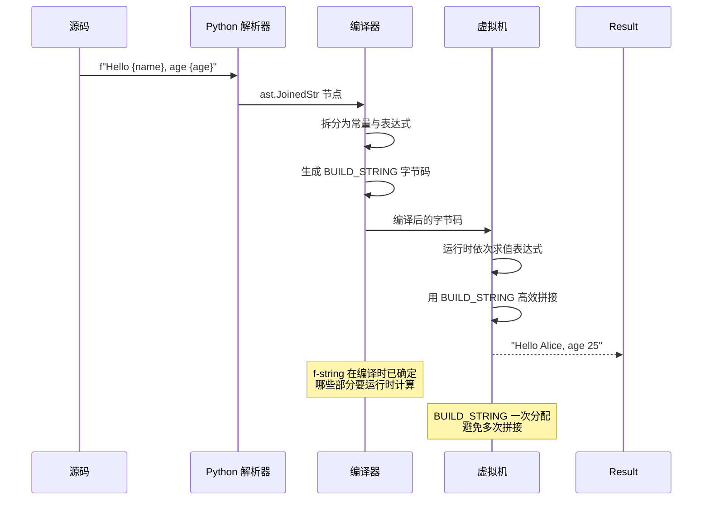
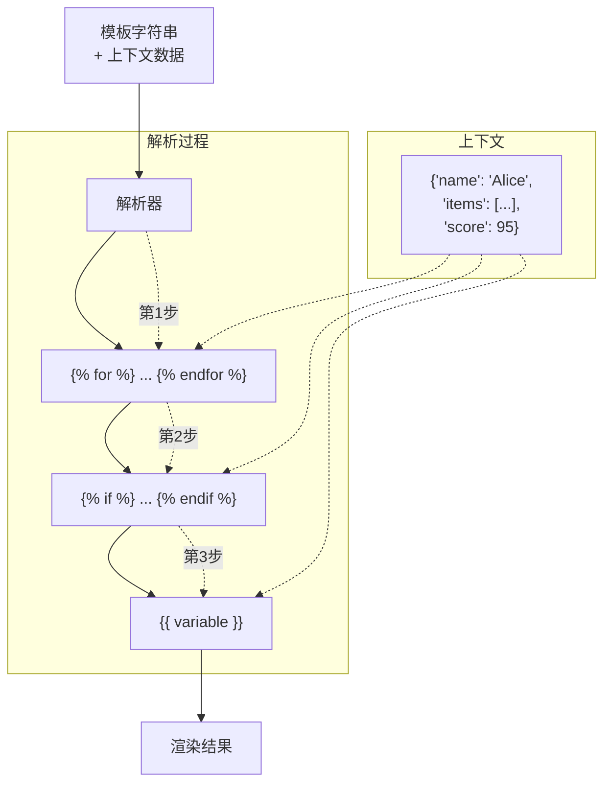
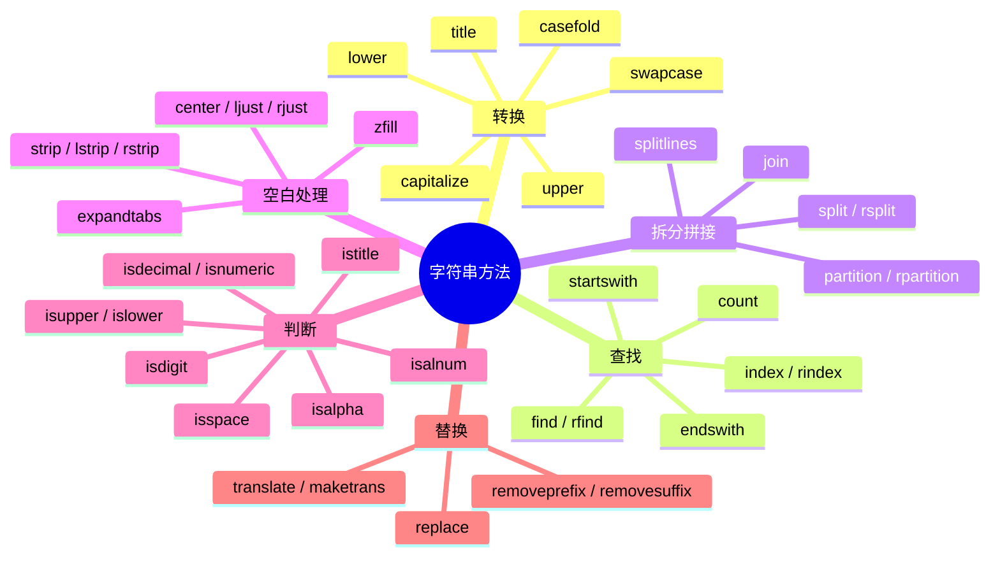

# Day 003 — 字符串深入：图解

> ASCII 图和 Mermaid 示意图，帮助你直观理解字符串的底层原理

---

## 1. 字符串不可变性示意

```
创建 s = "Python":
─────────────────────────────────────
    s ───▶ ┌──────────────────┐
           │ str object       │
           │ value: "Python"  │
           │ refcount: 1      │
           └──────────────────┘
           Address: 0x1000

执行 s += " 3":
─────────────────────────────────────
    ① 计算 "Python 3" 的长度（9 字节）
    ② 分配新内存 ───────────▶ ┌──────────────────┐
                              │ str object       │
    s ───▶ ┌──────────────────┐ │ value: "Python 3" │
           │ str object       │ │ refcount: 1      │
           │ value: "Python"  │ └──────────────────┘
           │ refcount: 0  ← GC 回收   Address: 0x2000
           └──────────────────┘
           Address: 0x1000
```

## 2. 字符串驻留（Interning）

```
Python 的字符串驻留池（interned dict）:

      驻留池
    ┌─────────────────────┐
    │ "hello" ────────────┼──▶ 同一对象
    │ "python"            │
    │ "world"             │
    └─────────────────────┘
              ▲               ▲
              │               │
             a                b
        a = "hello"      b = "hello"
        a is b → True（相同对象）

非驻留字符串（运行时创建）:
    
    c = "".join(["h","e","l","l","o"])
    
    "hello" (驻留池)     "hello" (新创建)
    ┌──────────────┐    ┌──────────────┐
    │ refcount: 2  │    │ refcount: 1  │
    │ a→, b→       │    │ c→           │
    └──────────────┘    └──────────────┘
    a is c → False（不同对象）
```

## 3. 切片操作原理

```
Python 字符串切片 s[start:stop:step]:

s = "Python Programming"

索引: 0   1   2   3   4   5   6   7   8   9  10  11  12  13  14  15  16  17
      P   y   t   h   o   n       P   r   o   g   r   a   m   m   i   n   g

s[0:6]   →  ┌───┬───┬───┬───┬───┬───┐
            │ P │ y │ t │ h │ o │ n │  → "Python"
            └───┴───┴───┴───┴───┴───┘

s[7:]    →  ┌───┬───┬───┬───┬───┬───┬───┬───┬───┬───┬───┐
            │ P │ r │ o │ g │ r │ a │ m │ m │ i │ n │ g │  → "Programming"
            └───┴───┴───┴───┴───┴───┴───┴───┴───┴───┴───┘

s[::-1]  →  取反序:
            g   n   i   m   m   a   r   g   o   r   P       n   o   h   t   y   P
            └───┴───┴───┴───┴───┴───┴───┴───┴───┴───┴───┴───┴───┴───┴───┴───┴───┘

s[::2]   →  步长为 2:
            P   t   o       r   g   a   m   n
            └───┴───┴───┴───┴───┴───┴───┴───┴───┘  → "Pto rgamn"
```

## 4. f-string 编译时优化（Mermaid）



## 5. 字符串拼接性能对比

```
使用 + 拼接 n 个字符串:
─────────────────────────────────────
循环 1:  "0"              (1 次分配, 1 字符)
循环 2:  "0" + "1"        → "01"              (1 次分配, 2 字符)
循环 3:  "01" + "2"       → "012"             (1 次分配, 3 字符)
循环 4:  "012" + "3"      → "0123"            (1 次分配, 4 字符)
...
循环 n:  "012...n-1" + n  → "012...n"         (1 次分配, n 字符)

总分配次数: n
总复制字符数: 1 + 2 + 3 + ... + n = n(n+1)/2 ≈ O(n²)

使用 "".join(list) 拼接:
─────────────────────────────────────
第 1 步: 计算总长度 = n 字符
第 2 步: 一次分配 n+1 字节内存
第 3 步: 将所有字符逐段复制到新内存

总分配次数: 1
总复制字符数: n ≈ O(n)

可视化对比 (n=10000):
                    + 拼接
    ┌────────────────────────────────┐
    │                                │
    │      ████████████████████      │  ~5000万次字符复制
    │      ████████████████████      │
    └────────────────────────────────┘
                    
                    join 拼接
    ┌────────────────────────────────┐
    │                                │
    │              ██                │  ~10000次字符复制
    │              ██                │
    └────────────────────────────────┘

结论: join 比 + 快约 5000 倍 (n=10000)
```

## 6. 模板引擎渲染流程



## 7. 字符串方法分类脑图


