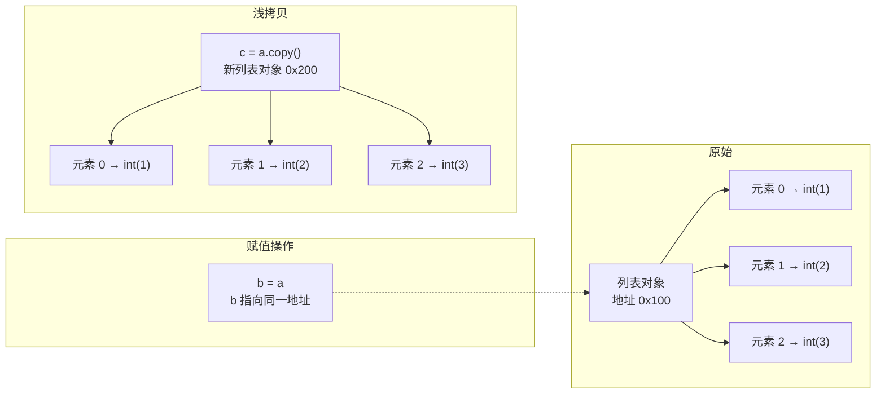

# Day 006 — 列表（List）

> 从"放东西"到"管东西"：Python 最灵活的序列类型全面掌握

---

## 📋 今日学习目标

- [ ] 理解列表的创建方式和索引机制
- [ ] 掌握列表可变性的内存原理
- [ ] 熟练使用切片的高级用法
- [ ] 掌握所有常用列表方法
- [ ] 理解列表推导式和常用模式
- [ ] 完成实战：待办事项管理器

---

## 一、列表创建与索引

### 1.1 概念解释

**列表（list）** 是 Python 中最核心的序列类型之一。它是有序的、可变的、可包含任意类型元素的集合。

```python
# 空列表
empty = []

# 同类型元素
numbers = [1, 2, 3, 4, 5]

# 不同类型元素（Python 允许）
mixed = [1, "hello", 3.14, True, None]

# 嵌套列表（矩阵/多维数据）
matrix = [
    [1, 2, 3],
    [4, 5, 6],
    [7, 8, 9],
]
```

**为什么叫"列表"而不是"数组"？**

Python 的 list 和其他语言的数组有本质区别：
- **动态类型**：一个列表里可以放任何类型（C 的数组不行）
- **动态大小**：自动扩容（Java 的数组也不行，得用 ArrayList）
- **存储引用**：存的是对象的引用，不是值本身

### 1.2 创建方式

| 创建方式 | 语法 | 说明 |
|---------|------|------|
| 字面量 | `[1, 2, 3]` | 最常用 |
| 构造器 | `list()` | 创建空列表 |
| 构造器 | `list(iterable)` | 从可迭代对象创建 |
| 列表推导式 | `[x*2 for x in range(5)]` | 简洁创建 |
| 乘法复制 | `[0] * 5` | 创建重复元素列表 |

```python
# 从字符串创建
list("hello")  # ['h', 'e', 'l', 'l', 'o']

# 从 range 创建
list(range(5))  # [0, 1, 2, 3, 4]

# 乘法复制——⚠️ 有坑！
result = [[0] * 3] * 3  # [[0,0,0], [0,0,0], [0,0,0]]
result[0][0] = 1
print(result)            # [[1,0,0], [1,0,0], [1,0,0]] — 全变了！
```

> **乘法复制的陷阱**：`[obj] * n` 复制的是引用，不是对象本身。对于不可变类型（int, str）没问题，但可变类型（list, dict）就会共享同一份内存。

### 1.3 索引机制

索引是从 0 开始的位置编号，Python 同时支持**正向索引**和**负向索引**。

```python
fruits = ["苹果", "香蕉", "橘子", "葡萄", "西瓜"]

# 正向索引（从左到右，从 0 开始）
#  索引:  0      1      2      3      4
print(fruits[0])   # 苹果
print(fruits[2])   # 橘子

# 负向索引（从右到左，从 -1 开始）
#  索引: -5     -4     -3     -2     -1
print(fruits[-1])  # 西瓜
print(fruits[-3])  # 橘子
```

```ascii
┌──────┬──────┬──────┬──────┬──────┐
│ 苹果 │ 香蕉 │ 橘子 │ 葡萄 │ 西瓜 │
├──────┼──────┼──────┼──────┼──────┤
│  0   │  1   │  2   │  3   │  4   │  ← 正向索引
│ -5   │ -4   │ -3   │ -2   │ -1   │  ← 负向索引
└──────┴──────┴──────┴──────┴──────┘
```

**负向索引为什么从 -1 开始？**

数学上合理的设计。如果 -0 = 0，那就无法区分第一个和最后一个元素。从 -1 开始，`lst[-1]` 永远是最后一个元素，方便又直观。

---

## 二、可变性原理（内存角度）

### 2.1 列表是可变对象

这是列表和字符串、元组最大的区别——**列表可以原地修改**。

```python
# 可变（Mutable）：列表
lst = [1, 2, 3]
lst[0] = 99      # ✅ 直接修改元素
print(lst)       # [99, 2, 3]

# 不可变（Immutable）：字符串/元组
s = "abc"
# s[0] = "X"    # ❌ TypeError: 'str' object does not support item assignment

t = (1, 2, 3)
# t[0] = 99     # ❌ TypeError: 'tuple' object does not support item assignment
```

### 2.2 内存模型图解

```ascii
内存角度理解列表的"可变性"
══════════════════════════════

列表对象 lst = [1, 2, 3]
                          
栈空间                        堆空间
┌────────┐               ┌───────────────────┐
│ lst    │ ─────────────→ │ 列表对象（PyListObject） │
└────────┘               │───────────────────│
                         │ ob_refcnt = 1     │
                         │ ob_size = 3       │
                         │ ob_item = ───┐    │
                         └──────────────│────┘
                                        │
             ┌──────────────────────────┼──────────┐
             ▼                          ▼          ▼
        ┌─────────┐              ┌─────────┐ ┌─────────┐
        │ int 对象 │              │ int 对象 │ │ int 对象 │
        │ 值: 1   │              │ 值: 2   │ │ 值: 3   │
        └─────────┘              └─────────┘ └─────────┘

修改 lst[0] = 99
═ ═ ═ ═ ═ ═ ═ ═ ═ ═ ═ ═ ═ ═

列表对象的 ob_item 指针数组中下标 0 的指针
从指向 "值=1 的 int 对象" 改为指向 "值=99 的 int 对象"
—— 列表结构不变，只是里面的引用变了
```

### 2.3 引用语义的连锁反应

因为列表存的是引用，所以：

```python
# 情况 1：赋值就是复制引用
a = [1, 2, 3]
b = a            # b 和 a 指向同一个列表对象
b.append(4)
print(a)         # [1, 2, 3, 4] — a 也被改了！
print(a is b)    # True — 同一个对象

# 情况 2：想复制要显式创建新列表
c = a.copy()     # 浅拷贝
# 或用 c = a[:]
# 或用 c = list(a)

c.append(5)
print(a)         # [1, 2, 3, 4] — 不受影响
print(c)         # [1, 2, 3, 4, 5]

# 情况 3：浅拷贝 vs 深拷贝（嵌套列表）
original = [[1, 2], [3, 4]]
shallow = original.copy()
shallow[0][0] = 99
print(original)  # [[99, 2], [3, 4]] — 内层列表共享！

import copy
deep = copy.deepcopy(original)
deep[0][0] = 999
print(original)  # [[99, 2], [3, 4]] — 不受影响
```



### 2.4 列表容量与扩容策略

Python 列表底层用**动态数组**实现（不是链表！）。这意味着：

```python
import sys

# 空列表的容量
empty = []
print(sys.getsizeof(empty))  # 56 bytes（仅列表对象本身）

# 每次 append，当容量不够时自动扩容
lst = []
for i in range(10):
    lst.append(i)
    print(f"len={len(lst):2d}, size={sys.getsizeof(lst):4d} bytes")
```

**扩容策略**（CPython 实现）：
- 初始容量：0（空列表不分配元素数组）
- 第一次添加：分配 4 个元素的空间
- 后续扩容：`new_allocated = (newsize >> 3) + (newsize < 9 ? 3 : 6) + newsize`
  - 粗略来说，大约是 **1.125 倍**的增长
- 这是一种**时间换空间**的权衡：小幅度扩容减少内存浪费，但需要更多次 realloc

> **为什么不用链表？** Python 列表需要 O(1) 的随机访问（通过索引读取元素），链表做不到。Python 的链表语义由 `collections.deque` 提供（双向链表）。

---

## 三、切片的高级用法

### 3.1 基本语法

```python
list[start:stop:step]
```

| 参数 | 含义 | 默认值 |
|------|------|--------|
| `start` | 起始索引（包含） | 0 |
| `stop` | 结束索引（不包含） | 列表长度 |
| `step` | 步长 | 1 |

```python
nums = [0, 1, 2, 3, 4, 5, 6, 7, 8, 9]

nums[2:5]        # [2, 3, 4]        — 标准切片
nums[:4]         # [0, 1, 2, 3]     — 从头开始
nums[6:]         # [6, 7, 8, 9]     — 到末尾结束
nums[::2]        # [0, 2, 4, 6, 8]  — 步长为 2（取偶数位）
nums[1::2]       # [1, 3, 5, 7, 9]  — 步长为 2（取奇数位）
nums[::-1]       # [9, 8, 7, 6, 5, 4, 3, 2, 1, 0] — 反转列表
nums[-3:-1]      # [7, 8]           — 负索引切片
nums[-5:-2]      # [5, 6, 7]        — 从倒数第 5 到倒数第 2
```

```ascii
列表: [0, 1, 2, 3, 4, 5, 6, 7, 8, 9]
索引:  0  1  2  3  4  5  6  7  8  9
      ────────────────────────────────
切片 nums[2:5]
结果: [2, 3, 4]
       ↑  ↑  ↑
      从索引2开始，到索引5之前
      
切片 nums[::-1]
      反向走，从头到尾
结果: [9, 8, 7, 6, 5, 4, 3, 2, 1, 0]
```

### 3.2 切片返回新列表

每次切片操作都会**创建一个新的列表对象**（浅拷贝其中的元素引用）。

```python
original = [1, 2, 3, 4, 5]
sliced = original[1:4]

print(sliced is original)    # False — 不同对象
sliced[0] = 999
print(original)              # [1, 2, 3, 4, 5] — 原始不变
print(sliced)                # [999, 3, 4]
```

### 3.3 切片的"魔法用法"

```python
nums = [1, 2, 3, 4, 5]

# 1. 用切片替换部分元素（数量可以不相等！）
nums[1:4] = [10, 20]         # 替换 3 个元素为 2 个
print(nums)                  # [1, 10, 20, 5]

# 2. 用切片删除元素
nums[1:3] = []               # 等价于 del nums[1:3]
print(nums)                  # [1, 5]

# 3. 用切片插入元素
nums[1:1] = [2, 3, 4]       # 在索引 1 处插入（不替换任何元素）
print(nums)                  # [1, 2, 3, 4, 5]

# 4. 用切片清空列表（但保留原对象）
nums[:] = []
print(nums)                  # []

# 5. 复制整个列表
nums = [1, 2, 3]
copy = nums[:]               # 等价于 nums.copy()
```

### 3.4 切片底层原理

```ascii
切片操作 nums[1:4] 的底层流程
═══════════════════════════════

1. Python 解析 [1:4] 为 slice(1, 4, None) 对象
   ┌─────────────────────┐
   │ slice(1, 4, None)   │
   │ start=1, stop=4     │
   │ step=None (默认 1)   │
   └─────────────────────┘

2. 列表的 __getitem__ 方法检测到 slice 对象
   调用 list.__getitem__(slice(1,4,None))

3. CPython 内部绕过 PySlice_IndicesEx
   计算出有效索引范围
   分配新列表，循环复制元素引用

4. 返回新列表对象
```

```python
# 验证 slice 对象的创建
s = slice(1, 4, None)
print(s)                    # slice(1, 4, None)
print(nums[s])              # 等价于 nums[1:4]

# 命名切片——提高可读性
SLICE_MIDDLE = slice(2, 5)
data = [10, 20, 30, 40, 50, 60]
print(data[SLICE_MIDDLE])   # [30, 40, 50]
```

---

## 四、列表方法详解

### 4.1 方法速查表

#### 添加元素

| 方法 | 语法 | 说明 | 时间复杂度 |
|------|------|------|-----------|
| `append` | `lst.append(x)` | 在末尾添加一个元素 | O(1) 均摊 |
| `extend` | `lst.extend(iterable)` | 用可迭代对象扩展列表 | O(k) |
| `insert` | `lst.insert(i, x)` | 在指定位置插入元素 | O(n) |

```python
tasks = ["写代码", "测试"]

# append — 尾部添加一个元素
tasks.append("部署")
print(tasks)  # ['写代码', '测试', '部署']

# extend — 批量添加（参数必须是可迭代对象）
tasks.extend(["监控", "优化"])
print(tasks)  # ['写代码', '测试', '部署', '监控', '优化']

# 注意 append 和 extend 的区别
tasks.append(["文档", "复盘"])   # 整个列表作为一个元素
print(tasks)
# ['写代码', '测试', '部署', '监控', '优化', ['文档', '复盘']]

tasks.extend(["文档", "复盘"])   # 展开添加
print(tasks)
# ['写代码', '测试', '部署', '监控', '优化', '文档', '复盘']

# insert — 指定位置插入
tasks.insert(0, "规划")         # 插入到开头
print(tasks)
# ['规划', '写代码', '测试', '部署', '监控', '优化', '文档', '复盘']
```

#### 删除元素

| 方法 | 语法 | 说明 | 时间复杂度 |
|------|------|------|-----------|
| `pop` | `lst.pop()` | 删除并返回最后一个元素 | O(1) |
| `pop` | `lst.pop(i)` | 删除并返回索引 i 处的元素 | O(n) |
| `remove` | `lst.remove(x)` | 删除第一个匹配的元素 | O(n) |
| `clear` | `lst.clear()` | 清空所有元素 | O(n) |

```python
items = ["a", "b", "c", "b", "d"]

# pop — 栈操作（后进先出）
last = items.pop()
print(last)            # d
print(items)           # ['a', 'b', 'c', 'b']

# pop 指定索引
second = items.pop(1)
print(second)          # b
print(items)           # ['a', 'c', 'b']

# remove — 删除第一个匹配值
items.remove("b")
print(items)           # ['a', 'c'] — 只删第一个 b

# clear — 全部清空
items.clear()
print(items)           # []
```

> ⚠️ **remove 的陷阱**：如果元素不存在，抛出 `ValueError`。删除前最好先检查 `in`。

#### 查找与统计

| 方法 | 语法 | 说明 | 时间复杂度 |
|------|------|------|-----------|
| `index` | `lst.index(x)` | 返回第一个匹配元素的索引 | O(n) |
| `index` | `lst.index(x, start, end)` | 在指定范围内查找 | O(n) |
| `count` | `lst.count(x)` | 统计元素出现次数 | O(n) |
| `in` | `x in lst` | 检查元素是否存在 | O(n) |

```python
scores = [85, 92, 78, 92, 88, 92]

# index — 找索引（不存在抛 ValueError）
print(scores.index(92))        # 1 — 第一个 92 在索引 1

# 指定查找范围
print(scores.index(92, 2))     # 3 — 从索引 2 开始找
print(scores.index(92, 2, 5))  # 3 — 在索引 2~4 范围内找

# count — 统计出现次数
print(scores.count(92))        # 3
print(scores.count(999))       # 0

# in — 成员检查（推荐优先用这个判断存在）
if 78 in scores:
    print("78 分存在！")
```

#### 排序与反转

| 方法 | 语法 | 说明 | 时间复杂度 |
|------|------|------|-----------|
| `sort` | `lst.sort()` | 原地升序排序 | O(n log n) |
| `sort` | `lst.sort(reverse=True)` | 原地降序排序 | O(n log n) |
| `sort` | `lst.sort(key=func)` | 按 key 函数排序 | O(n log n) |
| `reverse` | `lst.reverse()` | 原地反转列表 | O(n) |
| `sorted` | `sorted(lst)` | 返回新排序列表（非原地） | O(n log n) |
| `reversed` | `reversed(lst)` | 返回反向迭代器 | O(1) |

```python
numbers = [3, 1, 4, 1, 5, 9, 2, 6]

# sort — 原地排序（修改原列表）
numbers.sort()
print(numbers)  # [1, 1, 2, 3, 4, 5, 6, 9]

numbers.sort(reverse=True)
print(numbers)  # [9, 6, 5, 4, 3, 2, 1, 1]

# sorted — 不修改原列表，返回新列表
original = [3, 1, 4]
sorted_copy = sorted(original)
print(original)       # [3, 1, 4] — 原列表不变
print(sorted_copy)    # [1, 3, 4]

# key 参数排序（高级用法）
words = ["python", "java", "c", "javascript", "go"]
words.sort(key=len)
print(words)  # ['c', 'go', 'java', 'python', 'javascript']

# 按自定义规则
students = [
    {"name": "Alice", "score": 85},
    {"name": "Bob", "score": 92},
    {"name": "Charlie", "score": 78},
]
students.sort(key=lambda s: s["score"], reverse=True)
print(students)
# [{'name': 'Bob', 'score': 92}, {'name': 'Alice', 'score': 85}, {'name': 'Charlie', 'score': 78}]
```

#### 其他重要方法/函数

| 方法 | 语法 | 说明 |
|------|------|------|
| `len` | `len(lst)` | 获取列表长度 |
| `min` | `min(lst)` | 返回最小值 |
| `max` | `max(lst)` | 返回最大值 |
| `sum` | `sum(lst)` | 求和（仅数值） |
| `any` | `any(lst)` | 任意元素为真返回 True |
| `all` | `all(lst)` | 所有元素为真返回 True |
| `enumerate` | `enumerate(lst)` | 返回索引-元素对 |
| `zip` | `zip(lst1, lst2)` | 并行迭代多个列表 |

```python
nums = [3, 1, 4, 1, 5]

print(len(nums))             # 5
print(min(nums))             # 1
print(max(nums))             # 5
print(sum(nums))             # 14
print(any([False, True]))    # True
print(all([True, True]))     # True

# enumerate — 同时拿索引和值
for i, v in enumerate(["a", "b", "c"]):
    print(f"索引 {i} → {v}")

# zip — 拉链式组合
names = ["张三", "李四", "王五"]
scores = [88, 95, 73]
for name, score in zip(names, scores):
    print(f"{name}: {score}")
```

### 4.2 列表推导式（List Comprehension）

这是 Python 最具特色的语法糖之一，以极其简洁的方式创建列表。

```python
# 基本形式：[expression for item in iterable]

# 传统写法
squares = []
for x in range(10):
    squares.append(x**2)

# 列表推导式
squares = [x**2 for x in range(10)]
# [0, 1, 4, 9, 16, 25, 36, 49, 64, 81]

# 带条件
evens = [x for x in range(20) if x % 2 == 0]
# [0, 2, 4, 6, 8, 10, 12, 14, 16, 18]

# 嵌套循环
pairs = [(x, y) for x in [1, 2] for y in [3, 4]]
# [(1, 3), (1, 4), (2, 3), (2, 4)]

# 条件表达式（三元）
labels = ["偶数" if x % 2 == 0 else "奇数" for x in range(5)]
# ['偶数', '奇数', '偶数', '奇数', '偶数']
```

**性能优势**：列表推导式比手写的 for 循环 + append 大约快 **1.5~2 倍**，因为它在 C 层面执行循环，避免了 Python 层面的属性查找和方法调用开销。

---

## 五、实战案例：待办事项管理器

完整的命令行待办事项应用，运用今天学到的所有列表知识。

详见 `code/02-todo-manager.py`。

---

## 六、常见陷阱与避坑指南

### 陷阱 1：修改列表时迭代

```python
# ❌ 错误：在迭代列表时删除元素
items = [1, 2, 3, 4, 5, 6]
for item in items:
    if item % 2 == 0:
        items.remove(item)
print(items)  # [1, 3, 5] — 运气好对了，但不可靠

# 更糟的情况
items = [1, 2, 2, 3, 4]
for item in items:
    if item == 2:
        items.remove(item)
print(items)  # [1, 2, 3, 4] — 第二个 2 被跳过了！

# ✅ 正确：遍历副本
for item in items[:]:    # 遍历切片副本
    if item == 2:
        items.remove(item)

# ✅ 更好：列表推导式创建新列表
items = [x for x in items if x != 2]
```

> **为什么跳过？** 当删除索引 1 的元素后，后面的元素全部前移。索引 2 变成原来索引 3 的元素，而循环已经走到索引 2 了——原来的索引 2 就被跳过了。

### 陷阱 2：默认参数中的可变对象

```python
# ❌ 大坑
def add_task(task, tasks=[]):
    tasks.append(task)
    return tasks

print(add_task("写代码"))   # ['写代码']
print(add_task("测试"))      # ['写代码', '测试'] — 同一个列表！

# ✅ 正确
def add_task(task, tasks=None):
    if tasks is None:
        tasks = []
    tasks.append(task)
    return tasks
```

> **为什么？** Python 只在函数定义时（加载模块时）求值默认参数一次。后续调用共享同一个列表对象。

### 陷阱 3：`[0] * n` 的引用问题

```python
# 一维：没问题（int 不可变）
row = [0] * 5
row[0] = 1
print(row)  # [1, 0, 0, 0, 0] — ✅

# 二维：大坑
matrix = [[0] * 3] * 3      # 3 行，每行都是同一个列表
matrix[0][0] = 1
print(matrix)  # [[1, 0, 0], [1, 0, 0], [1, 0, 0]] — ❌

# ✅ 正确创建二维列表
matrix = [[0] * 3 for _ in range(3)]
matrix[0][0] = 1
print(matrix)  # [[1, 0, 0], [0, 0, 0], [0, 0, 0]] — ✅
```

---

## 七、思考题

1. **可变性与性能的关系**：列表的 `append` 为什么是 O(1) 均摊？如果每次添加都重新分配内存会怎样？

2. **切片的批量赋值**：`lst[1:4] = [10, 20]` 将 3 个元素替换为 2 个。列表内部是怎么处理这种"不等长替换"的？如果替换后更少，剩余元素会怎样？

3. **索引的工作原理**：Python 的 `__getitem__` 方法如何区分 `lst[3]`（整数索引）和 `lst[1:3]`（切片操作）？它们在底层实现上有什么不同？

4. **列表推导式的执行顺序**：`[(x, y) for x in [1,2] for y in [3,4]]` 的执行过程是怎样的？它等价于嵌套的 for 循环还是别的顺序？

5. **什么时候不该用列表**：假设你需要频繁在列表的开头插入和删除元素，用列表合适吗？有什么更好的选择？
