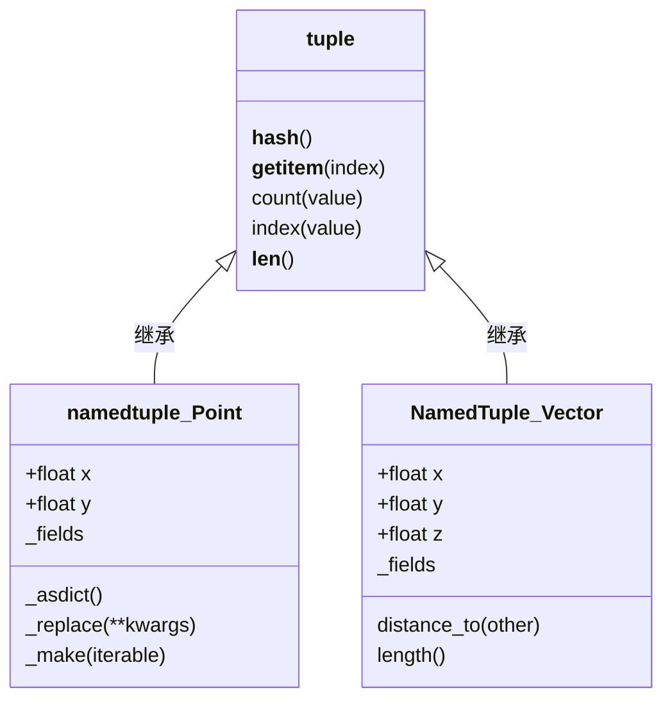

# Day 007 — 元组（Tuple）图解

> 本文件包含核心概念的 ASCII / Mermaid 图解

---

## 1. 元组 vs 列表：内存布局对比

```ascii
┌─────────────────────────────────────────────────────────────┐
│                    列表对象 (list)                           │
│  ┌─────────────────────────────────┐                       │
│  │ PyObject_HEAD (16 bytes)        │                       │
│  │   ob_refcnt: 1                  │                       │
│  │   ob_type: &PyList_Type         │                       │
│  │ ob_size: 3                      │                       │
│  │ allocated: 4                    │ ← 预分配更多空间！    │
│  │ ob_item ─────┐                  │                       │
│  └──────────────┼──────────────────┘                       │
│                 ↓                                          │
│  ┌──────────────┴────────────────┐                         │
│  │ 指针数组 (连续内存, 32 bytes)  │                         │
│  │ [ptr0] [ptr1] [ptr2] [未使用] │← 多余的 1 个槽位       │
│  └───────┬──────┬──────┬─────────┘                         │
│          │      │      │                                   │
│          ↓      ↓      ↓                                   │
│         [1]    [2]    [3]       ← Python 整数对象          │
│                                                                
│  合计: 56 + (16~32) = 72~88 bytes                          │
└─────────────────────────────────────────────────────────────┘

┌─────────────────────────────────────────────────────────────┐
│                    元组对象 (tuple)                          │
│  ┌─────────────────────────────────┐                       │
│  │ PyObject_HEAD (16 bytes)        │                       │
│  │   ob_refcnt: 1                  │                       │
│  │   ob_type: &PyTuple_Type        │                       │
│  │ ob_size: 3                      │                       │
│  │ ┌─────────────────────────────┐ │                       │
│  │ │ ob_item[0] = ptr0           │ │  ← 指针直接嵌入      │
│  │ │ ob_item[1] = ptr1           │ │     结构体内部！      │
│  │ │ ob_item[2] = ptr2           │ │     没有额外分配！    │
│  │ └───────┬──────┬──────┬───────┘ │                       │
│  └─────────┼──────┼──────┼─────────┘                       │
│            │      │      │                                 │
│            ↓      ↓      ↓                                 │
│           [1]    [2]    [3]       ← Python 整数对象        │
│                                                                
│  合计: 40 bytes （一次性，无浪费）                           │
└─────────────────────────────────────────────────────────────┘
```

---

## 2. 元组拆包流程图

```ascii
a, b, c = (1, 2, 3)

            (1, 2, 3)
               │
     ┌─────────┴─────────┐
     │ 获取迭代器         │
     │ for val in tuple:  │
     └─────────┬─────────┘
               │
     ┌─────────▼─────────┐
     │ 第一次 next() → 1  │ ←── a
     │ 第二次 next() → 2  │ ←── b
     │ 第三次 next() → 3  │ ←── c
     │ 第四次 next() → 抛 │ ←── StopIteration
     └───────────────────┘


带星号的拆包流程：

first, *middle, last = (1, 2, 3, 4, 5)

            (1, 2, 3, 4, 5)
                   │
     ┌─────────────▼─────────────┐
     │ Python 扫描星号位置       │
     │                           │
     │ 左边部分：first → t[0]    │
     │ 星号变量：*middle → t[1:4]│
     │ 右边部分：last → t[4]     │
     └─────────────┬─────────────┘
                   │
         ┌─────────▼─────────┐
         │ first = 1         │
         │ middle = [2, 3, 4]│ ←── 注意是列表！
         │ last = 5          │
         └───────────────────┘
```

---

## 3. namedtuple 继承关系图



---

## 4. 元组不可变性示意图

```ascii
t = (1, [2, 3], 4)

内存中的元组对象：
┌─────────────────────────────┐
│ 元组对象 (不可变外壳)        │
│                             │
│  ob_item[0] ───→ 整数 1    │ ← 不可替换（❌ t[0]=99）
│  ob_item[1] ───→ 列表对象   │ ← 不可替换（❌ t[1]=[5,6]）
│  ob_item[2] ───→ 整数 4    │ ← 不可替换
└─────────────────────────────┘
                        │
                        ▼
                  ┌──────────┐
                  │ 列表 [2,3]│ ← 可变内容！
                  │          │   可以修改（✅ t[1].append(4)）
                  │ 内容可变 │   因为元组只存引用，不存内容
                  └──────────┘

关键理解：
  "元组的不可变 = 引用不可变，引用的对象可变"
  元组保存的是"到对象的指针"，指针不能改
  但指针指向的对象内部可以改变
```

---

## 5. 列表 vs 元组 — 选择决策树

```ascii
数据需要放在一个序列中吗？
│
├── 是
│   │
│   ├── 数据数量会变化吗？（增/删/改）
│   │   │
│   │   ├── 是 ─────────→ 使用 列表 list
│   │   │
│   │   └── 否
│   │       │
│   │       ├── 需要做字典键吗？
│   │       │   │
│   │       │   ├── 是 ─→ 使用 元组 tuple
│   │       │   │
│   │       │   └── 否
│   │       │       │
│   │       │       ├── 数据是同质的（全是同一类型）？
│   │       │       │   ├── 是 → 列表（通常要遍历操作）
│   │       │       │   └── 否 → 元组（异质数据常是记录）
│   │       │       │
│   │       │       └── 性能敏感且数据量大？
│   │       │           ├── 是 → 元组（更快更省内存）
│   │       │           └── 否 → 列表（灵活优先）
│   │
│   └── 需要命名属性访问吗？
│       ├── 是 → namedtuple 或 dataclass
│       └── 否 → 普通元组或列表
│
└── 否 → 不需要序列，用其他数据结构
```

---

## 6. 多返回值拆包示意

```ascii
def func():
    return 1, 2, 3

Python 解析步骤：
┌─── return 1, 2, 3 ───────────────────────┐
│                                           │
│  1. 1, 2, 3 → Python 构造元组 (1, 2, 3)  │
│     (元组字面量，自动打包)                  │
│                                           │
│  2. return → 返回元组对象                  │
│                                           │
│  3. 调用方接收：result = func()            │
│     → result = (1, 2, 3)，类型是 tuple     │
│                                           │
│  4. 拆包：a, b, c = func()                │
│     → 右侧先执行 func() 返回 (1, 2, 3)     │
│     → 再执行拆包：a=1, b=2, c=3            │
└───────────────────────────────────────────┘
```
