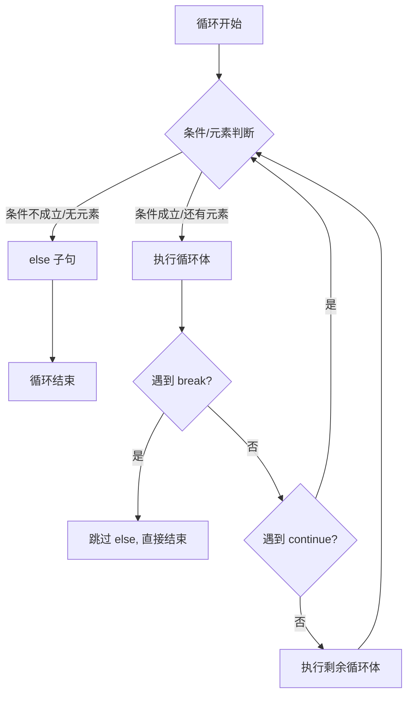

# Day 010 — 循环图解

> 一图胜千言 — 循环机制的可视化

---

## 1. 迭代器协议流程图

```mermaid
flowchart TD
    A[可迭代对象 Iterable] -->|iter&#40;&#41;| B[迭代器 Iterator]
    B -->|next&#40;&#41;| C{还有元素吗?}
    C -->|是| D[取出元素]
    D --> E[执行循环体]
    E --> B
    C -->|否| F[StopIteration 异常]
    F --> G[循环结束]
```



---

## 2. for 循环执行过程

```
    ┌──────────────────────────────────────┐
    │            for 循环内部               │
    │                                       │
    │  ┌───────────────────┐                │
    │  │  for x in [a,b,c]:│                │
    │  │     print(x)      │                │
    │  └────────┬──────────┘                │
    │           │                           │
    │           ▼                           │
    │  ┌────────────────────┐               │
    │  │  iterator = iter() │  ← 获取迭代器  │
    │  └────────┬───────────┘               │
    │           │                           │
    │  ┌────────▼───────────┐               │
    │  │  try:              │               │
    │  │    x = next(it)    │  ← 取元素     │
    │  │    print(x)        │  ← 执行体     │
    │  │  except StopIter:  │               │
    │  │    break           │  ← 结束       │
    │  └────────────────────┘               │
    │                                       │
    └──────────────────────────────────────┘
```

---

## 3. break / continue / else 决策树



---

## 4. range() 惰性求值原理

```
range(1, 10, 2)   ⟶   存储为: start=1, stop=10, step=2

内存中的 range 对象 (48 字节):
┌──────────────┐
│  start: 1    │
│  stop:  10   │
│  step:  2    │
└──────────────┘
       │
       ▼ 迭代时按需计算
async
    next() → 1
    next() → 3
    next() → 5
    next() → 7
    next() → 9
    next() → StopIteration

对比列表 list(range(1, 10, 2)):
┌──────────────┐
│  [1, 3, 5,   │
│   7, 9]      │  ← 所有值已存在
│  存储: 120 字节│
└──────────────┘
```

---

## 5. 菱形打印分解图

```
n = 4 (上半部分行数)

行  |  空格  |  星号  |  绘制
────┼────────┼────────┼─────────
 1  │  n-1=3 │ 2*1-1=1│    *
 2  │  n-2=2 │ 2*2-1=3│   ***
 3  │  n-3=1 │ 2*3-1=5│  *****
 4  │  n-4=0 │ 2*4-1=7│ *******
    │        │        │
 5  │   i=1  │ 2*(4-1)-1=5│  *****
 6  │   i=2  │ 2*(4-2)-1=3│   ***
 7  │   i=3  │ 2*(4-3)-1=1│    *
```

---

## 6. 嵌套循环执行明细

```
外循环 i  内循环 j     打印的内容
──────────────────────────────
i=1       j=1,2,...,i   第一行
              ↓
          print("*")    →  i 个星号

i=2       j=1,2,...,i   第二行
              ↓
          print("**")   →  i 个星号

i=3       j=1,2,...,i   第三行
              ↓
          print("***")  →  i 个星号

总计执行次数: ∑i = n(n+1)/2

示例 n=5:
  1 + 2 + 3 + 4 + 5 = 15 次
```

---

## 7. while 循环与 for 循环对比

```
for 循环                      while 循环
────────                      ──────────
for i in range(5):            i = 0
    print(i)                  while i < 5:
                                  print(i)
                                  i += 1

适合场景:                     适合场景:
- 已知迭代次数                - 不知次数，只知条件
- 遍历容器                    - 用户输入验证
- 固定步长                    - 状态机/游戏循环

特点:                        特点:
- 自动管理迭代状态             - 手动管理状态（容易忘记更新）
- 不会意外无限循环             - 容易意外无限循环
- 语法简洁                    - 控制更灵活
```

---

## 8. for...else 的工作原理

```
      ┌─────────────────────┐
      │  for x in sequence:  │
      └──────────┬──────────┘
                 │
      ┌──────────▼──────────┐
      │  循环体执行           │
      └──────────┬──────────┘
                 │
      ┌──────────▼──────────┐
      │  break 被执行了吗?    │
      └──────┬───────┬──────┘
             │       │
           是│       │否
             ▼       ▼
      ┌──────────┐ ┌──────────┐
      │ 结束循环  │ │  执行    │
      │ 跳过 else│ │  else 子句│
      └──────────┘ └──────────┘
```

---

## 9. 用户输入验证的 while 模式

```
      ┌─────────────────────┐
      │  while True:         │
      │      user_input =    │
      │        input("...")  │
      └──────────┬──────────┘
                 │
      ┌──────────▼──────────┐
      │  验证输入有效吗?      │
      └──────┬───────┬──────┘
             │       │
           否│       │是
             ▼       ▼
      ┌──────────┐ ┌──────────┐
      │ 打印错误  │ │ break    │
      │ 继续循环  │ │ 退出     │
      └──────────┘ └──────────┘
```

---

> **总结：** 所有循环 = 迭代器（数据来源）+ 条件（何时停止）+ 循环体（做什么）
>
> 选择 for 的场景：已知范围、遍历容器
> 选择 while 的场景：未知次数、条件驱动
