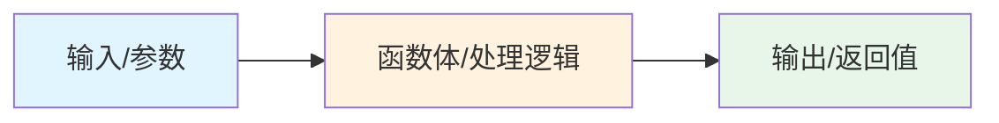
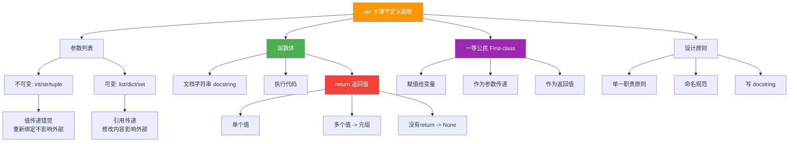

# Day 011 — 函数基础图解

> 一图胜千言 —— 函数机制的可视化

---

## 1. 函数的本质



**函数 = 输入 → 处理 → 输出**

---

## 2. 函数定义与调用的执行流程

```
                         调用栈 (Call Stack)
    ┌────────────────────────────────────────────────────┐
    │                                                    │
    │  调用 greet("张三")                                  │
    │                                                    │
    │  步骤:                                              │
    │  ① 查找 greet 函数对象                               │
    │  ② 创建新的栈帧 (Stack Frame)                       │
    │  ③ 绑定参数: name = "张三"                            │
    │  ④ 执行函数体                                       │
    │  ⑤ 销毁栈帧                                         │
    │  ⑥ 返回调用点继续执行                                 │
    │                                                    │
    │  ┌──────────────────────────────────────┐          │
    │  │  [栈顶 - 当前活跃]                     │          │
    │  │  greet_scope                          │          │
    │  │  ┌────────────────────────────────┐   │          │
    │  │  │  name = "张三"                  │   │          │
    │  │  │  result = "你好, 张三!"          │   │          │
    │  │  └────────────────────────────────┘   │          │
    │  ├──────────────────────────────────────┤          │
    │  │  [栈底 - 全局]                        │          │
    │  │  global_scope                        │          │
    │  │  ┌────────────────────────────────┐   │          │
    │  │  │  greet = <function>             │   │          │
    │  │  │  say_hello = <function>         │   │          │
    │  │  │  add = <function>               │   │          │
    │  │  └────────────────────────────────┘   │          │
    │  └──────────────────────────────────────┘          │
    └────────────────────────────────────────────────────┘
```

---

## 3. 参数传递机制详解

### 不可变类型（int）

```
调用前:                        调用中:                    调用后:
n = 5                         ┌───────────────┐          n = 5
n ───→ [int: 5]               │ x ──→ [int:5] │          n ───→ [int: 5]
                               │               │
                               │ x = 100       │
                               │ x ──→ [int:100]│
                               └───────────────┘
```

### 可变类型（list）—— 修改内容

```
调用前:                        调用中:                    调用后:
my_list = [1,2,3]             ┌──────────────────┐       my_list = [1,2,3,4]
my_list ──→ [1,2,3]           │ lst ──→ [1,2,3]  │       my_list ──→ [1,2,3,4]
                               │           │      │
                               │     lst.append(4)  │
                               │           │      │
                               │           ▼      │
                               │         [1,2,3,4] │
                               └──────────────────┘
```

### 重新绑定 vs 修改对象

```
重新绑定 (不影响外部):               修改对象 (影响外部):

外部:                      外部:
[1, 2, 3]                  [1, 2, 3]
    ↑                          ↑
    │                          │
lst (参数) ──→ 断开了!     lst (参数) ──→ 仍然指向同一个
    │                          │
    ▼                          ▼
[100, 200, 300]            [1, 2, 3, 999]
(新对象，外部再也看不到了)    (外部能感知到这个修改)
```

---

## 4. return 的执行流程

```
函数调用
    │
    ▼
┌──────────────────┐
│  执行函数体        │
└──────┬───────────┘
       │
       ▼
┌──────────────────┐
│  遇到 return 语句  │
│       或          │
│  函数体执行完毕     │
└──────┬───────────┘
       │
       ▼
┌──────────────────────────────────┐
│  计算 return 后面的表达式（如果有） │
│  return a + b                    │
│         ↓                        │
│     计算 a + b → 得到结果         │
└──────────────┬───────────────────┘
               │
               ▼
┌──────────────────┐
│  销毁当前栈帧      │  ← 局部变量消失
└──────┬───────────┘
       │
       ▼
┌──────────────────┐
│  返回值传递给调用者  │
└──────────────────┘
```

---

## 5. 文档字符串（docstring）结构

```
def function_name(param1, param2):
    """
    ┌─────────────────────────────────────────┐
    │  一句话描述                              │  ← 必须
    │                                         │
    │  详细描述——可以多行                        │  ← 可选，复杂函数推荐
    │  解释功能、注意事项、算法简要说明              │
    │                                         │
    │  Args:                                  │  ← 参数说明
    │      param1 (type): 描述                  │
    │      param2 (type, optional): 描述        │
    │                                         │
    │  Returns:                               │  ← 返回值说明
    │      type: 描述                           │
    │                                         │
    │  Raises:                                │  ← 异常说明（可选）
    │      ValueError: 什么情况下抛出            │
    │                                         │
    │  Example:                               │  ← 示例（可选）
    │      >>> func(1, 2)                      │
    │      3                                   │
    └─────────────────────────────────────────┘
    """
    pass
```

---

## 6. 函数是一等公民

```
Python 中的数据类型 "地位" 对比:

┌─────────────────────────────────────────────────────────┐
│                   数据一等公民                            │
│                                                          │
│  操作               int  str  list  dict  tuple  FUNCTION│
│  ─────────────────────────────────────────────────────  │
│  赋值给变量          ✓    ✓    ✓     ✓     ✓       ✓    │
│  作为参数传递        ✓    ✓    ✓     ✓     ✓       ✓    │
│  作为返回值          ✓    ✓    ✓     ✓     ✓       ✓    │
│  存储在容器中        ✓    ✓    ✓     ✓     ✓       ✓    │
│  比较相等性          ✓    ✓    ✓     ✓     ✓       ✓    │
│                                                          │
│  结论: 函数和 int、str 一样，是一等公民！                   │
└─────────────────────────────────────────────────────────┘
```

---

## 7. 计算器函数库架构

```
┌──────────────────────────────────────────────────────────┐
│                  计算器函数库 (Calculator Library)         │
│                                                           │
│  函数数据流:                                               │
│                                                           │
│  用户输入                                                  │
│      │                                                    │
│      ▼                                                    │
│  ┌──────────┐     ┌──────────────┐     ┌─────────────┐   │
│  │ 输入解析  │ ──→ │ 命令路由分发   │ ──→ │ 调用对应函数  │   │
│  │ split()  │     │ 判断运算符    │     │ add/sub/... │   │
│  └──────────┘     └──────────────┘     └──────┬──────┘   │
│                                                │         │
│                                                ▼         │
│                                         ┌─────────────┐  │
│                                         │ 返回结果      │  │
│                                         └──────┬──────┘  │
│                                                │         │
│                                                ▼         │
│                                         ┌─────────────┐  │
│                                         │ 格式化输出    │  │
│                                         │ 显示给用户    │  │
│                                         └─────────────┘  │
│                                                           │
└──────────────────────────────────────────────────────────┘
```

---

## 8. 牛顿迭代法求平方根（可视化）

```
求 sqrt(10)

第一次迭代: x₀ = 10
    切线: f(x) = x² - 10
    x₁ = (10 + 10/10) / 2 = 5.5

第二次迭代: x₁ = 5.5
    x₂ = (5.5 + 10/5.5) / 2 = 3.66

第三次迭代: x₂ = 3.66
    x₃ = (3.66 + 10/3.66) / 2 = 3.20

第四次迭代: x₃ = 3.20
    x₄ = (3.20 + 10/3.20) / 2 = 3.16

第五次迭代: x₄ = 3.16
    x₅ = (3.16 + 10/3.16) / 2 = 3.1623 ✅

收敛过程:
10.00 → 5.50 → 3.66 → 3.20 → 3.16 → 3.1623 (实际: 3.16227766)
```

---

## 9. 函数设计原则（单一职责）

```
❌ 不好的设计:                           ✅ 好的设计:
                                        │
def process_data(data):                 def clean_data(data):
    # 清洗                                  ...
    # 分析                                  return cleaned
    # 画图                                │
    # 发邮件                              def analyze_data(data):
    # 存数据库                               ...
    pass                                    return results
                                        │
  这个函数做太多事了!                       def plot_data(results):
  任何一个功能的改动都可能影响其他功能:           ...
  测试困难                               │
  复用困难                                def export_results(results):
                                              ...
```

---

## 10. 总结：函数的核心概念关系图


