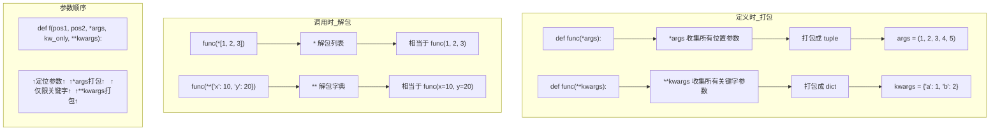
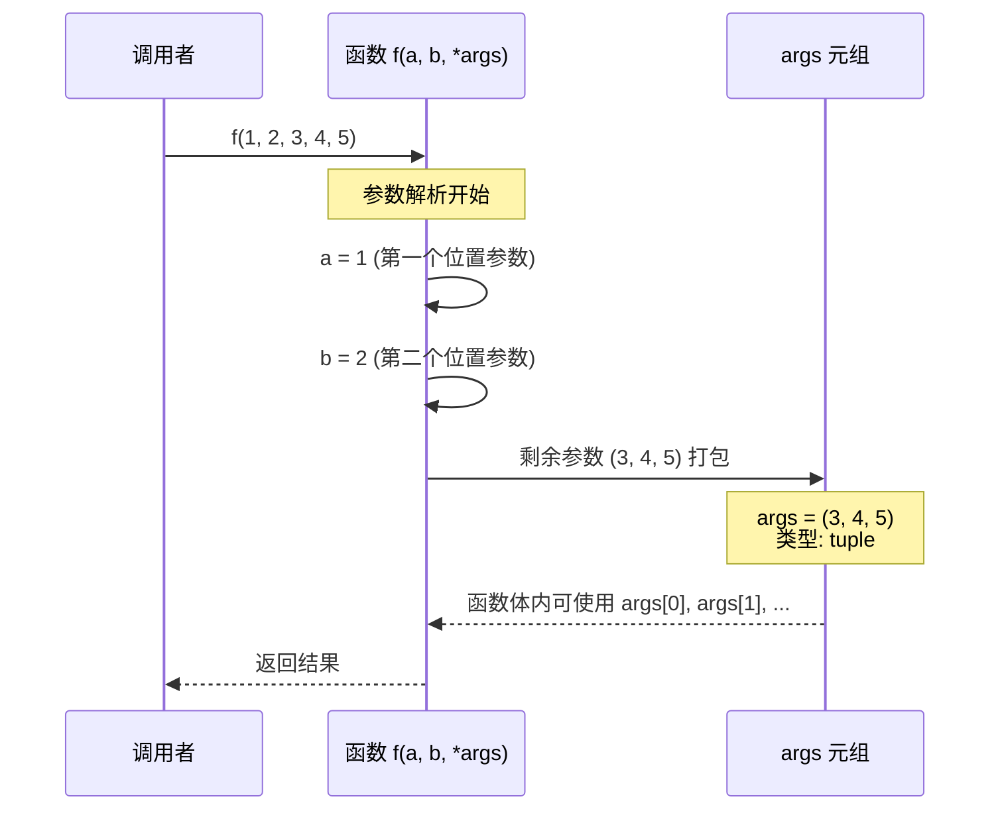
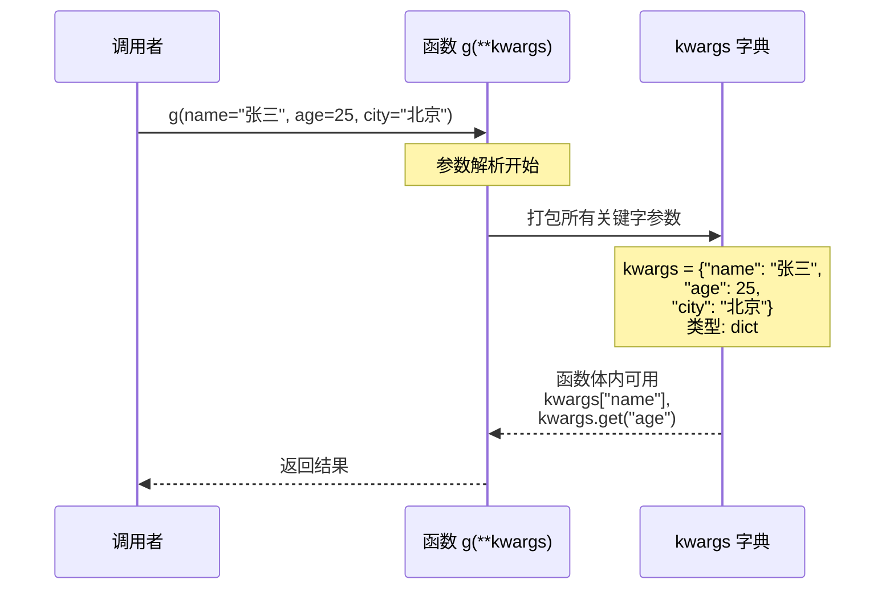
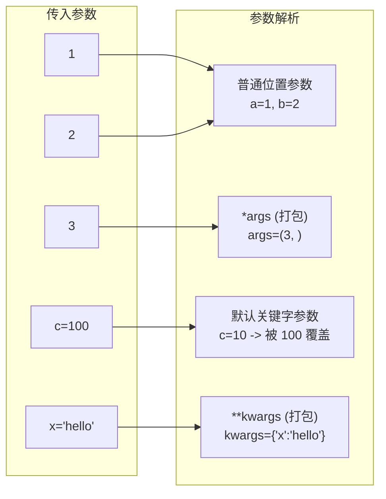
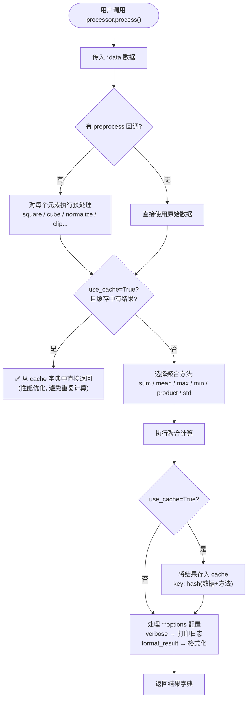
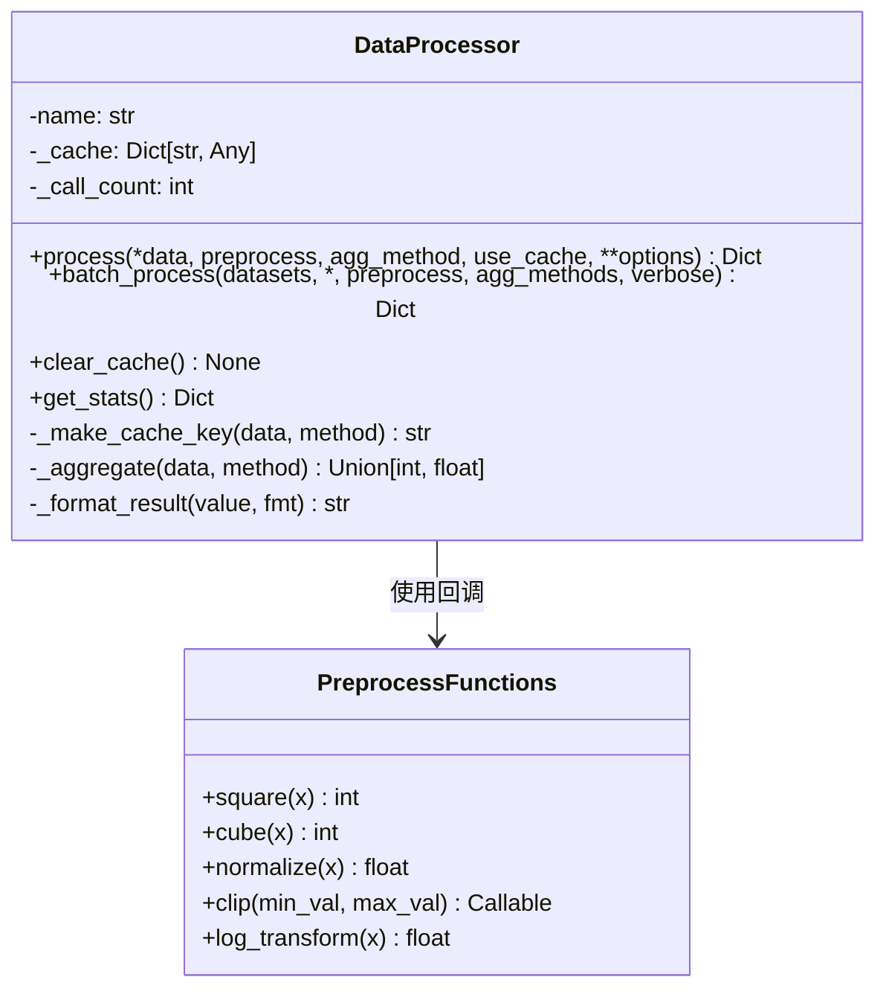

# Day 012 — 函数进阶：图解

> 本章图的 ASCII 示意图和 Mermaid 流程图，帮助理解函数进阶的核心概念。

---

## 目录

1. [默认参数陷阱内存示意图](#1-默认参数陷阱内存示意图-ascii)
2. [*args/**kwargs 数据流向图](#2-args-kwargs-数据流向图-mermaid)
3. [函数注解存储机制图解](#3-函数注解存储机制图解-ascii)
4. [通用数据处理器流程图](#4-通用数据处理器流程图-mermaid)

---

## 1. 默认参数陷阱内存示意图 (ASCII)

### 1.1 陷阱版本：共享同一个可变对象

```
                      ┌─────────────────────┐
                      │   函数对象 (add_item) │
                      │                     │
                      │  __defaults__ = ([]) │
                      │         │           │
                      │         ▼           │
                      │    ┌─────────────────┐
                      │    │ 空列表 []       │ ← 唯一的列表对象
                      │    └─────────────────┘
                      └─────────────────────┘


第一次调用: add_item("a")
  参数: item = "a"
  items ──── 指向默认列表 ────→ ┌─┬─┬─┐
                                │a│ │ │   ← 在默认列表上 .append("a")
                                └─┴─┴─┘
  调用后默认列表永久变为 ['a']


第二次调用: add_item("b")
  参数: item = "b"
  items ──── 仍然指向同一个 ──→ ┌─┬─┬─┐
                                │a│b│ │   ← 继续在同一个列表上 .append("b")
                                └─┴─┴─┘
  调用后默认列表变为 ['a', 'b'] ← 上个调用的结果还在！


第三次调用: add_item("c")
  参数: item = "c"
  items ──── 还是同一个 ──────→ ┌─┬─┬─┐
                                │a│b│c│   ← 越积越多
                                └─┴─┴─┘
  调用后默认列表变为 ['a', 'b', 'c']
```

### 1.2 正确版本：None 模式 + 每次创建新对象

```
                      ┌─────────────────────┐
                      │   函数对象            │
                      │  (add_item_correct)  │
                      │                     │
                      │  __defaults__ = (None)│ ← None 是不可变对象
                      │                    │
                      ＋─────────────────────＋


第一次调用: add_item_correct("a")
  参数: item = "a"
  items ──── 指向 None ──────────────────────→ None (单例)
  if items is None: items = []
  
  创建新的独立列表: ┌─┬─┬─┐
                    │a│ │ │
                    └─┴─┴─┘
  调用结束后，这个列表被返回，默认参数不受影响。


第二次调用: add_item_correct("b")
  参数: item = "b"
  items ──── 仍然指向 None ──────────────────→ None (还是那个单例)
  if items is None: items = []

  创建另一个新的独立列表: ┌─┬─┬─┐
                          │b│ │ │  ← 干净的新列表！
                          └─┴─┴─┘
  调用结束后，这个列表被返回，默认参数不受影响。
```

### 1.3 对比：陷阱 vs 正确

```
陷阱版本 (共享):
                                            
  ┌────────┐   ┌────────┐   ┌────────┐     
  │ 第1次   │   │ 第2次   │   │ 第3次   │     
  │ 调用    │   │ 调用    │   │ 调用    │     
  └───┬────┘   └───┬────┘   └───┬────┘     
      │            │            │           
      └──────┬─────┴─────┬──────┘           
             │           │                  
             ▼           ▼                  
        ┌─────────────────────┐             
        │   同一个列表         │             
        │   ['a', 'b', 'c']   │  ← 被累加修改
        └─────────────────────┘             

正确版本 (独立):

  ┌────────┐     ┌────────┐     ┌────────┐  
  │ 第1次   │     │ 第2次   │     │ 第3次   │  
  │ 调用    │     │ 调用    │     │ 调用    │  
  └───┬────┘     └───┬────┘     └───┬────┘  
      │              │              │       
      ▼              ▼              ▼       
  ┌────────┐    ┌────────┐    ┌────────┐    
  │ ['a']  │    │ ['b']  │    │ ['c']  │  ← 每次独立
  └────────┘    └────────┘    └────────┘    
```

---

## 2. *args/**kwargs 数据流向图 (Mermaid)



### *args 数据流详细图



### **kwargs 数据流详细图



### 参数传递完整流程



---

## 3. 函数注解存储机制图解 (ASCII)

### __annotations__ 字典结构

```
def add(x: int, y: int) -> float:
    return x + y

                    ┌─────────────────────────────────┐
                    │      add.__annotations__          │
                    │  (函数对象的 __annotations__ 属性)  │
                    ├─────────────────────────────────┤
                    │  ┌─────────────────────────────┐ │
                    │  │  "x"      →  <class 'int'>  │ │
                    │  │  "y"      →  <class 'int'>  │ │
                    │  │  "return" →  <class 'float'>│ │
                    │  └─────────────────────────────┘ │
                    │                                   │
                    │  字典的键: 参数名 (字符串)          │
                    │           "return" 代表返回值      │
                    │  字典的值: 类型对象 (任何表达式)     │
                    └─────────────────────────────────┘

Python 运行时不检查类型:
    add("hello", "world")  → 不会报错！
    TypeError 只在执行时出现（字符串不支持 + 操作）

静态检查工具 (mypy):
    mypy 在运行前分析 __annotations__ 
    → 发现 "hello" 不是 int → 报类型错误
```

### Python 为什么不强制检查？

```
动态类型 (Duck Typing):

    def double(x):
        return x * 2

    print(double(5))     → 10      (int * 2)
    print(double("Hi"))  → "HiHi"  (str * 2)
    print(double([1]))   → [1, 1]  (list * 2)

    同一个函数、无类型约束 — 三种不同类型都能正确工作！
    这就是「鸭子类型」的灵活性。

Type Hints + mypy 的平衡:

    灵活性                              安全性
    ┌─────────────────────────────────────┐
    │                                     │
    │  纯 Duck    有 Type     有 Type     │
    │  Typing    Hints       Hints       │
    │            无 mypy      + mypy     │
    │                                     │
    │  灵活      ⬆ 更可读    ⬆ 安全     │
    │  但易错    仍易错      CI 捕获错误  │
    │                                     │
    └─────────────────────────────────────┘
```

---

## 4. 通用数据处理器流程图 (Mermaid)



### 处理器类架构



---

## 快速参考

| 概念 | 图解位置 | 核心要点 |
|------|---------|---------|
| 默认参数陷阱 | 第 1 节 | def 执行时创建默认参数，所有调用共享同一可变对象 |
| None 模式 | 第 1 节 | 用 None 代替可变默认值，函数体内创建新对象 |
| *args 打包 | 第 2 节 Mermaid | 位置参数 → 元组 |
| **kwargs 打包 | 第 2 节 Mermaid | 关键字参数 → 字典 |
| 函数注解 | 第 3 节 | 存储在 `__annotations__`，不强制检查 |
| 数据处理器 | 第 4 节 Mermaid | 综合运用所有概念 |
