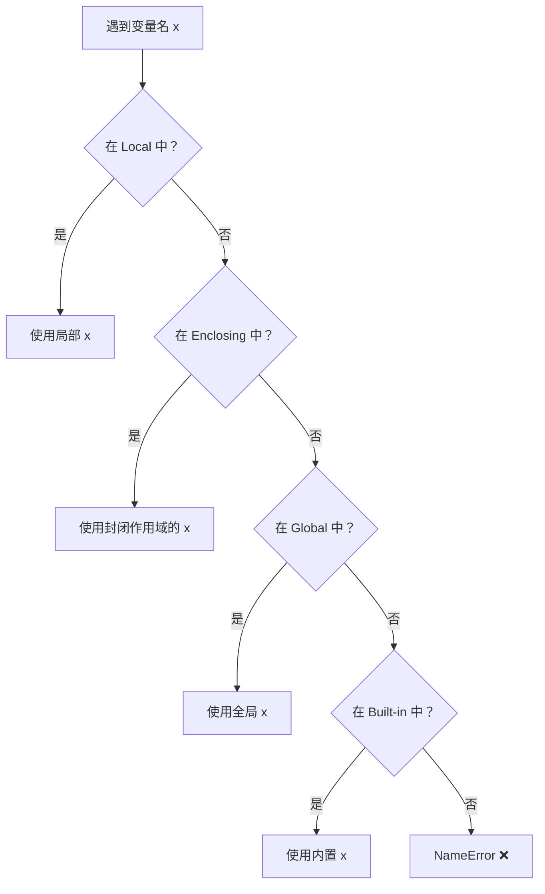
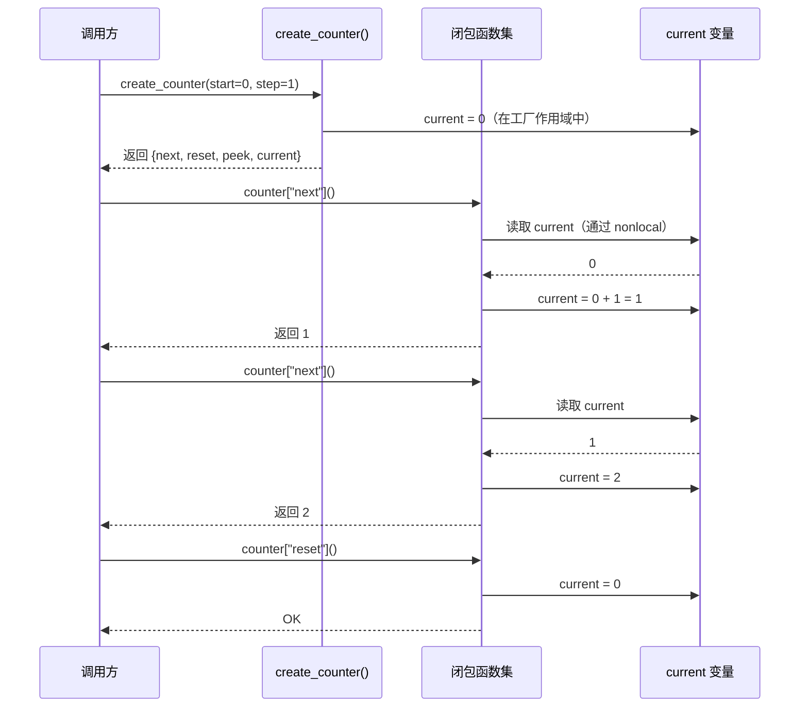

# Day 013：作用域与命名空间

> 理解 Python 如何在代码中查找变量 —— 这是写出可维护、无 Bug 代码的基石。

---

## 📋 目录

1. [作用域的概念](#1-作用域的概念)
2. [LEGB 规则详解](#2-legb-规则详解)
3. [global 与 nonlocal 声明](#3-global-与-nonlocal-声明)
4. [闭包原理](#4-闭包原理)
5. [变量生命周期](#5-变量生命周期)
6. [实战：计数器工厂](#6-实战计数器工厂)
7. [思考题](#7-思考题)

---

## 1. 作用域的概念

### 1.1 什么是作用域？

**作用域（Scope）** 是变量在程序中可见和可访问的区域。简单说：一个变量在代码的哪些位置可以被读取或修改。

```python
def outer():
    x = 10          # x 定义在 outer 函数内部
    def inner():
        print(x)    # 这里能访问 x 吗？
    inner()

outer()
print(x)            # ❌ 这里能访问 x 吗？
```

### 1.2 为什么需要作用域？

> **设计原理**：作用域的存在是为了实现 **命名隔离（name isolation）**。

没有作用域的世界会怎样？
- 不同函数里的变量会互相覆盖
- 一个循环的 `i` 会污染整个程序
- 无法把代码拆分成独立模块

```python
# 如果没有作用域隔离...
def calc_a():
    total = 100   # 会覆盖 calc_b 的 total 吗？

def calc_b():
    total = 200   # 会覆盖 calc_a 的 total 吗？
```

Python 通过作用域机制，让不同代码块的变量互不干扰。

### 1.3 命名空间的概念

**命名空间（Namespace）** 是变量名到对象的映射。本质上就是一个字典：`{变量名: 对象引用}`。

```python
# Python 内部大致是这样管理命名空间的
scope = {
    'x': 42,
    'name': 'Alice',
    'items': [1, 2, 3]
}
```

每个作用域对应一个命名空间。Python 在运行时维护多个命名空间：
- **局部命名空间（Local）** ── 当前函数的变量
- **封闭命名空间（Enclosing）** ── 外层函数的变量
- **全局命名空间（Global）** ── 模块级别的变量
- **内置命名空间（Built-in）** ── Python 内置函数和异常

---

## 2. LEGB 规则详解

### 2.1 定义

**LEGB** 是 Python 解析变量名时的查找顺序，代表四层作用域的优先级：

```
L ── Local（局部）────────── 当前函数内部
E ── Enclosing（封闭）────── 外层函数（嵌套函数场景）
G ── Global（全局）────────── 当前模块顶层
B ── Built-in（内置）──────── Python 内置的命名空间
```

> **为什么是 LEGB 这个顺序？** Python 编译器在设计时遵循 **"最内层优先"（innermost-first）** 原则。这样做的理由是：
> 1. **局部性原理**：一个函数内最常访问的是它的局部变量，优先查找能提升性能
> 2. **封装性**：内部变量可以安全地"遮蔽"外部同名变量，不影响外部逻辑
> 3. **可预测性**：无论嵌套多深，查找路径总是由内向外，规则简单明确

### 2.2 图解 LEGB 查找过程



### 2.3 分层示例

```python
# 内置命名空间
print           # ← 来自 Built-in，不需要定义

# 全局命名空间
x = "全局 x"    # ← 全局作用域

def outer():
    y = "封闭 y"  # ← outer 的局部，对 inner 来说是 Enclosing

    def inner():
        z = "局部 z"  # ← inner 的局部
        print(z)      # L：找到局部 z
        print(y)      # E：local 没有 y，去 enclosing 找
        print(x)      # G：前两层都没有，去全局找
        print(len)    # B：全局也没有 len，去内置找

    inner()

outer()
```

### 2.4 遮蔽现象（Shadowing）

当内层变量与外层变量同名时，**内层会遮蔽外层**。

```python
x = 10

def shadow():
    x = 20      # 这个 x 是局部变量，遮蔽了全局 x
    print(x)    # → 20

shadow()
print(x)        # → 10（全局 x 不受影响）
```

> ⚠️ **常见陷阱**：很多初学者认为在函数内修改外部变量会"同步修改"，实际上只是创建了一个同名的局部变量。

### 2.5 LEGB 的例外：赋值与可变对象

**原则**：LEGB 查找规则适用于**读取变量**。对于**赋值**，Python 默认在当前作用域创建或修改变量。

```python
nums = [1, 2, 3]

def mutate():
    nums.append(4)          # ✅ 可以！这是"读取后修改"，不是"赋值"
    print(nums)             # → [1, 2, 3, 4]

def reassign():
    nums = [4, 5, 6]       # ⚡ 这是"赋值"——创建了新局部变量 nums
    print(nums)             # → [4, 5, 6]

mutate()
reassign()
print(nums)                 # → [1, 2, 3, 4]（mutate 真的修改了列表）
```

> **关键区别**：`nums.append(4)` 是读→修改（先通过 LEGB 找到 nums，再调用 append 方法），`nums = [...]` 是赋值（在局部创建新变量）。

---

## 3. global 与 nonlocal 声明

### 3.1 为什么需要 global 和 nonlocal？

Python 默认在函数内赋值会创建**局部变量**。如果想让赋值操作影响**外层作用域**的变量，需要显式声明。

> **设计原理**：这是 Python 的 **显式优于隐式（Explicit is better than implicit）** 哲学的体现。其他语言（如 JavaScript）在嵌套函数中修改变量可能需要复杂的规则，Python 选择了简单粗暴的方式——需要通过关键字告诉解释器你的意图。

### 3.2 global 声明

**作用**：声明一个变量来自全局命名空间，函数内的赋值操作会修改全局变量。

```python
count = 0           # 全局变量

def increment():
    global count    # 声明：这个 count 是全局的
    count += 1
    print(f"count = {count}")

increment()         # → count = 1
increment()         # → count = 2
print(count)        # → 2（确实被修改了）
```

**如果不加 global**：

```python
count = 0

def increment():
    # 这里没有 global 声明
    count += 1      # 🚫 UnboundLocalError!
```

为什么会报错？因为 Python 在编译函数时就发现 `count += 1` 里对 `count` 进行了赋值，于是将其标记为局部变量。后续 `+=` 需要先读取 `count`，但此时局部 `count` 还没有定义，所以抛出错误。

> ⚠️ **最佳实践**：尽量避免大量使用 `global`。它破坏了函数的封装性——函数不应该依赖或修改外部状态。如果确实需要，考虑使用类（`class`）或返回值来替代。

### 3.3 nonlocal 声明

**作用**：声明一个变量来自**最近的外层函数作用域**（Enclosing），用于嵌套函数中修改外层函数的局部变量。

```python
def outer():
    x = 10              # outer 的局部变量

    def inner():
        nonlocal x      # 声明：这个 x 来自外层函数
        x = 20          # 修改的是 outer 的 x，不是创建新变量
        print(f"inner: x = {x}")

    inner()
    print(f"outer: x = {x}")  # → 20（被 inner 修改了）

outer()
```

**为什么需要 nonlocal？**

```python
def outer():
    x = 10

    def inner_bad():
        x = 20          # 这创建了一个新的局部 x，不会影响 outer 的 x
        print(f"inner_bad: x = {x}")

    def inner_good():
        nonlocal x
        x = 20          # 这修改了 outer 的 x
        print(f"inner_good: x = {x}")

    inner_bad()
    print(f"after inner_bad: x = {x}")   # → 10（没变）

    inner_good()
    print(f"after inner_good: x = {x}")  # → 20（变了）

outer()
```

### 3.3 global vs nonlocal 对比

| 特性 | `global` | `nonlocal` |
|------|----------|------------|
| 作用目标 | 全局命名空间 | 最近的外层函数（非全局） |
| 适用场景 | 模块顶层变量 | 嵌套函数中的封闭作用域 |
| 多层嵌套 | 跳过多层到全局 | 逐层向上，找到最近的 |
| 使用频率 | 很少（破坏封装） | 较多（闭包场景） |

```python
x = "全局"

def a():
    x = "a 层的 x"       # 局部

    def b():
        x = "b 层的 x"   # a 到 b 之间还有一个局部

        def c():
            global x     # 跳过 a 层和 b 层，直接到全局
            x = "被 c 修改的全局 x"

        def d():
            nonlocal x   # 去最近的外层找 x → b 层的 x
            x = "被 d 修改的 b 层 x"

        c()
        d()
        print("b:", x)   # → "被 d 修改的 b 层 x"

    b()
    print("a:", x)       # → "a 层的 x"（没被 nonlocal 影响）

a()
print("全局:", x)        # → "被 c 修改的全局 x"
```

---

## 4. 闭包原理

### 4.1 什么是闭包？

**闭包（Closure）** 是一个函数对象，它记住了其创建时所在作用域中的自由变量，即使那个作用域已经执行完毕。

```python
def make_greeter(greeting):
    def greet(name):
        return f"{greeting}, {name}!"
    return greet

say_hi = make_greeter("你好")
say_hello = make_greeter("Hello")

print(say_hi("Alice"))      # → 你好, Alice!
print(say_hello("Bob"))     # → Hello, Bob!
```

这里 `greet` 就是闭包——它捕获了 `greeting` 这个自由变量（既不是 `greet` 的局部变量，也不是全局变量）。

### 4.2 闭包的底层机制

> **实现原理**：Python 的闭包机制基于 **函数对象** 和 **__closure__ 属性**。

当一个嵌套函数引用了外层函数的变量时，Python 会：

1. **在编译时发现**：检查到内层函数引用了外层变量，标记这些变量为 **自由变量（free variable）**
2. **创建闭包元组**：将自由变量的引用存储在函数的 `__closure__` 属性中
3. **延长变量生命周期**：外层函数返回后，这些变量本应被销毁，但因为闭包还有它们的引用，所以继续存活

```python
def make_counter():
    count = 0

    def counter():
        nonlocal count
        count += 1
        return count

    return counter

ct = make_counter()
print(ct())          # → 1
print(ct())          # → 2
print(ct())          # → 3

# 查看闭包的内部结构
print(ct.__closure__)           # 闭包元组
print(ct.__closure__[0])        # cell 对象
print(ct.__closure__[0].cell_contents)  # → 3（当前值）
print(ct.__code__.co_free_vars) # → ('count',) 自由变量名
```

**内部结构示意**：

```
make_counter() 返回的 counter 函数对象
├── __code__.co_free_vars ──→ ('count',)
├── __closure__ ──→ (<cell at 0x...: int object at 0x...>,)
│                     └── cell_contents ──→ 3
└── 普通局部变量 ──→ {}
```

### 4.3 为什么需要闭包？

闭包是 Python 中实现以下模式的核心机制：

1. **数据封装**：创建"私有"状态，对外部隐藏细节
2. **函数工厂**：生成带有预设参数的不同函数
3. **装饰器**（Day 041 会讲）
4. **回调函数**：保存上下文信息

```python
# 闭包实现数据封装
def create_secure_storage(initial_value=0):
    """创建一个带"私有"状态的计数器"""
    _value = initial_value

    def get():
        """获取当前值"""
        return _value

    def set(new_value):
        """设置新值（有验证）"""
        nonlocal _value
        if not isinstance(new_value, (int, float)):
            raise TypeError("只支持数字类型")
        _value = new_value

    # 返回操作接口，但不直接暴露 _value
    return {"get": get, "set": set}

storage = create_secure_storage(100)
print(storage["get"]())           # → 100
storage["set"](200)
print(storage["get"]())           # → 200
# storage["set"]("abc")            # ← TypeError
# print(storage["_value"])          # ← NameError（无法直接访问！）
```

### 4.4 闭包的常见陷阱：延迟绑定

看这个经典问题：

```python
def create_multipliers():
    multipliers = []
    for i in range(5):
        def multiplier(x):
            return x * i       # i 是自由变量
        multipliers.append(multiplier)
    return multipliers

multipliers = create_multipliers()
for m in multipliers:
    print(m(2), end=" ")  # → 8 8 8 8 8  (不是 0 2 4 6 8! 😱)
```

**为什么？** 因为所有 `multiplier` 函数共享同一个 `i`，循环结束后 `i = 4`，所以所有函数都返回 `x * 4`。

**解决方案**：用默认参数捕获当前值，或创建新的作用域。

```python
# 方案 1：默认参数（立即绑定当前 i 的值）
def create_multipliers_fixed1():
    multipliers = []
    for i in range(5):
        def multiplier(x, i=i):   # 默认参数在定义时求值
            return x * i
        multipliers.append(multiplier)
    return multipliers

# 方案 2：额外闭包层（创建新作用域）
def create_multipliers_fixed2():
    multipliers = []
    for i in range(5):
        def make_multiplier(i):
            def multiplier(x):
                return x * i
            return multiplier
        multipliers.append(make_multiplier(i))
    return multipliers

print([m(2) for m in create_multipliers_fixed1()])  # → [0, 2, 4, 6, 8] ✅
print([m(2) for m in create_multipliers_fixed2()])  # → [0, 2, 4, 6, 8] ✅
```

### 4.5 闭包 vs 对象

闭包和对象都能保存状态：

```python
# 闭包方式
def counter_closure():
    count = 0
    def inc():
        nonlocal count
        count += 1
        return count
    return inc

# 类方式
class CounterClass:
    def __init__(self):
        self.count = 0
    def inc(self):
        self.count += 1
        return self.count

c1 = counter_closure()
c2 = CounterClass()
print(c1())        # → 1
print(c2.inc())    # → 1
```

| 对比 | 闭包 | 类 |
|------|------|-----|
| 简洁性 | 更短，无冗余 | 需要定义完整类 |
| 可扩展性 | 有限 | 可以添加方法、继承 |
| 状态封装 | 自动隐藏 | 需要 `__private` |
| 适用场景 | 简单状态管理 | 复杂逻辑处理 |

---

## 5. 变量生命周期

### 5.1 变量的创建与销毁

Python 中每个变量的生命周期由**引用计数**和**垃圾回收**共同管理。

```python
# 1. 变量创建：赋值时创建
x = 42          # 对象 42 被创建，x 引用它

# 2. 变量存活：只要有引用指向它
y = x           # 42 的引用计数 +1

# 3. 变量销毁：离开作用域时
def demo():
    temp = "临时"  # 函数离开时，temp 被销毁
    print(temp)

demo()
# print(temp)   # NameError ❌
```

### 5.2 不同作用域的变量生命周期

| 作用域 | 创建时间 | 销毁时间 |
|--------|----------|----------|
| 全局（模块） | 模块导入/执行时 | 程序退出时 |
| 局部（函数） | 函数被调用时 | 函数返回或异常退出时 |
| 封闭（Enclosing） | 外层函数调用时 | 外层函数返回时（除非被闭包引用） |
| 内置（Built-in） | Python 解释器启动时 | 解释器退出时 |

```python
import sys

# 全局变量
module_var = "我活在模块中"  # 创建于导入时，销毁于程序退出

def outer():
    # Enclosing 变量
    enclosing_var = "我活在 outer 函数中"  # 创建于 outer() 调用时

    def inner():
        # 局部变量
        local_var = "我活在 inner 函数中"  # 创建于 inner() 调用时
        print(local_var)
        print(enclosing_var)   # 引用外层变量

    inner()
    # inner() 返回，local_var 被销毁
    # outer() 返回，enclosing_var 被销毁

outer()
```

### 5.3 闭包延长生命周期

变量通常在其作用域结束时被销毁，但**闭包会延长自由变量的生命周期**：

```python
def make_closure():
    # 这个变量在 make_closure 返回后本该销毁
    data = [1, 2, 3]

    def keep():
        print(f"我还记得 data: {data}")

    return keep

keeper = make_closure()
# 此时 make_closure 已经执行完毕
# 但 data 没有被销毁——因为 keeper 的闭包还引用着它
keeper()  # → 我还记得 data: [1, 2, 3]

# 查看引用情况
import gc
print(gc.get_referrers(data))  # 注意：在函数外无法直接访问 data
```

### 5.4 引用计数与循环引用

```python
import sys

x = [1, 2, 3]
print(sys.getrefcount(x))  # → 2（x 的引用 + getrefcount 参数）

y = x
print(sys.getrefcount(x))  # → 3

del y                       # 引用计数 -1
print(sys.getrefcount(x))  # → 2

# ⚠️ 循环引用
a = []
b = []
a.append(b)
b.append(a)
# a 和 b 互相引用，引用计数永远不会归零
# Python 的垃圾回收器会检测并回收这种情况
```

---

## 6. 实战：计数器工厂

> 结合作用域、闭包、nonlocal 的综合实战。

### 6.1 需求分析

实现一个灵活的计数器工厂函数：

- `create_counter(start=0, step=1)`：创建计数器
- 计数器有 `next()`、`reset()`、`peek()` 方法
- 支持多个独立计数器互不干扰
- 支持设置上下限（可选）

### 6.2 实现代码

```python
def create_counter(start=0, step=1, min_val=None, max_val=None):
    """
    创建计数器闭包

    参数:
        start: 起始值（默认 0）
        step: 步长（默认 1）
        min_val: 最小值限制（可选）
        max_val: 最大值限制（可选）

    返回:
        包含 next/reset/peek 方法的字典
    """
    current = start

    def next():
        """增加计数并返回新值"""
        nonlocal current
        new_val = current + step

        # 检查上限
        if max_val is not None and new_val > max_val:
            raise StopIteration(f"已达到上限 {max_val}")

        # 检查下限
        if min_val is not None and new_val < min_val:
            raise StopIteration(f"已达到下限 {min_val}")

        current = new_val
        return current

    def reset():
        """重置到起始值"""
        nonlocal current
        current = start

    def peek():
        """查看当前值（不修改）"""
        return current

    # 返回操作接口
    return {
        "next": next,
        "reset": reset,
        "peek": peek,
        "current": current  # 这不是闭包，只是当前值快照！
    }


# ============ 使用示例 ============

# 基础计数器：从 0 开始，步长 1
counter = create_counter()
print(counter["peek"]())      # → 0
print(counter["next"]())      # → 1
print(counter["next"]())      # → 2
counter["reset"]()
print(counter["peek"]())      # → 0

# 自定义计数器：从 100 开始，步长 -5，下限 80
counter2 = create_counter(start=100, step=-5, min_val=80)
print(counter2["next"]())     # → 95
print(counter2["next"]())     # → 90
print(counter2["next"]())     # → 85
print(counter2["next"]())     # → 80
# print(counter2["next"]())     # ← StopIteration!

# 多个计数器互不干扰
c3 = create_counter()
c4 = create_counter()
print(c3["next"]())           # → 1
print(c3["next"]())           # → 2
print(c4["next"]())           # → 1（c4 是独立的）
```

### 6.3 代码运行流程



---

## 7. 思考题

1. **遮蔽与非遮蔽**：如果一个外部函数定义一个变量 `name`，内部函数也定义一个 `name`，通过什么机制可以控制是否覆盖外层变量？

2. **闭包的对象等价物**：用类改写下面这个闭包。闭包相比类的优势和劣势分别是什么？
   ```python
   def make_adder(n):
       def add(x):
           return x + n
       return add
   ```

3. **跨模块作用域**：如果 `a.py` 里有一个全局变量 `x`，`b.py` 里 `import a` 后修改 `a.x`，`a.py` 本身的代码能看到这个修改吗？为什么？

4. **闭包的内存泄漏**：如果一个长时间运行的程序大量创建闭包，会有什么问题？如何避免？

5. **global 的根本问题**：说明为什么 `global` 被认为是有害的编程实践。能用什么替代方案来实现类似功能？
