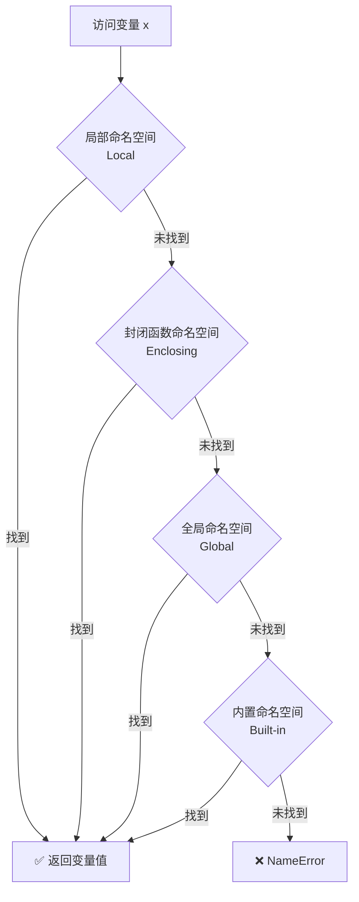
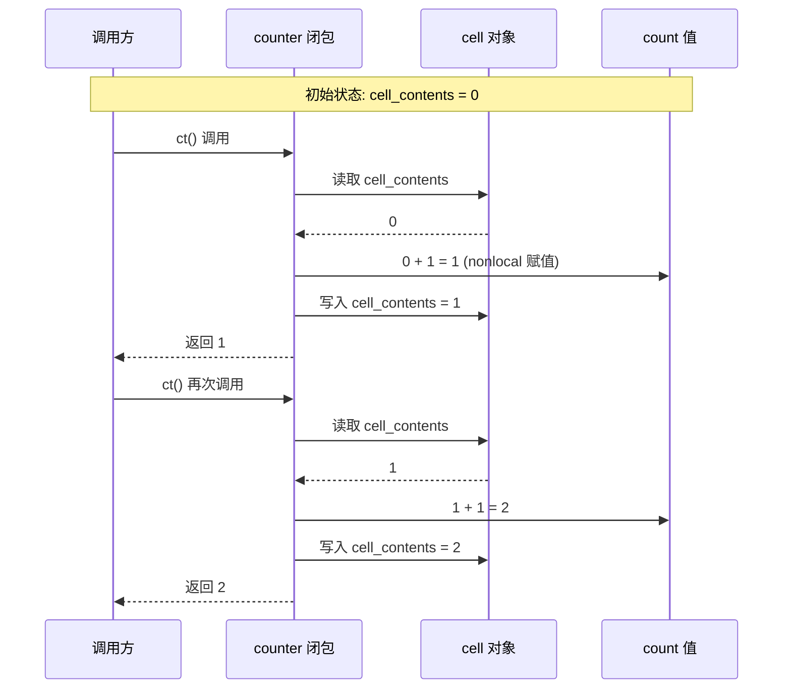
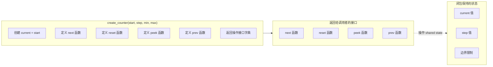

# 作用域与命名空间图解

> 本文档包含 Day 013 内容的 ASCII 图和 Mermaid 图。

---

## 1. LEGB 变量查找流程

### Mermaid 流程图



### ASCII 层级示意图

```
┌──────────────────────────────────────────────┐
│           内置命名空间 (Built-in)               │
│  print, len, range, int, str, Exception ...    │
│                                                │
│  ┌──────────────────────────────────────────┐  │
│  │       全局命名空间 (Global)                │  │
│  │  当前模块的顶层变量和函数                    │  │
│  │                                            │  │
│  │  ┌────────────────────────────────────┐   │  │
│  │  │   封闭作用域 (Enclosing)            │   │  │
│  │  │   外层函数的局部变量                 │   │  │
│  │  │                                    │   │  │
│  │  │  ┌──────────────────────────────┐  │   │  │
│  │  │  │ 局部作用域 (Local)            │  │   │  │
│  │  │  │ 当前函数的局部变量             │  │   │  │
│  │  │  │                              │  │   │  │
│  │  │  │   [变量查找从这里开始 →]       │  │   │  │
│  │  │  └──────────────────────────────┘  │   │  │
│  │  └────────────────────────────────────┘   │  │
│  └──────────────────────────────────────────┘  │
└──────────────────────────────────────────────┘
```

---

## 2. 遮蔽（Shadowing）示意图

```
变量定义层级                 可见范围
                           │
global_x = "全局"  ────────┤←───────────────── 全局可见
                           │
def outer():               │
    outer_x = "外层" ──────┤←───────── 在 outer 内部可见
                           │
    def inner():            │
        outer_x = "遮蔽" ──┤←── 遮蔽了 outer_x
        inner_x = "内层" ──┤←── 仅 inner 内部可见
```

---

## 3. 闭包机制详解

### 闭包的数据流

```
make_counter() 被调用
│
├── 创建局部变量 count = 0
│
├── 定义 counter() 函数
│   ├── 编译器发现 counter 引用了 count
│   ├── count 被标记为"自由变量"
│   └── 创建 cell 对象存放 count 引用
│
├── 返回 counter 函数对象
│   ├── counter.__code__.co_free_vars = ('count',)
│   └── counter.__closure__ = (<cell at 0x...: count=0>,)
│
└── make_counter() 的局部作用域"理论上"结束
    但 count 不被销毁 ── 因为闭包仍持有引用

调用 ct = make_counter()
ct() → 通过 nonlocal 修改 __closure__[0].cell_contents → 1
ct() → 同上 → 2
ct() → 同上 → 3
```

### Mermaid 时序图：计数器调用流程



---

## 4. 变量生命周期图

```
时间线 ──────────────────────────────────────────────→

全局变量:  ████████████████████████████████████████████
           │ (模块导入时创建)              (程序退出时销毁)

局部变量:        ████████
                 │        │
            (函数调用)  (函数返回)

Enclosing:       ████████████
                 │           │
            (外层调用)   (外层返回)
                         (除非被闭包引用)

闭包持有:        ████████████████████████████████████
                 │                                    │
            (闭包创建)                          (闭包被销毁)
```

---

## 5. 命名空间关系图

```mermaid
graph TD
    subgraph Builtin["内置命名空间 (Built-in)"]
        B1[print]
        B2[len]
        B3[range]
        B4[int]
        B5[...]
    end

    subgraph Global["全局命名空间 (Global) - module.py"]
        G1[global_var = 42]
        G2[items = [1,2,3]]
        G3[def outer]
        G4[make_counter]
    end

    subgraph Enclosing["封闭命名空间 (Enclosing) - outer()"]
        E1[enclosing_x = 'outer']
        E2[nested_count]
    end

    subgraph Local["局部命名空间 (Local) - inner()"]
        L1[local_z = 100]
        L2[result]
    end

    Builtin -.->|内置自动可用| Global
    Global -.->|可被内部引用| Enclosing
    Enclosing -.->|可被内部引用| Local

    Note1["每个作用域独立于其他作用域
    同名的变量不会冲突
    查找总是从最内层开始向外"]
```

---

## 6. global vs nonlocal 的范围

```ascii
模块顶层 (module.py)
├── x = "全局x"                        ← global 可以到达这里
│
├── def outer():
│   ├── x = "outer的x"                 ← nonlocal 最多到达这里
│   │                                     （最近的外层非全局作用域）
│   └── def inner():
│       │   nonlocal x  → 修改 outer 的 x
│       │   global  x   → 直接跳过 outer 到模块顶层
│       └── x = "inner的x"
```

---

## 7. 实战：计数器工厂架构图


