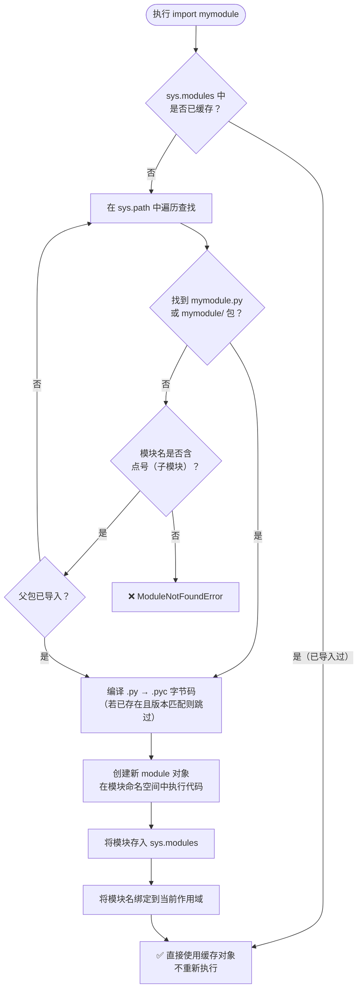
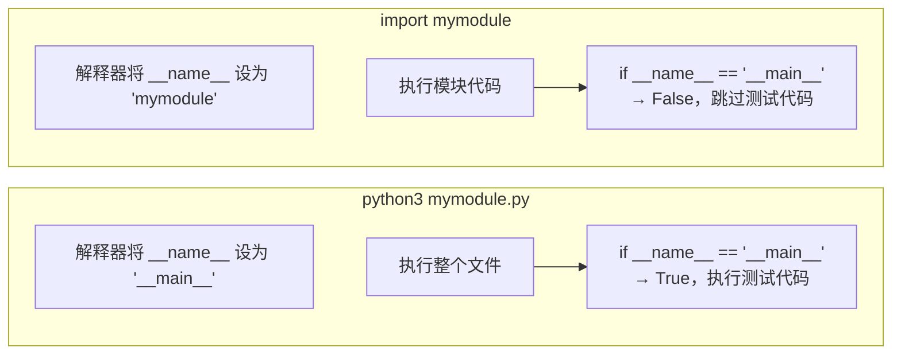
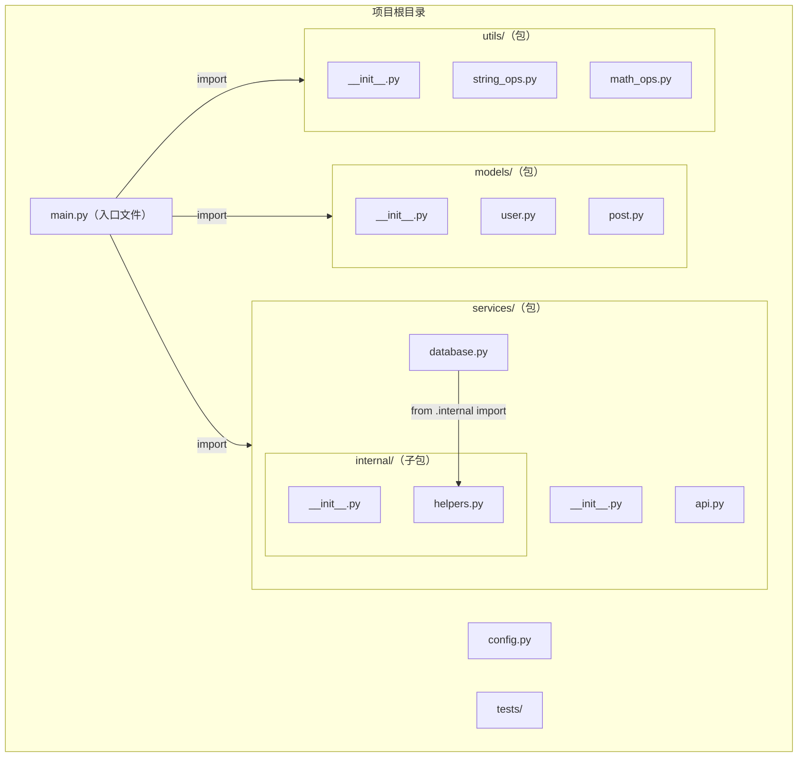
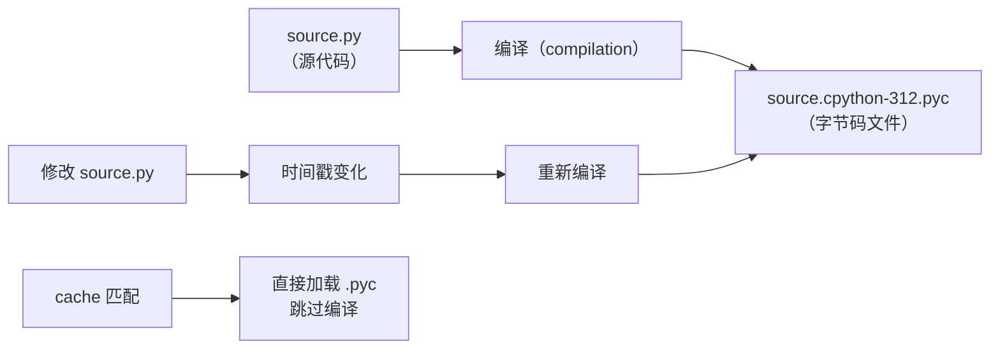
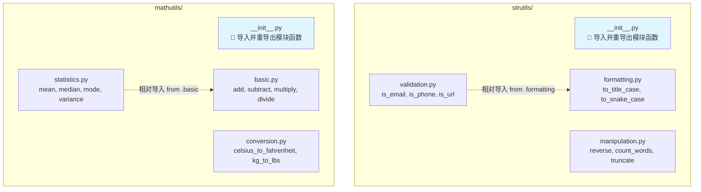

# Day 014：模块与包

> 理解 Python 的模块系统 —— 从单文件脚本到多文件项目的组织之道。

---

## 📋 目录

1. [模块的概念与设计原理](#1-模块的概念与设计原理)
2. [import 机制与模块搜索路径](#2-import-机制与模块搜索路径)
3. [sys.modules 模块缓存](#3-sysmodules-模块缓存)
4. [__name__ == '__main__' 原理](#4-__name__--__main__-原理)
5. [包结构与 __init__.py](#5-包结构与-__init__py)
6. [相对导入与绝对导入](#6-相对导入与绝对导入)
7. [import * 与 __all__ 控制](#7-import--与-__all__-控制)
8. [__pycache__ 与字节码缓存](#8-__pycache__-与字节码缓存)
9. [实战：构建小型工具包](#9-实战构建小型工具包)
10. [思考题](#10-思考题)
11. [避坑指南](#11-避坑指南)

---

## 1. 模块的概念与设计原理

### 1.1 什么是模块？

**模块（Module）** 是一个包含 Python 代码的 `.py` 文件。任何 `.py` 文件都可以作为模块被其他代码导入和使用。

```python
# mymodule.py  —— 这是一个模块
def greet(name):
    return f"Hello, {name}!"

PI = 3.14159

class Calculator:
    pass
```

在其他文件中：

```python
# main.py —— 导入并使用模块
import mymodule

print(mymodule.greet("Alice"))   # → Hello, Alice!
print(mymodule.PI)                # → 3.14159
```

### 1.2 为什么需要模块？

> **设计原理**：模块解决了代码组织中的三个核心问题：

1. **命名隔离（Namespace Isolation）**：不同模块中同名的变量/函数不会冲突

```python
# math_ops.py
def add(a, b):
    return a + b

# string_ops.py
def add(a, b):
    return a + b  # 同名函数，但互不干扰，因为命名空间不同

# main.py
import math_ops
import string_ops

print(math_ops.add(1, 2))      # → 3
print(string_ops.add("A", "B")) # → AB
```

2. **代码复用（Code Reuse）**：一次编写，多处使用

3. **可维护性（Maintainability）**：大项目拆分成小文件，每个文件职责单一

### 1.3 模块即对象

> **核心认知**：在 Python 中，**模块就是对象**。当你 `import` 一个模块时，Python 会创建一个 `module` 类型的对象。

```python
import math

print(type(math))           # → <class 'module'>
print(math.__name__)         # → 'math'
print(math.__file__)         # → '/usr/lib/python3.12/math.py'（实际路径可能不同）
print(math.__dict__)         # → 模块中所有定义的字典（命名空间）

# 模块对象可以像任何对象一样被赋值给变量
m = math
print(m.sqrt(16))            # → 4.0
```

### 1.4 模块的创建过程

当你 `import` 一个模块时，Python 做了四件事：

```
import mymodule

① 查找：在 sys.path 中搜索 mymodule.py
      ↓
② 编译：将 mymodule.py 编译成字节码（.pyc）
      ↓
③ 执行：在隔离的命名空间中执行字节码
      ↓
④ 绑定：将模块对象绑定到当前命名空间的变量名
```

---

## 2. import 机制与模块搜索路径

### 2.1 搜索路径（sys.path）

当 Python 执行 `import mymodule` 时，它会在 **sys.path** 列表中的每个路径依次查找：

```python
import sys

# 查看模块搜索路径
for i, path in enumerate(sys.path, 1):
    print(f"{i}. {path}")
```

典型输出：

```
1. /home/user/project          ← 当前脚本所在目录（第一位）
2. /usr/lib/python3.12         ← 标准库路径
3. /usr/lib/python3.12/lib-dynload  ← C 扩展模块
4. /usr/lib/python3.12/site-packages  ← 第三方包（pip 安装）
```

### 2.2 sys.path 的构成

`sys.path` 的初始值来自四个来源：

```python
import sys

# sys.path 的组成
print(f"1. 当前脚本目录: {sys.path[0]}")
print(f"2. PYTHONPATH 环境变量: {'已设置' if 'PYTHONPATH' in __import__('os').environ else '未设置'}")
print(f"3. 标准库路径: {[p for p in sys.path if 'lib/python' in p]}")
print(f"4. .pth 文件加载: {'site-packages' in str(sys.path)}")
```

**来源详解：**

| 来源 | 优先级 | 说明 |
|------|--------|------|
| 当前脚本目录 | 最高 | `sys.path[0]`，即入口文件所在目录 |
| PYTHONPATH | 高 | 环境变量，可手动设置 |
| 标准库 | 中 | Python 安装路径下的 Lib 目录 |
| site-packages | 低 | pip 安装的第三方包 |

### 2.3 搜索顺序图解



```python
# 演示搜索路径机制
import sys
import os

# 动态添加搜索路径
sys.path.insert(0, "/tmp/my_custom_modules")

# 查看当前工作目录
print(f"当前工作目录: {os.getcwd()}")
print(f"sys.path[0] (脚本目录): {sys.path[0]}")
```

### 2.4 import 语句的各种写法

```python
# 写法 1：导入整个模块（推荐）
import math
print(math.sqrt(16))        # 通过模块名访问

# 写法 2：导入特定名称
from math import sqrt
print(sqrt(16))              # 直接使用，无需模块名前缀

# 写法 3：导入多个名称
from math import sqrt, pi, sin
print(sqrt(16), pi, sin(0))

# 写法 4：导入所有公开名称（谨慎使用）
from math import *           # 导入 math 的所有公开成员
print(sqrt(16))
print(pi)

# 写法 5：起别名
import numpy as np           # 模块别名
from math import sqrt as square_root  # 名称别名
print(square_root(16))

# 写法 6：延迟导入（在函数内部）
def use_math():
    import math              # 函数调用时才导入
    return math.sqrt(25)
```

### 2.5 import 在不同位置的效果

```python
# 全局导入 —— 在模块顶部（惯例）
import os

# 函数内导入 —— 延迟导入（只在需要时加载）
def read_file(path):
    import json              # 仅在函数被调用时导入
    with open(path) as f:
        return json.load(f)

# 条件导入 —— 根据条件选择不同模块
import sys
if sys.platform == 'win32':
    import msvcrt
else:
    import termios            # Unix 系

# 导入并赋值给不同名字
import sys as system_module
from os import path as ospath
```

---

## 3. sys.modules 模块缓存

### 3.1 缓存机制

> **设计原理**：为什么需要缓存？避免重复加载、编译和执行同一个模块。

```python
# sys.modules 是模块缓存的字典
import sys

# 查看所有已加载的模块
print(f"已加载模块数量: {len(sys.modules)}")
print(f"前几个: {list(sys.modules.keys())[:10]}")
```

**缓存的核心作用：**

```python
import sys

# 验证导入是否使用缓存
print("第一次导入...")
import json
print(f"json 在 sys.modules 中: {'json' in sys.modules}")

# 第二次导入——直接从缓存取，不会重新执行 json 代码
print("第二次导入...")
import json                 # 这个几乎不花时间
print(f"sys.modules['json'] is json: {sys.modules['json'] is json}")
```

### 3.2 缓存与重新加载

```python
# 演示模块缓存
import importlib
import sys

# 创建一个测试模块
with open('/tmp/mymod.py', 'w') as f:
    f.write("value = 1\n")

# 第一次导入
import importlib.util
spec = importlib.util.spec_from_file_location("mymod", "/tmp/mymod.py")
mod = importlib.util.module_from_spec(spec)
sys.modules["mymod"] = mod
spec.loader.exec_module(mod)
print(f"第一次: value = {mod.value}")  # → 1

# 修改源文件
with open('/tmp/mymod.py', 'w') as f:
    f.write("value = 999\n")

# 再次 import —— 使用缓存，不会读取新的源文件
import mymod                    # 这里会报错，因为我们刚用 importlib 手动注册了
# 用 reload 强制重新加载
importlib.reload(mod)
print(f"reload 后: value = {mod.value}")  # → 999
```

### 3.3 sys.modules 的妙用

```python
# 1. 检查模块是否已导入
if 'requests' not in sys.modules:
    print("requests 尚未加载")
    
# 2. 防御性移除缓存（危险操作！）
if 'my_module' in sys.modules:
    del sys.modules['my_module']   # 强制下次重新导入

# 3. 查看模块源代码位置
import pandas
print(sys.modules['pandas'].__file__) if 'pandas' in sys.modules else print("pandas 未加载")

# 4. 手动注册模块（高级用法）
import types
dummy_mod = types.ModuleType("dummy")
dummy_mod.x = 42
sys.modules["dummy"] = dummy_mod

import dummy                     # 这次不会出错！
print(dummy.x)                   # → 42
```

---

## 4. __name__ == '__main__' 原理

### 4.1 __name__ 是什么？

> **设计原理**：`__name__` 是一个**运行时自动赋值的变量**，用于告诉代码："我是被直接运行的，还是被导入的？"

每个模块都有一个 `__name__` 属性，它的值取决于模块的使用方式：

| 使用方式 | `__name__` 的值 |
|----------|----------------|
| 直接运行（`python3 xxx.py`） | `'__main__'` |
| 被导入（`import xxx`） | 模块的实际名称（如 `'xxx'`） |

### 4.2 为什么需要这种机制？

根本原因：**Python 没有"入口点"的语法关键字**。在 C/Java 中有 `main()` 函数作为入口，但在 Python 中，脚本是从第一行开始顺序执行的。`__name__` 提供了一种**运行时检测入口**的方式。



### 4.3 经典用法

```python
# calculator.py
def add(a, b):
    return a + b

def subtract(a, b):
    return a - b

# 这是一段测试代码 —— 只在直接运行时执行
if __name__ == '__main__':
    # 测试 add
    assert add(2, 3) == 5, "add(2,3) 应为 5"
    assert add(-1, 1) == 0
    
    # 测试 subtract
    assert subtract(5, 3) == 2
    
    # 交互测试
    print("✅ 所有测试通过")
    print(f"add(10, 20) = {add(10, 20)}")
```

```python
# main.py
import calculator          # 会执行 calculator 的模块代码，但不会执行测试代码

print(calculator.add(5, 3))  # → 8（不会打印测试信息）
```

### 4.4 __name__ 的运行时细节

```python
# 演示 __name__ 的运行时变化

# 选项 1：直接运行 python3 thisfile.py
# 选项 2：导入 import thisfile

def where_am_i():
    """打印当前模块的 __name__ 信息"""
    print(f"当前模块 __name__ = '{__name__}'")
    print(f"当前模块 __file__ = '{__file__}'")
    print(f"直接运行? {__name__ == '__main__'}")

where_am_i()

# 如果是被导入的，__name__ 会是模块名
# 如果是被直接运行的，__name__ 是 '__main__'

# 查看其他模块的 __name__
import math
import sys

print(f"math.__name__ = '{math.__name__}'")
print(f"sys.__name__  = '{sys.__name__}'")

# 每个模块有自己的 __name__
# math.__name__ 永远是 'math'
# sys.__name__  永远是 'sys'
```

### 4.5 __name__ == '__main__' 的常见模式

```python
# 模式 1：基本用法
if __name__ == '__main__':
    main()

# 模式 2：带命令行参数
if __name__ == '__main__':
    import sys
    if len(sys.argv) > 1:
        # 处理命令行参数
        pass

# 模式 3：单元测试自动运行
if __name__ == '__main__':
    import doctest
    doctest.testmod()
    # 或
    import unittest
    unittest.main()

# 模式 4：性能基准测试
if __name__ == '__main__':
    import timeit
    print(timeit.timeit('"-".join(str(n) for n in range(100))', number=10000))

# 模式 5：交互式帮助
if __name__ == '__main__':
    print("📖 帮助信息：这个模块提供了 XXX 功能")
    print("使用方法：import 模块名")
```

### 4.6 一个完整的示例模块

```python
"""
示例：一个同时支持导入和直接运行的模块
"""

def factorial(n):
    """计算 n 的阶乘"""
    if n < 0:
        raise ValueError("负数没有阶乘")
    if n <= 1:
        return 1
    return n * factorial(n - 1)

def fibonacci(n):
    """返回前 n 个斐波那契数"""
    if n <= 0:
        return []
    if n == 1:
        return [0]
    result = [0, 1]
    for i in range(2, n):
        result.append(result[-1] + result[-2])
    return result

def is_prime(n):
    """判断 n 是否为质数"""
    if n < 2:
        return False
    for i in range(2, int(n ** 0.5) + 1):
        if n % i == 0:
            return False
    return True

# ---- 只有直接运行时才执行的代码 ----
if __name__ == '__main__':
    # 测试区
    print("🧪 运行自测试...")
    
    # 测试 factorial
    assert factorial(0) == 1
    assert factorial(5) == 120
    assert factorial(10) == 3628800
    
    # 测试 fibonacci
    assert fibonacci(0) == []
    assert fibonacci(1) == [0]
    assert fibonacci(5) == [0, 1, 1, 2, 3]
    
    # 测试 is_prime
    assert is_prime(2) == True
    assert is_prime(4) == False
    assert is_prime(17) == True
    
    print("✅ 所有测试通过！")
    print()
    
    # 交互演示
    import sys
    print(f"🎯 当前文件: {__file__}")
    print(f"🏷️  __name__ = {__name__}")
    
    if len(sys.argv) > 1:
        try:
            n = int(sys.argv[1])
            print(f"factorial({n}) = {factorial(n)}")
            print(f"fibonacci({n}) = {fibonacci(n)}")
            print(f"is_prime({n}) = {is_prime(n)}")
        except ValueError:
            print("❌ 请提供整数参数")
```

---

## 5. 包结构与 __init__.py

### 5.1 什么是包？

**包（Package）** 是一个包含 `__init__.py` 文件的目录。包本质上就是 **带有命名空间的模块集合**。

```
mypackage/                   ← 包目录
├── __init__.py              ← 包初始化文件（重要）
├── module_a.py              ← 子模块
├── module_b.py              ← 子模块
└── subpackage/              ← 子包
    ├── __init__.py
    └── module_c.py
```

> **设计原理**：包解决了模块命名冲突的问题。不同的人可能都写了一个叫 `utils.py` 的模块，但只要你把它们放在不同包中，就能区分开。

### 5.2 __init__.py 的作用

`__init__.py` 在包导入时执行，它的主要作用：

1. **标记目录为 Python 包**（Python 3.3+ 中可省略，但强烈建议保留）
2. **包级别的初始化代码**
3. **控制包的公开接口（__all__）**
4. **集中导入子模块**

```python
# mypackage/__init__.py

# 作用 1：包级别的文档
"""mypackage - 一个示例工具包"""

# 作用 2：集中导入，简化使用路径
from mypackage.module_a import func_a
from mypackage.module_b import func_b

# 用户可以直接：
# import mypackage
# mypackage.func_a()     # 而不需要 mypackage.module_a.func_a()

# 作用 3：包级别的变量
__version__ = "1.0.0"
__author__ = "Python Learner"

# 作用 4：控制 from mypackage import * 的行为
__all__ = ['func_a', 'func_b', 'CONSTANT', 'ModuleA']

# 作用 5：import 时的副作用（谨慎使用）
print(f"🔧 正在初始化 mypackage v{__version__}")

# 作用 6：延迟导入，只在需要时加载重型模块
def get_heavy_module():
    """延迟加载重型依赖"""
    from mypackage.heavy_module import HeavyProcessor
    return HeavyProcessor()
```

### 5.3 包的层级结构



### 5.4 包的 __all__ 控制

```python
# mypackage/__init__.py

# 导入子模块中的特定函数
from .string_ops import capitalize, reverse
from .math_ops import add, subtract, multiply, divide

# 定义 __all__ —— 控制 from mypackage import * 的行为
__all__ = [
    'capitalize',    # 对外公开
    'reverse',       # 对外公开
    'add',           # 对外公开
    'subtract',      # 对外公开
    # 'multiply',    # 不对外公开（虽然可以导入，但默认不会）
    # 'divide',      # 不对外公开
    '__version__',
]
```

### 5.5 创建包的标准流程

```python
# 步骤 1：创建目录结构
# mytoolkit/
# ├── __init__.py
# ├── config.py
# ├── validators.py
# └── formatters.py

# 步骤 2：编写 __init__.py
"""
mytoolkit - 个人工具箱
"""

from mytoolkit.validators import validate_email, validate_phone
from mytoolkit.formatters import format_date, format_currency
from mytoolkit.config import load_config, save_config

__version__ = '0.1.0'
__all__ = [
    'validate_email',
    'validate_phone',
    'format_date',
    'format_currency',
    'load_config',
    'save_config',
]

# 步骤 3：在其他文件中使用
# 方式 A：导入包名，访问其属性
import mytoolkit
mytoolkit.validate_email("user@example.com")
mytoolkit.format_currency(1000)
print(mytoolkit.__version__)

# 方式 B：直接导入特定函数
from mytoolkit import validate_email, format_date

# 方式 C：导入子模块（需要模块中定义 __all__ 或显式指定）
from mytoolkit.validators import validate_email as email_validator

# 方式 D：导入所有公开接口
from mytoolkit import *
print(validate_email)   # ✅ 公开的
# print(validate_phone)  # ❌ 如果不在 __all__ 中则不可用
```

---

## 6. 相对导入与绝对导入

### 6.1 绝对导入

**绝对导入**：从顶级包开始，指定完整的模块路径。

```python
# 绝对导入示例

# 从标准库
import os
import sys
from datetime import datetime

# 从第三方包
import requests
from flask import Flask

# 从自己的包
import mypackage
from mypackage.module_a import func_a
from mypackage.subpackage.module_c import func_c
```

**绝对导入的优点：**
- 清晰明确，一眼就能看出模块的层级位置
- 不受当前文件位置影响
- 推荐在项目中使用

### 6.2 相对导入

**相对导入**：基于当前模块的位置，使用 `.` 表示当前包，`..` 表示父包。

```python
# package/subpackage/module_c.py

# .  表示当前包（即 subpackage）
from . import module_d           # 同级模块
from .module_d import func_d     # 同级模块中的函数

# .. 表示父包（即 package）
from .. import module_a
from ..module_a import func_a

# ... 表示父包的父包（不要滥用）
from ... import another_package
```

**相对导入的语法：**

| 语法 | 含义 | 示例 |
|------|------|------|
| `.` | 当前包 | `from . import sibling` |
| `..` | 父包 | `from .. import parent_module` |
| `...` | 祖父包 | `from ... import grandparent_module` |
| `.name` | 当前包·名称 | `from .submodule import func` |
| `..name` | 父包·名称 | `from ..parent_sub import func` |

### 6.3 相对导入的完整示例

```python
# 考虑以下目录结构：
# project/
# ├── main.py                ← 入口文件
# ├── package/
# │   ├── __init__.py
# │   ├── module_a.py
# │   └── subpackage/
# │       ├── __init__.py
# │       ├── module_b.py
# │       └── module_c.py

# === package/__init__.py ===
from .module_a import helper_a
from .subpackage import helper_b

# === package/module_a.py ===
# 绝对导入：明确、推荐
from package.subpackage.module_b import func_b

def helper_a():
    return "A"

# === package/subpackage/module_b.py ===
# 相对导入：简洁，但要正确理解上下文
from .. import module_a          # 从父包导入
from . import module_c           # 从同级导入

def func_b():
    return f"B + {module_a.helper_a()} + {module_c.func_c()}"

# === package/subpackage/module_c.py ===
def func_c():
    return "C"
```

### 6.4 相对导入的重要限制

> **🚨 核心规则：相对导入只能在**包内部**使用，不能在入口脚本（`__main__`）中直接用。**

```python
# ❌ 错误：直接运行 main.py，里面使用相对导入
# main.py
from .mymodule import x   # ImportError: attempted relative import with no known parent package

# ✅ 正确：入口文件用绝对导入
# main.py
from mymodule import x     # 正确！
```

**为什么？** 因为相对导入需要知道"当前模块所属的包"，而直接运行的脚本（`__main__`）的 `__package__` 属性为 `None`，Python 无法确定其父包。

### 6.5 绝对导入 vs 相对导入

| 对比项 | 绝对导入 | 相对导入 |
|--------|---------|---------|
| 可读性 | 路径完整，一目了然 | 简洁但需要脑补路径 |
| 可移植性 | 好（改名需要修改所有引用） | 好（包内移动不受影响） |
| 入口脚本 | ✅ 可用 | ❌ 不可用 |
| PEP 8 推荐 | ✅ 推荐 | 谨慎使用 |
| 重构友好 | 改名包需要改所有导入 | 改名包不影响内部相对导入 |

**PEP 8 建议**：优先使用绝对导入，除非包结构很深，用相对导入能显著提升可读性。

```python
# PEP 8 推荐的导入顺序
# 1. 标准库
import os
import sys
from datetime import datetime

# 2. 第三方库
import requests
import numpy as np

# 3. 本地模块（绝对导入优先）
from myproject.models import User
from myproject.services import api
```

---

## 7. import * 与 __all__ 控制

### 7.1 import * 的行为

```python
# from module import * 会导入模块中所有"公开"的名称

# 情形 A：模块定义了 __all__
# mymodule.py
# __all__ = ['func_a', 'CONSTANT']  # 只导入这两个

# 情形 B：模块没有 __all__
# 导入所有不以 _ 开头的名称（所谓的"伪私有"）

from math import *    # 导入 sqrt, pi, sin, cos... 等所有非 _ 开头的名称
print(sqrt(16))        # → 4.0
print(pi)              # → 3.14159
```

### 7.2 __all__ 的用途

```python
# mytoolkit/__init__.py

# 精准控制公开接口
__all__ = [
    'process_data',
    'validate_input',
    'DEFAULT_TIMEOUT',
]

# 内部实现细节（以 _ 开头），不对外公开
_internal_helper = None
_private_config = {}

def process_data(data):
    """公开的 API — 用户应该使用这个"""
    _validate_internal(data)
    return _transform(data)

def validate_input(data):
    """公开的 API"""
    return _internal_validation(data)

def _validate_internal(data):
    """内部函数，不属于公开 API"""
    pass

def _transform(data):
    """内部函数，不属于公开 API"""
    return data

DEFAULT_TIMEOUT = 30
_INTERNAL_CONSTANT = 42  # 以下划线开头，import * 不会导入
```

```python
# 使用
from mytoolkit import *

print(process_data)      # ✅ 公开
print(validate_input)    # ✅ 公开
print(DEFAULT_TIMEOUT)   # ✅ 公开
# print(_validate_internal)  # ❌ NameError（不在 __all__ 中）
# print(_INTERNAL_CONSTANT)  # ❌ NameError（以下划线开头）
```

### 7.3 __all__ 在包级的作用

```python
# 包级别：在 __init__.py 中定义 __all__
# 控制 from mypackage import * 的行为

# mypackage/__init__.py
from .module_a import func_a, _internal_func_a
from .module_b import func_b

__all__ = ['func_a', 'func_b']

# 使用
from mypackage import *
# 只导入 func_a 和 func_b
# _internal_func_a 不会被导入
```

### 7.4 import * 的注意事项

```python
# ⚠️ 避免在大型项目中用 import *
# 原因 1：命名冲突
from math import *    # 导入了 40 多个名字
from cmath import *   # 同名函数会被覆盖！

# 上面两条语句后：
# sqrt 可能指向 cmath.sqrt（复数版本），而不是 math.sqrt（实数版本）！

# 原因 2：不知道哪些名字被导入
# 代码阅读者不知道 sqrt 是从 math 还是 cmath 来的

# 推荐的做法
import math
import cmath

print(math.sqrt(-1))   # ValueError: math domain error
print(cmath.sqrt(-1))  # 1j（复数结果）
```

---

## 8. __pycache__ 与字节码缓存

### 8.1 为什么需要 __pycache__？

> **设计原理**：Python 是解释型语言，但为了性能，它会把源代码编译成**字节码（bytecode）**。`__pycache__` 就是存放这些编译产物的目录。



### 8.2 __pycache__ 的命名规则

```
__pycache__/
├── module.cpython-312.pyc    ← Python 3.12 的字节码
├── module.cpython-311.pyc    ← Python 3.11 的字节码
├── module.cpython-39.pyc     ← Python 3.9 的字节码
```

**命名格式**：`模块名.解释器名-Python主版本.字节码`

这种命名方式允许多个 Python 版本共享缓存目录而不会冲突。

### 8.3 缓存验证机制

```python
# Python 如何判断缓存是否有效？
#
# 每次生成 .pyc 时，Python 会记录：
# 1. 源文件的修改时间戳（mtime）
# 2. 源文件的大小（size）
#
# 当再次导入时：
# - 检查 .pyc 是否存在
# - 检查 .pyc 中记录的时间戳和大小是否与源文件匹配
# - 匹配 → 直接加载字节码（跳过编译）
# - 不匹配 → 重新编译源文件

# 可以手动控制缓存行为
import py_compile

# 手动编译某个文件
py_compile.compile('mymodule.py', cfile='__pycache__/mymodule.cpython-312.pyc')

# 或使用命令行
# python3 -m py_compile mymodule.py
```

### 8.4 与缓存相关的环境变量

```python
import sys

# Python 提供了环境变量来控制缓存行为
# export PYTHONDONTWRITEBYTECODE=1  → 不写入 .pyc
# export PYTHONPYCACHEPREFIX=/tmp/pycache → 指定缓存目录

# 在代码中检查或控制
print(f"Python 不写字节码: {sys.dont_write_bytecode}")

# 如果 sys.dont_write_bytecode = True，则不会创建 __pycache__
# 可以通过 -B 选项启动：python3 -B script.py

# 运行时不生成 __pycache__
# python3 -B main.py
```

### 8.5 .pyc 文件的优势

```
源码文件 (.py)                  →  字节码文件 (.pyc)
├── 人类可读                    →  ├── 机器可读（更紧凑）
├── 每次导入都编译              →  ├── 只编译一次
├── 包含注释（多 30% 体积）      →  ├── 不含注释（更小）
├── 编码/解码开销               →  ├── 直接加载到内存
└── 适合开发                    →  └── 适合部署
```

---

## 9. 实战：构建小型工具包

### 9.1 项目结构

```ascii
strutils/                    ← 字符串工具包
├── __init__.py               ← 包初始化
├── manipulation.py           ← 字符串操作
├── validation.py             ← 字符串验证
└── formatting.py             ← 字符串格式化

mathutils/                   ← 数学工具包
├── __init__.py               ← 包初始化
├── basic.py                  ← 基础运算
├── statistics.py             ← 统计计算
└── conversion.py             ← 单位转换
```

### 9.2 代码实现

```python
# strutils/__init__.py
"""
strutils - 字符串处理工具包

提供字符串操作、验证和格式化功能。
"""

from strutils.manipulation import (
    reverse,
    count_words,
    remove_duplicates,
    truncate,
)

from strutils.validation import (
    is_email,
    is_phone,
    is_url,
    is_palindrome,
)

from strutils.formatting import (
    to_title_case,
    to_snake_case,
    to_camel_case,
    mask_sensitive,
)

__version__ = '0.1.0'
__all__ = [
    'reverse', 'count_words', 'remove_duplicates', 'truncate',
    'is_email', 'is_phone', 'is_url', 'is_palindrome',
    'to_title_case', 'to_snake_case', 'to_camel_case', 'mask_sensitive',
]
```

```python
# strutils/manipulation.py
"""字符串操作模块"""


def reverse(text: str) -> str:
    """反转字符串"""
    return text[::-1]


def count_words(text: str) -> int:
    """统计单词数"""
    return len(text.split())


def remove_duplicates(text: str) -> str:
    """移除连续重复字符"""
    if not text:
        return text
    result = [text[0]]
    for ch in text[1:]:
        if ch != result[-1]:
            result.append(ch)
    return ''.join(result)


def truncate(text: str, max_length: int = 50, suffix: str = '...') -> str:
    """截断字符串到指定长度"""
    if len(text) <= max_length:
        return text
    return text[:max_length - len(suffix)] + suffix
```

```python
# strutils/validation.py
"""字符串验证模块（相对导入示例）"""

from .formatting import to_snake_case
import re


def is_email(text: str) -> bool:
    """验证邮箱格式"""
    pattern = r'^[a-zA-Z0-9._%+-]+@[a-zA-Z0-9.-]+\.[a-zA-Z]{2,}$'
    return bool(re.match(pattern, text.strip()))


def is_phone(text: str) -> bool:
    """验证中国大陆手机号"""
    pattern = r'^1[3-9]\d{9}$'
    return bool(re.match(pattern, text.strip()))


def is_url(text: str) -> bool:
    """验证 URL 格式"""
    pattern = r'^https?://[^\s/$.?#].[^\s]*$'
    return bool(re.match(pattern, text.strip()))


def is_palindrome(text: str) -> bool:
    """判断是否为回文字符串"""
    cleaned = re.sub(r'[^a-zA-Z0-9]', '', text).lower()
    return cleaned == cleaned[::-1]


# 演示相对导入 —— 使用同包的 formatting 模块
def normalize_and_validate(email: str) -> dict:
    """规范化邮箱并验证"""
    normalized = to_snake_case(email.strip().lower())
    return {
        'original': email,
        'normalized': normalized,
        'is_valid': is_email(normalized),
    }
```

```python
# strutils/formatting.py
"""字符串格式化模块"""


def to_title_case(text: str) -> str:
    """转为标题格式"""
    return text.title()


def to_snake_case(text: str) -> str:
    """转为蛇形命名（words_like_this）"""
    result = []
    for i, ch in enumerate(text):
        if ch.isupper():
            if i > 0 and text[i - 1].islower():
                result.append('_')
            result.append(ch.lower())
        elif ch in (' ', '-', '.'):
            if result and result[-1] != '_':
                result.append('_')
        else:
            result.append(ch)
    return ''.join(result).strip('_')


def to_camel_case(text: str) -> str:
    """转为驼峰命名（camelCase）"""
    words = text.replace('-', ' ').replace('_', ' ').split()
    if not words:
        return ''
    return words[0].lower() + ''.join(w.capitalize() for w in words[1:])


def mask_sensitive(text: str, visible_chars: int = 4, mask_char: str = '*') -> str:
    """脱敏处理：保留最后 visible_chars 位，其余替换为 mask_char"""
    if len(text) <= visible_chars:
        return text
    return mask_char * (len(text) - visible_chars) + text[-visible_chars:]
```

```python
# mathutils/__init__.py
"""
mathutils - 数学计算工具包

提供基础运算、统计计算和单位转换功能。
"""

from mathutils.basic import (
    add, subtract, multiply, divide,
    power, sqrt, factorial, gcd, lcm,
)

from mathutils.statistics import (
    mean, median, mode, variance, std_dev,
)

from mathutils.conversion import (
    celsius_to_fahrenheit,
    fahrenheit_to_celsius,
    km_to_miles,
    miles_to_km,
    kg_to_lbs,
    lbs_to_kg,
)

__version__ = '0.1.0'
__all__ = [
    'add', 'subtract', 'multiply', 'divide',
    'power', 'sqrt', 'factorial', 'gcd', 'lcm',
    'mean', 'median', 'mode', 'variance', 'std_dev',
    'celsius_to_fahrenheit', 'fahrenheit_to_celsius',
    'km_to_miles', 'miles_to_km', 'kg_to_lbs', 'lbs_to_kg',
]
```

```python
# mathutils/basic.py
"""基础运算模块"""


def add(*args: float) -> float:
    """加法"""
    return sum(args)


def subtract(a: float, b: float) -> float:
    """减法"""
    return a - b


def multiply(*args: float) -> float:
    """乘法"""
    result = 1
    for n in args:
        result *= n
    return result


def divide(a: float, b: float) -> float:
    """除法"""
    if b == 0:
        raise ZeroDivisionError("除数不能为 0")
    return a / b


def power(base: float, exp: float) -> float:
    """乘方"""
    return base ** exp


def sqrt(n: float) -> float:
    """平方根"""
    if n < 0:
        raise ValueError("负数没有实数平方根")
    return n ** 0.5


def factorial(n: int) -> int:
    """阶乘"""
    if n < 0:
        raise ValueError("负数没有阶乘")
    if n <= 1:
        return 1
    result = 1
    for i in range(2, n + 1):
        result *= i
    return result


def gcd(a: int, b: int) -> int:
    """最大公约数（欧几里得算法）"""
    while b:
        a, b = b, a % b
    return abs(a)


def lcm(a: int, b: int) -> int:
    """最小公倍数"""
    if a == 0 or b == 0:
        return 0
    return abs(a * b) // gcd(a, b)
```

```python
# mathutils/statistics.py
"""统计计算模块（相对导入示例）"""

from .basic import sqrt as _sqrt
import math


def mean(data: list) -> float:
    """算术平均值"""
    if not data:
        raise ValueError("空数据集")
    return sum(data) / len(data)


def median(data: list) -> float:
    """中位数"""
    if not data:
        raise ValueError("空数据集")
    sorted_data = sorted(data)
    n = len(sorted_data)
    mid = n // 2
    if n % 2 == 1:
        return sorted_data[mid]
    return (sorted_data[mid - 1] + sorted_data[mid]) / 2


def mode(data: list):
    """众数"""
    if not data:
        raise ValueError("空数据集")
    from collections import Counter
    counter = Counter(data)
    max_count = max(counter.values())
    modes = [k for k, v in counter.items() if v == max_count]
    return modes[0] if len(modes) == 1 else modes


def variance(data: list, ddof: int = 0) -> float:
    """方差"""
    if not data:
        raise ValueError("空数据集")
    n = len(data)
    if n <= ddof:
        raise ValueError(f"数据量 {n} 不足以计算自由度 {ddof} 的方差")
    avg = mean(data)
    return sum((x - avg) ** 2 for x in data) / (n - ddof)


def std_dev(data: list, ddof: int = 0) -> float:
    """标准差"""
    return _sqrt(variance(data, ddof))
```

```python
# mathutils/conversion.py
"""单位转换模块"""


def celsius_to_fahrenheit(c: float) -> float:
    """摄氏度 → 华氏度"""
    return c * 9 / 5 + 32


def fahrenheit_to_celsius(f: float) -> float:
    """华氏度 → 摄氏度"""
    return (f - 32) * 5 / 9


def km_to_miles(km: float) -> float:
    """公里 → 英里"""
    return km * 0.621371


def miles_to_km(miles: float) -> float:
    """英里 → 公里"""
    return miles / 0.621371


def kg_to_lbs(kg: float) -> float:
    """公斤 → 磅"""
    return kg * 2.20462


def lbs_to_kg(lbs: float) -> float:
    """磅 → 公斤"""
    return lbs / 2.20462
```

### 9.3 使用工具包

```python
# 方式 1：导入整个包
import strutils

print(strutils.is_email("hello@example.com"))    # → True
print(strutils.reverse("Python"))                 # → nohtyP
print(strutils.mask_sensitive("1234567890"))      # → ******7890
```

```python
# 方式 2：导入特定函数
from mathutils import add, mean, celsius_to_fahrenheit

print(add(1, 2, 3, 4, 5))              # → 15
print(mean([10, 20, 30, 40, 50]))       # → 30.0
print(celsius_to_fahrenheit(100))        # → 212.0
```

```python
# 方式 3：使用 from ... import *
from strutils import *

print(count_words("hello world python"))  # → 3
print(is_palindrome("A man a plan a canal Panama"))  # → True
print(truncate("这是一段很长的文本内容...", 5))  # → 这是一...
```

```python
# 方式 4：实际导入包的方法
from strutils.manipulation import truncate

# 演示 truncate
long_text = "Python 是一种广泛使用的解释型、高级编程语言。"
print(truncate(long_text, 20))
# → Python 是一种广泛使用...
```

### 9.4 包结构一览



---

## 10. 思考题

1. **命名空间设计**：为什么 Python 选择用 `import module` 而不是像 C 那样直接 `#include "module.h"` 把代码内容插入到当前位置？两种方案各自的优劣是什么？

2. **缓存与热加载**：如果项目正在运行，你修改了一个模块的源代码，为什么新代码不会生效？通过什么机制可以强制重新加载模块而不重启进程？

3. **包与模块的差异**：一个带 `__init__.py` 的目录和一个不带 `__init__.py` 的目录，在 `import` 时行为有何不同？Python 3.3+ 引入的 **命名空间包（namespace package）** 是什么？

4. **循环导入的根源**：`a.py` 导入 `b.py`，`b.py` 又导入 `a.py`，为什么有时会出错有时又不会？延迟导入（把 `import` 放在函数内部）是如何解决这个问题的？

5. **__all__ 的安全意义**：如果第三方库的 `__init__.py` 中没有定义 `__all__`，使用 `from package import *` 可能带来什么安全隐患？Python 的哪些安全机制可以限制 `import` 行为？

---

## 11. 避坑指南

### 🚫 坑 1：循环导入（Circular Imports）

```python
# module_a.py
from module_b import func_b

def func_a():
    return func_b()

# module_b.py
from module_a import func_a

def func_b():
    return func_a()

# 运行时会报 ImportError
# 解决方案：延迟导入
```

```python
# ✅ 解决方案 1：延迟导入（在函数内部导入）
# module_a.py
def func_a():
    from module_b import func_b
    return func_b()

# module_b.py
def func_b():
    from module_a import func_a
    return func_a()
```

```python
# ✅ 解决方案 2：重构，提取公共代码到第三个模块
# common.py —— 放置 a 和 b 都需要的函数
def shared_func():
    pass

# module_a.py
from common import shared_func

# module_b.py
from common import shared_func
```

### 🚫 坑 2：相对导入在 __main__ 中失效

```python
# ❌ 错误示例
# mypackage/__main__.py
from . import submodule   # ❌ ImportError: attempted relative import with no known parent package

# ✅ 正确做法：在入口文件中使用绝对导入
# main.py
from mypackage import submodule
```

### 🚫 坑 3：__pycache__ 版本不兼容

```python
# 场景：项目被多个 Python 版本运行
# Python 3.11 编译了 .pyc 文件
# Python 3.12 运行时会检测版本不匹配，重新编译
# 但如果源文件被删除，只有 .pyc 文件 → 无法运行！

# 解决方案：版本控制忽略 __pycache__
# .gitignore 中添加：
# __pycache__/
# *.pyc
```

### 🚫 坑 4：import * 的意外覆盖

```python
# 假设有两个模块：
# module_a.py
VERSION = "1.0"

# module_b.py
VERSION = "2.0"

# main.py
from module_a import *
from module_b import *

print(VERSION)  # → "2.0"（module_a 的 VERSION 被覆盖！）
# 最后导入的模块的同名变量会覆盖之前的
# 解决方案：用 import module_a; module_a.VERSION
```

### 🚫 坑 5：sys.path 被修改后的副作用

```python
# 在库代码中修改 sys.path 会影响全局
# mylibrary.py
import sys
sys.path.insert(0, '/some/path')   # ⚠️ 这会影响所有后续模块导入

# 更好的做法：使用相对导入或绝对导入
# 避免在库代码中修改 sys.path

# 如果必须添加路径，使用上下文管理器
import sys
from contextlib import contextmanager

@contextmanager
def add_to_path(path):
    sys.path.insert(0, path)
    try:
        yield
    finally:
        sys.path.remove(path)

# 使用
with add_to_path('/tmp/custom_modules'):
    import my_custom_module
```

### 🚫 坑 6：模块被重复执行

```python
# 一个容易忽视的问题：当用多种路径导入同一模块时，可能导致分叉
# 比如 mypackage/__init__.py 中做了 print("初始化...")

import mypackage           # 打印 "初始化..."
import mypackage           # 不打印（缓存）
from mypackage import func # 不打印（缓存）

# 但如果 sys.path 中有重复路径，可能导致模块被不同名称加载
import sys

# 情况：两个不同路径都指向同一个物理位置
sys.path.insert(0, '/home/user/project')
sys.path.insert(0, '/home/user/project/subdir/..')  # 和上面等价但字符串不同

import mymodule    # 第一次加载
import mymodule     # 缓存命中

# 但如果之前从另一路径导入了同模块的"别名"
# 则可能存在两个副本
```

### ✅ 最佳实践总结

| 场景 | 推荐做法 |
|------|---------|
| 入口脚本 | 使用绝对导入 |
| 包内部引用 | 绝对导入优先，深层结构可用相对导入 |
| 避免命名冲突 | 用 `import module` 而不是 `from module import *` |
| 控制公开接口 | 在 `__init__.py` 中定义 `__all__` |
| 避免循环导入 | 延迟导入或重构提取公共模块 |
| 版本控制 | 在 `.gitignore` 中添加 `__pycache__/` |
| 组织代码 | 大项目用包（目录），小工具用模块（文件） |
