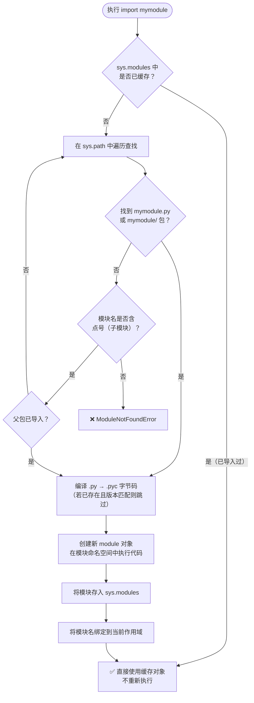
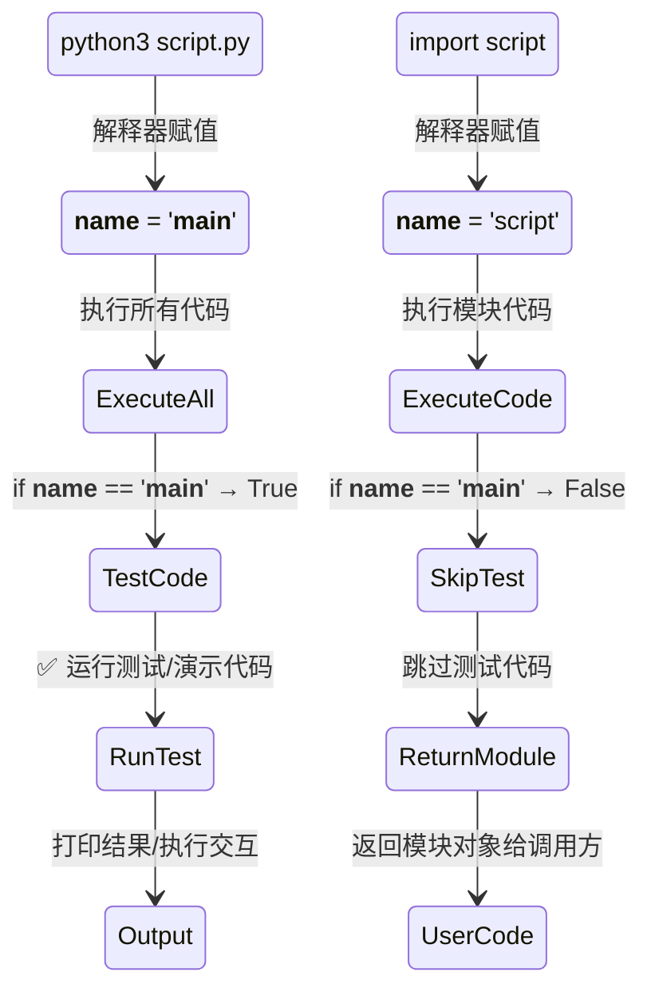
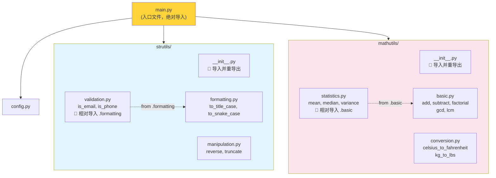
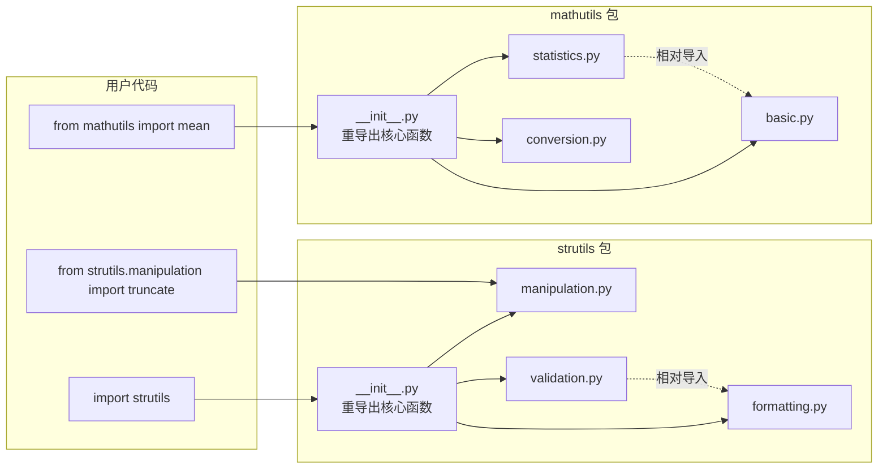

# 模块与包图解

> 本文档包含 Day 014 内容的 ASCII 图和 Mermaid 图。

---

## 1. import 搜索路径流程图

### Mermaid 流程图



### ASCII 搜索路径

```
┌─────────────────────────────────────────────────────┐
│              Python 模块搜索路径 (sys.path)           │
├─────────────────────────────────────────────────────┤
│                                                      │
│  ① 当前脚本所在目录 (入口脚本)                         │
│     sys.path[0]  = /home/user/myproject               │
│                                                      │
│  ② PYTHONPATH 环境变量 (如有设置)                     │
│     export PYTHONPATH=/custom/libs:$PYTHONPATH        │
│                                                      │
│  ③ 标准库路径                                        │
│     /usr/lib/python3.12/                              │
│     /usr/lib/python3.12/lib-dynload/                  │
│                                                      │
│  ④ site-packages (第三方包)                           │
│     /usr/lib/python3.12/site-packages/                │
│                                                      │
└─────────────────────────────────────────────────────┘
```

---

## 2. __name__ 值变化示意

### __name__ 在直接运行 vs 被导入时的值

```
┌─────────────────────────────────────────────────────────┐
│                                                          │
│  python3 mymodule.py                    import mymodule  │
│                                                          │
│  ┌─────────────────┐                  ┌───────────────┐  │
│  │  __name__ 被赋值  │                  │ __name__ 被赋值│  │
│  │  '__main__'      │                  │ 'mymodule'    │  │
│  └────────┬────────┘                  └──────┬────────┘  │
│           │                                   │           │
│           ▼                                   ▼           │
│  ┌─────────────────┐                  ┌───────────────┐  │
│  │ 执行全部代码     │                  │ 执行全部代码   │  │
│  │                  │                  │               │  │
│  │ if __name__ ==   │                  │ if __name__   │  │
│  │    '__main__':   │                  │    ==         │  │
│  │    → True        │                  │    '__main__':│  │
│  │    → 执行测试代码 │                  │    → False    │  │
│  │    → 交互演示     │                  │    → 跳过     │  │
│  └─────────────────┘                  └───────────────┘  │
│                                                          │
└─────────────────────────────────────────────────────────┘
```

### 不同场景下的 __name__ 值

| 文件 | 运行方式 | `__name__` |
|------|---------|-----------|
| `main.py` | `python3 main.py` | `'__main__'` |
| `mymodule.py` | `python3 mymodule.py` | `'__main__'` |
| `mymodule.py` | `import mymodule` | `'mymodule'` |
| `package/module.py` | `import package.module` | `'package.module'` |
| `__main__.py` | `python3 -m package` | `'__main__'` |

### Mermaid 状态图



---

## 3. 包目录结构图

### 完整包结构

```ascii
project/
├── main.py                          ← 入口文件
│
├── strutils/                        ← 字符串工具包
│   ├── __init__.py                  ← 包初始化，集中导入/重导出
│   ├── manipulation.py              ← 字符串操作：reverse, truncate
│   ├── validation.py                ← 字符串验证：is_email, is_phone
│   └── formatting.py                ← 字符串格式化：to_title_case
│
├── mathutils/                       ← 数学工具包
│   ├── __init__.py                  ← 包初始化，集中导入/重导出
│   ├── basic.py                     ← 基础运算：add, subtract
│   ├── statistics.py                ← 统计计算：mean, median, variance
│   └── conversion.py                ← 单位转换：celsius_to_fahrenheit
│
├── config.py                        ← 配置文件
│
└── tests/                           ← 测试目录
    └── test_strutils.py
```

### Mermaid 树状结构



---

## 4. import 语句各种写法的关系

```ascii
                    import 语句的分类
                    ┌─────────────────────────────────┐
                    │                                 │
    ┌───────────────┴───────────────┐                 │
    │                               │                 │
绝对导入                           相对导入            │
(absolute import)                 (relative import)  │
    │                               │                 │
    ▼                               ▼                 │
┌─────────┐                    ┌──────────┐          │
│明确指定│                    │基于当前 │          │
│完整路径│                    │模块位置 │          │
└────┬────┘                    └────┬─────┘          │
     │                              │                 │
     ▼                              ▼                 │
┌─────────────────┐        ┌─────────────────┐       │
│ import os        │        │ from . import x  │       │
│ from os import   │        │ from .. import y │       │
│   path           │        │ from .module    │       │
│ from package    │        │   import z      │       │
│   import module  │        └─────────────────┘       │
│ import numpy as │                                   │
│   np             │        ⚠ 不能在 __main__ 使用    │
└─────────────────┘                                   │
                                                      │
        ★ PEP 8 推荐优先使用绝对导入 ★               │
└─────────────────────────────────────────────────────┘
```

---

## 5. sys.modules 缓存机制

```ascii
第一次 import mymodule:

    import mymodule
         │
         ▼
    ┌──────────────────┐    未命中      ┌──────────────────┐
    │  sys.modules     │ ──────────→   │  在 sys.path     │
    │  检查 'mymodule' │                │  中搜索文件       │
    └──────────────────┘               └────────┬─────────┘
                                               │
                                               ▼
                                        ┌──────────────────┐
                                        │  找到并编译 .py   │
                                        └────────┬─────────┘
                                               │
                                               ▼
                                        ┌──────────────────┐
                                        │  创建 module 对象 │
                                        │  执行模块代码     │
                                        └────────┬─────────┘
                                               │
                                               ▼
                                        ┌──────────────────┐
                                        │  sys.modules     │
                                        │  ['mymodule']    │
                                        │  存入缓存        │
                                        └──────────────────┘

第二次 import mymodule:

    import mymodule
         │
         ▼
    ┌──────────────────┐    命中!
    │  sys.modules     │ ──────────→   ✅ 直接返回缓存的对象
    │  检查 'mymodule' │
    └──────────────────┘
```

---

## 6. 模块生命周期

```ascii
时间线 ──────────────────────────────────────────────────────→

模块源文件 (.py)     ██████████████████████████████████████
                     │（创建）                   （修改/删除）

字节码缓存 (.pyc)    ██████████████████████████████████████
                     │（首次导入生成）        （重新编译更新）

模块对象 (内存)      ────████████████████████──────────────
                        │                    │
                   (第一次导入)          (所有引用释放
                                         或 del sys.modules)

命名空间绑定         ──████████████████████████────────────
                     │                                  │
                (import 语句)                  (函数返回/作用域结束)

模块作用域中的变量   ██████████████████████████████████████
                     只要模块对象在 sys.modules 中，变量就存活
```

---

## 7. 实战工具包架构图



---

## 8. __name__ 与 __main__ 的关系总结

```ascii
┌──────────────────────────────────────────────────────────────┐
│                                                               │
│  每个 .py 文件在运行时都有一个 __name__ 变量                    │
│                                                               │
│       ┌───────────────┐                                        │
│       │  运行方式      │                                        │
│       └───────┬───────┘                                        │
│               │                                                │
│     ┌─────────┴─────────┐                                      │
│     ▼                   ▼                                      │
│ ┌──────────┐      ┌──────────┐                                 │
│ │直接运行   │      │ 被导入    │                                 │
│ │python3 x │      │ import x │                                 │
│ └─────┬────┘      └─────┬────┘                                 │
│       │                 │                                       │
│       ▼                 ▼                                       │
│ ┌──────────┐      ┌──────────┐                                 │
│ │__name__  │      │__name__  │                                 │
│ │=         │      │= 'x'     │                                 │
│ │'__main__'│      │          │                                 │
│ └──────────┘      └──────────┘                                 │
│                                                               │
└──────────────────────────────────────────────────────────────┘
```

---

## 9. 循环导入示意图

```ascii
❌ 循环导入问题：

    module_a.py              module_b.py
    ┌────────────────┐       ┌────────────────┐
    │ from module_b  │       │ from module_a  │
    │   import func_b│◄─────►│   import func_a│
    │                │       │                │
    │ def func_a():  │       │ def func_b():  │
    │   return       │       │   return       │
    │   func_b()     │       │   func_a()     │
    └────────────────┘       └────────────────┘
              │                      │
              └──────────────────────┘
        互相引用，造成循环依赖！
        
✅ 解决方案 1：延迟导入（在函数体内部导入）

    module_a.py              module_b.py
    ┌────────────────┐       ┌────────────────┐
    │ def func_a():  │       │ def func_b():  │
    │   from module_b│       │   from module_a│
    │     import     │       │     import     │
    │     func_b     │       │     func_a     │
    │   return       │       │   return       │
    │   func_b()     │       │   func_a()     │
    └────────────────┘       └────────────────┘

✅ 解决方案 2：提取公共模块

    module_a.py ──→ common.py ←── module_b.py
                      │
                  共享的函数/变量
```

---

## 10. sys.path 构成与修改

```ascii
sys.path 是一个列表，决定了 Python 去哪里找模块：

>>> import sys
>>> sys.path
[
    '/home/user/project',               # ① 脚本所在目录
    '/usr/lib/python3.12',               # ② 标准库
    '/usr/lib/python3.12/lib-dynload',   # ③ C 扩展
    '/usr/lib/python3.12/site-packages',  # ④ 第三方包
]

可以动态修改（但谨慎！）：
>>> sys.path.append('/my/custom/libs')   # 临时添加
>>> sys.path.insert(0, '/override/first') # 插入到最前面（优先级最高）
>>> sys.path.remove('/my/custom/libs')    # 移除

影响 sys.path 的来源：
┌────────────────┐
│ ① __file__ 的    │── 自动设置 sys.path[0] 为入口文件目录
│    所在目录      │
├────────────────┤
│ ② PYTHONPATH    │── 环境变量，多个路径用 : 分隔
│    环境变量      │
├────────────────┤
│ ③ .pth 文件     │── site-packages 中的文本文件
│                 │   每个路径一行，自动追加到 sys.path
├────────────────┤
│ ④ site 模块     │── 启动时自动执行，初始化 site-packages
│    自动初始化    │
└────────────────┘
```
