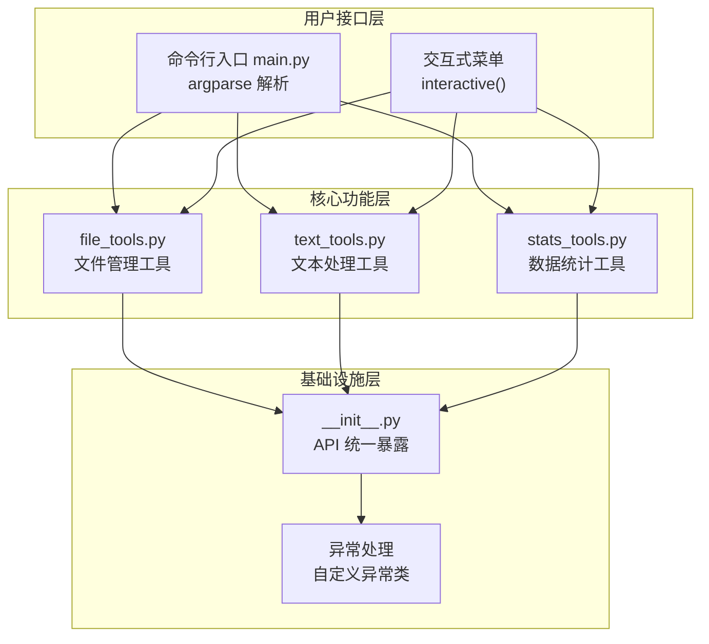
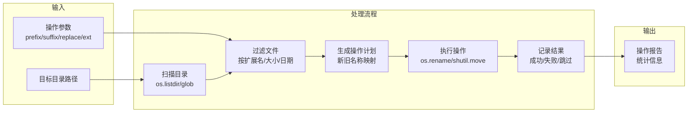
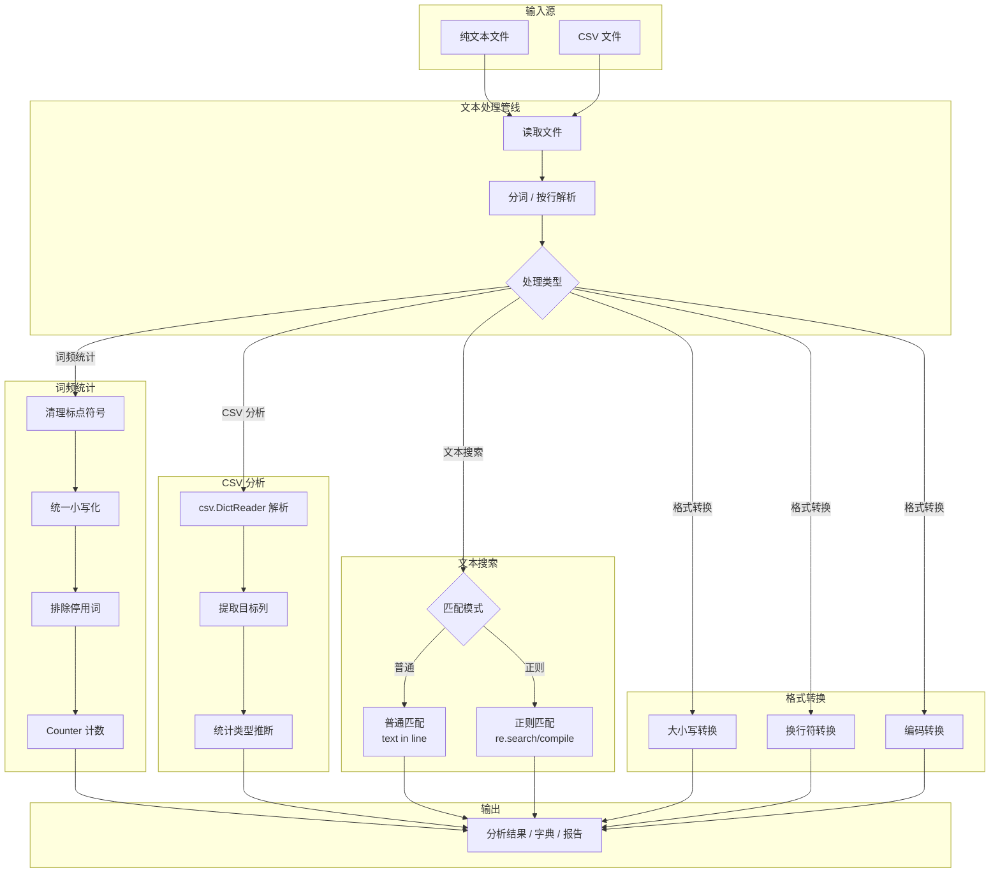
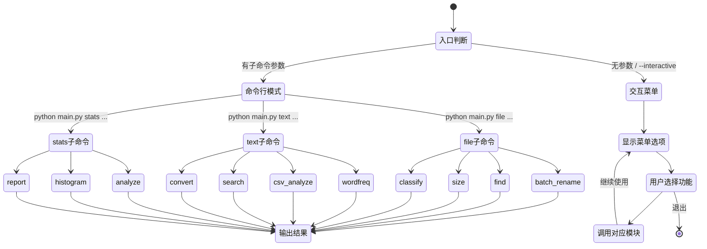

# Python 工具箱 — 架构与流程示意图

## 1️⃣ 工具包整体架构



## 2️⃣ 文件管理工具 — 工作流



### file_tools 函数关系图

```text
┌─────────────────────────────────────────────────────────────────────┐
│                         file_tools.py                               │
│                                                                     │
│  batch_rename(path, prefix, suffix, replace, ext, start)            │
│    ├─ 收集匹配文件列表                                               │
│    ├─ 生成新名称（前缀 + 原名 / 原名 + 后缀 / 替换 / 序号）        │
│    └─ os.rename() 执行重命名                                       │
│                                                                     │
│  find_files(path, ext, min_size, max_size, date_from, date_to)     │
│    ├─ os.walk() 递归遍历                                           │
│    ├─ 按扩展名过滤 → 大小过滤 → 日期过滤                            │
│    └─ 返回匹配文件列表 + 统计信息                                   │
│                                                                     │
│  dir_size_stats(path)                                               │
│    ├─ 递归计算总大小                                                 │
│    ├─ 按子目录汇总大小                                               │
│    └─ 返回结构化大小报告                                             │
│                                                                     │
│  classify_files(path, by_extension)                                 │
│    ├─ 按扩展名分组                                                   │
│    ├─ 创建分类目录（图片/文档/音频/视频/压缩包/其他）              │
│    └─ shutil.move() 移动文件                                        │
└─────────────────────────────────────────────────────────────────────┘
```

## 3️⃣ 文本处理工具 — 处理管线



### text_tools 函数关系图

```text
┌─────────────────────────────────────────────────────────────────────┐
│                         text_tools.py                               │
│                                                                     │
│  word_frequency(text, ignore_stopwords, top_n)                      │
│    ├─ 加载文件或字符串输入                                           │
│    ├─ 预处理：去标点 → 小写 → 分词                                  │
│    ├─ 排除停用词（可选）                                             │
│    └─ collections.Counter 统计 → 返回 Top-N 结果                   │
│                                                                     │
│  analyze_csv(filepath, column, delimiter)                            │
│    ├─ csv.DictReader 读取                                            │
│    ├─ 检测列数据类型（数字/字符串）                                  │
│    ├─ 统计：行数 / 唯一值 / 缺失值 / 均值（数字列）                 │
│    └─ 返回分析报告字典                                               │
│                                                                     │
│  search_text(filepath, pattern, use_regex, case_sensitive)          │
│    ├─ 逐行读取                                                       │
│    ├─ 普通匹配 (in 运算符) 或正则匹配 (re.search)                   │
│    ├─ 返回匹配行号 + 内容                                            │
│    └─ 支持大小写不敏感选项                                           │
│                                                                     │
│  convert_text(filepath, to_case, newline, encoding)                  │
│    ├─ 读取文件内容                                                   │
│    ├─ 大小写转换 (upper/lower/title)                                 │
│    ├─ 换行符转换 (\\n / \\r\\n / \\r)                                │
│    ├─ 编码转换 (utf-8/latin-1/gbk 等)                               │
│    └─ 写入新文件或原地替换                                           │
└─────────────────────────────────────────────────────────────────────┘
```

## 4️⃣ 数据统计流程

```mermaid
flowchart LR
    subgraph "输入数据"
        RAW[原始数据列表\nlist[float/int]]
    end

    subgraph "数据清洗"
        CLEAN[过滤 None/NaN]
        VALIDATE[类型检查]
    end

    subgraph "统计计算"
        CT["集中趋势\n均值 / 中位数 / 众数"]
        DISP["离散程度\n方差 / 标准差"]
        FREQ["分布\n频数统计 / 分箱"]
        SORT["排序\n升序 / 去重"]
        PCT["分位数\n任意百分比"]
    end

    subgraph "输出"
        REPORT2["综合报告\nsummary_report()"]
        CHART["字符直方图\nvisual_histogram()"]
    end

    RAW --> CLEAN
    CLEAN --> VALIDATE
    VALIDATE --> CT
    VALIDATE --> DISP
    VALIDATE --> FREQ
    VALIDATE --> SORT
    VALIDATE --> PCT
    CT --> REPORT2
    DISP --> REPORT2
    FREQ --> REPORT2
    SORT --> REPORT2
    PCT --> REPORT2
    FREQ --> CHART
```

### stats_tools 函数关系图

```text
┌─────────────────────────────────────────────────────────────────────┐
│                        stats_tools.py                               │
│                                                                     │
│  基础统计函数                                                       │
│  ┌──────────────────────────────────────────────────────────────┐  │
│  │ mean(data)       → 算术平均值                                │  │
│  │ median(data)     → 中位数（奇数取中间，偶数取平均）         │  │
│  │ mode(data)       → 众数（支持多个众数）                     │  │
│  │ variance(data, sample) → 方差（样本/总体）                  │  │
│  │ std_dev(data, sample)  → 标准差（样本/总体）                │  │
│  └──────────────────────────────────────────────────────────────┘  │
│                                                                     │
│  进阶统计函数                                                       │
│  ┌──────────────────────────────────────────────────────────────┐  │
│  │ frequency_distribution(data, bins) → 直方图分箱统计         │  │
│  │ sort_and_dedup(data) → 排序并去重，返回统计信息             │  │
│  │ percentiles(data, percents) → 计算任意分位数                 │  │
│  │ visual_histogram(data, bins) → 终端字符直方图               │  │
│  └──────────────────────────────────────────────────────────────┘  │
│                                                                     │
│  综合报告函数                                                       │
│  ┌──────────────────────────────────────────────────────────────┐  │
│  │ summary_report(data) → 一键生成统计分析报告 (dict)          │  │
│  │   ├─ 样本量 | 均值 | 中位数 | 众数                          │  │
│  │   ├─ 方差 | 标准差 | 最小值 | 最大值                        │  │
│  │   ├─ 极差 | Q1 | Q3 | IQR                                   │  │
│  │   └─ 分布: 分箱频数表                                        │  │
│  └──────────────────────────────────────────────────────────────┘  │
└─────────────────────────────────────────────────────────────────────┘
```

## 5️⃣ main.py 命令行流程


