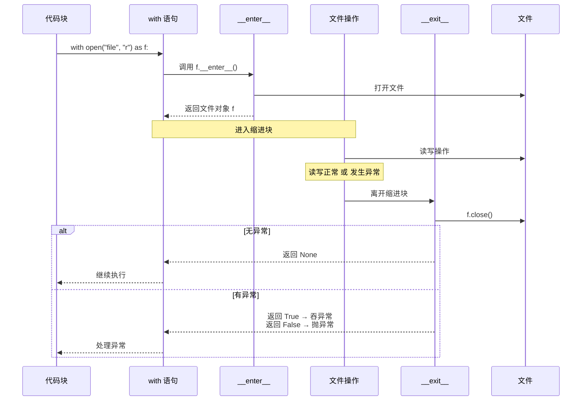
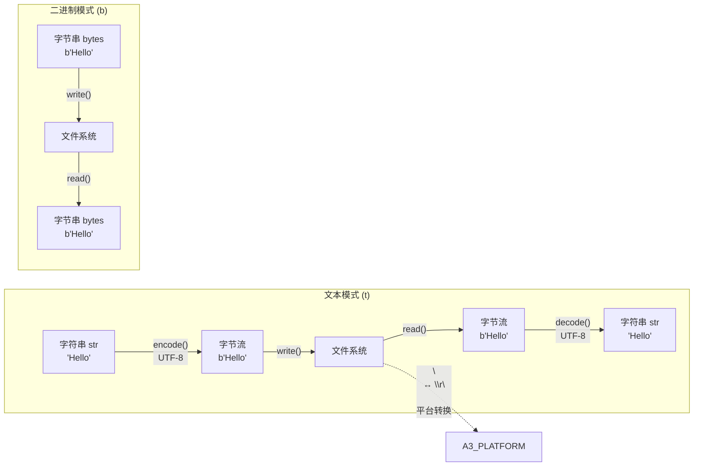
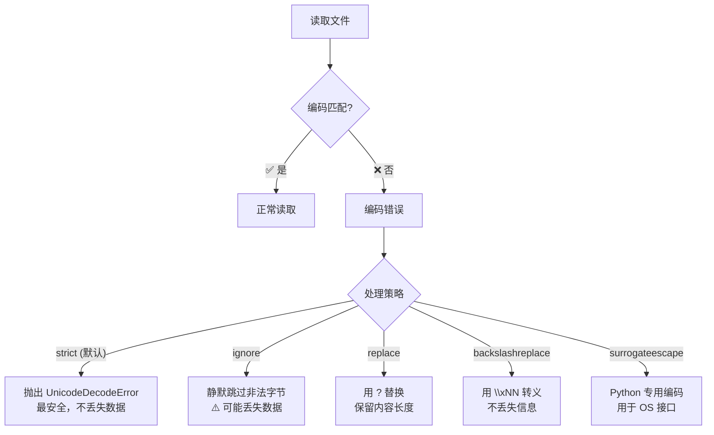
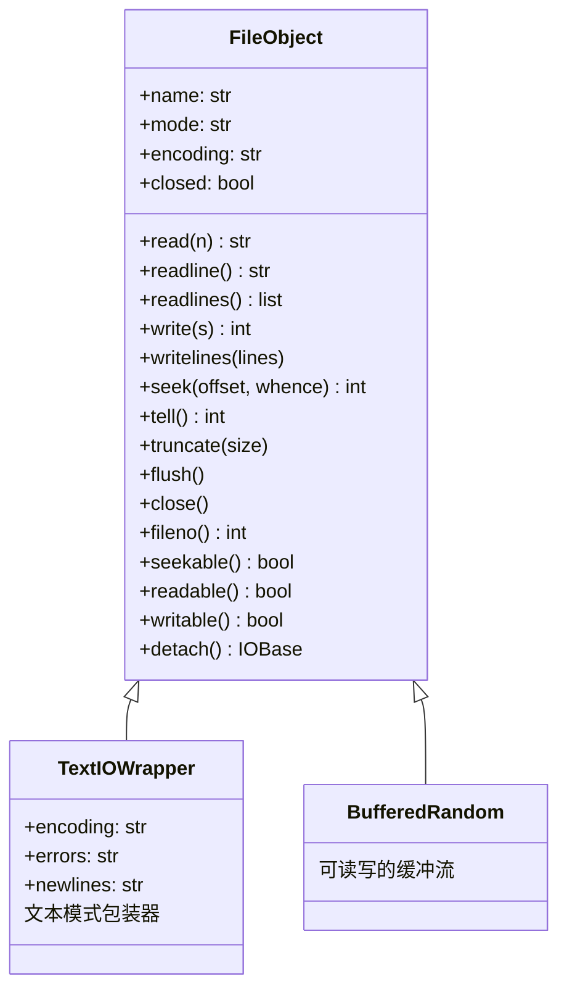
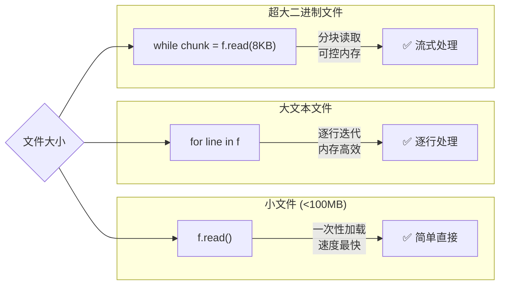

# 文件 I/O 图解

---

## 1. 文件打开模式体系图

```mermaid
graph TB
    subgraph "打开模式体系"
        direction TB
        MODE[open(file, mode)]
        MODE --> BASIC[基本操作]
        MODE --> TYPE[文件类型]
        MODE --> EXTRA[附加操作]
        
        BASIC --> R["r - 只读"]
        BASIC --> W["w - 写入(清空)"]
        BASIC --> A["a - 追加"]
        BASIC --> X["x - 排他创建"]
        
        TYPE --> T["t - 文本模式(默认)"]
        TYPE --> B["b - 二进制模式"]
        
        EXTRA --> PLUS["+ - 读写"]
    end
    
    subgraph "常见组合"
        COM1["r+t"] --> |"文本读写<br>常用: JSON编辑"| COM1U
        COM2["w+b"] --> |"二进制读写<br>常用: 图片处理"| COM2U
        COM3["a+t"] --> |"追加读取<br>常用: 日志查看"| COM3U
        COM4["x+t"] --> |"排他写<br>常用: 避免覆盖"| COM4U
    end
```

## 2. `with` 语句执行流程



## 3. 文本模式 vs 二进制模式处理流程



## 4. 文件指针 seek/tell 示意图

```ascii
文件内容:  H e l l o   W o r l d  \n
          0 1 2 3 4 5 6 7 8 9 10 11
          
① open() 后:
  H e l l o   W o r l d  \n
  ↑
  pos=0 (文件开头)

② f.read(5) 后:
  H e l l o   W o r l d  \n
            ↑
            pos=5

③ f.read() 后 (读完):
  H e l l o   W o r l d  \n
                              ↑
                              pos=12 (文件末尾)

④ f.seek(6): 移动到第 6 个位置
  H e l l o   W o r l d  \n
              ↑
              pos=6

⑤ f.seek(-3, 2): 从末尾往前 3
  H e l l o   W o r l d  \n
                          ↑
                          pos=9
```

## 5. 不同打开模式的文件指针位置

```ascii
┌────────────────────────────────────────────┐
│                   文件内容                    │
│  ┌─┬─┬─┬─┬─┬─┬─┬─┬─┬─┬─┬─┬─┬─┬─┬─┬─┬─┐  │
│  │H│e│l│l│o│ │W│o│r│l│d│ │!│\n│T│e│s│t│  │
│  └─┴─┴─┴─┴─┴─┴─┴─┴─┴─┴─┴─┴─┴─┴─┴─┴─┴─┘  │
│  pos:  0       5       10        15         │
└────────────────────────────────────────────┘

模式 r/r+:    ↑ (pos=0)         只读或读写
模式 w/w+:    清空 → ↑ (pos=0)  先清空再写
模式 a/a+:                     ↑ (pos=18) 追加到末尾
模式 x:       新文件 → ↑ (pos=0) 不存在才创建
```

## 6. 编码错误处理策略对比



## 7. 文件操作 API 速查图



---

## 8. 大文件处理策略对比


