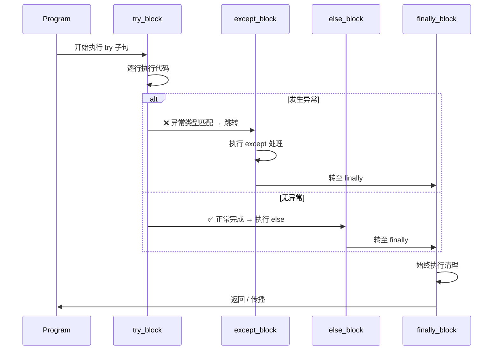
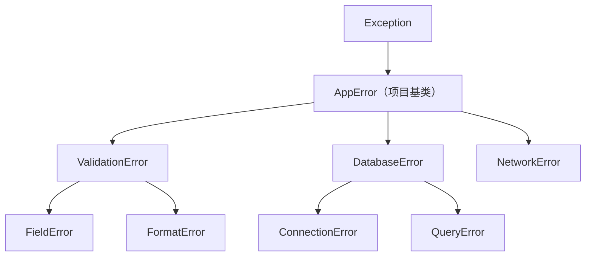

# Day 017：异常处理

> 程序总会出错 —— 优雅地处理它们，而非崩溃。

---

## 目录

- [概念与定义](#概念与定义)
- [异常处理结构](#异常处理结构)
- [执行流详解](#执行流详解)
- [异常链与 raise from](#异常链与-raise-from)
- [自定义异常](#自定义异常)
- [断言与防御式编程](#断言与防御式编程)
- [最佳实践](#最佳实践)
- [API 速查表](#api-速查表)
- [常见陷阱](#常见陷阱)
- [思考题](#思考题)

---

## 概念与定义

### 什么是异常？

**异常（Exception）** 是程序执行过程中发生的错误事件，它会中断正常的指令流。Python 使用 **异常对象** 来表示错误，每个异常都是 `BaseException` 或其子类的实例。

```
正常执行流:  A → B → C → D (完成)
异常中断:    A → B → 💥 抛出异常 → 寻找处理器
```

### 异常的核心哲学

| 原则 | 说明 |
|------|------|
| **EAFP** | Easier to Ask for Forgiveness than Permission<br>先做，出错再处理 — Python 首选风格 |
| **LBYL** | Look Before You Leap<br>先检查再做 — 传统风格 |
| **渐进式** | 从宽到窄捕获，从不裸 `except:` |
| **精确性** | 捕获你能处理的异常，其它让它传播 |

**EAFP vs LBYL 对比：**

```python
# LBYL — 先检查
if os.path.exists(path):
    with open(path) as f:
        data = f.read()

# EAFP — 先做，再处理
try:
    with open(path) as f:
        data = f.read()
except FileNotFoundError:
    data = ""
```

### 内置异常层次结构（部分）

```
BaseException
 ├── SystemExit           — sys.exit()
 ├── KeyboardInterrupt    — Ctrl+C
 └── Exception             — 所有常规异常的基类
      ├── StopIteration    — 迭代结束
      ├── ArithmeticError
      │    ├── ZeroDivisionError
      │    └── OverflowError
      ├── LookupError
      │    ├── IndexError
      │    ├── KeyError
      │    └── ...
      ├── OSError
      │    ├── FileNotFoundError
      │    ├── PermissionError
      │    └── ...
      ├── ValueError       — 值不合法
      ├── TypeError        — 类型不匹配
      ├── RuntimeError     — 通用运行时错误
      └── ...
```

---

## 异常处理结构

### 1. `try/except` — 最简形式

```python
try:
    result = 10 / 0
except ZeroDivisionError:
    print("不能除以零！")
```

### 2. `try/except/else` — 无异常时执行

```python
try:
    result = 10 / 2
except ZeroDivisionError:
    print("除零错误")
else:
    print(f"结果是: {result}")  # 仅无异常时执行
```

### 3. `try/except/finally` — 始终执行清理

```python
f = None
try:
    f = open("data.txt")
    data = f.read()
except FileNotFoundError:
    print("文件不存在")
finally:
    if f:
        f.close()  # 无论是否异常都会执行
```

### 4. `try/except/else/finally` — 完整结构

```python
try:
    risky_operation()
except ValueError:
    handle_value_error()
except TypeError as e:
    handle_type_error(e)
else:
    no_exception_happened()
finally:
    always_run_this()
```

### 5. 捕获多个异常

```python
# 元组方式
try:
    value = int(input())
    result = 100 / value
except (ValueError, ZeroDivisionError) as e:
    print(f"输入错误: {e}")

# 分层捕获
try:
    data = {"key": "value"}
    print(data["missing"])
    print(10 / 0)       # 这行不会执行
except KeyError:
    print("键不存在")
except ZeroDivisionError:
    print("除零错误")
```

---

## 执行流详解

### 完整执行时序图



### 关键规则

| 场景 | try | except | else | finally |
|------|-----|--------|------|---------|
| 无异常 | ✅ 执行 | ❌ 跳过 | ✅ 执行 | ✅ 执行 |
| 异常匹配 | ❌ 中断 | ✅ 执行 | ❌ 跳过 | ✅ 执行 |
| 异常不匹配 | ❌ 中断 | ❌ 跳过 | ❌ 跳过 | ✅ 执行后传播 |
| return 在 try 中 | ⚡ 暂缓 | — | — | ⚡ 仍执行 |
| 异常在 except 中 | — | ❌ 中断 | — | ✅ 执行后传播 |

> **关键洞察**：`finally` 总会执行，即使 `try` 或 `except` 中有 `return`、`break`、`continue`。它会在这些语句 **生效前** 执行。

### 异常传播链

```
函数 A → 函数 B → 函数 C → 💥 raise ValueError
   ↓          ↓          ↓
   ← 不处理 ← 不处理 ← 抛出异常
   ↓
   捕获处理 → 程序继续
```

---

## 异常链与 raise from

### 1. 简单的 `raise`

```python
def divide(a, b):
    if b == 0:
        raise ValueError("除数不能为零")  # 主动抛出
    return a / b

try:
    divide(10, 0)
except ValueError as e:
    print(e)
```

### 2. 重抛异常（保留原异常）

```python
try:
    process_data(data)
except ValueError:
    print("记录日志...")
    raise  # 保留完整的 traceback，继续向上传播
```

### 3. `raise ... from` — 异常链

```python
def load_config(path):
    try:
        with open(path) as f:
            return json.load(f)
    except FileNotFoundError as e:
        raise ConfigError("配置文件缺失") from e
```

这会在异常链中建立因果关系：

```
ConfigError: 配置文件缺失
    └─ 由 FileNotFoundError 引发（显式链接）
```

### 4. `raise ... from None` — 抑制异常链

```python
def api_call():
    try:
        return requests.get("https://api.example.com")
    except ConnectionError:
        raise APIError("服务不可达") from None
    # 隐藏底层 ConnectionError 细节
```

---

## 自定义异常

### 定义方式

```python
class MyAppError(Exception):
    """应用异常的基类"""
    pass

class ValidationError(MyAppError):
    """验证错误"""
    def __init__(self, field: str, message: str):
        self.field = field
        self.message = message
        super().__init__(f"[{field}] {message}")

class DatabaseError(MyAppError):
    """数据库错误"""
    pass
```

### 最佳实践

1. **继承自 `Exception`**，而非 `BaseException`
2. **建立层次结构**：项目基类 → 具体子类
3. **添加有用信息**：字段名、错误码、上下文
4. **保持 `__str__` 可读**：`super().__init__(message)` 即可
5. **不处理内部细节**：让上层决定如何展示



---

## 断言与防御式编程

### `assert` 语句

```python
def withdraw(balance: float, amount: float) -> float:
    assert amount > 0, "取款金额必须为正数"
    assert balance >= amount, "余额不足"
    return balance - amount
```

### 何时使用断言

| 场景 | 用断言 | 用异常 |
|------|--------|--------|
| 内部不变量 | ✅ 永远为真的事 | ❌ |
| 前置条件（开发期） | ✅ 检查参数约定 | ❌ |
| 后置条件（开发期） | ✅ 验证返回值 | ❌ |
| 用户输入 | ❌ | ✅ 用 ValueError |
| 外部数据 | ❌ | ✅ 用适当异常 |
| 可恢复错误 | ❌ | ✅ |

> **关键规则**：断言在 `-O`（优化模式）下会被禁用。**不要用断言做输入验证！**

### 防御式编程策略

```python
def safe_divide(a, b):
    """防御式除法"""
    # 类型守卫
    if not isinstance(a, (int, float)):
        raise TypeError(f"a 必须是数字，收到 {type(a).__name__}")
    if not isinstance(b, (int, float)):
        raise TypeError(f"b 必须是数字，收到 {type(b).__name__}")
    # 值守卫
    if b == 0:
        raise ValueError("不能除以零")
    return a / b
```

---

## 最佳实践

### 1. 捕获具体异常

```python
# ❌ 不好的：捕获所有
try:
    data = json.loads(text)
except:  # 连 KeyboardInterrupt 都捕获了！
    pass

# ✅ 好的：精确捕获
try:
    data = json.loads(text)
except json.JSONDecodeError:
    data = {}
```

### 2. 保持异常处理区域最小

```python
# ❌ 不好的：整个函数都包在 try 里
try:
    data = load_data()
    result = process(data)  # 这里出 bug 也吞了
    save_result(result)
except Exception:
    pass

# ✅ 好的：只包裹可能出错的这行
try:
    data = load_data()
except FileNotFoundError:
    data = fallback_data()
result = process(data)
save_result(result)
```

### 3. 使用 `with` 语句管理资源

```python
# ❌ 不好的：手动 finally
f = None
try:
    f = open("file.txt")
    ...
finally:
    if f:
        f.close()

# ✅ 好的：上下文管理器
with open("file.txt") as f:
    ...  # 自动关闭，无需 finally
```

### 4. 异常的层级与传播

```python
def low_level():
    raise PermissionError("无权限")

def mid_level():
    try:
        low_level()
    except PermissionError as e:
        raise AppPermissionError("操作被拒绝") from e

def high_level():
    try:
        mid_level()
    except AppPermissionError as e:
        logger.error(f"应用权限错误: {e}")
        raise  # 或返回错误响应
```

### 5. 记录异常

```python
import logging

logger = logging.getLogger(__name__)

try:
    connect_to_db()
except ConnectionError as e:
    logger.error("数据库连接失败: %s", e, exc_info=True)
    # exc_info=True 会记录完整 traceback
```

---

## API 速查表

| 构造 | 用途 | 示例 |
|------|------|------|
| `raise` | 抛出异常 | `raise ValueError("msg")` |
| `raise` (裸) | 重抛当前异常 | `except: raise` |
| `raise X from Y` | 异常链 | `raise AppErr from original` |
| `raise X from None` | 抑制异常链 | `raise AppErr from None` |
| `assert cond, msg` | 断言 | `assert x > 0, "正数要求"` |
| `try/except` | 捕获异常 | `try: ... except X: ...` |
| `try/except/else` | 无异常回调 | `try: ... except: ... else: ...` |
| `try/finally` | 清理 | `try: ... finally: ...` |
| `try/except/finally` | 完整处理 | 组合所有 |
| `except X as e` | 绑定异常实例 | `except ValueError as e:` |
| `except (X, Y)` | 捕获多个类型 | `except (ValueError, TypeError):` |
| `sys.exc_info()` | 获取当前异常信息 | `exc_type, exc_val, exc_tb` |
| `traceback.format_exc()` | 获取格式化的 traceback | `import traceback` |

### 常用内置异常

| 异常 | 触发场景 |
|------|----------|
| `ValueError` | 参数值不合法 |
| `TypeError` | 操作/函数应用于不适当类型的对象 |
| `IndexError` | 序列索引超出范围 |
| `KeyError` | 字典键不存在 |
| `FileNotFoundError` | 文件或目录不存在 |
| `ZeroDivisionError` | 除数为零 |
| `AttributeError` | 属性引用或赋值失败 |
| `ImportError` | 导入模块失败 |
| `RuntimeError` | 通用运行时错误 |
| `StopIteration` | 迭代器无更多元素 |

---

## 常见陷阱

### 陷阱 1：裸 `except` 捕获了不该捕获的

```python
try:
    while True:
        ...
except:  # ← 连 Ctrl+C 都捕获了！
    pass
# ❌ 程序无法通过 Ctrl+C 退出！

# ✅ 正确方式
except Exception:
    pass
```

### 陷阱 2：空 `except` 吞没异常

```python
try:
    result = unstable_api()
except Exception:
    pass  # ← 静默吞掉！出了 bug 完全不知道
# 如果 unstable_api() 返回 None，下一行报 AttributeError

# ✅ 至少记录或处理
```

### 陷阱 3：异常处理范围过大

```python
try:
    import os
    filename = user_input
    with open(filename) as f:  # NameError: user_input 未定义
        data = f.read()
except FileNotFoundError:
    data = ""  # 捕获不到 NameError，程序崩溃
```

### 陷阱 4：`finally` 中的 `return` 覆盖异常

```python
def bad():
    try:
        raise ValueError("错误")
    finally:
        return 42  # ← 覆盖了 ValueError！

print(bad())  # 输出 42，没有异常！
```

### 陷阱 5：混淆 `raise` 和 `raise from`

```python
# 产生误导链
try:
    json.loads(data)
except ValueError as e:
    raise ValueError("解析失败")  # ← 新的异常，丢失上下文

# ✅ 保留因果关系
except ValueError as e:
    raise ValueError("解析失败") from e
```

---

## 思考题

1. `try/except/finally` 三段中，`finally` 在什么时候 **不会** 执行？（提示：和 `os._exit()` 有关）

2. 以下代码输出什么？为什么？
```python
def test():
    try:
        return 1
    finally:
        return 2
```

3. 设计一个 `RetryError` 自定义异常和一个 `retry()` 装饰器，使得函数在抛出 `RetryableError` 时重试最多 3 次，否则抛出 `RetryError`。

4. 阅读 `contextlib.suppress` 文档，它和 `try/except: pass` 有什么区别？哪个性能更好？

5. 不使用 `try/except`，有哪些方式可以检查一个对象是否可调用、可迭代、或包含某个属性？

6. 以下代码哪里有问题？
```python
def fetch_data():
    try:
        return http_get("https://api.example.com")
    except ConnectionError:
        return None
    except TimeoutError:
        return None
    except Exception:
        return None
```

7. 在异步代码中（`async/await`），异常处理机制是否有不同？捕获一个 `asyncio.CancelledError` 的行为是什么？

---

> **下一课：[Day 018 —— 标准库入门](..%2Fday-018-standard-library%2F)**
