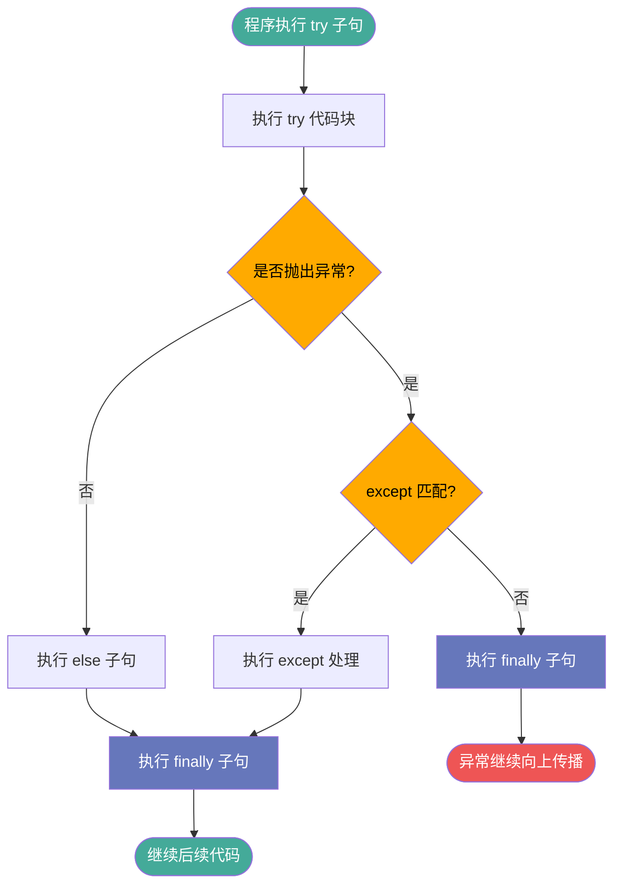
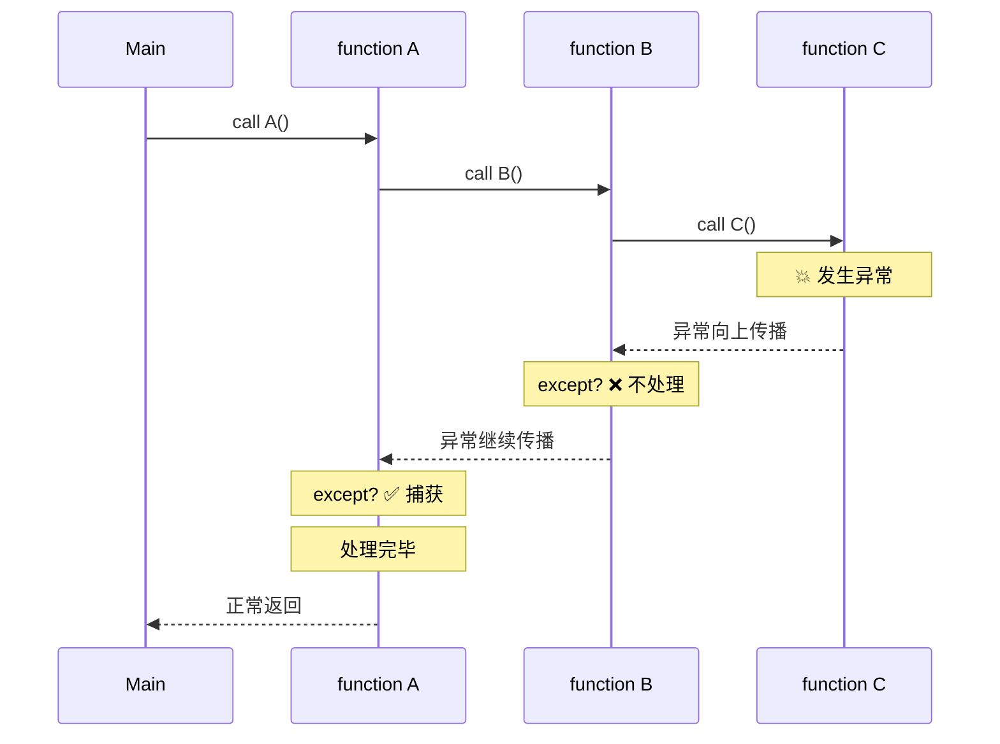
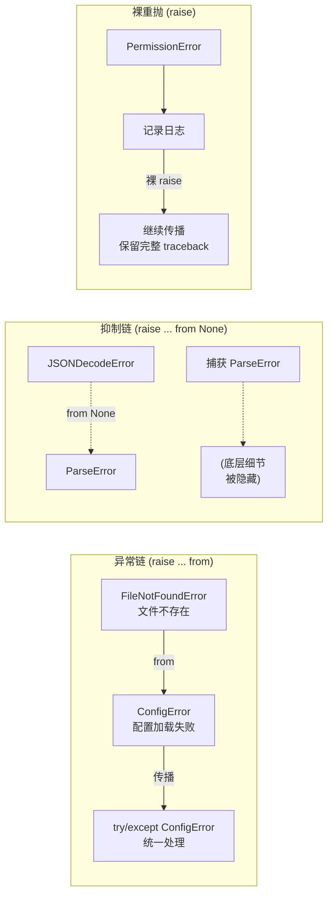
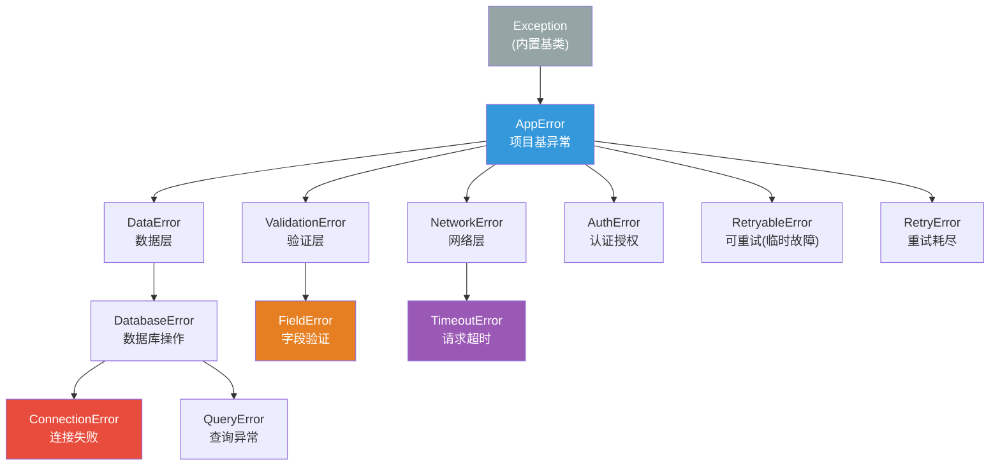
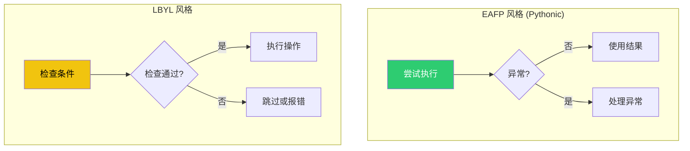
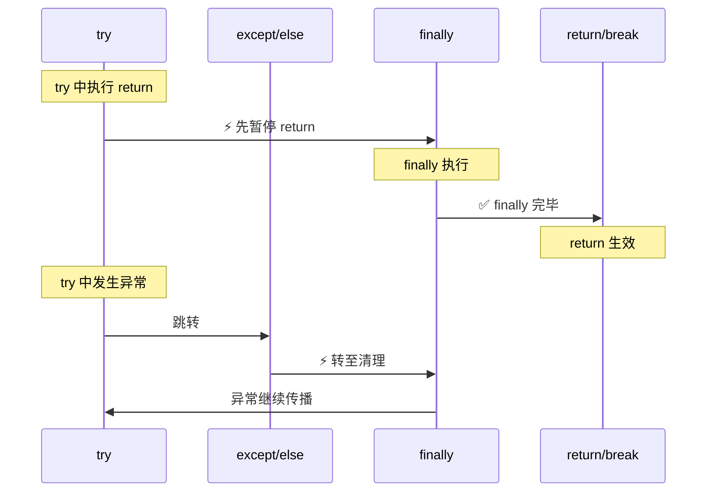
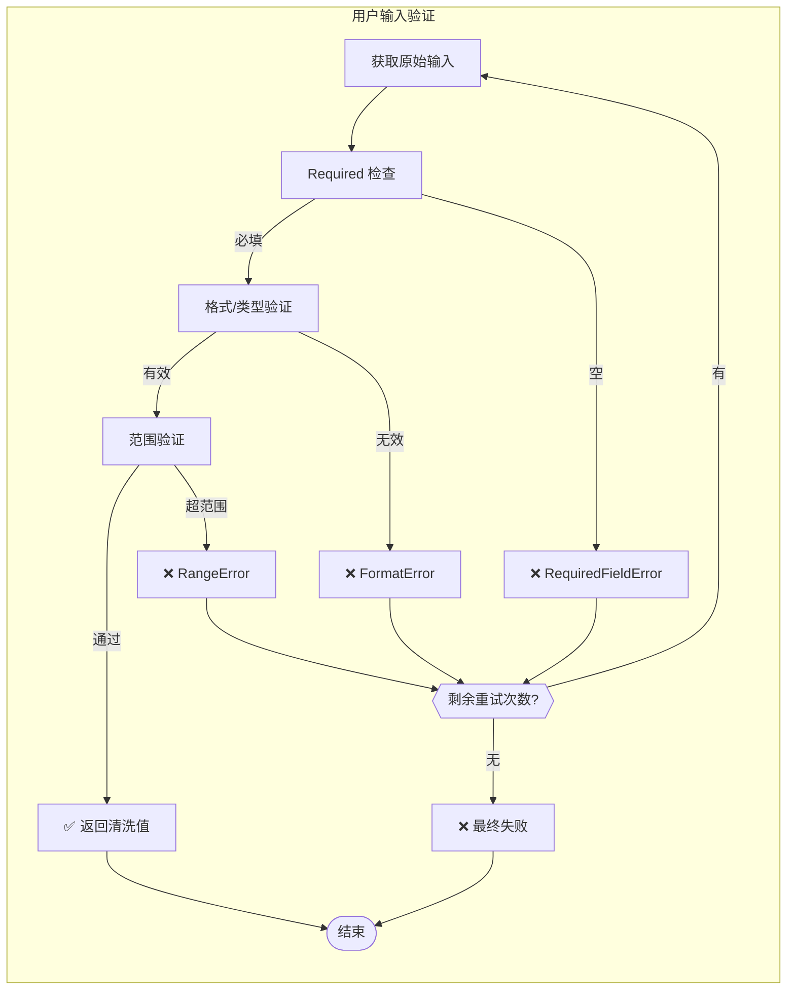
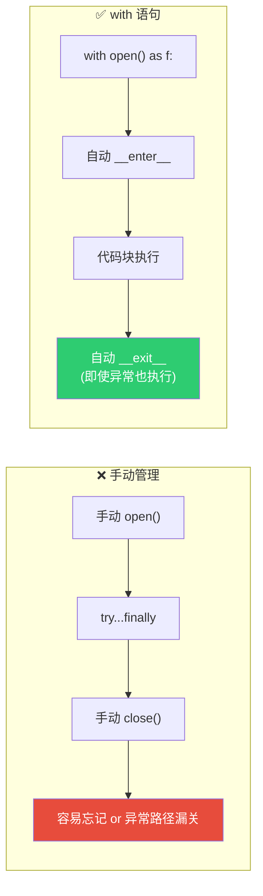
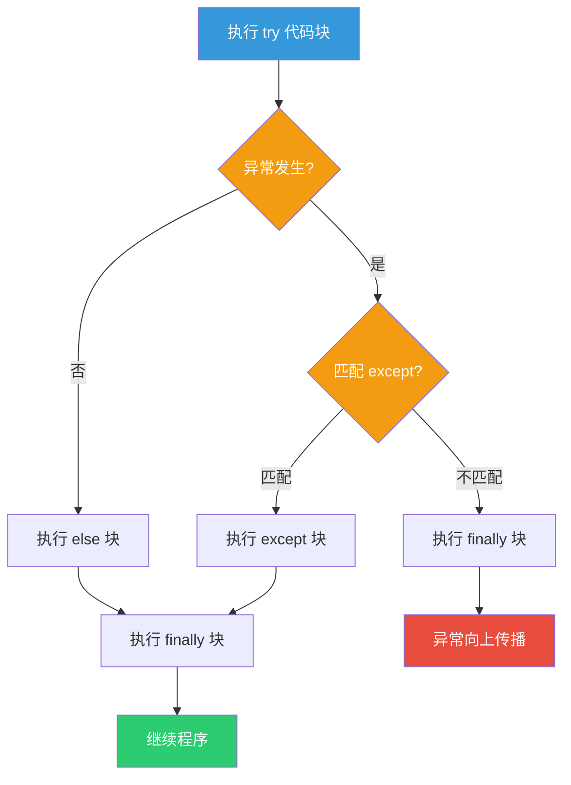
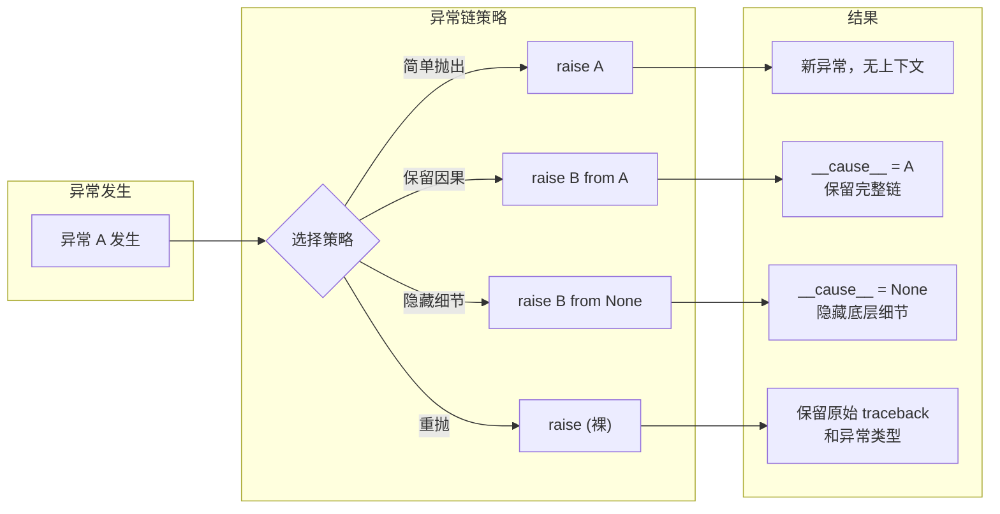

# Day 017 — 异常处理：图解与分析

## 1️⃣ 异常处理完整执行流

## 2️⃣ 异常传播链

## 3️⃣ 异常链关系

## 4️⃣ 自定义异常层次结构

## 5️⃣ EAFP vs LBYL 对比

## 6️⃣ finally 执行保证

## 7️⃣ 异常处理流程图

## 8️⃣ 资源管理最佳实践

## 9️⃣ try/except/else/finally 决策树

## 🔟 异常链决策流

