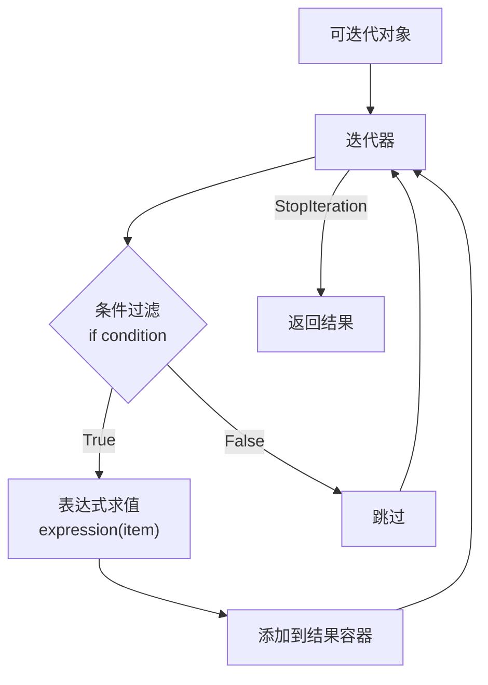
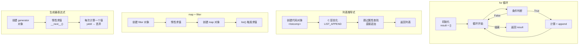
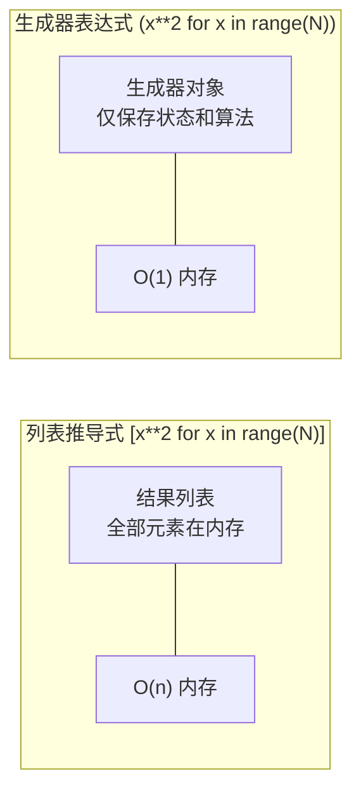
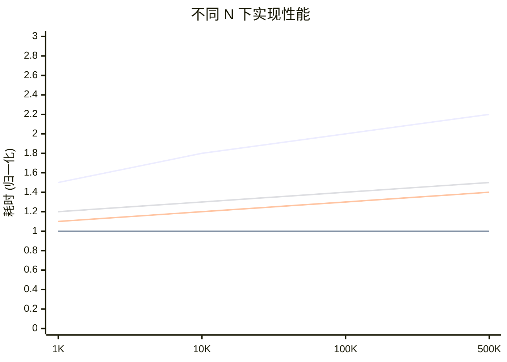

# Day 018 — 推导式图解

> 本目录包含推导式的 Mermaid 和 ASCII 图解

---

## Mermaid 图解

### 1. 推导式执行流程



### 2. 四种实现方式对比



### 3. 内存占用对比图



### 4. 推导式种类

```mermaid
mindmap
  root((推导式 Comprehensions))
    列表推导式
      [expr for x in iterable]
      支持 if 过滤
      支持嵌套 for
      返回 list
    字典推导式
      {k:v for x in iterable}
      键值变换
      过滤
      返回 dict
    集合推导式
      {expr for x in iterable}
      自动去重
      映射转换
      返回 set
    生成器表达式
      (expr for x in iterable)
      惰性求值
      迭代器
      返回 generator
```

### 5. 性能趋势图



---

## ASCII 图解

### 推导式结构

```
┌──────────────────────────────────────────────────────────┐
│                   列表推导式结构                           │
│                                                          │
│  [ 表达式    for    变量    in    可迭代对象    if   条件 ] │
│   ────────   ───   ────   ──   ─────────   ──   ────── │
│     输出     关键字  循环变量   关键字     数据源    可选过滤  │
│                                                          │
│  示例: [ x**2    for    x      in   range(10)   if x%2==0 ]│
│                                                          │
│  数学等价: { x² | x ∈ [0,10), x 是偶数 }                 │
└──────────────────────────────────────────────────────────┘
```

### 等效循环展开

```
推导式:  [x**2 for x in range(5) if x % 2 == 0]


展开为:

        result = []
                      ┌─── for 开始 ───┐
        x=0 ────────→ │  if 0%2==0? ✅ │ ──→ result.append(0²=0)
        x=1 ────────→ │  if 1%2==0? ❌ │ ──→ skip
        x=2 ────────→ │  if 2%2==0? ✅ │ ──→ result.append(2²=4)
        x=3 ────────→ │  if 3%2==0? ❌ │ ──→ skip
        x=4 ────────→ │  if 4%2==0? ✅ │ ──→ result.append(4²=16)
                      └─── for 结束 ───┘

        结果: [0, 4, 16]
```

### 嵌套推导式执行过程

```
嵌套推导式: [a+b for a in [1,2] for b in [3,4]]


执行顺序（从左到右嵌套）:

    a=1 ──→ b=3 ──→ 1+3=4 ──→ append(4)
         → b=4 ──→ 1+4=5 ──→ append(5)

    a=2 ──→ b=3 ──→ 2+3=5 ──→ append(5)
         → b=4 ──→ 2+4=6 ──→ append(6)

结果: [4, 5, 5, 6]


等价于:

    result = []
    for a in [1, 2]:
        for b in [3, 4]:
            result.append(a + b)
```

### 列表推导式 vs 生成器执行对比

```
列表推导式 (急切求值):
───────────────────────────
  [x**2 for x in range(5)]
         │
         ▼
  同时计算所有值:
  [0, 1, 4, 9, 16]  ← 内存中全部存在
         │
         ▼
  后续访问任意索引: print(result[3]) → 9
         │
         ▼
  可多次迭代


生成器表达式 (惰性求值):
───────────────────────────
  (x**2 for x in range(5))
         │
         ▼
  存储算法, 不计算:
  <generator object>
         │
         ▼
  每次 __next__() 调用:
  next() → 0     (计算并丢弃)
  next() → 1     (计算并丢弃)
  next() → 4     (计算并丢弃)
  next() → 9     (计算并丢弃)
  next() → 16    (计算并丢弃)
  next() → StopIteration
         │
         ▼
  只能迭代一次, 无法索引
```

### 性能对比可视化

```
性能对比 (N=100,000)
───────────────────────────

for循环     🔵 ████████████████████████████    2.0x
推导式      🟢 ████████████████               1.0x  (基准)
map+filter  🟡 ██████████████████             1.3x
生成器→列表 🟠 ████████████████████           1.4x

0x          1x          2x          3x

相对速度 (越低越快)
```
