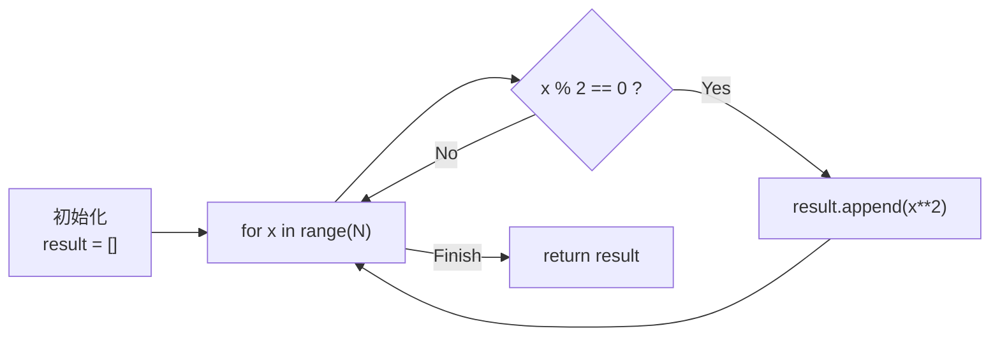
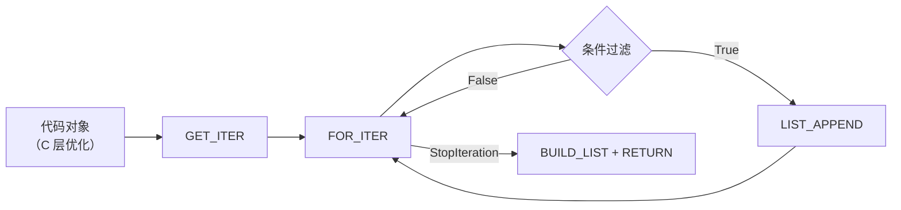

# 推导式与原循环对比示意图

## 执行流程对比

### 手写 for 循环



### 列表推导式



### 关键差异

```
                   手写 for 循环                         列表推导式
              ┌──────────────────┐                ┌──────────────────┐
              │  每次迭代：       │                │  每次迭代：       │
              │  LOAD_FAST x     │                │  LIST_APPEND      │
              │  LOAD_CONST 2    │                │  （单指令）       │
              │  BINARY_POWER    │                │                   │
              │  LOAD_METHOD     │                │  无方法查找开销   │
              │  append          │                │  无函数调用开销   │
              │  CALL_METHOD     │                │                   │
              │  5 条指令        │                │  1 条指令         │
              └──────────────────┘                └──────────────────┘
```

## 深层嵌套对比

```
三维数据扁平化:

for 循环:
    result = []
    for dim1 in data:
        for dim2 in dim1:
            for item in dim2:
                result.append(item)

推导式:
    result = [item for dim1 in data for dim2 in dim1 for item in dim2]

差异:
    - for 循环更清晰（3 层缩进，易于理解）
    - 推导式更简洁（但可读性下降）
    - 建议: 3 层及以上用 for 循环
```

## 内存分配对比

```
for 循环:
    result = []         ← 预分配空列表
                          (实际动态扩容)
    for x in range(N):
        if x % 2 == 0:
            result.append(x**2)  ← 每次检查容量

列表推导式:
    ⋮                    ← CPython 会预分配
                          ≈ len(iterable) 容量
                          减少扩容次数
                          因此速度更快
```
