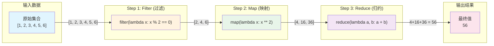
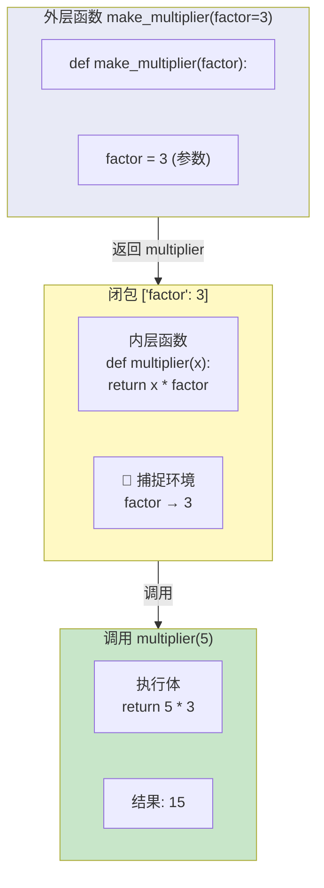
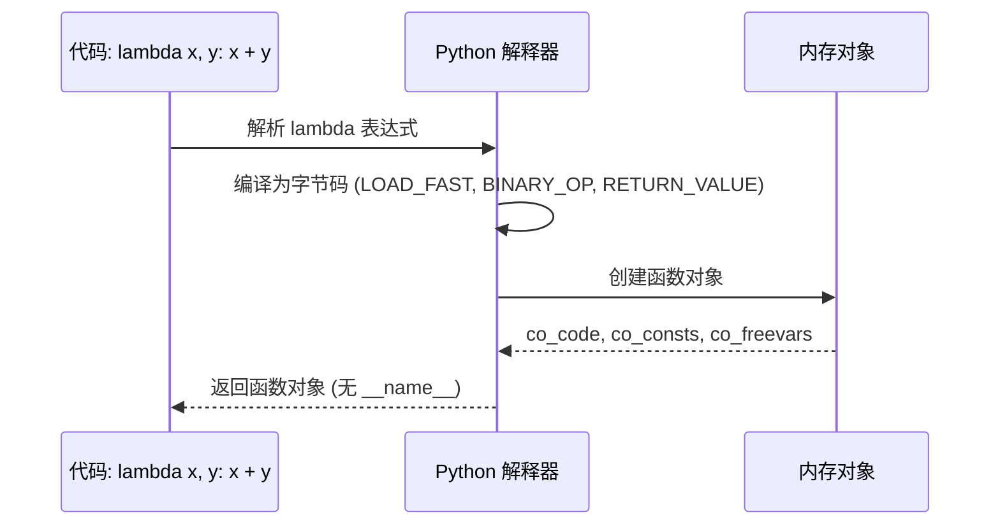
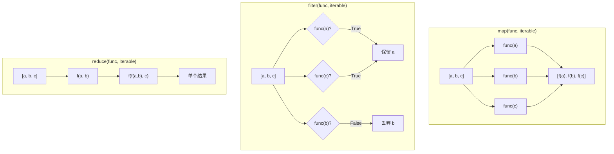

# Day 019 — Lambda 与函数式编程 图解

## 1. 函数式数据流

```mermaid
flowchart LR
    subgraph Input["输入数据"]
        A["原始集合<br/>[1, 2, 3, 4, 5, 6]"]
    end

    subgraph Step1["Step 1: Filter (过滤)"]
        F["filter(lambda x: x % 2 == 0)"]
    end

    subgraph Step2["Step 2: Map (映射)"]
        M["map(lambda x: x ** 2)"]
    end

    subgraph Step3["Step 3: Reduce (归约)"]
        R["reduce(lambda a, b: a + b)"]
    end

    subgraph Output["输出结果"]
        O["最终值<br/>56"]
    end

    A -->|"[1, 2, 3, 4, 5, 6]"| F
    F -->|"[2, 4, 6]"| M
    M -->|"[4, 16, 36]"| R
    R -->|"4+16+36 = 56"| O

    style A fill:#e1f5fe
    style F fill:#fff3e0
    style M fill:#e8f5e9
    style R fill:#f3e5f5
    style O fill:#fce4ec
```

---

## 2. 闭包与作用域链

```mermaid
flowchart TD
    subgraph Outer["外层函数 make_multiplier(factor=3)"]
        direction LR
        DECL["def make_multiplier(factor):"]
        FACTOR["factor = 3 (参数)"]
    end

    subgraph Closure["闭包 ['factor': 3]"]
        INNER["内层函数<br/>def multiplier(x):<br/>    return x * factor"]
        CAPTURE["📎 捕捉环境<br/>factor → 3"]
    end

    subgraph Call["调用 multiplier(5)"]
        EXEC["执行体<br/>return 5 * 3"]
        RESULT["结果: 15"]
    end

    Outer -->|"返回 multiplier"| Closure
    Closure -->|"调用"| Call

    style Outer fill:#e8eaf6
    style Closure fill:#fff9c4
    style Call fill:#c8e6c9
```

---

## 3. Lambda 表达式原理

```mermaid
sequenceDiagram
    participant C as 代码: lambda x, y: x + y
    participant P as Python 解释器
    participant O as 内存对象

    C->>P: 解析 lambda 表达式
    P->>P: 编译为字节码 (LOAD_FAST, BINARY_OP, RETURN_VALUE)
    P->>O: 创建函数对象
    O-->>P: co_code, co_consts, co_freevars
    P-->>C: 返回函数对象 (无 __name__)
```

---

## 4. map/filter/reduce 对比

```mermaid
graph TB
    subgraph map["map(func, iterable)"]
        M1["[a, b, c]"] --> M2["func(a)"]
        M1 --> M3["func(b)"]
        M1 --> M4["func(c)"]
        M2 --> M5["[f(a), f(b), f(c)]"]
        M3 --> M5
        M4 --> M5
    end

    subgraph filter["filter(func, iterable)"]
        F1["[a, b, c]"] --> F2{"func(a)?"}
        F1 --> F3{"func(b)?"}
        F1 --> F4{"func(c)?"}
        F2 -->|True| F5["保留 a"]
        F3 -->|False| F6["丢弃 b"]
        F4 -->|True| F5
    end

    subgraph reduce["reduce(func, iterable)"]
        R1["[a, b, c]"] --> R2["f(a, b)"]
        R2 --> R3["f(f(a,b), c)"]
        R3 --> R4["单个结果"]
    end
```
