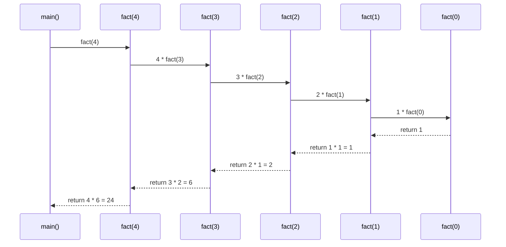
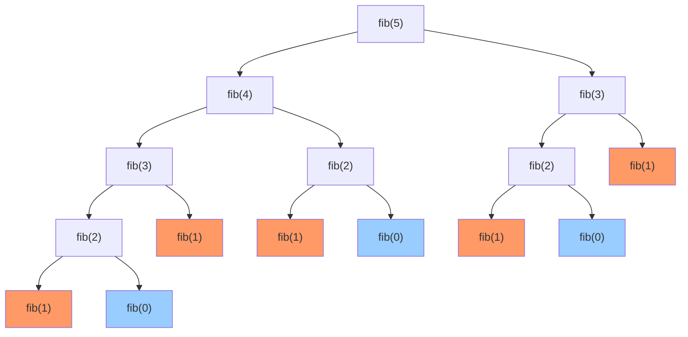

# Day 020 — 递归 (Recursion) 🔄

## 概述

**递归（Recursion）** 是一种在函数定义中**调用自身**的编程技术。它通过将大问题分解成结构相同的子问题，使得代码简洁优雅，特别适合处理具有自相似结构的数据（如树、图、嵌套列表等）。

递归的核心哲学：**"To understand recursion, you must first understand recursion."** 🌀

## 📚 递归定义与数学基础

### 数学定义

递归函数通常定义为：

```
f(0) = base_case       ← 基线条件
f(n) = f(n-1) + ...    ← 递归关系
```

### 数学归纳法关联

递归与**数学归纳法**有着深厚的联系：

| 数学归纳法 | 递归实现 |
|-----------|---------|
| 基础情况：证明 P(0) 成立 | 基线条件：处理最简单的情况 |
| 归纳步骤：假设 P(k) 成立，证明 P(k+1) 成立 | 递归步骤：假设规模更小的问题已解决 |
| 结论：P(n) 对所有 n 成立 | 结果：递归函数对所有输入产生正确结果 |

> **理解**：数学归纳法是从小到大证明，递归是从大到小求解——但底层结构完全对应。
>
> **举例**：证明 `1 + 2 + ⋯ + n = n(n+1)/2`
> - 基础情况：n=1 时，左边=1，右边=1(2)/2=1 ✅
> - 归纳步骤：假设 n=k 成立，证明 n=k+1 也成立
> - 递归实现：`def sum_n(n): return 0 if n==0 else n + sum_n(n-1)`
> - **两者完美对应**：基线条件 = 基础情况，递归关系 = 归纳步骤

### 递推关系与闭式解

著名递推关系及其闭式解：

| 递推关系 | 通项公式 | 示例 |
|---------|---------|------|
| T(n) = T(n-1) + 1 | T(n) = n | 线性递归 |
| T(n) = T(n-1) + T(n-2) | 斐波那契数 | 分治递归 |
| T(n) = 2T(n/2) + n | T(n) = n log n | 归并排序 |
| T(n) = 2T(n-1) + 1 | T(n) = 2ⁿ - 1 | 汉诺塔 |

## 🏗️ 调用栈与栈帧模型

### 调用栈（Call Stack）

当程序调用一个函数时，系统会：

1. **压栈**：将当前函数的上下文（局部变量、返回地址等）推入**调用栈**
2. **跳转**：控制权转移到被调函数
3. **执行**：被调函数运行
4. **返回**：被调函数结束后，从栈顶弹出上下文
5. **恢复**：恢复调用者的执行

递归的特殊之处在于——同一个函数被多次压栈，每次压栈的是不同的调用实例。

### 栈帧结构

每个栈帧包含：

```
┌────────────────────────┐
│     返回地址            │  ← 函数结束后回到哪里
├────────────────────────┤
│     局部变量            │  ← n, result 等
├────────────────────────┤
│     参数值              │  ← 调用时传入的值
├────────────────────────┤
│     临时变量            │  ← 编译器优化用
└────────────────────────┘
```

### recursion tree (递归树) 模型

以 `fib(5)` 为例，递归调用形成一棵树：

```
                    fib(5)
                   /      \
              fib(4)      fib(3)
             /     \      /    \
        fib(3)   fib(2) fib(2) fib(1)
        /    \    /  \   /  \
    fib(2) fib(1) 1  1  1   1
    /   \
   1    1
```

每个节点代表一次函数调用，树的高度代表递归深度。

### Python 递归深度限制

```python
import sys
print(sys.getrecursionlimit())  # 默认 1000
sys.setrecursionlimit(3000)     # 可调大，但小心栈溢出
```

> **为什么有上限？** 每个 Python 函数调用消耗约 1KB 栈空间。1000 层 ≈ 1MB，再大可能导致段错误（Segmentation Fault）。

## 🎯 基线条件与递归条件

每个正确的递归函数必须包含两个部分：

### ⚓ 基线条件 (Base Case)
- 递归的**终止条件**
- 不调用自身，直接返回结果
- 通常是最简单的情况（n=0, n=1, 空列表等）

### 🔁 递归条件 (Recursive Case)
- 函数调用自身
- 每次调用**必须向基线条件逼近**
- 问题规模不断缩小

```python
def countdown(n):
    # 基线条件
    if n <= 0:
        return
    print(n)
    # 递归条件（向基线逼近：n → n-1）
    countdown(n - 1)
```

### 常见错误

```python
# ❌ 缺失基线条件 → RecursionError
def infinite(n):
    return infinite(n + 1)

# ❌ 不向基线逼近 → 也是无限递归
def bad_fact(n):
    if n == 0:
        return 1
    return n * bad_fact(n)  # 没有减小 n
```

## ⚡ 递归 vs 迭代性能对比

| 维度 | 递归 | 迭代 |
|------|------|------|
| **代码简洁性** | ⭐⭐⭐ (数学公式直译) | ⭐⭐ (需要额外变量) |
| **可读性** | 嵌套结构清晰 | 循环直观 |
| **栈空间** | O(n) 额外栈空间 | O(1) 额外空间 |
| **时间复杂度** | 有时有重复计算 | 通常可控 |
| **适用场景** | 树、分治、回溯 | 线性遍历、累加 |
| **极限规模** | 受栈深度限制 (1000) | 无理论限制 |

### 典型对比：斐波那契

```
递归: fib(40) ≈ 0.8s, 3.3 亿次调用
迭代: fib(40) ≈ 0.00001s, 39 次循环
优化后: fib(40) ≈ 0.00005s, 40 次调用 (memoization)
```

## 🌀 尾递归（Tail Recursion）

### 定义

**尾递归**是指递归调用是函数的**最后一个操作**，并且函数的返回值直接就是递归调用的返回值。

```python
# 非尾递归 — 需要保存 n，返回后再乘
def factorial(n):
    if n == 0:
        return 1
    return n * factorial(n - 1)  # 最后操作是乘，不是递归

# 尾递归形式 — 不需要保存额外状态
def factorial_tail(n, acc=1):
    if n == 0:
        return acc
    return factorial_tail(n - 1, n * acc)  # 最后操作就是递归
```

### Python 为什么不支持尾递归优化？

**Python 的设计哲学决定了它不支持尾递归优化（TCO，Tail Call Optimization）：**

1. **栈帧调试信息**：Python 的栈帧包含丰富的调试信息（文件名、行号、局部变量等）。TCO 会丢弃当前栈帧，使调试变得困难。

2. **装饰器兼容性**：尾递归优化会与装饰器、上下文管理器产生复杂的交互。

3. **`sys.settrace()`**：Python 的追踪钩子依赖栈帧引用。

4. **Guido 的立场**：Python 之父 Guido van Rossum 曾明确表示不打算支持 TCO，原因是：
   - TCO 会掩盖栈溢出错误，使调试更困难
   - 鼓励人们使用迭代（更 Pythonic 的方式）

> **结论**：在 Python 中不要依赖尾递归优化。如果递归深度可能超过 1000，请使用迭代。

## 🚨 常见递归陷阱与调试技巧

### 陷阱 1️⃣ 栈溢出 (Stack Overflow)

```python
# 深度 1001 → RecursionError
recurse(1000)  # 刚好在边界
recurse(1001)  # 💥 RecursionError: maximum recursion depth exceeded
```

**解决**：增大递归限制或改用迭代。

### 陷阱 2️⃣ 重复计算 (Redundant Computation)

```python
# fib(5) 计算 fib(3) 两次，fib(2) 三次...
def fib(n):
    if n <= 1:
        return n
    return fib(n-1) + fib(n-2)

# fib(40) 需要约 3.3 亿次调用！
```

**解决**：使用记忆化（Memoization）。

### 陷阱 3️⃣ 可变默认参数共享

```python
# ❌ 共享同一个列表！
def traverse(node, visited=[]):
    visited.append(node)
    for child in node.children:
        traverse(child, visited)

# ✅ 使用 None 并创建新列表
def traverse(node, visited=None):
    if visited is None:
        visited = []
    visited.append(node)
    ...
```

### 调试技巧

**技巧 1：打印调用深度**

```python
def factorial(n, depth=0):
    prefix = "  " * depth
    print(f"{prefix}factorial({n}) called")
    if n == 0:
        print(f"{prefix}→ return 1")
        return 1
    result = n * factorial(n - 1, depth + 1)
    print(f"{prefix}→ return {result}")
    return result

# 输出：
# factorial(3) called
#   factorial(2) called
#     factorial(1) called
#       factorial(0) called
#       → return 1
#     → return 1
#   → return 2
# → return 6
```

**技巧 2：使用 `sys.setrecursionlimit`**

```python
import sys
sys.setrecursionlimit(10_000)
```

**技巧 3：memoization 优化**

```python
from functools import lru_cache

@lru_cache(maxsize=None)
def fib(n):
    if n <= 1:
        return n
    return fib(n-1) + fib(n-2)
```

## 🎨 Mermaid 图解

### 递归调用栈流程（factorial(4)）



### 递归树（斐波那契 fib(5)）



## 📝 思考题

1. 为什么 Python 的递归深度默认只有 1000？如何安全地增加？
2. 哪些问题天然适合用递归解决？哪些问题绝不能用递归？
3. 实现一个 `flatten()` 函数，将任意嵌套的列表展开成一维列表。
4. 如何用递归实现二分查找？和迭代版本相比优劣如何？
5. 斐波那契函数的原始递归版本时间复杂度是多少？如何优化？
6. 汉诺塔问题的步数为什么是 2ⁿ - 1？请用数学归纳法证明。
7. Python 不支持尾递归优化的根本原因有哪些？
8. 编写一个装饰器来统计递归函数被调用的总次数。

## 🔗 延伸阅读

- [Recursion (Computer Science) — Wikipedia](https://en.wikipedia.org/wiki/Recursion_(computer_science))
- [The Recursive Book of Recursion — Al Sweigart](https://nostarch.com/recursive-book-recursion)
- [Python: Why is recursion depth limited? — Stack Overflow](https://stackoverflow.com/questions/3323001/what-is-the-maximum-recursion-depth-in-python-and-how-to-increase-it)
- [Tail Recursion Elimination — Guido van Rossum](http://neopythonic.blogspot.com/2009/04/tail-recursion-elimination.html)
