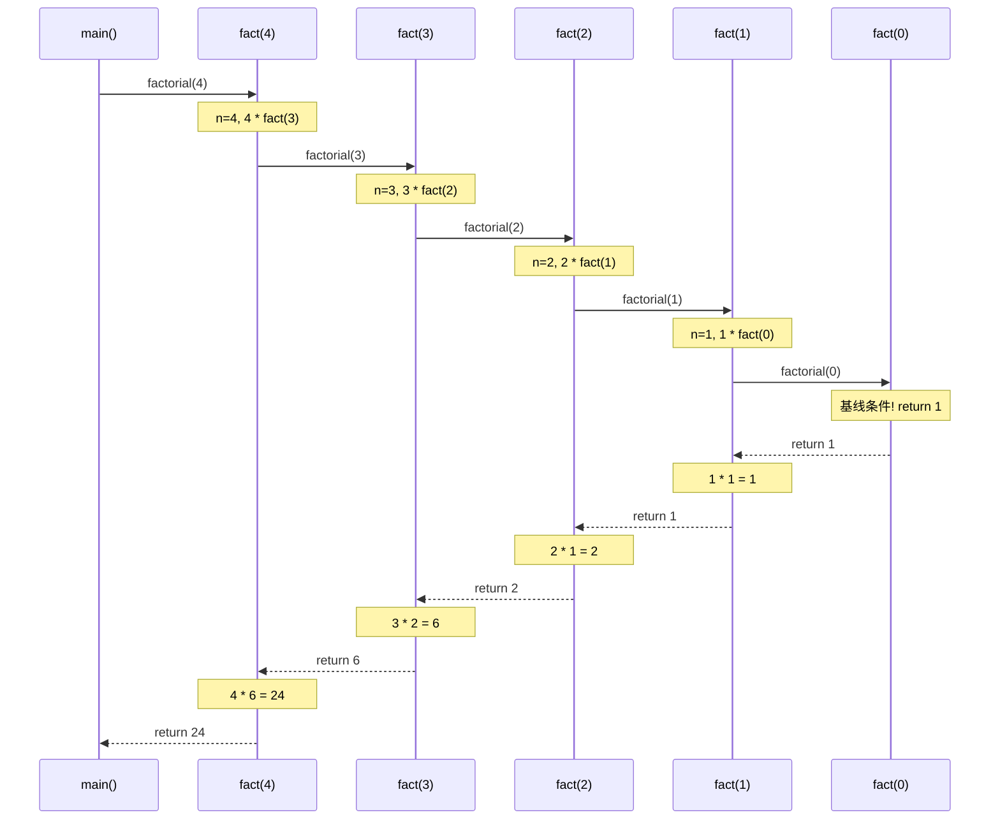
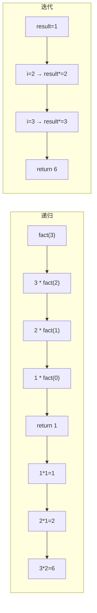
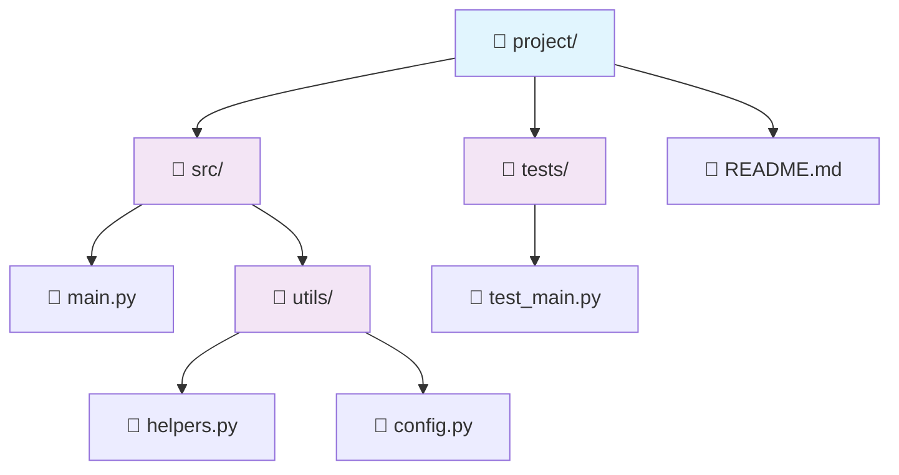
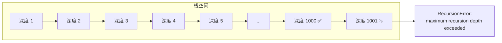

# Day 020 — 递归原理图解

## 1. 调用栈与栈帧模型

### 调用栈生命周期（factorial(3) 为例）

```
初始状态:
┌─────────────┐
│   main()    │  ← 当前执行
└─────────────┘
调用栈底部

调用 factorial(3):
┌─────────────┐
│ factorial(3)│  ← 当前执行 (n=3)
├─────────────┤
│   main()    │
└─────────────┘

调用 factorial(2):
┌─────────────┐
│ factorial(2)│  ← 当前执行 (n=2)
├─────────────┤
│ factorial(3)│  (等待 return, n=3, 记住了 3 * ?)
├─────────────┤
│   main()    │
└─────────────┘

调用 factorial(1):
┌─────────────┐
│ factorial(1)│  ← 当前执行 (n=1)
├─────────────┤
│ factorial(2)│  (等待 return, n=2, 记住了 2 * ?)
├─────────────┤
│ factorial(3)│  (等待 return, n=3, 记住了 3 * ?)
├─────────────┤
│   main()    │
└─────────────┘

调用 factorial(0):
┌─────────────┐
│ factorial(0)│  ← 基线条件, 返回 1
├─────────────┤
│ factorial(1)│  (等待 return, n=1)
├─────────────┤
│ factorial(2)│  (等待 return, n=2)
├─────────────┤
│ factorial(3)│  (等待 return, n=3)
├─────────────┤
│   main()    │
└─────────────┘

开始回溯:
┌─────────────┐
│ factorial(1)│  ← 收到 1, 计算 1*1=1, 返回 1
├─────────────┤
│ factorial(2)│  (等待 return, n=2)
├─────────────┤
│ factorial(3)│  (等待 return, n=3)
├─────────────┤
│   main()    │
└─────────────┘

继续回溯:
┌─────────────┐
│ factorial(2)│  ← 收到 1, 计算 2*1=2, 返回 2
├─────────────┤
│ factorial(3)│  (等待 return, n=3)
├─────────────┤
│   main()    │
└─────────────┘

继续回溯:
┌─────────────┐
│ factorial(3)│  ← 收到 2, 计算 3*2=6, 返回 6
├─────────────┤
│   main()    │
└─────────────┘

最终:
┌─────────────┐
│   main()    │  ← 收到 6, result = 6
└─────────────┘
```

### 栈帧内部结构（factorial(3) 的栈帧）

```
栈帧地址: 0x7ffeeb4a8f30
┌──────────────────────────────┐
│     返回地址: 0x55a3b2c1     │ → 返回到 factorial(3) 的调用处
├──────────────────────────────┤
│     局部变量:                 │
│       n      = 3             │  ← 参数
│       result = ?             │  ← 未计算（等待递归返回）
├──────────────────────────────┤
│     代码指针: fact+42        │ → 当前执行到的行号
├──────────────────────────────┤
│     上一层栈帧指针: 0x7ffe...│ → 链接到 main 的栈帧
└──────────────────────────────┘
```

## 2. 递归执行流程对比

### 普通递归 vs 尾递归 (factorial)

```
普通递归:
    fact(3) → 3 * fact(2)
                  → 2 * fact(1)
                        → 1 * fact(0)
                              → 1
                        ← 1
                  ← 2
            ← 6

    特点: 展开(递推) → 收缩(回溯)
         每层都需要记住 "n * ?"

尾递归:
    fact_tail(3, 1) → fact_tail(2, 3)
                      → fact_tail(1, 6)
                        → fact_tail(0, 6)
                          → 6

    特点: 不需要回溯
         累加器直接传递结果
         理论上只需一个栈帧（如果优化）
         但 Python 不优化！
```

## 3. 递归树与 DAG

### 斐波那契递归树（显示重复计算）

```
                    fib(5)
                   ╱     ╲
              fib(4)     fib(3)
             ╱     ╲     ╱   ╲
        fib(3)   fib(2) fib(2) fib(1)★
        ╱   ╲    ╱  ╲   ╱  ╲
    fib(2) fib(1)★1★  1★  1★
    ╱   ╲
   1★   1★

★ = fib(1) 被计算了 5 次!
fib(2) 被计算了 3 次!

Memoization 后变成 DAG:
                    fib(5)
                   ╱     ╲
              fib(4)     fib(3)
             ╱     ╲       │
        fib(3)   fib(2)    │
        ╱   ╲      │       │
    fib(2) fib(1)  │       │
       │     │     │       │
    fib(0)  (1)    │       │
       │           │       │
      (0)         (1)     (2)

    每个节点仅计算一次 → O(n)
```

## 4. 汉诺塔递归分治图解

### n=3 的移动过程

```
初始状态:
    A: [3, 2, 1]    B: []    C: []

步骤 1-3: 移动 1,2 到 B (借助 C)
    A: [3]           B: [2, 1]    C: []

步骤 4: 移动 3 到 C
    A: []            B: [2, 1]    C: [3]

步骤 5-7: 移动 1,2 从 B 到 C (借助 A)
    A: []            B: []        C: [3, 2, 1]

递归树:
    hanoi(3, A, C, B)
    ├── hanoi(2, A, B, C)
    │   ├── hanoi(1, A, C, B)     → 1: A→C
    │   ├── 移动 2:        A→B
    │   └── hanoi(1, C, B, A)     → 3: C→B
    ├── 移动 3:            A→C
    └── hanoi(2, B, C, A)
        ├── hanoi(1, B, A, C)     → 5: B→A
        ├── 移动 2:        B→C
        └── hanoi(1, A, C, B)     → 7: A→C
```

## 5. 二分查找递归树

### 在 [1, 3, 5, 7, 9, 11, 13, 15] 中搜索 7

```
                查找(arr, 7, 0, 7)     mid=3, arr[3]=7 → 找到!
                │
                └── 命中基线条件

    实际上分治过程：
    arr = [1, 3, 5, 7, 9, 11, 13, 15]     left=0, right=7
                              ↓
    mid = 3, arr[3] = 7 == target → 返回 3 ✅

    搜索 1 的过程（更典型）:
    arr = [1, 3, 5, 7, 9, 11, 13, 15]     left=0, right=7, mid=3, arr[3]=7 > 1
                              ↓
    arr = [1, 3, 5, 7]                    left=0, right=2, mid=1, arr[1]=3 > 1
                              ↓
    arr = [1, 3]                          left=0, right=0, mid=0, arr[0]=1 == 1 ✅
```

## 6. Mermaid 图

### 递归调用序列图



### 递归树 vs 迭代流程对比



### 文件系统递归遍历



## 7. 递归深度与栈溢出示意


