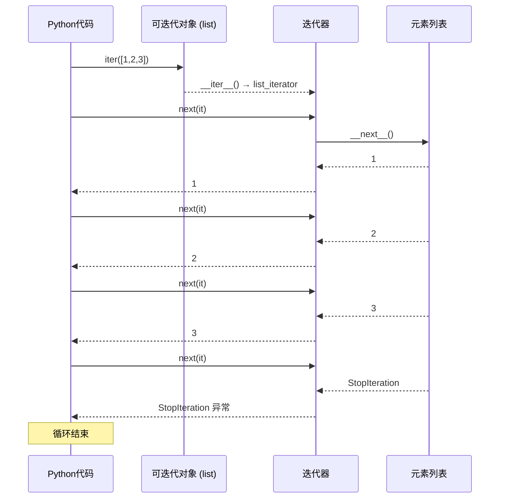
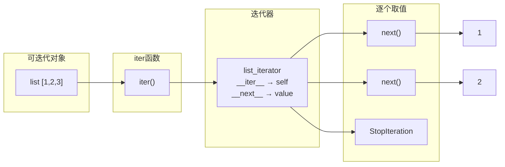
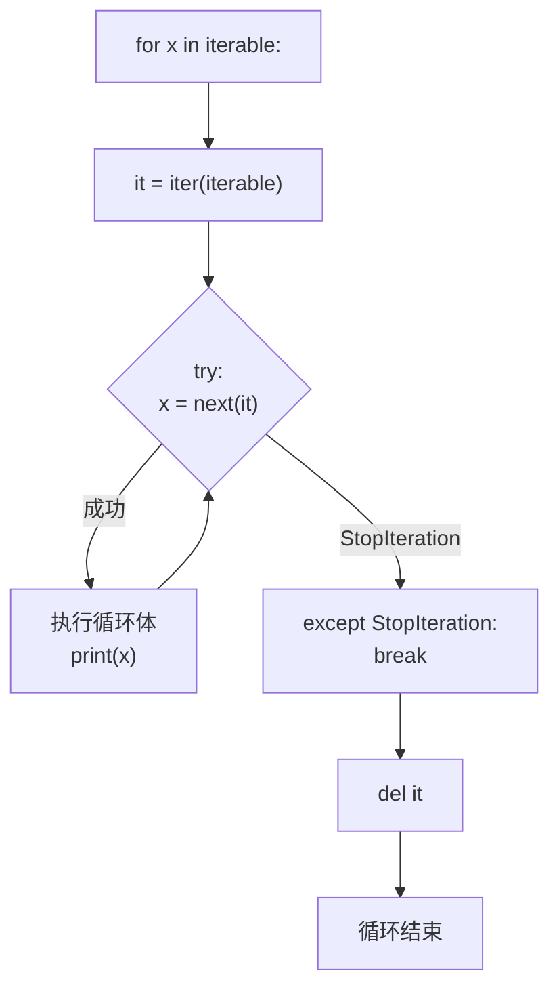
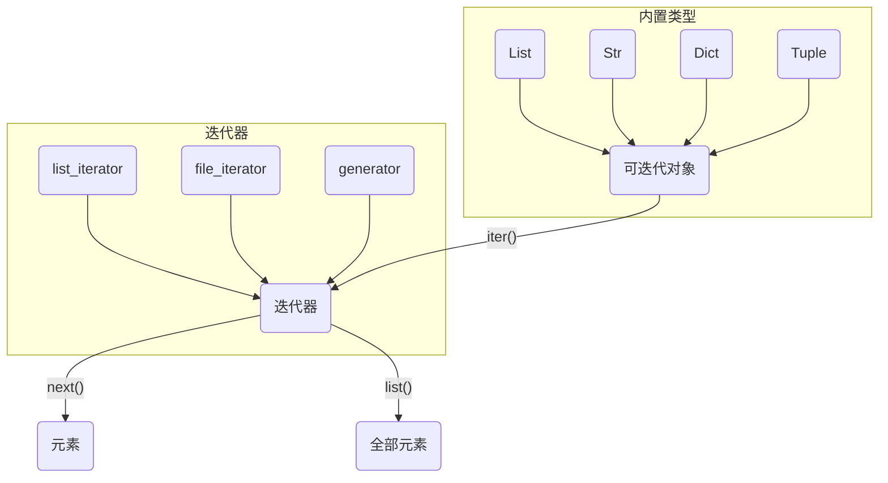

# Day 021 — 迭代器与可迭代对象 (Iterator & Iterable) 🔄

<!-- Updated 2026-06-15: Added for loop implementation details and __getitem__ fallback mechanism -->

## 概述

**迭代器（Iterator）** 和 **可迭代对象（Iterable）** 是 Python 中遍历数据的核心抽象。理解它们的关系和差异，是掌握 Python 数据流处理的关键一步。

> **一句话理解**：可迭代对象是"可以产生迭代器的东西"，迭代器是"可以逐个取值的东西"。

## 📚 可迭代对象 vs 迭代器 vs 生成器

### 三者的层次关系

```
┌──────────────────────────────────────┐
│          可迭代对象 (Iterable)         │
│  ┌──────────────────────────────────┐│
│  │        迭代器 (Iterator)          ││
│  │  ┌────────────────────────────┐  ││
│  │  │    生成器 (Generator)      │  ││
│  │  └────────────────────────────┘  ││
│  └──────────────────────────────────┘│
└──────────────────────────────────────┘
```

### 对比速查表

| 特性 | 可迭代对象 (Iterable) | 迭代器 (Iterator) | 生成器 (Generator) |
|------|----------------------|-------------------|-------------------|
| **可 for 循环** | ✅ | ✅ | ✅ |
| **有 `__iter__()`** | ✅ | ✅ | ✅ |
| **有 `__next__()`** | ❌ | ✅ | ✅ |
| **可多次遍历** | ✅ | ❌（只能一次） | ❌（只能一次） |
| **惰性求值** | ❌ | ✅ | ✅ |
| **使用 `yield`** | ❌ | ❌ | ✅ |
| **举例** | list, str, dict, tuple, set | iter([]), 文件句柄 | 生成器函数返回值 |

### 判断方法

```python
from collections.abc import Iterable, Iterator, Generator

# 检查
print(isinstance([1, 2, 3], Iterable))   # True
print(isinstance([1, 2, 3], Iterator))   # False
print(isinstance(iter([1, 2, 3]), Iterable))  # True
print(isinstance(iter([1, 2, 3]), Iterator))  # True
```

## 🏗️ 迭代器协议 (Iterator Protocol)

### 协议定义

迭代器协议由两个魔法方法组成：

| 方法 | 作用 | 返回值 |
|------|------|--------|
| `__iter__(self)` | 返回迭代器自身 | `self` |
| `__next__(self)` | 返回下一个元素 | 元素值，或抛出 `StopIteration` |

### 协议流程

```
可迭代对象          iter()          迭代器           next()          值
  list       ──────────────→   list_iterator  ──────────────→  元素
  str                          str_iterator                     ...
  dict                         dict_keyiterator                 StopIteration
```

### 完整契约

```python
class IteratorProtocol:
    """迭代器协议的完整契约"""

    def __iter__(self):
        """返回迭代器对象本身"""
        return self

    def __next__(self):
        """返回下一个元素，没有元素时抛出 StopIteration"""
        if self._exhausted:
            raise StopIteration
        # ... 返回下一个值
```

## 🔄 for 循环底层实现原理

### 等价代码

Python 的 `for x in iterable:` 语句底层实际上执行的是：

```python
# for x in iterable:
#     print(x)

# 等价于：
_iterator = iter(iterable)     # 1. 获取迭代器
while True:
    try:
        x = next(_iterator)     # 2. 逐个取值
    except StopIteration:       # 3. 捕捉结束信号
        break
    print(x)                    # 4. 执行循环体
del _iterator                   # 5. 清理迭代器
```

### 步骤详解

**步骤 1: `iter(iterable)`**
- 调用 `iterable.__iter__()` 或 `iterable.__getitem__(0)`（回退方案）
- 返回一个迭代器对象

**步骤 2-3: `next(iterator)` 和 `StopIteration`**
- 反复调用 `next(iterator)`（等价于 `iterator.__next__()`）
- 当迭代器耗尽时抛出 `StopIteration`，循环正常结束

**步骤 4-5: 循环体和清理**
- 每次迭代执行循环体代码
- 循环结束后删除迭代器引用（触发 GC）

### `__getitem__` 回退机制

如果对象没有 `__iter__()` 但有 `__getitem__()`，Python 会创建一个旧的序列迭代器：

```python
class OldStyleIterable:
    """旧式可迭代对象——只有 __getitem__"""
    def __init__(self, data):
        self.data = data

    def __getitem__(self, index):
        if index >= len(self.data):
            raise IndexError     # Python 捕获 IndexError 并转为 StopIteration
        return self.data[index]

# 仍然可以 for 循环！
for x in OldStyleIterable([1, 2, 3]):
    print(x)  # 1, 2, 3
```

> ⚠️ **注意**：`__getitem__` 是 Python 2 的遗留协议。Python 3 优先使用 `__iter__()`。推荐始终实现 `__iter__()`。

## 🔧 迭代器的惰性求值（Lazy Evaluation）

### 什么是惰性求值？

迭代器的核心优势是**惰性求值**——只在需要时才计算下一个值。这意味着：

1. **节省内存**：可以处理无限序列或超大文件
2. **节省CPU**：不需要一次性计算所有值
3. **支持无限数据流**：理论上可以永不停止

```python
# ❌ 列表：一次性加载所有数据到内存
all_lines = file.readlines()  # 大文件时内存爆炸

# ✅ 迭代器：逐行读取，每次只占一行内存
for line in file:             # file 本身是迭代器
    process(line)

# ❌ 列表推导式：立即生成全部结果
squares = [x**2 for x in range(10**7)]  # 内存爆炸！

# ✅ 迭代器：按需生成
squares = (x**2 for x in range(10**7))  # 几乎不占内存
```

### 无限迭代器

```python
class Counter:
    """无限递增的迭代器——演示惰性求值"""
    def __init__(self, start=0):
        self.current = start

    def __iter__(self):
        return self

    def __next__(self):
        result = self.current
        self.current += 1
        return result

# 永远不会构造完 10 亿个元素的列表
# 只会在 for 循环中逐个生成
counter = Counter()
for i, val in enumerate(counter):
    if i >= 10:
        break
    print(val)  # 0, 1, 2, ..., 9
```

## 🔗 itertools 标准库

### 核心函数速查

| 函数 | 作用 | 等价于 | 示例 |
|------|------|--------|------|
| `count(start, step)` | 无限等差数列 | `start, start+step, ...` | `count(10, 2)` → 10, 12, 14... |
| `cycle(iterable)` | 无限循环 | `A, B, C, A, B, C, ...` | `cycle('ABC')` → A, B, C, A... |
| `repeat(elem, n)` | 重复元素 n 次 | `elem, elem, ...` | `repeat(5, 3)` → 5, 5, 5 |
| `chain(*iters)` | 串联多个迭代器 | `a1, a2, b1, b2` | `chain('AB', 'CD')` → A, B, C, D |
| `zip_longest(*iters)` | 类似 zip 但以最长为准 | 填充 `fillvalue` | 见下方示例 |
| `islice(iter, start, stop)` | 迭代器切片 | 惰性切片 | `islice(count(), 5)` → 0-4 |
| `takewhile(pred, iter)` | 条件为真时取值 | | 从开头取直到条件不满足 |
| `dropwhile(pred, iter)` | 跳过条件为真的部分 | | 从条件不满足开始取 |
| `product(*iters)` | 笛卡尔积 | 嵌套 for | `product('AB', '12')` |
| `permutations(iter, r)` | 排列 | | |
| `combinations(iter, r)` | 组合 | | |
| `groupby(iter, key)` | 相邻元素分组 | | 类似 SQL GROUP BY |

### 实战示例

```python
import itertools

# 1. count + islice = 惰性切片
evens = itertools.count(start=0, step=2)
first_10 = list(itertools.islice(evens, 10))  # [0, 2, 4, ... 18]

# 2. cycle 实现轮询
servers = ['S1', 'S2', 'S3']
pool = itertools.cycle(servers)
assignments = [next(pool) for _ in range(7)]  # ['S1','S2','S3','S1','S2','S3','S1']

# 3. chain 合并多个迭代器
result = list(itertools.chain([1, 2], [3, 4], 'AB'))  # [1, 2, 3, 4, 'A', 'B']

# 4. zip_longest 处理不等长
a = [1, 2, 3]
b = ['a', 'b']
padded = list(itertools.zip_longest(a, b, fillvalue='N/A'))
# [(1, 'a'), (2, 'b'), (3, 'N/A')]

# 5. groupby 分组（必须已排序）
data = [('A', 1), ('A', 2), ('B', 3), ('B', 4)]
for key, group in itertools.groupby(data, key=lambda x: x[0]):
    print(key, list(group))  # A [(A,1),(A,2)]  B [(B,3),(B,4)]
```

## 🚨 常见陷阱与注意事项

### 陷阱 1: 迭代器只能遍历一次

```python
nums = iter([1, 2, 3])

# 第一次遍历：正常
for x in nums:
    print(x)  # 1, 2, 3

# 第二次遍历：什么都没有！
for x in nums:
    print(x)  # (无输出) — 迭代器已经耗尽

# ✅ 解决：需要重新创建迭代器
nums = iter([1, 2, 3])
```

### 陷阱 2: 在迭代时修改集合

```python
# ❌ RuntimeError: Set changed size during iteration
items = {1, 2, 3, 4, 5}
for item in items:
    if item % 2 == 0:
        items.remove(item)

# ✅ 正确做法：先复制再遍历
for item in list(items):  # list() 创建副本
    if item % 2 == 0:
        items.remove(item)
```

### 陷阱 3: 生成器被意外耗尽

```python
# 小心：传给多个函数可能导致意外耗尽
def check_positive(nums):
    return all(x > 0 for x in nums)

def sum_squares(nums):
    return sum(x**2 for x in nums)

data = (x for x in [1, 2, -3, 4])  # 生成器
print(check_positive(data))  # False（遍历到 -3 时停止）
print(sum_squares(data))     # 只得到 4²=16，因为生成器已部分耗尽！

# ✅ 改用列表
data = [1, 2, -3, 4]
```

### 陷阱 4: 递归迭代器的深层嵌套

```python
# chain 嵌套 chain：没问题，惰性的
deep = itertools.chain.from_iterable(
    itertools.chain.from_iterable(...)
)

# 但打印调试时会立即求值
list(deep)  # 小心内存！
```

## 🎨 Mermaid 图解

### 迭代器协议流程



### 可迭代对象 → 迭代器 → 元素



### for 循环底层等价代码流程图



### 常见迭代器关系



## 📝 思考题

1. 为什么迭代器遍历过一次后就不能再次遍历？设计上的考虑是什么？
2. 用自己的话说说 `__iter__()` 和 `__next__()` 方法的各自职责。
3. 实现一个迭代器来生成斐波那契数列——和递归版本、迭代版本比有什么优劣势？
4. `range()` 返回的是什么？是迭代器吗？用代码验证。
5. 如何实现一个"可暂停、可恢复"的迭代器？需要存储哪些状态？
6. `itertools.chain` 和 `+` 运算符拼接列表有什么区别？
7. 什么时候应该选择用迭代器而不是列表？什么时候反过来？
8. 请写出 `for x in obj:` 在 CPython 虚拟机中的完整执行步骤。

## 🔗 延伸阅读

- [PEP 234 — Iterators](https://peps.python.org/pep-0234/)
- [Python docs: Iterator Types](https://docs.python.org/3/library/stdtypes.html#iterator-types)
- [Python docs: itertools](https://docs.python.org/3/library/itertools.html)
- [Fluent Python — Chapter 17: Iterators, Generators, and Coroutines](https://www.oreilly.com/library/view/fluent-python-2nd/9781492056348/)
