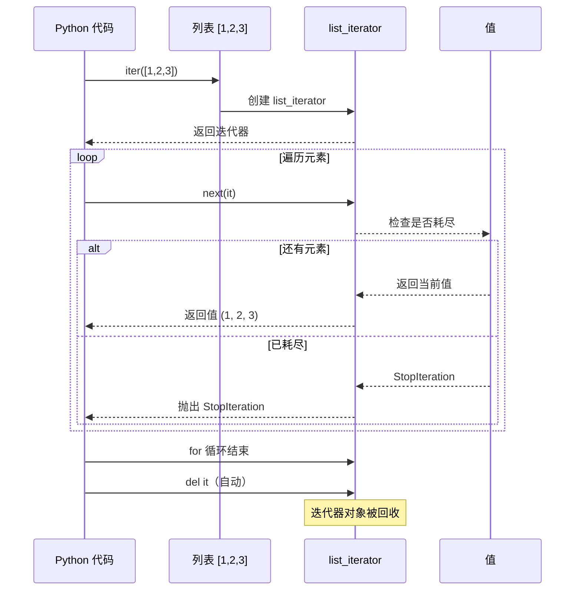
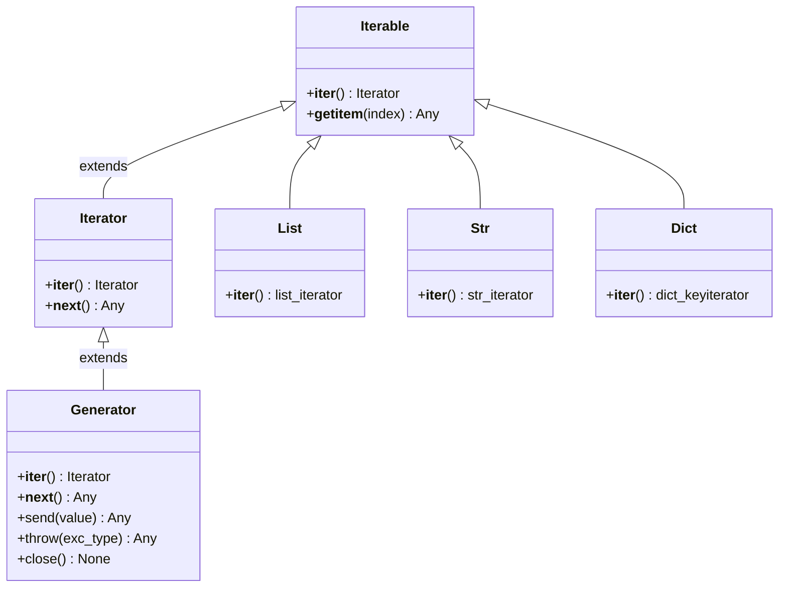

# Day 021 — 迭代器与可迭代对象原理图解

## 1. 迭代器协议流程图

### 完整的协议交互

```
┌──────────────────────────────────────────────────┐
│                  可迭代对象                        │
│  ┌────────────────────────────────────────────┐  │
│  │  __iter__(self) → 返回迭代器对象            │  │
│  │  或 __getitem__(self, index) → 按索引取值   │  │
│  └────────────────────────────────────────────┘  │
└──────────────────────┬───────────────────────────┘
                       │  iter()
                       ▼
┌──────────────────────────────────────────────────┐
│                   迭代器                           │
│  ┌────────────────────────────────────────────┐  │
│  │  __iter__(self) → return self              │  │
│  │  __next__(self) → return value             │  │
│  │                 → raise StopIteration      │  │
│  └────────────────────────────────────────────┘  │
└──────────────────────┬───────────────────────────┘
                       │  next()
                       ▼
              ┌─────────────────┐
              │    返回值        │
              │  或 StopIteration│
              └─────────────────┘
```

## 2. for 循环底层实现拆解

```
Python 代码:
    for x in iterable:
        print(x)

底层展开:
                         ┌──────────────────┐
                         │  开始 for 循环    │
                         └────────┬─────────┘
                                  │
                                  ▼
                     ┌────────────────────────┐
                     │  _it = iter(iterable)  │
                     │  # 调用 __iter__()     │
                     └────────┬───────────────┘
                              │
                              ▼
                     ┌────────────────────────┐
                     │  while True:           │
                     └────────┬───────────────┘
                              │
                              ▼
                     ┌────────────────────────┐
                     │  try:                  │
                     │    x = next(_it)       │
                     │    # 调用 __next__()   │
                     └────────┬───────────────┘
                              │
                    ┌─────────┴─────────┐
                    ▼                   ▼
           ┌────────────────┐  ┌──────────────────┐
           │ 没有异常        │  │ StopIteration    │
           │ 执行循环体      │  │ 跳出循环          │
           └───────┬────────┘  └────────┬─────────┘
                   │                    │
                   └──── 继续 ──────────┘
                                        │
                                        ▼
                              ┌──────────────────┐
                              │  del _it         │
                              │  # 清理迭代器    │
                              └──────────────────┘
```

## 3. 可迭代对象 vs 迭代器 关系

```
                    ┌─────────────────────┐
                    │   可迭代对象         │
                    │   Iterable          │
                    │                     │
                    │   可以 for 循环      │
                    │   有 __iter__()      │
                    │   iter(obj) 返回     │
                    └──────────┬──────────┘
                               │
             ┌─────────────────┼─────────────────┐
             │                 │                  │
             ▼                 ▼                  ▼
     ┌──────────────┐  ┌──────────────┐  ┌──────────────┐
     │    列表      │  │    字符串    │  │    字典      │
     │ [1, 2, 3]    │  │   "hello"    │  │  {"a": 1}    │
     │ list_iterator│  │  str_iterator│  │  dict_keys   │
     └──────────────┘  └──────────────┘  └──────────────┘

                    ┌─────────────────────┐
                    │     迭代器           │
                    │   Iterator          │
                    │                     │
                    │  有 __iter__() = self│
                    │  有 __next__()      │
                    │  只能用一次          │
                    │  惰性求值            │
                    └─────────────────────┘
```

## 4. 迭代器状态机

```
                    ┌─────────────────┐
                    │   初始状态       │
                    │  (还未取值)      │
                    └────────┬────────┘
                             │  __next__()
                             ▼
                    ┌─────────────────┐
                    │   激活状态       │◄────┐
                    │  (有值可取)      │     │
                    └────────┬────────┘     │
                             │  __next__()  │  __next__()
                             ▼              │
                    ┌─────────────────┐     │
                    │   激活状态       │─────┘
                    │  (下一个值)      │
                    └────────┬────────┘
                             │  __next__() → StopIteration
                             ▼
                    ┌─────────────────┐
                    │   耗尽状态       │
                    │  (无法再取值)    │
                    └─────────────────┘
```

## 5. 迭代器 vs 列表 内存对比

```
列表方式（立即求值）:
    range(1000000) → [0, 1, 2, ..., 999999]
                     ┌───────────────────────────────┐
                     │  ↓ 立即分配                    │
                     │  约 8MB 内存                   │
                     └───────────────────────────────┘

迭代器方式（惰性求值）:
    iter(range(1000000)) → <range_iterator>
                     ┌───────────────────────────────┐
                     │  ↓ 几乎不占内存                │
                     │  56 字节                      │
                     │  ↓ 逐个生成                    │
                     │  0 → 1 → 2 → ... → 999999    │
                     │  ↓ 用完即弃                    │
                     └───────────────────────────────┘
```

## 6. itertools 工具集关系图

```
                         itertools
                            │
        ┌───────────────────┼───────────────────┐
        │                   │                   │
   无限生成              拼接操作             筛选操作
        │                   │                   │
   ┌────┴────┐        ┌────┴────┐        ┌────┴────┐
   │ count   │        │ chain   │        │ islice  │
   │ cycle   │        │ zip_long│        │ takewhil│
   │ repeat  │        │         │        │ dropwhil│
   └─────────┘        └─────────┘        └─────────┘
                             │
                        ┌────┴────┐
                        │ 排列组合 │
                        │ product │
                        │ permu   │
                        │ comb    │
                        └─────────┘
```

## 7. 迭代器对象生命周期



## 8. 迭代器协议接口图


