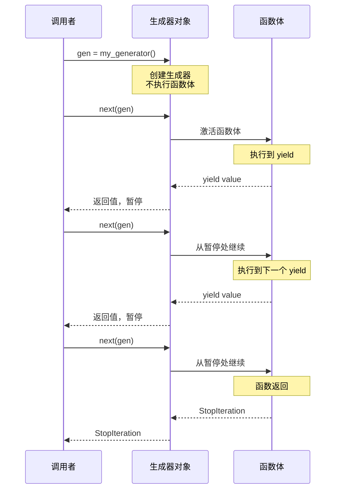
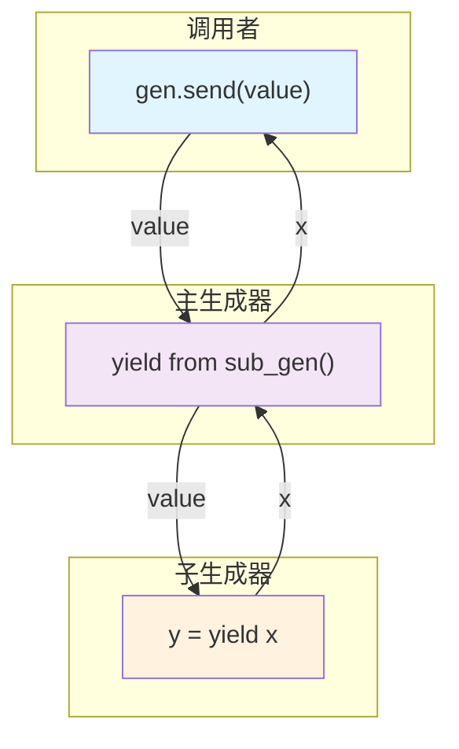

# Day 022 — 生成器 (Generator) ⚡

## 概述

**生成器（Generator）** 是 Python 中最优雅的惰性求值工具。它结合了迭代器的所有优点（惰性、节省内存），同时用 `yield` 关键字提供了极其简洁的语法。

> **一句话理解**：生成器是"可以暂停执行的函数"，每次 yield 都会保存当前状态，下次调用时从暂停处继续执行。

## 📚 生成器函数 vs 生成器表达式

### 生成器函数

用 `def` 定义，用 `yield` 返回值：

```python
def count_up_to(n):
    """生成 0 到 n-1"""
    i = 0
    while i < n:
        yield i
        i += 1
```

调用生成器函数返回一个**生成器对象**（Generator Object），不会立即执行函数体。

### 生成器表达式

用圆括号的推导式语法：

```python
# 生成器表达式（惰性）
squares = (x**2 for x in range(10))

# 对比：列表推导式（立即求值）
squares_list = [x**2 for x in range(10)]
```

### 对比速查

| 特性 | 生成器函数 | 生成器表达式 | 列表推导式 |
|------|-----------|-------------|-----------|
| **语法** | `def f(): yield x` | `(x for x in it)` | `[x for x in it]` |
| **求值时机** | 惰性（调用时） | 惰性（迭代时） | 立即 |
| **内存** | O(1) | O(1) | O(n) |
| **可重用** | 每次调用创建新的 | 每次求值创建新的 | 可重复使用 |
| **复杂逻辑** | ✅ 支持 | ❌ 仅简单表达式 | ❌ 仅简单表达式 |
| **多次 yield** | ✅ 支持 | ❌ 仅一次 | ❌ 仅一次 |

## ⚙️ yield 关键字原理（状态机模型）

### yield 的底层机制

Python 的生成器实际上是**编译为状态机的函数**。当 Python 编译器遇到 `yield` 关键字时，它会：

1. 将函数编译为 **生成器代码对象**
2. 生成器对象包含：
   - **`gi_frame`** — 当前栈帧（冻结的执行状态）
   - **`gi_running`** — 是否正在执行
   - **`gi_code`** — 代码对象
   - **`gi_yieldfrom`** — 如果使用了 `yield from`

### 状态机模型

```python
def demo():
    print("开始")
    yield 1
    print("继续")
    yield 2
    print("结束")
```

编译后的逻辑等价于：

```
状态机：
  ┌─────────┐
  │ 状态 0  │ → print("开始"), yield 1, 切换到 状态 1
  ├─────────┤
  │ 状态 1  │ → print("继续"), yield 2, 切换到 状态 2
  ├─────────┤
  │ 状态 2  │ → print("结束"), 返回/StopIteration
  └─────────┘
```

### 执行流程图

```
调用 gen = demo()      → 创建生成器对象，不执行任何代码
next(gen)              → 执行到第一个 yield：
                            print("开始")
                            yield 1 → 返回值 1，暂停
next(gen)              → 从暂停处继续：
                            print("继续")
                            yield 2 → 返回值 2，暂停
next(gen)              → 从暂停处继续：
                            print("结束")
                            → 函数返回 → StopIteration
```

### 函数 vs 生成器的栈帧对比

```
普通函数调用：
┌────────────────────────────┐
│  栈帧创建                   │
│  执行全部代码                │
│  栈帧销毁                   │
└────────────────────────────┘

生成器调用：
┌────────────────────────────┐
│  栈帧创建（冻结）            │
│  ...                        │
│  ┌──────────────────────┐  │
│  │ yield → 返回值       │  │  ← 暂停，栈帧保持在堆上
│  │ ...                  │  │
│  │ 从上次暂停处继续     │  │  ← 恢复执行
│  │ yield → 返回值       │  │  ← 再次暂停
│  └──────────────────────┘  │
│  函数返回 → StopIteration  │
│  栈帧销毁                   │
└────────────────────────────┘
```

## 🔧 生成器状态与 send()/throw()/close()

### 生成器生命周期

```
    gen = func()          next(gen)        next(gen)      StopIteration
    ┌────────┐          ┌────────┐       ┌────────┐       ┌────────┐
    │创建    │─────────→│ 挂起   │──────→│ 挂起   │──────→│ 结束   │
    │(GEN_CREATED)│      │(SUSPENDED)│   │(SUSPENDED)│    │(CLOSED)│
    └────────┘          └────────┘       └────────┘       └────────┘
                              ↑               ↑
                         send(value)     send(value)
```

| 方法 | 作用 | 说明 |
|------|------|------|
| `next(gen)` | 推进到下一个 yield | 等价于 `gen.send(None)` |
| `gen.send(value)` | 推进到下一个 yield并传入值 | `value` 作为当前 yield 表达式的返回值 |
| `gen.throw(exc)` | 在暂停处抛出异常 | 异常由 yield 处的 try/except 捕获 |
| `gen.close()` | 停止生成器 | 在暂停处抛出 `GeneratorExit` |

### send() 的两种设计模式

```python
# 模式 1: 协程 — 两次 yield 之间传递值
def echo():
    while True:
        received = yield  # 只接收，不发送
        print(f"收到: {received}")

gen = echo()
next(gen)           # 启动到第一个 yield
gen.send("Hello")   # 发送值
gen.send("World")

# 模式 2: 累加器 — 每次发送值，yield 返回累计结果
def accumulator():
    total = 0
    while True:
        value = yield total  # 发送累计值，接收新值
        total += value

gen = accumulator()
next(gen)                # 启动，返回 total=0
print(gen.send(10))      # total=10 → yield 10
print(gen.send(20))      # total=30 → yield 30
```

### throw() 和 close()

```python
def safe_generator():
    try:
        while True:
            yield 1
    except GeneratorExit:
        print("正在关闭...")
        # 可以执行清理操作
    except ValueError:
        print("收到 ValueError")

gen = safe_generator()
next(gen)          # 1
gen.throw(ValueError)  # "收到 ValueError"，然后继续 yield 1
gen.close()        # "正在关闭..."，然后停止
```

## 🔄 生成器 vs 迭代器对比

| 特性 | 迭代器 | 生成器 |
|------|--------|--------|
| **实现方式** | 手动定义类，实现 `__iter__` 和 `__next__` | 使用 `yield` 关键字的函数或表达式 |
| **代码量** | 较多（完整类定义） | 极少（一个函数） |
| **状态管理** | 手动维护（self.index 等） | 自动维护（栈帧冻结） |
| **send/throw/close** | 不支持 | 支持 |
| **yield from** | 不支持 | 支持 |
| **可读性** | 一般 | 优秀 |

```python
# 迭代器方式（手动管理状态）
class CountUp:
    def __init__(self, n):
        self.n = n
        self.i = 0
    def __iter__(self):
        return self
    def __next__(self):
        if self.i >= self.n:
            raise StopIteration
        val = self.i
        self.i += 1
        return val

# 生成器方式（自动管理状态）
def count_up(n):
    i = 0
    while i < n:
        yield i
        i += 1
```

## 💡 yield from 语法

### 基本用法

`yield from` 将迭代/生成的操作委托给子生成器，简化生成器的嵌套使用。

```python
def chain(*iterables):
    """chain 的生成器实现"""
    for it in iterables:
        yield from it  # 委托给子迭代器

# 对比原始写法
def chain_manual(*iterables):
    for it in iterables:
        for item in it:  # 需要手动嵌套循环
            yield item
```

### flatten 嵌套列表

```python
def flatten(items):
    """递归展开嵌套列表"""
    for item in items:
        if isinstance(item, (list, tuple)):
            yield from flatten(item)  # 递归委托
        else:
            yield item

# 测试
nested = [1, [2, [3, 4]], 5]
print(list(flatten(nested)))  # [1, 2, 3, 4, 5]
```

### yield from 的双向通信

`yield from` 的独特之处在于，它会在调用者和子生成器之间建立**双向通道**：

```python
def sub_gen():
    """子生成器"""
    received = yield "子-准备就绪"
    print(f"子: 收到 {received}")
    result = yield "子-处理完成"
    print(f"子: 收到 {result}")
    return "子-最终结果"

def main_gen():
    """主生成器，通过 yield from 委托给子生成器"""
    result = yield from sub_gen()
    print(f"主: 子返回了 {result}")

gen = main_gen()
print(next(gen))         # 启动 → 进入 sub_gen → "子-准备就绪"
print(gen.send("数据1"))  # 发送 → sub_gen → "子-处理完成"
try:
    gen.send("数据2")     # 发送 → sub_gen 返回 → 主生成器结束
except StopIteration:
    print("完成")
```

## 🎨 Mermaid 图解

### 生成器执行流程



### yield from 双向通道



## 📝 思考题

1. 生成器函数和普通函数在字节码层面有什么区别？
2. 什么时候应该用生成器表达式而不是列表推导式？
3. `yield` 和 `return` 在生成器函数中同时出现会发生什么？
4. 生成器在执行 `close()` 后还能继续使用吗？
5. `yield from` 和 `for item in sub:` 相比有什么优势？
6. 如何实现一个可重复使用的生成器？
7. 协程和生成器是什么关系？Python 中的 `async def` 和 `def` + `yield` 有什么联系？
8. 如果生成器函数中有多个 `yield` 语句，状态机会如何处理？

## 🔗 延伸阅读

- [PEP 255 — Simple Generators](https://peps.python.org/pep-0255/)
- [PEP 342 — Coroutines via Enhanced Generators](https://peps.python.org/pep-0342/)
- [PEP 380 — Syntax for Delegating to a Subgenerator](https://peps.python.org/pep-0380/)
- [Python docs: Generator Types](https://docs.python.org/3/library/stdtypes.html#generator-types)
- [Python docs: yield expression](https://docs.python.org/3/reference/expressions.html#yield-expressions)
