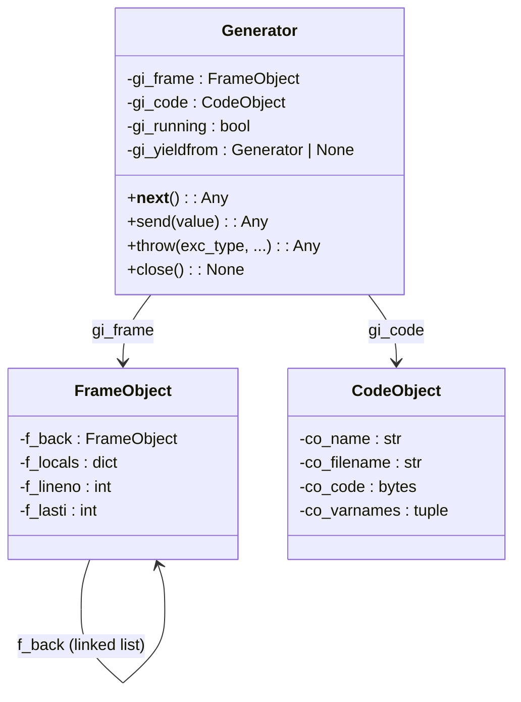
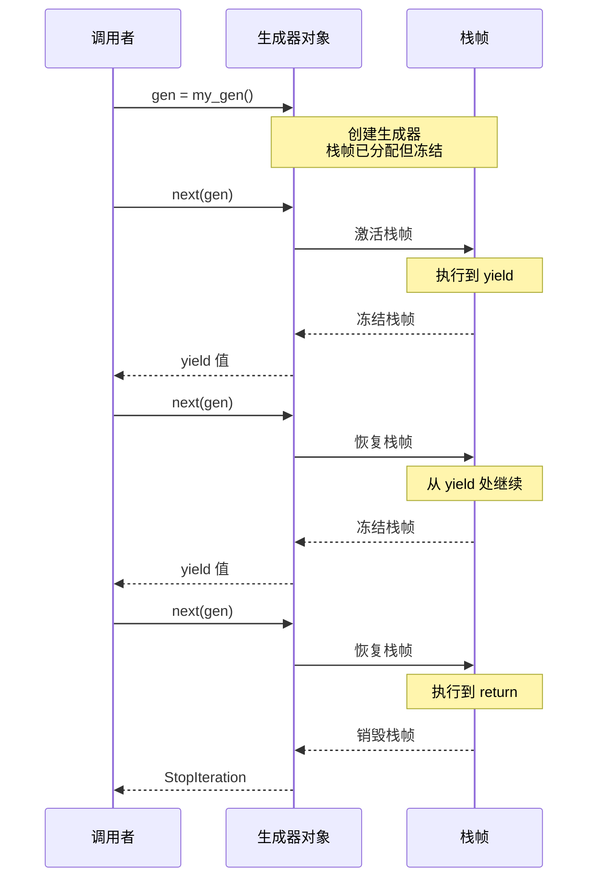

# Day 022 — 生成器原理图解

## 1. 生成器执行流程（yield 暂停/恢复）

```
生成器生命周期：

    创建生成器对象             next(gen) 调用          StopIteration
         │                        │                      │
         ▼                        ▼                      ▼
    ┌─────────┐            ┌─────────────┐          ┌─────────┐
    │ 冷冻态  │    next()  │   执行中     │  return  │ 结束态  │
    │ 不执行  │ ─────────→ │  ┌───────┐  │ ───────→ │ 关闭    │
    │ 代码    │            │  │yield  │  │          │         │
    └─────────┘            │  │暂停   │  │          └─────────┘
                           │  │保存栈 │  │
                           │  └───────┘  │
                           └──────┬──────┘
                                  │ next() 调用
                                  ▼
                           ┌─────────────┐
                           │   从断点     │
                           │   继续执行    │
                           │  ┌───────┐  │
                           │  │yield  │  │
                           │  │...    │  │
                           │  └───────┘  │
                           └─────────────┘
```

## 2. yield 状态机模型

```
代码:
    def my_gen():
        print("start")
        yield 1
        print("middle")
        yield 2
        print("end")

编译后内部状态机:

    ┌─────────────────────────────────────────────────────┐
    │                 生成器状态机                          │
    ├──────────┬──────────────────┬──────────────────────┤
    │ 状态编号 │   执行代码        │   下一状态            │
    ├──────────┼──────────────────┼──────────────────────┤
    │    0     │ print("start")   │ 暂停 → 状态 1        │
    │          │ yield 1          │ 返回值 1              │
    ├──────────┼──────────────────┼──────────────────────┤
    │    1     │ print("middle")  │ 暂停 → 状态 2        │
    │          │ yield 2          │ 返回值 2              │
    ├──────────┼──────────────────┼──────────────────────┤
    │    2     │ print("end")     │                      │
    │          │ return           │ StopIteration        │
    └──────────┴──────────────────┴──────────────────────┘

    执行流程:

    next() ──→ 状态 0 ──→ yield 1 ──→ next() ──→ 状态 1 ──→ yield 2
                  ↑                                             │
                  │                   next()                    │
                  └─────────────────────────────────────────────┘
                                                                 │
                                                            return ──→ StopIteration
```

## 3. send/throw/close 交互

```
调用者                            生成器
  │                                │
  │  next(gen)                     │
  │ ──────────────────────────────→│  进入生成器，执行到 yield
  │                                │  print("...")
  │                                │  yield value
  │ ←──────────────────────────────│  返回 value，暂停
  │                                │
  │  gen.send(data)                │
  │ ──────────────────────────────→│  yield 表达式求值为 data
  │                                │  继续执行到下一个 yield
  │                                │  yield value2
  │ ←──────────────────────────────│  返回 value2，暂停
  │                                │
  │  gen.throw(ValueError)         │
  │ ──────────────────────────────→│  在 yield 处抛出 ValueError
  │                                │  try/except 处理或传播
  │                                │  如果处理了→继续 yield
  │ ←──────────────────────────────│  或异常穿透到调用者
  │                                │
  │  gen.close()                   │
  │ ──────────────────────────────→│  在 yield 处抛出 GeneratorExit
  │                                │  finally 执行清理
  │                                │  生成器关闭
```

## 4. yield from 双向通道

```
调用者 ─── send(value) ──→ 主生成器 ── yield from ──→ 子生成器
                              │                           │
                              │                           │
  调用者 ←── return_val ←── yield from ←── yield val ←───│

  实际上 yield from 打通了一条双向通道：
  - 调用者的 send() 直接传到子生成器的 yield 表达式
  - 子生成器的 yield 值直接返回到调用者
  - 子生成器的 return 值作为 yield from 表达式的值

  示例流程:
  def main():
      result = yield from sub()
      # result = "子返回的值"

  def sub():
      x = yield "准备就绪"
      # x = 调用者 send("数据")
      return "完成"

  调用者          main()            sub()
    │               │                │
    │ next()        │                │
    │──────────────→│                │
    │               │───────────────→│ (进入 sub)
    │               │                │ yield "准备就绪"
    │               │←───────────────│
    │←──────────────│
    │               │                │
    │ send("数据")  │                │
    │──────────────→│                │
    │               │───────────────→│ (x = "数据")
    │               │                │ return "完成"
    │               │←───────────────│
    │               │ result = "完成" │
    │               │ return         │
    │←──────────────│
```

## 5. 生成器 vs 迭代器 vs 列表 内存对比

```
生成 1 到 1000000 的平方数:

列表方式 (内存 O(n)):
    [1, 4, 9, 16, ..., 10^12]
    ┌────────────────────────────────────────────┐
    │ 所有值同时存在内存中                         │
    │ 约 28MB 内存                                │
    │ 随时可访问任意元素                           │
    └────────────────────────────────────────────┘

迭代器方式 (内存 O(1)):
    <list_iterator object>
    ┌────────────────────────────────────────────┐
    │ 几乎不占内存                                │
    │ 逐个产生值，用完即弃                         │
    │ 只能遍历一次                                │
    └────────────────────────────────────────────┘

生成器方式 (内存 O(1)):
    <generator object>
    ┌────────────────────────────────────────────┐
    │ 几乎不占内存                                │
    │ 惰性求值，按需计算                           │
    │ 代码最简洁                                  │
    │ 支持 send/throw/close                       │
    └────────────────────────────────────────────┘
```

## 6. 生成器在数据管道中的应用

```
数据流:
    ┌──────┐    ┌──────┐    ┌──────┐    ┌──────┐
    │ 读取  │───→│ 过滤  │───→│ 转换  │───→│ 输出  │
    │ 生成器│    │ 生成器│    │ 生成器│    │ 使用  │
    └──────┘    └──────┘    └──────┘    └──────┘
         │          │          │          │
         │          │          │          │
         ▼          ▼          ▼          ▼
     逐行读取    条件筛选   数据转换    汇总/存储
     内存: 1行   内存: 1行  内存: 1行    内存: 1行

    整个管道任何时候都只有 1 行数据在内存中！
```

## 7. 协程 vs 子例程 vs 生成器

```
子例程（普通函数）

    A() 调用 ──→ 进入 B()
                  B() 从头到尾执行
                  B() 返回 ──→ A() 继续
    A() 结束

    特点: 一次进入，一次退出

生成器（带 yield）

    调用 gen() ──→ 创建生成器对象
    next(gen) ──→ 进入函数体
                   执行到 yield ──→ 暂停并返回值
    next(gen) ──→ 从暂停处继续
                   执行到 yield ──→ 暂停
    next(gen) ──→ 从暂停处继续
                   函数返回 ──→ StopIteration

    特点: 多次进入退出，状态保持

协程（带 send/throw）

    next(coro) ──→ 启动
    coro.send(x) ──→ 发送数据并继续
                      处理数据
                      yield result ──→ 返回结果并暂停
    coro.send(y) ──→ 再次发送

    特点: 双向通信，数据可以流入流出
```

## 8. 生成器属性结构



## 9. 生成器生命周期（Mermaid 序列图）



## 10. 生成器表达式 AST 结构

```
生成器表达式: (x**2 for x in range(10))

         GeneratorExp
         /          \
     Name('x')    comp_iter
                    |
                 comp_for
                /        \
          Name('x')   comp_iter
                       |
                    call_function
                    /           \
              Name('range')  Num(10)
```
