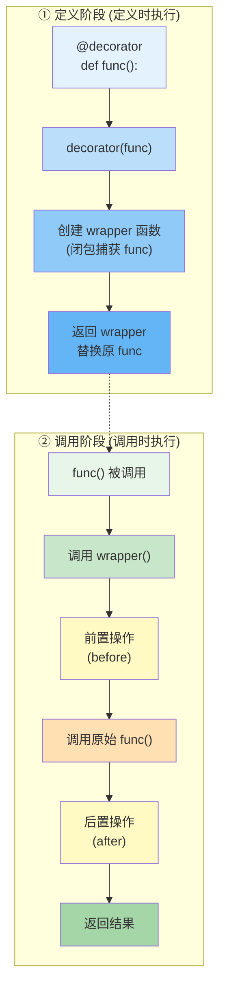
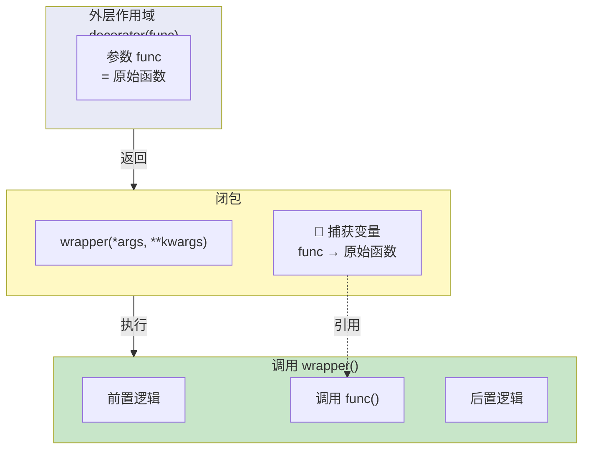
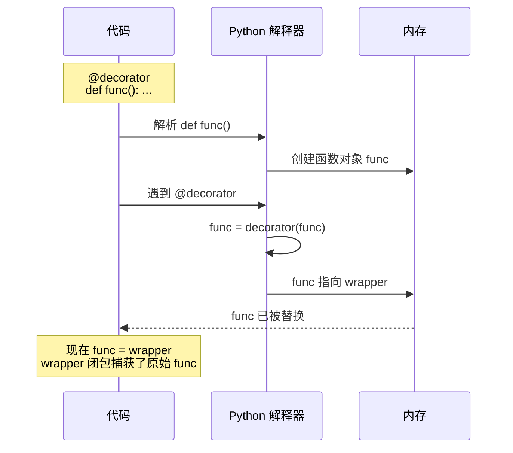
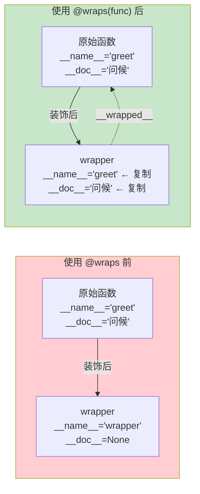
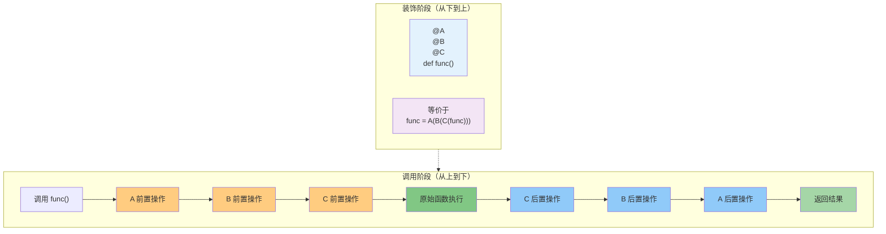
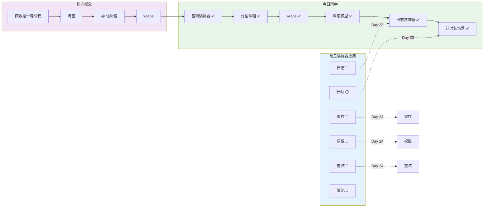

# Day 023 — 装饰器入门 图解

## 1. 装饰器执行流程



---

## 2. 闭包与作用域链



---

## 3. 语法糖 @ 等价还原



---

## 4. functools.wraps 工作原理



---

## 5. 装饰器顺序：洋葱模型



---

## 6. 装饰器应用场景概览



---

## 7. 装饰器 API 对比图

```mermaid
mindmap
  root((装饰器))
    基础概念
      函数是一等公民
      闭包
      @ 语法糖
      functools.wraps
    创建方式
      函数装饰器
        def decorator(func):
        def wrapper():
     类装饰器
        __call__
        __init__
    执行机制
      定义时执行
      洋葱模型
      自下而上装饰
      自上而下执行
    陷阱
      忘记 wraps
      返回值假设
      类方法装饰
      带参数 vs 不带参数
    实战应用
      日志
      计时
      缓存
      权限检查
      重试机制
      输入验证
      单例模式
```
