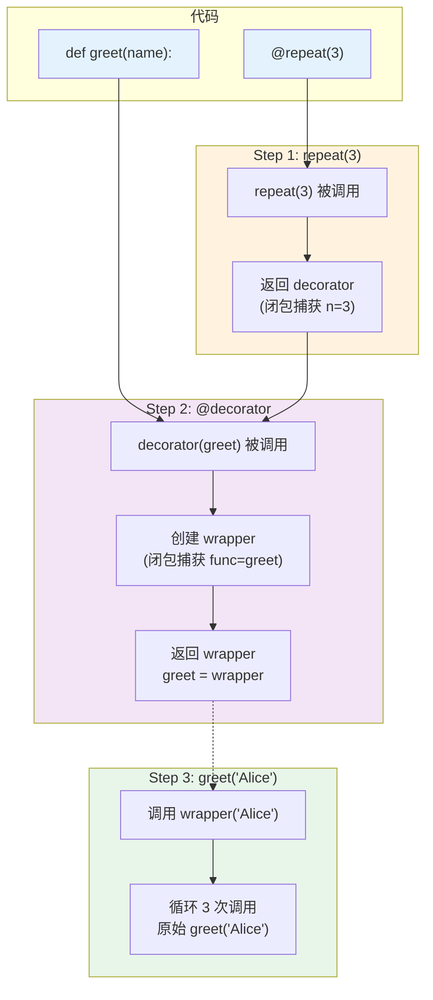
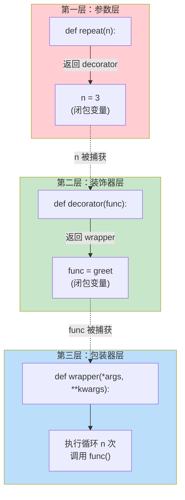
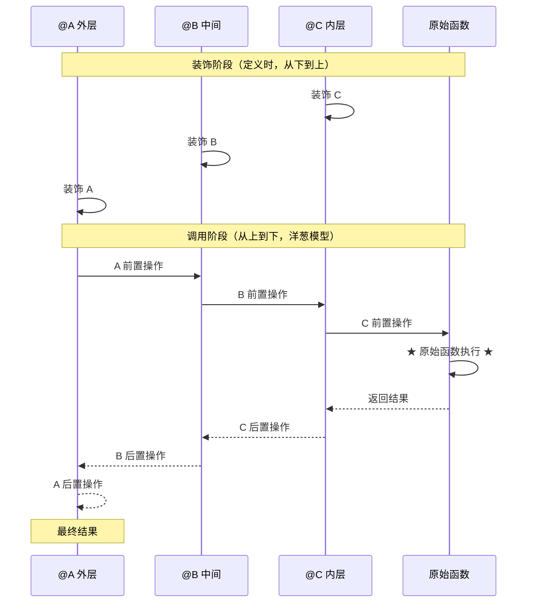
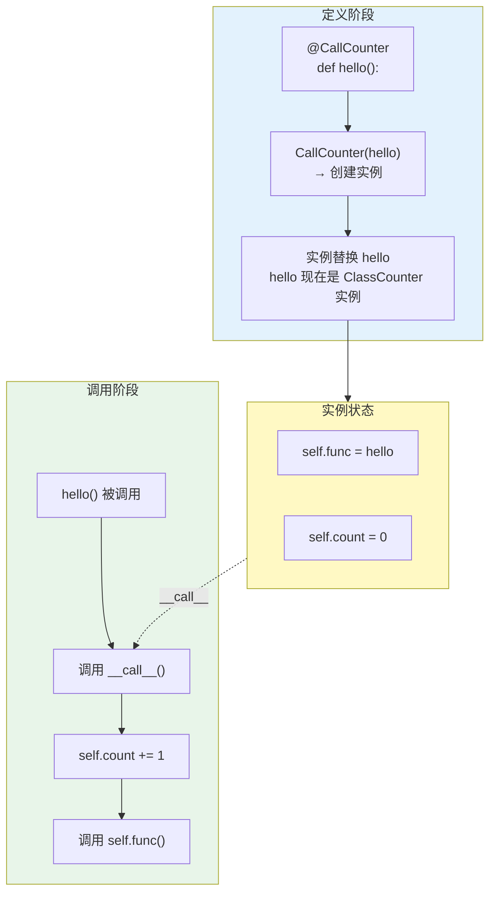
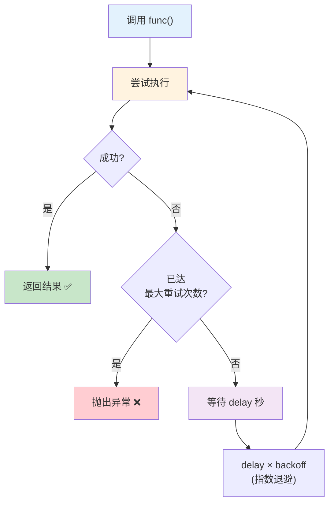
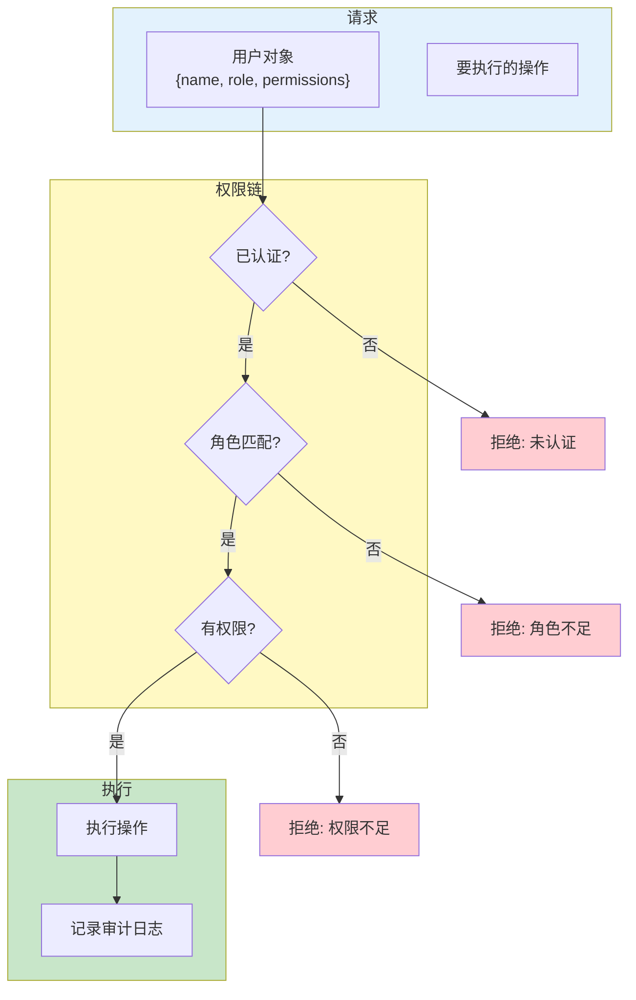
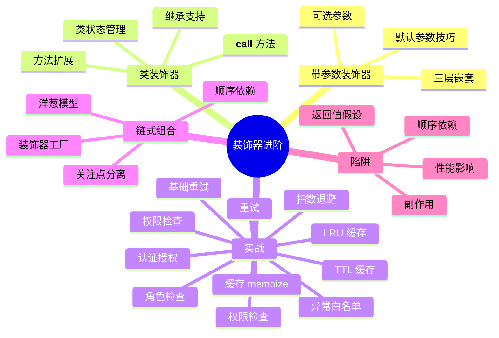

# Day 024 — 装饰器进阶 图解

## 1. 带参数装饰器执行流程



---

## 2. 三层嵌套结构详解



---

## 3. 多层装饰器链执行顺序



---

## 4. 类装饰器工作机制



---

## 5. 缓存装饰器工作原理

```mermaid
flowchart TD
    subgraph Input["输入"]
        ARGS["fibonacci(10)"]
    end

    subgraph Cache["缓存层 (memoize)"]
        CHECK{缓存中有<br/> (10) 吗?}
        HIT["✅ 命中<br/>返回缓存值"]
        MISS["❌ 未命中<br/>调用原始函数"]
        STORE["存储结果到缓存<br/>cache[(10)] = 55"]
    end

    subgraph Func["原始函数"]
        EXEC["执行 fibonacci(10)"]
        RESULT["返回 55"]
    end

    ARGS --> CHECK
    CHECK -->|有| HIT
    CHECK -->|没有| MISS
    MISS --> EXEC
    EXEC --> RESULT
    RESULT --> STORE
    STORE --> HIT
    HIT --> Output["输出: 55"]

    style Cache fill:#fff9c4
    style Func fill:#c8e6c9
    style HIT fill:#a5d6a7
    style MISS fill:#ffcdd2
```

---

## 6. 重试装饰器工作流



---

## 7. 权限装饰器架构



---

## 8. 装饰器链组合全景


