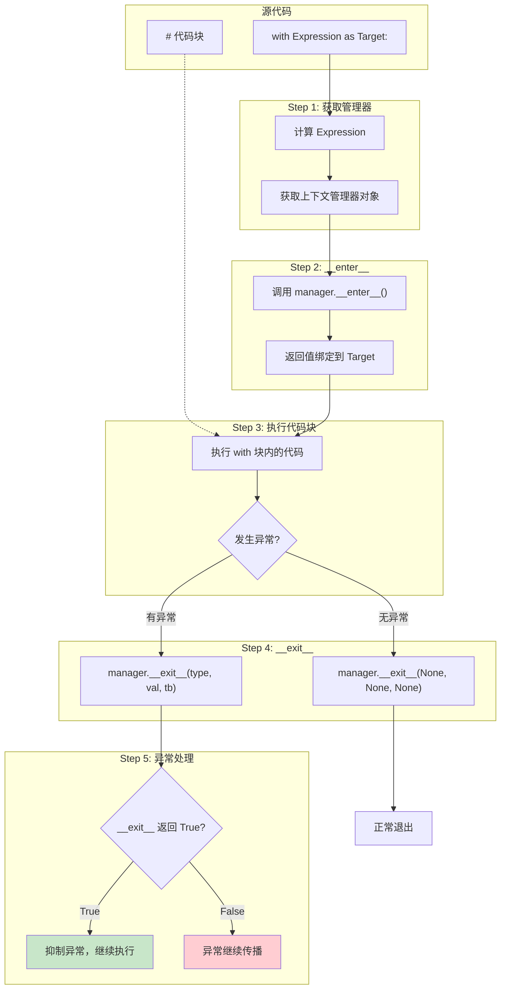
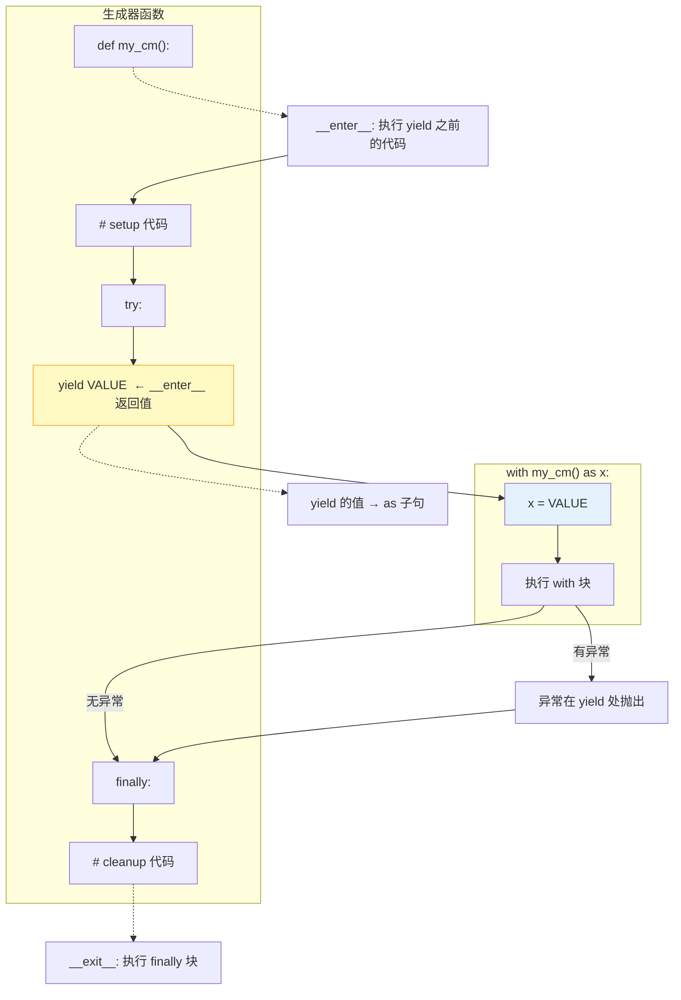
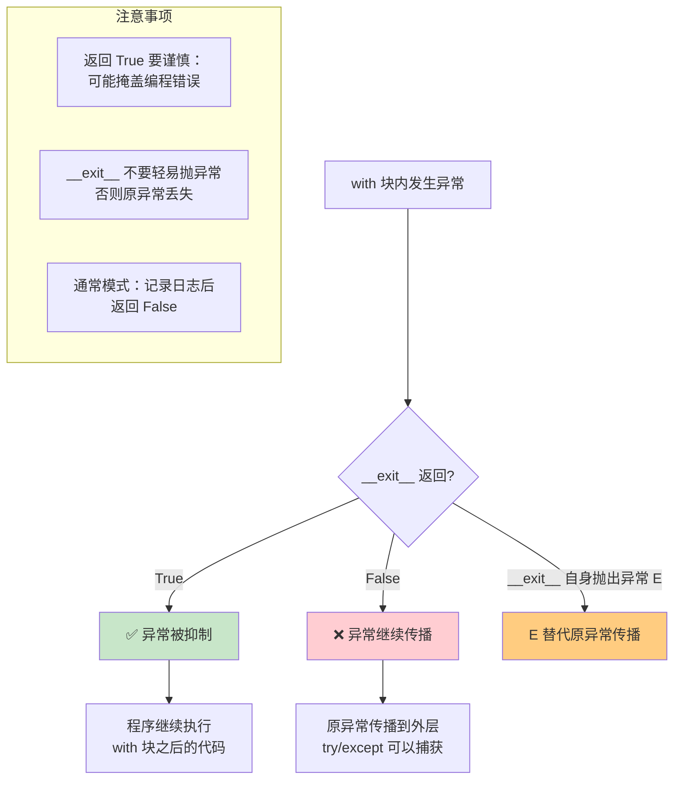
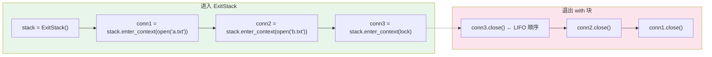

# Day 025 — 上下文管理器 图解

## 1. with 语句执行流程



## 2. @contextmanager 生成器模式



## 3. __exit__ 异常处理决策树



## 4. 上下文管理器分层图

```text
┌─────────────────────────────────────────────────────┐
│                 Python 上下文管理器体系                │
├─────────────────────────────────────────────────────┤
│                                                     │
│  ┌─────────────────────────────────────────────┐   │
│  │        核心协议 (PEP 343)                    │   │
│  │  __enter__(self)  → 返回值绑定到 as          │   │
│  │  __exit__(self, exc_type, exc_val, exc_tb)  │   │
│  │     → 返回 bool 决定是否抑制异常              │   │
│  └─────────────────────────────────────────────┘   │
│                                                     │
│  ┌─────────────────────────────────────────────┐   │
│  │       标准库 contextlib 模块                  │   │
│  │                                             │   │
│  │  @contextmanager    生成器方式实现            │   │
│  │  closing(obj)       调用 obj.close()         │   │
│  │  suppress(*excs)    忽略指定异常             │   │
│  │  redirect_stdout    重定向 print 输出        │   │
│  │  redirect_stderr    重定向 stderr            │   │
│  │  ExitStack          动态管理多个管理器       │   │
│  │  nullcontext()      空操作上下文             │   │
│  │  ContextDecorator   装饰器+上下文二合一       │   │
│  └─────────────────────────────────────────────┘   │
│                                                     │
│  ┌─────────────────────────────────────────────┐   │
│  │       内置上下文管理器                        │   │
│  │                                             │   │
│  │  open()            文件操作                  │   │
│  │  threading.Lock    线程锁                   │   │
│  │  subprocess.Popen  子进程                   │   │
│  │  socket.socket     网络套接字               │   │
│  │  decimal.localcontext 十进制上下文          │   │
│  └─────────────────────────────────────────────┘   │
│                                                     │
│  ┌─────────────────────────────────────────────┐   │
│  │       异步上下文管理器 (Python 3.5+)          │   │
│  │  __aenter__(self)                            │   │
│  │  __aexit__(self, exc_type, exc_val, exc_tb)  │   │
│  │  @asynccontextmanager                        │   │
│  │  async with expr as var:                     │   │
│  └─────────────────────────────────────────────┘   │
│                                                     │
└─────────────────────────────────────────────────────┘
```

## 5. with 语句的伪代码解释

```text
with EXPRESSION as TARGET:
    BLOCK
```

等价于：

```text
manager = (EXPRESSION)          # 计算表达式得到管理器
value = manager.__enter__()     # 调用 __enter__
TARGET = value                  # 绑定到 as 目标
exc = True                      # 标记是否有异常
try:
    BLOCK                       # 执行代码块
    exc = False                 # 无异常
except:
    exc = True                  # 有异常
    if not manager.__exit__(*sys.exc_info()):
        raise                   # __exit__ 返回 False，继续传播
finally:
    if not exc:
        manager.__exit__(None, None, None)  # 无异常时正常退出
```

注意：实际 CPython 实现更复杂（使用特殊的 `SETUP_WITH` 字节码），
但上述伪代码准确地反映了语义。

## 6. ExitStack 动态管理架构



## 7. 异常在 __exit__ 中的传播路径

```text
场景 A：正常退出
  with块 ──(无异常)──→ __exit__(None, None, None)
                               │
                               ↓
                        返回 False → 正常继续

场景 B：异常被抑制
  with块 ──(ZeroDivisionError)──→ __exit__(ZeroDivisionError, ..., ...)
                                           │
                                    返回 True
                                           │
                                           ↓
                                    异常被抑制
                                    程序继续

场景 C：异常被传播
  with块 ──(ValueError)──→ __exit__(ValueError, ..., ...)
                                     │
                              返回 False
                                     │
                                     ↓
                              ValueError 继续传播
                              try/except 可以捕获

场景 D：异常被替换
  with块 ──(ValueError)──→ __exit__(ValueError, ..., ...)
                                     │
                              __exit__ 自身抛出 RuntimeError
                                     │
                                     ↓
                              RuntimeError 替代 ValueError
                              原 ValueError 丢失 (__context__ 中)
```
