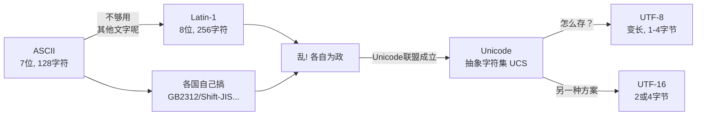
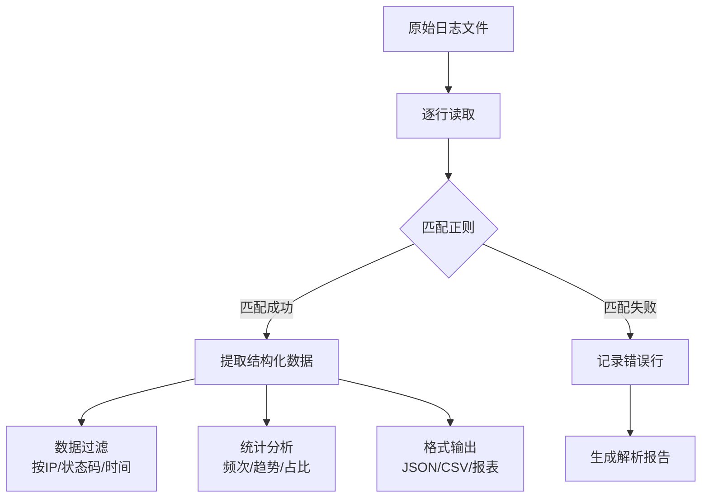

# Day 026 — 字符串高级 🎯

## 📖 学习目标

- 理解正则表达式的核心概念与匹配原理
- 掌握 `re` 模块所有核心 API 及用法
- 理解字符编码的发展历程与 Python 的编码模型
- 掌握字符串编码/解码的正确姿势
- 实战：日志解析器与数据提取工具

---

## 一、正则表达式入门

### 1.1 什么是正则表达式？

正则表达式（Regular Expression，简称 regex/re）是一种**描述字符串模式的语言**。它允许你通过一个有特定语法规则的表达式来描述一类字符串，而非一个个精确匹配。

**核心思想**：模式匹配（Pattern Matching）

> 你写的是规则，而不是具体字符串。正则引擎拿着你的规则去文本中查找所有符合该规则的子串。

```text
规则："\d{3,4}-\d{7,8}"
匹配：010-12345678、021-87654321、0571-88886666
不匹配：12345（没短横线）、010-123（号码太短）
```

### 1.2 为什么需要正则表达式？

| 场景 | 不用正则 | 用正则 |
|------|---------|--------|
| 验证邮箱 | 几十行 if-else 判断@和.的位置 | `r'^[\w.+-]+@[\w-]+\.[\w.]+$'` 一行搞定 |
| 提取手机号 | 遍历字符找连续数字 | `r'1[3-9]\d{9}'` |
| 替换敏感词 | 手动查找替换 | `re.sub(pattern, '***', text)` |
| 日志解析 | 逐行 split 再判断格式 | 一行正则提取所有字段 |

### 1.3 元字符速查表

正则表达式的核心是**元字符**（Metacharacters）——有特殊含义的字符。

#### 基本匹配字符

| 元字符 | 含义 | 示例 | 匹配 |
|--------|------|------|------|
| `.` | 匹配任意单个字符（除换行） | `h.t` | hat, hot, hut |
| `\w` | 单词字符（字母+数字+下划线） | `\w+` | hello, user_123 |
| `\d` | 数字 | `\d{4}` | 2024, 1024 |
| `\s` | 空白字符（空格、制表符、换行） | `name\s+value` | name value |
| `\b` | 单词边界 | `\bword\b` | 精确匹配 word |
| `^` | 字符串开头 | `^Hello` | 以 Hello 开头 |
| `$` | 字符串结尾 | `end$` | 以 end 结尾 |

#### 量词

| 量词 | 含义 | 示例 | 匹配 |
|------|------|------|------|
| `*` | 0 次或多次 | `ab*c` | ac, abc, abbc |
| `+` | 1 次或多次 | `ab+c` | abc, abbc（不匹配ac） |
| `?` | 0 次或 1 次 | `colou?r` | color, colour |
| `{n}` | 恰好 n 次 | `\d{4}` | 2024 |
| `{n,}` | 至少 n 次 | `\d{3,}` | 123, 456789 |
| `{n,m}` | n 到 m 次 | `\d{2,4}` | 12, 123, 1234 |

#### 字符类

| 语法 | 含义 | 示例 |
|------|------|------|
| `[abc]` | a、b、c 中任意一个 | `[aeiou]` 匹配元音字母 |
| `[a-z]` | a 到 z 范围内任意一个 | `[A-Za-z]` 匹配任意字母 |
| `[^abc]` | 除 a、b、c 之外的任意字符 | `[^0-9]` 匹配非数字 |
| `a\|b` | 匹配 a 或 b | `cat\|dog` 匹配 cat 或 dog |

#### 分组与捕获

| 语法 | 含义 | 示例 |
|------|------|------|
| `(abc)` | 捕获分组 | 提取匹配的子串 |
| `(?:abc)` | 非捕获分组 | 只分组但不提取 |
| `\1` | 反向引用 | 引用第 1 个分组 |
| `(?P<name>...)` | 命名分组 | 按名字引用分组 |

### 1.4 匹配模式（Flags）

| 模式 | 缩写 | 含义 |
|------|------|------|
| `re.IGNORECASE` | `re.I` | 忽略大小写 |
| `re.MULTILINE` | `re.M` | 多行模式，`^` `$` 匹配每行 |
| `re.DOTALL` | `re.S` | `.` 匹配包括换行在内的所有字符 |
| `re.VERBOSE` | `re.X` | 允许正则中添加注释和空白 |
| `re.ASCII` | `re.A` | 让 `\w` `\d` `\s` 只匹配 ASCII |

---

## 二、re 模块详解

### 2.1 re 模块的函数 vs 编译对象

re 模块提供两种使用方式：

**方式一：直接调用模块函数**

```python
result = re.search(pattern, string)
```

每次调用都会编译正则 → 适合只用一两次的场景。

**方式二：先编译，后使用**

```python
pat = re.compile(pattern)
result = pat.search(string)
```

预编译 → 适合重复使用的正则，性能更好。

### 2.2 核心 API 速查表

| API | 功能 | 返回类型 | 示例 |
|-----|------|---------|------|
| `re.search(p, s)` | 搜索第一个匹配位置 | `Match\|None` | 是否包含 |
| `re.match(p, s)` | 从开头匹配 | `Match\|None` | 是否以...开头 |
| `re.fullmatch(p, s)` | 整个字符串精确匹配 | `Match\|None` | 完全匹配验证 |
| `re.findall(p, s)` | 找到所有匹配 | `list[str\|tuple]` | 提取所有 |
| `re.finditer(p, s)` | 迭代所有匹配 | `Iterator[Match]` | 大量匹配时高效 |
| `re.sub(p, r, s)` | 替换匹配内容 | `str` | 替换/脱敏 |
| `re.subn(p, r, s)` | 替换并返回替换次数 | `(str, int)` | 统计替换次数 |
| `re.split(p, s)` | 按模式分割 | `list[str]` | 高级 split |
| `re.compile(p)` | 编译正则 | `Pattern` | 预编译重用 |

### 2.3 Match 对象详解

`re.search()` 和 `re.match()` 返回的 `Match` 对象包含丰富的匹配信息：

```python
m = re.search(r'(\d{4})-(\d{2})-(\d{2})', '日期: 2026-06-17')
```

| 方法/属性 | 说明 | 示例结果 |
|-----------|------|---------|
| `m.group()` | 整个匹配 | `'2026-06-17'` |
| `m.group(1)` | 第 1 个分组 | `'2026'` |
| `m.groups()` | 所有分组元组 | `('2026', '06', '17')` |
| `m.groupdict()` | 命名分组字典 | `{'year': '2026', ...}` |
| `m.start()` | 匹配起始位置 | 3 |
| `m.end()` | 匹配结束位置 | 13 |
| `m.span()` | 匹配范围 `(start, end)` | (3, 13) |
| `m.string` | 原始字符串 | `'日期: 2026-06-17'` |

### 2.4 贪婪与非贪婪

这是正则初学者最容易踩的坑之一。

```python
import re

text = '<div>内容1</div><div>内容2</div>'

# 贪婪模式（默认） → 尽可能多的匹配
greedy = re.findall(r'<div>(.*)</div>', text)
print(greedy)  # ['内容1</div><div>内容2']  ⚠️ 不是我们想要的！

# 非贪婪模式 → 在 量词 后加 ?
non_greedy = re.findall(r'<div>(.*?)</div>', text)
print(non_greedy)  # ['内容1', '内容2'] ✅ 正确！
```

**原理**：正则引擎默认是贪婪的——在保证整体匹配的前提下，`*` `+` `{}` 等量词会尽可能多匹配字符。加 `?` 后变为非贪婪，尽可能少匹配。

### 2.5 性能注意事项

| 陷阱 | 说明 | 解决方案 |
|------|------|---------|
| 灾难性回溯 | `(a+)+b` 匹配 `aaaaaac` 导致指数级回溯 | 用原子分组或避免嵌套量词 |
| 过度使用 `.` | 先用 `.` 再限制边界，容易性能差 | 精确描述字符范围 |
| 不加 `r` 前缀 | 反斜杠被 Python 转义 | 始终用 `r'raw string'` |
| 预编译缺失 | 循环中每次调用都会编译 | 循环外 `re.compile()` |

---

## 三、字符串编码（ASCII / Unicode / UTF-8）

### 3.1 为什么需要编码？

计算机只能存 0 和 1。要让计算机显示文字，必须建立 **字符 ↔ 二进制** 的映射表。这个映射表就是**字符编码**。

### 3.2 编码发展简史



### 3.3 ASCII

- **范围**：0-127（7 位二进制）
- **包含**：英文字母、数字、标点、控制字符
- **特点**：所有字符占 1 字节，最高位为 0
- **局限**：只有英文，其他语言文字无法表示

```python
print(ord('A'))   # 65
print(chr(65))    # 'A'
print(bin(65))    # '0b1000001' → 7位足够
```

### 3.4 Unicode

Unicode 是一个**字符集**（Character Set），不是编码方式。它给世界上几乎所有字符分配了一个唯一的数字编号——**码点**（Code Point）。

```text
字符 'A'   → U+0041
字符 '中'  → U+4E2D
字符 '😊'  → U+1F60A
```

Python 3 的 `str` 内部就是 Unicode 码点序列。

### 3.5 UTF-8

UTF-8 是 Unicode 的**具体存储实现方式**，特点是**变长编码**：

| 码点范围 | UTF-8 字节序列 | 字节数 |
|----------|---------------|--------|
| U+0000 ~ U+007F | `0xxxxxxx` | 1 字节 |
| U+0080 ~ U+07FF | `110xxxxx 10xxxxxx` | 2 字节 |
| U+0800 ~ U+FFFF | `1110xxxx 10xxxxxx 10xxxxxx` | 3 字节 |
| U+10000 ~ U+10FFFF | `11110xxx 10xxxxxx 10xxxxxx 10xxxxxx` | 4 字节 |

**UTF-8 的设计精妙之处**：

1. **与 ASCII 完全兼容** — ASCII 字符的 UTF-8 编码就是字节本身
2. **自同步** — 从任意位置都能识别字符边界（看字节高位即可）
3. **无 BOM 问题** — 不依赖字节序标记
4. **空间效率高** — 英文 1 字节，中文 3 字节

### 3.6 Python 的编码模型

Python 3 最关键的改变之一：**`str` 存 Unicode，`bytes` 存原始字节**。

```mermaid
graph LR
    subgraph 编码 encode
        A[str<br/>Unicode字符串] -->|str.encode()| B[bytes<br/>原始字节]
    end
    subgraph 解码 decode
        B -->|bytes.decode()| A
    end
```

**核心原则**：
- 内存中用 `str`（Unicode）操作
- 与外界交互（文件、网络、数据库）时用 `bytes`
- 永远记得指定编码（默认 UTF-8）

```python
# 编码：str → bytes
s = '你好世界'
b = s.encode('utf-8')
print(b)          # b'\xe4\xbd\xa0\xe5\xa5\xbd...'
print(len(s))     # 4（4个字符）
print(len(b))     # 12（12个字节）

# 解码：bytes → str
original = b.decode('utf-8')
print(original)   # 你好世界
```

### 3.7 常见编码错误

**UnicodeDecodeError**：用错误的编码解码 bytes

```python
b = b'\xe4\xbd\xa0'  # "你" 的 UTF-8 编码
print(b.decode('latin-1'))  # 不会报错但会乱码：ä½ 
print(b.decode('utf-8'))    # 正确：你
```

**UnicodeEncodeError**：包含无法编码的字符

```python
s = '你好😊'
s.encode('ascii')  # UnicodeEncodeError: 'ascii' codec can't encode
# 解决方案：
s.encode('ascii', errors='ignore')    # b'' — 直接忽略
s.encode('ascii', errors='replace')   # b'????' — 替换为 ?
s.encode('ascii', errors='xmlcharrefreplace')  # b'&#20320;&#22909;&#128522;'
```

### 3.8 `errors` 参数处理策略

| 策略 | 说明 | 适用场景 |
|------|------|---------|
| `'strict'` | 抛出异常（默认） | 调试时发现编码问题 |
| `'ignore'` | 忽略无法编码的字符 | 不关心内容完整性 |
| `'replace'` | 替换为 `?` | 保持长度不变 |
| `'backslashreplace'` | 替换为 `\x..` 转义 | 调试时看到原始值 |
| `'xmlcharrefreplace'` | 替换为 HTML 实体 | 生成 HTML |
| `'surrogateescape'` | 将非法字节存为代理对 | 处理 OS 文件名 |

---

## 四、实战：日志解析器 + 数据提取

我们要实现一个能解析 Nginx 访问日志的解析器，提取关键信息。

### 4.1 Nginx 日志格式示例

```text
192.168.1.1 - - [17/Jun/2026:10:15:30 +0800] "GET /api/users HTTP/1.1" 200 1234 "https://example.com" "Mozilla/5.0"
127.0.0.1 - admin [17/Jun/2026:10:16:45 +0800] "POST /api/login HTTP/1.1" 401 56 "-" "curl/7.68"
```

每行包含：
- **IP 地址**：客户端 IP
- **用户标识**：通常为 `-`
- **用户名**：如果开启认证则显示
- **时间戳**：`[日/月/年:时:分:秒 时区]`
- **请求行**：`"方法 路径 协议"`
- **状态码**：HTTP 状态码
- **响应大小**：字节数
- **Referer**：来源页
- **User-Agent**：客户端信息

### 4.2 对应的正则表达式

```python
log_pattern = re.compile(
    r'(?P<ip>\d+\.\d+\.\d+\.\d+)'          # IP 地址
    r'\s-\s'                                 # 固定分隔符
    r'(?P<user>\S+)?\s'                       # 用户名（可选）
    r'\[(?P<time>[^\]]+)\]'                   # 时间戳
    r'\s"(?P<method>\S+)\s'                   # HTTP 方法
    r'(?P<path>\S+)\s'                         # 请求路径
    r'(?P<protocol>[^"]+)"\s'                 # 协议版本
    r'(?P<status>\d{3})\s'                     # 状态码
    r'(?P<size>\d+)\s'                         # 响应大小
    r'"(?P<referer>[^"]*)"\s'                  # Referer
    r'"(?P<user_agent>[^"]*)"'                 # User-Agent
)
```

### 4.3 解析器核心功能设计



### 4.4 思考题

1. 如果日志中 IP 地址可能包含 IPv6（如 `::1`），正则要如何修改？IPv4 和 IPv6 如何同时兼容？

2. 对于极大量的日志文件（如 10GB+），逐行正则匹配的效率可能不够，你有哪些优化思路？

3. Unicode 的 `encode('utf-8')` 为什么不叫 `encode('unicode')`？两者在概念上有什么区别？

4. 正则表达式 `(ab+)+c` 如果用来匹配 `abbbbbbc` 和 `abbbbbbx`，分别需要回溯多少次？你能构造一个导致灾难性回溯的输入吗？

5. Python 的 `str` 内部是使用固定 4 字节（UTF-32）还是变长编码（UTF-8）来存储的？这跟 `len()` 的时间复杂度有什么关系？
