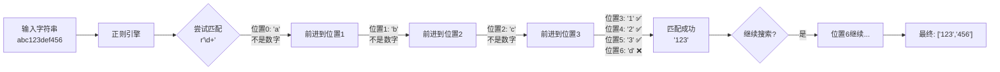
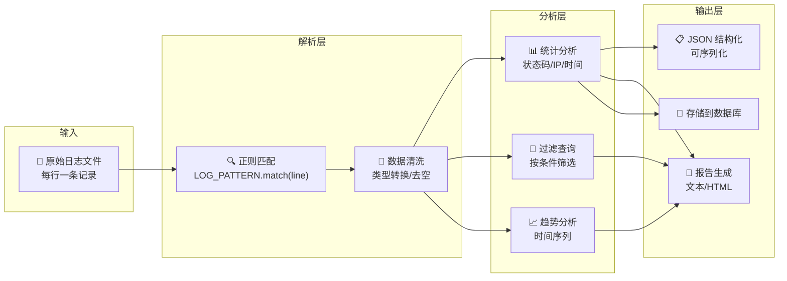
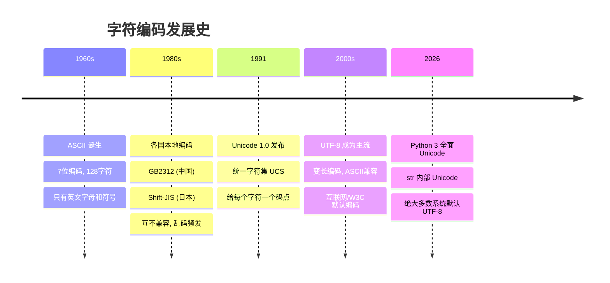

# Day 026 — 图解：字符串高级

本目录包含 Day 026 主题相关的 ASCII 图和 Mermaid 图解。

---

## 正则表达式执行流程

### NFA 引擎匹配过程

```text
正则: a(b|c)d
文本: "abd"

引擎执行路径：

Step 1: a   → 匹配 'a' ✅
              ↓
Step 2: (b|c) → 分支1: 尝试 'b' → 'b' 匹配 ✅ 选择 b
                   ↓
Step 3: d     → 匹配 'd' ✅
                   ↓
              匹配成功!

如果在分支1失败，回溯到分支2尝试 'c'。
这就是正则引擎的"回溯"机制。
```

### 贪婪 vs 非贪婪匹配路径

```text
文本: "<div>a</div><div>b</div>"

贪婪模式: <div>(.*)</div>
  <div>a</div><div>b</div>
  ^^^^^                      → 匹配 <div>
       ^^^^^^^^^^^^^^^^^^    → .* 尽可能多匹配（贪心）
                           ^^^^^^^ → 匹配最后的 </div>
  结果: "a</div><div>b"

非贪婪模式: <div>(.*?)</div>
  <div>a</div><div>b</div>
  ^^^^^                      → 匹配 <div>
       ^                    → .*? 尽可能少匹配（找到一个就停）
        ^^^^^^              → 匹配 </div>
  结果: "a"
  (继续搜索...)
```

---

## 字符编码转换流程

### Python 的 str ↔ bytes 模型

```text
┌─────────────────────────────────────────────────┐
│                   内存 (RAM)                      │
│                                                   │
│   str = "你好世界"                                │
│   (Unicode 码点序列: U+4F60, U+597D, U+4E16, U+754C)│
└──────────────────────┬──────────────────────────┘
                       │
          ┌────────────┴────────────┐
          │  str.encode('utf-8')    │
          │  bytes.decode('utf-8')  │
          └────────────┬────────────┘
                       │
┌──────────────────────▼──────────────────────────┐
│                   磁盘/网络                        │
│                                                   │
│   bytes = b'\xe4\xbd\xa0\xe5\xa5\xbd...'         │
│   (UTF-8 编码后的原始字节)                         │
└─────────────────────────────────────────────────┘
```

### UTF-8 编码示意

```text
字符:   A       中       😊
码点:   U+0041  U+4E2D  U+1F60A
二进制: 1000001  100111000101101  11111011000001010

UTF-8 编码:

A (1字节, 0x00-0x7F):
  0xxxxxxx
  01000001  →  0x41

中 (3字节, 0x0800-0xFFFF):
  1110xxxx  10xxxxxx  10xxxxxx
  11100100  10111000  10101101  →  0xE4 0xB8 0xAD

😊 (4字节, 0x10000-0x10FFFF):
  11110xxx  10xxxxxx  10xxxxxx  10xxxxxx
  11110000  10011111  10011000  10001010  →  0xF0 0x9F 0x98 0x8A
```

---

## Mermaid 图解（渲染后可见）

### 正则匹配流程



### 日志解析管道



### 字符编码发展历程


