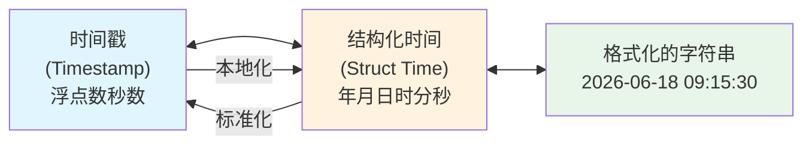
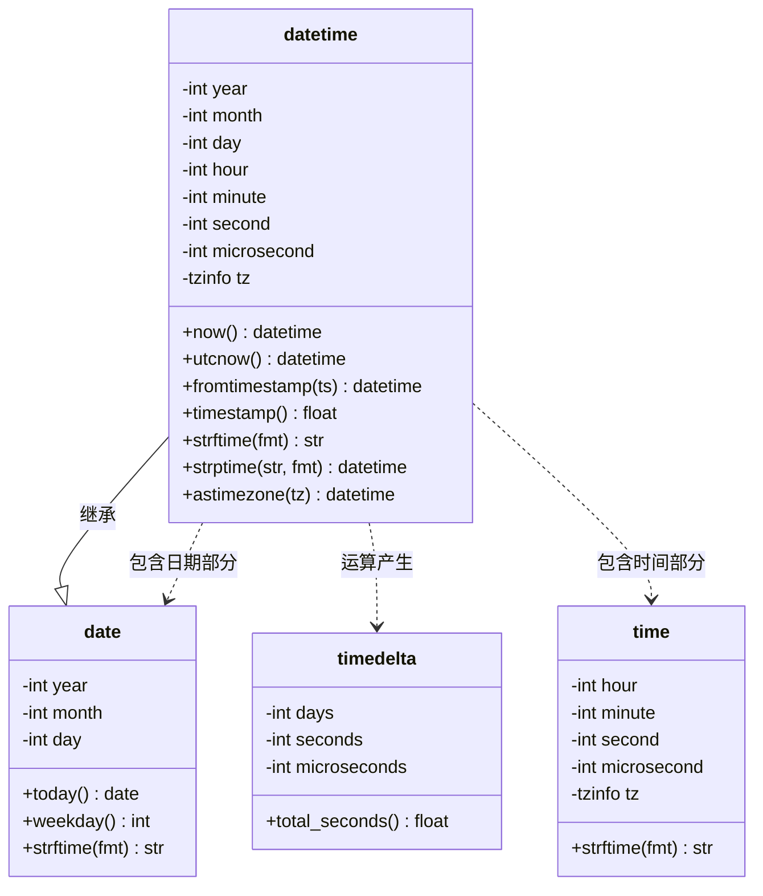
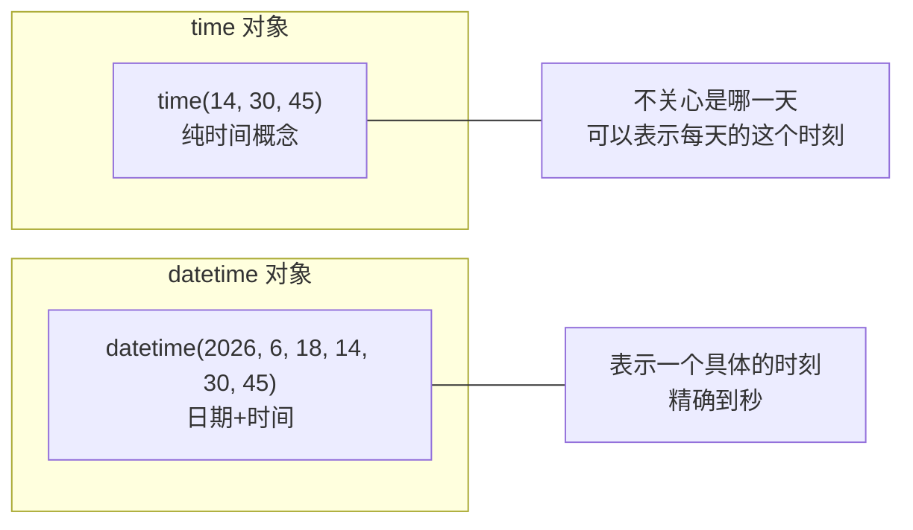
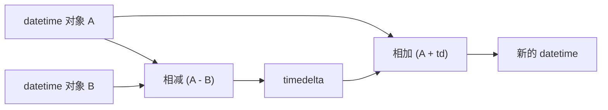
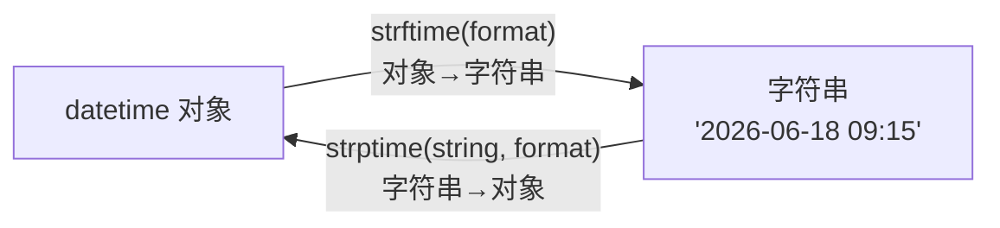

# Day 027 — 时间与日期 🕐

## 📖 学习目标

- 理解时间在计算机中的本质表示（时间戳 vs 结构化时间）
- 掌握 `datetime` 模块的核心类及相互关系
- 熟练使用 `timedelta` 进行时间计算
- 掌握 `time` 模块与时间戳操作
- 理解时区的设计原理与处理方式（`zoneinfo` / `pytz`）
- 掌握 `strftime` / `strptime` 格式化与解析
- 实战：编写日志时间戳解析器

---

## 一、计算机如何表示时间？

### 1.1 时间的两种形态

在计算机系统中，时间有两种基本表示形态：

**形态一：时间戳（Timestamp）**

时间戳是一个**浮点数**或**整数**，表示从某个"纪元"（Epoch）开始到现在的秒数。

```text
Unix Epoch: 1970-01-01 00:00:00 UTC

当前时间戳 ≈ 1,755,000,000.0 秒
              ↑ 从 1970-01-01 到现在经过的秒数
```

**为什么从 1970 年开始？**
- Unix 操作系统诞生于 1969–1970 年
- 选择 1970-01-01 作为"纪元"是历史惯例
- 早期用 32 位有符号整数存储，最大到 2038-01-19（**2038 年问题**）
- Python 的 `time.time()` 返回 float，精度到微秒级

**形态二：结构化时间（Struct Time）**

结构化时间将时间分解为人类可读的字段：

```python
(year=2026, month=6, day=18, hour=9, minute=15, second=30,
 week_day=3, year_day=169, is_dst=0)
```

### 1.2 两种形态的关系



**为什么需要两种形态？**

| 形态 | 优点 | 缺点 | 适用场景 |
|------|------|------|---------|
| 时间戳 | 连续、可排序、适合数学运算 | 人类不可读 | 数据库存储、时间差计算、排序 |
| 结构化时间 | 人类可读、直观 | 不适合运算、时区敏感 | 显示、交互、日志记录 |

---

## 二、`datetime` 模块概览

### 2.1 四大核心类

`datetime` 模块包含四个核心类，理解它们的关系是掌握本模块的关键：

```python
from datetime import date, time, datetime, timedelta
```

| 类 | 表示内容 | 示例 | 是否可变 |
|-----|---------|------|---------|
| `date` | 日期（年、月、日） | `date(2026, 6, 18)` | ❌ 不可变 |
| `time` | 时间（时、分、秒、微秒） | `time(9, 15, 30)` | ❌ 不可变 |
| `datetime` | 日期 + 时间 | `datetime(2026, 6, 18, 9, 15)` | ❌ 不可变 |
| `timedelta` | 时间差（天数、秒数、微秒数） | `timedelta(days=3, hours=2)` | ✅ 但很少修改 |

### 2.2 类关系图



**关键继承关系**：`datetime` 是 `date` 的子类。这意味着：
- `datetime` 对象可以使用 `date` 的所有方法
- `isinstance(datetime_obj, date)` 返回 `True`
- 反过来不成立：`date` 对象不能当作 `datetime` 使用

### 2.3 从时间戳看类的设计哲学

```text
时间戳 (epoch seconds)
     │
     ▼
  ┌───────────┐      ┌───────────┐
  │ datetime    │──────│ date       │
  │ (年月日+时分秒)│      │ (年月日)   │
  └──────┬────┘      └───────────┘
         │
         ▼
  ┌───────────┐      ┌───────────┐
  │ time       │      │ timedelta  │
  │ (时分秒+时区)│      │ (时间差)   │
  └───────────┘      └───────────┘
```

**设计原理**：将时间拆分为"日期"和"时间"两个概念，既保持语义清晰，又保留了组合的灵活性。`timedelta` 则独立出来处理时间运算，使算术逻辑与时间表示分离。

---

## 三、`date` 类详解

### 3.1 创建 date 对象

```python
from datetime import date

# 方式一：指定年月日
d1 = date(2026, 6, 18)
print(d1)  # 2026-06-18

# 方式二：获取今天的日期
today = date.today()
print(today)  # 2026-06-18（取决于运行日期）

# 方式三：从时间戳转换
ts_date = date.fromtimestamp(1755000000)
print(ts_date)  # 对应的日期
```

### 3.2 date 对象的属性

```python
d = date(2026, 6, 18)
print(d.year)    # 2026
print(d.month)   # 6
print(d.day)     # 18
```

### 3.3 date 对象的常用方法

```python
d = date(2026, 6, 18)

# 星期几
print(d.weekday())     # 3 → 周一=0, 周日=6
print(d.isoweekday())  # 4 → 周一=1, 周日=7

# ISO 日历
print(d.isocalendar())  # (2026, 25, 4) → (ISO年, ISO周, ISO星期)

# 替换部分字段（返回新对象，原对象不变）
d2 = d.replace(year=2025)
print(d2)  # 2025-06-18

# 格式化输出
print(d.strftime('%Y/%m/%d'))  # 2026/06/18

# 比较运算
print(d > date(2025, 1, 1))  # True
```

### 3.4 替换操作的不可变性

```python
# ❌ 错误认知：认为 replace 会修改原对象
d = date(2026, 6, 18)
d.replace(year=2025)  # 废弃了返回值！
print(d)  # 仍然是 2026-06-18（原对象不变）

# ✅ 正确做法：接收返回值
d_new = d.replace(year=2025)
```

> **不可变对象的设计理由**：让 `date` 对象可以安全地作为字典键、集合元素、以及在不同函数间传递而不用担心被意外修改。

---

## 四、`time` 类详解

### 4.1 创建 time 对象

```python
from datetime import time

# 时分秒微秒
t1 = time(9, 15, 30)
print(t1)  # 09:15:30

# 带微秒
t2 = time(9, 15, 30, 123456)
print(t2)  # 09:15:30.123456

# 带时区信息
from datetime import timezone, timedelta
tz = timezone(timedelta(hours=8))
t3 = time(9, 15, tzinfo=tz)
print(t3)  # 09:15:00+08:00
```

### 4.2 time 对象的属性

```python
t = time(14, 30, 45, 654321)
print(t.hour)         # 14
print(t.minute)       # 30
print(t.second)       # 45
print(t.microsecond)  # 654321
print(t.tzinfo)       # None（未设置时区）
```

### 4.3 `time` vs `datetime` 中的时间部分



> **为什么要有一个单独的 `time` 类？** 有些场景下我们只关心时间，不关心日期。例如：每天的定时任务（"每天早上9点执行"）、营业时间（"9:00-18:00"）。

---

## 五、`datetime` 类详解

### 5.1 创建 datetime 对象

```python
from datetime import datetime

# 方式一：直接指定
dt1 = datetime(2026, 6, 18, 9, 15, 30)
print(dt1)  # 2026-06-18 09:15:30

# 方式二：获取当前时间
now = datetime.now()      # 本地时间
utc_now = datetime.utcnow()  # UTC 时间（naive）

# 方式三：从时间戳转换
ts = 1755000000
dt2 = datetime.fromtimestamp(ts)      # 转为本地时间
dt2_utc = datetime.utcfromtimestamp(ts)  # 转为 UTC

# 方式四：从字符串解析
dt3 = datetime.strptime('2026-06-18 09:15:30', '%Y-%m-%d %H:%M:%S')

# 方式五：组合 date 和 time
from datetime import date, time
d = date(2026, 6, 18)
t = time(9, 15)
combined = datetime.combine(d, t)
```

### 5.2 核心方法速查

| 方法 | 返回值 | 说明 |
|------|--------|------|
| `datetime.now()` | `datetime` | 当前本地时间（naive） |
| `datetime.utcnow()` | `datetime` | 当前 UTC 时间（naive） |
| `datetime.today()` | `datetime` | 同 `now()` |
| `datetime.fromtimestamp(ts)` | `datetime` | 时间戳 → 本地时间 |
| `datetime.utcfromtimestamp(ts)` | `datetime` | 时间戳 → UTC |
| `datetime.fromisoformat(s)` | `datetime` | ISO 8601 字符串 → 对象 |
| `datetime.strptime(s, fmt)` | `datetime` | 按格式解析字符串 |
| `datetime.combine(d, t)` | `datetime` | 组合 date 和 time |

### 5.3 实例方法速查

| 方法 | 返回值 | 说明 |
|------|--------|------|
| `dt.date()` | `date` | 提取日期部分 |
| `dt.time()` | `time` | 提取时间部分（无时区） |
| `dt.timetz()` | `time` | 提取时间部分（带时区） |
| `dt.timestamp()` | `float` | 转时间戳 |
| `dt.weekday()` | `int` | 星期几（0=周一） |
| `dt.strftime(fmt)` | `str` | 格式化为字符串 |
| `dt.isoformat()` | `str` | ISO 8601 格式字符串 |
| `dt.replace(**kwargs)` | `datetime` | 替换部分字段 |
| `dt.astimezone(tz)` | `datetime` | 转换到指定时区 |
| `dt.utcoffset()` | `timedelta` | UTC 偏移量 |

### 5.4 datetime 的两种类型

`datetime` 对象根据是否包含时区信息分为两种：

**naive（朴素）**：不包含时区信息
```python
naive = datetime(2026, 6, 18, 9, 15)
print(naive.tzinfo)  # None
```

**aware（感知）**：包含时区信息
```python
from datetime import timezone, timedelta
tz = timezone(timedelta(hours=8))
aware = datetime(2026, 6, 18, 9, 15, tzinfo=tz)
print(aware.tzinfo)  # UTC+08:00
```

> **为什么区分两种类型？**
> - naive 适合纯本地应用（如个人记事本），简单高效
> - aware 适合跨时区场景（国际会议、分布式系统），避免歧义
> - **坑**：naive 和 aware 对象之间不能进行比较或算术运算

```python
# ❌ 错误：混合使用 naive 和 aware
naive = datetime(2026, 6, 18, 9, 15)
aware = datetime(2026, 6, 18, 9, 15, tzinfo=timezone.utc)
# naive - aware  → TypeError: can't subtract offset-naive and offset-aware datetimes

# ✅ 正确：先统一
aware2 = naive.replace(tzinfo=timezone.utc)  # 假设 naive 是 UTC
result = aware2 - aware  # 可行
```

---

## 六、`timedelta` 时间差

### 6.1 什么是 timedelta

`timedelta` 表示两个时间点之间的**差值**。它内部只存储三种数据：

```python
from datetime import timedelta

td = timedelta(days=5, hours=3, minutes=30)
print(td)  # 5 days, 3:30:00
```

**内部存储**：`timedelta` 将所有值规范化为 `days`、`seconds`、`microseconds` 三个字段：

```python
td = timedelta(hours=25, minutes=90)
print(td)             # 1 day, 2:30:00
print(td.days)        # 1
print(td.seconds)     # 9000 (= 2*3600 + 30*60)
print(td.microseconds) # 0
print(td.total_seconds())  # 90000.0
```

### 6.2 timedelta 的运算



```python
from datetime import datetime, timedelta

# 两个时间相减 → timedelta
start = datetime(2026, 6, 1, 9, 0)
end = datetime(2026, 6, 18, 9, 0)
delta = end - start
print(delta)              # 17 days, 0:00:00
print(delta.days)         # 17
print(delta.total_seconds())  # 1468800.0

# datetime ± timedelta → 新的 datetime
future = start + timedelta(days=7)
past = start - timedelta(hours=3)
print(future)  # 2026-06-08 09:00:00
print(past)    # 2026-06-01 06:00:00

# timedelta 之间的运算
td1 = timedelta(days=3)
td2 = timedelta(hours=12)
print(td1 + td2)  # 3 days, 12:00:00
print(td1 * 2)    # 6 days, 0:00:00
print(td1 / 2)    # 1 day, 12:00:00
```

### 6.3 timedelta 的常用构造参数

```python
# 所有参数都是可选的，默认值为 0
td = timedelta(
    days=0,
    seconds=0,
    microseconds=0,
    milliseconds=0,     # 自动转微秒
    minutes=0,          # 自动转秒
    hours=0,            # 自动转秒
    weeks=0             # 自动转天
)
```

> **注意**：`timedelta` 只支持到**微秒**级别。如果需要纳秒精度，需要自己处理或将时间存储为整数纳秒数。

### 6.4 timedelta 的坑：不能直接计算月份差

```python
from datetime import datetime, timedelta

# ❌ 错误：没有 timedelta(months=1) 的概念
# timedelta(months=1) → TypeError

# 因为"一个月"的天数是不确定的（28-31天）
# 加一个月需要通过第三方库如 dateutil
from dateutil.relativedelta import relativedelta

dt = datetime(2026, 1, 31)
# 加一个月 → 应该得到 2026-02-28（2月最后一天）
# relativedelta 会帮你处理好
new_dt = dt + relativedelta(months=1)
print(new_dt)  # 2026-02-28 00:00:00
```

---

## 七、时间格式化与解析（strftime / strptime）

### 7.1 格式化 vs 解析



- **`strftime`**：`str from time` — 将时间对象格式化为字符串
- **`strptime`**：`str parse time` — 将字符串解析为时间对象
- **记忆技巧**：`f` = format（格式化→字符串），`p` = parse（解析→对象）

### 7.2 格式化指令速查表

| 指令 | 含义 | 示例 |
|------|------|------|
| `%Y` | 4 位年份 | `2026` |
| `%y` | 2 位年份 | `26` |
| `%m` | 2 位月份（01-12） | `06` |
| `%B` | 完整月份名称 | `June` |
| `%b` | 缩写月份名称 | `Jun` |
| `%d` | 2 位日期（01-31） | `18` |
| `%H` | 24 小时制（00-23） | `09` |
| `%I` | 12 小时制（01-12） | `09` |
| `%p` | AM 或 PM | `AM` |
| `%M` | 分钟（00-59） | `15` |
| `%S` | 秒（00-59） | `30` |
| `%f` | 微秒（6 位） | `123456` |
| `%w` | 星期（0=周日, 6=周六） | `4` |
| `%A` | 完整星期名称 | `Thursday` |
| `%a` | 缩写星期名称 | `Thu` |
| `%j` | 年中的第几天（001-366） | `169` |
| `%U` | 年中的第几周（周日为每周第一天） | `24` |
| `%W` | 年中的第几周（周一为每周第一天） | `24` |
| `%z` | UTC 偏移（±HHMM） | `+0800` |
| `%Z` | 时区名称 | `CST` |
| `%%` | 转义的 % | `%` |

### 7.3 常见格式模板

```python
# 国际标准格式
fmt_iso = '%Y-%m-%d'              # 2026-06-18
fmt_iso_full = '%Y-%m-%d %H:%M:%S'  # 2026-06-18 09:15:30

# 中文格式
fmt_cn = '%Y年%m月%d日 %H:%M'    # 2026年06月18日 09:15

# 美国风格
fmt_us = '%m/%d/%Y'               # 06/18/2026

# 日志格式
fmt_log = '%d/%b/%Y:%H:%M:%S %z'  # 18/Jun/2026:09:15:30 +0800

# 紧凑格式
fmt_compact = '%Y%m%d_%H%M%S'    # 20260618_091530（适合文件名）
```

### 7.4 strptime 的坑与注意事项

```python
# ⚠️ 坑 1：%Y 不能匹配 2 位年份
# datetime.strptime('26-06-18', '%y-%m-%d') ✅ 可以
# datetime.strptime('26-06-18', '%Y-%m-%d') ❌ %Y 要求 4 位

# ⚠️ 坑 2：月份和日期必须匹配
# datetime.strptime('2026-02-30', '%Y-%m-%d') → ValueError
# 因为 2 月只有 28/29 天

# ⚠️ 坑 3：%f 是 6 位微秒，但可能只有 1-6 位
from datetime import datetime
dt = datetime.strptime('2026-06-18 09:15:30.123', '%Y-%m-%d %H:%M:%S.%f')
print(dt.microsecond)  # 123000（自动补 0）
dt2 = datetime.strptime('2026-06-18 09:15:30.123456', '%Y-%m-%d %H:%M:%S.%f')
print(dt2.microsecond)  # 123456

# ⚠️ 坑 4：%z 的格式问题
# Python 3.6 之前不支持 %z 的可选冒号
# Python 3.7+ 支持 -05:00 和 -0500 两种格式
```

---

## 八、`time` 模块

### 8.1 time 模块 vs datetime 模块

| | `time` 模块 | `datetime` 模块 |
|--|------------|----------------|
| 定位 | 底层时间接口 | 高层时间抽象 |
| 核心表示 | 时间戳（float） | 结构化对象 |
| 精度 | 通常到秒/毫秒 | 到微秒 |
| 时区 | 依赖系统时区 | 可明确指定 |
| 适合场景 | 性能测量、延时 | 时间操作、显示 |

### 8.2 核心函数

```python
import time

# 当前时间戳
ts = time.time()
print(ts)  # 1755000000.123456

# 结构化时间（本地）
local_time = time.localtime()        # 当前本地时间
local_ts = time.localtime(ts)        # 时间戳 → 结构化时间

# 结构化时间（UTC）
utc_time = time.gmtime()             # 当前 UTC 时间
utc_ts = time.gmtime(ts)             # 时间戳 → UTC 结构化时间

# 结构化时间 → 时间戳
ts_back = time.mktime(local_time)

# 结构化时间 → 字符串
str_time = time.asctime(local_time)  # 'Thu Jun 18 09:15:30 2026'
str_ts = time.ctime(ts)              # 同上，直接从时间戳转

# 格式化（类似 strftime）
formatted = time.strftime('%Y-%m-%d %H:%M:%S', local_time)

# 解析（类似 strptime）
parsed = time.strptime('2026-06-18', '%Y-%m-%d')
```

### 8.3 性能测量函数

```python
import time

# time.perf_counter() — 高精度性能计数器
# 适合测量代码块执行时间
start = time.perf_counter()
# ... 执行代码 ...
end = time.perf_counter()
print(f"执行耗时: {end - start:.6f} 秒")

# time.process_time() — CPU 时间
# 只统计当前进程实际占用的 CPU 时间
cpu_start = time.process_time()
# ... 执行 CPU 密集型操作 ...
cpu_end = time.process_time()
print(f"CPU 时间: {cpu_end - cpu_start:.6f} 秒")
```

> **`time()` vs `perf_counter()` 的区别**：
> - `time()` 返回的是墙上时间（wall-clock time），可能受系统时间调整影响（如 NTP 同步）
> - `perf_counter()` 使用系统最高精度计时器，不受系统时间调整影响
> - **性能测量永远用 `perf_counter()`，不要用 `time()`**

### 8.4 sleep 函数

```python
import time

# 暂停执行
time.sleep(2)        # 暂停 2 秒
time.sleep(0.5)      # 暂停 500 毫秒
time.sleep(0.001)    # 暂停 1 毫秒

# ⚠️ sleep 的精度取决于操作系统
# Windows: ~15ms 精度
# Linux: ~1μs 精度
# 高精度定时需要用 select 或 threading.Timer
```

---

## 九、时区处理

### 9.1 时区的本质

**时区 = UTC 偏移量 + 夏令时规则**

```text
UTC+8 (北京时间) = UTC + 8:00
    - 全年固定偏移，无夏令时
    
US/Eastern (美国东部)
    - 标准时间: UTC-5
    - 夏令时:   UTC-4 (3月~11月)
```

**关键概念**：

1. **UTC**：协调世界时，全球时间基准
2. **偏移量**：相对于 UTC 的小时数（如 +08:00）
3. **夏令时（DST）**：部分国家夏季将时钟拨快 1 小时
4. **时区名**：如 `Asia/Shanghai`、`America/New_York`

### 9.2 Python 3.9+ 的 zoneinfo 模块

Python 3.9 引入了内置的 `zoneinfo` 模块，使用 **IANA 时区数据库**：

```python
from zoneinfo import ZoneInfo
from datetime import datetime, timezone, timedelta

# 创建时区对象
beijing = ZoneInfo('Asia/Shanghai')
new_york = ZoneInfo('America/New_York')
utc = timezone.utc

# 创建带时区的 datetime
dt_beijing = datetime(2026, 6, 18, 9, 15, tzinfo=beijing)
print(dt_beijing)  # 2026-06-18 09:15:00+08:00

# 时区转换
dt_utc = dt_beijing.astimezone(utc)
print(dt_utc)  # 2026-06-18 01:15:00+00:00

dt_ny = dt_beijing.astimezone(new_york)
print(dt_ny)  # 2026-06-17 21:15:00-04:00（夏令时）
```

> ⚠️ **注意**：`ZoneInfo('Asia/Shanghai')` 和 `timezone(timedelta(hours=8))` 不同。前者包含完整的时区历史记录（如历史上的偏移变化），后者只是一个固定的 UTC 偏移。

### 9.3 旧版方案：pytz

对于 Python 3.8 及更早版本（或某些特殊场景），需要使用 `pytz`：

```python
import pytz
from datetime import datetime

beijing = pytz.timezone('Asia/Shanghai')
new_york = pytz.timezone('America/New_York')

# ⚠️ pytz 的特殊用法：不要直接传 tzinfo
# ❌ 错误
# dt = datetime(2026, 6, 18, 9, 15, tzinfo=beijing)

# ✅ 正确：使用 localize
dt_naive = datetime(2026, 6, 18, 9, 15)
dt_beijing = beijing.localize(dt_naive)

# 转换时区
dt_ny = dt_beijing.astimezone(new_york)
print(dt_beijing)  # 2026-06-18 09:15:00+08:00
print(dt_ny)       # 2026-06-17 21:15:00-04:00
```

### 9.4 zoneinfo vs pytz 对比

| 对比项 | zoneinfo | pytz |
|--------|----------|------|
| Python 版本 | 3.9+ 内置 | 2.3+（需安装） |
| 时区数据库 | 使用系统的 tzdata | 自带 tzdata |
| 创建 aware datetime | 直接传 tzinfo | 必须用 localize() |
| 更新频率 | 随系统更新 | 独立发布 |
| 推荐度 | ✅ 优先使用 | ❌ 仅兼容旧版 |

### 9.5 跨时区会议安排实战

```python
from datetime import datetime, date, time
from zoneinfo import ZoneInfo

def convert_meeting_time(
    local_date: date,
    local_time: time,
    local_tz: str,
    target_tz: str
) -> datetime:
    """
    将某个时区的会议时间转换到目标时区
    
    示例：北京下午3点的会议，纽约是几点？
    """
    local_dt = datetime.combine(
        local_date,
        local_time,
        tzinfo=ZoneInfo(local_tz)
    )
    target_dt = local_dt.astimezone(ZoneInfo(target_tz))
    return target_dt

# 使用示例
result = convert_meeting_time(
    local_date=date(2026, 6, 18),
    local_time=time(15, 0),
    local_tz='Asia/Shanghai',
    target_tz='America/New_York'
)
print(f"北京 15:00 → 纽约 {result.strftime('%Y-%m-%d %H:%M %Z')}")
# 北京 15:00 → 纽约 2026-06-18 03:00 EDT（夏令时，纽约慢12小时）

# 如果要显示所有参会者时间
meeting = datetime(2026, 6, 18, 15, 0, tzinfo=ZoneInfo('Asia/Shanghai'))
cities = {
    '北京': 'Asia/Shanghai',
    '东京': 'Asia/Tokyo',
    '纽约': 'America/New_York',
    '伦敦': 'Europe/London',
    '悉尼': 'Australia/Sydney',
}
for city, tz_name in cities.items():
    local_time = meeting.astimezone(ZoneInfo(tz_name))
    print(f"{city}: {local_time.strftime('%Y-%m-%d %H:%M %Z')}")
```

---

## 十、实战场景

### 场景一：日志时间戳解析

Nginx 日志中的时间格式：`18/Jun/2026:09:15:30 +0800`

```python
from datetime import datetime

log_time = '18/Jun/2026:09:15:30 +0800'
fmt = '%d/%b/%Y:%H:%M:%S %z'
dt = datetime.strptime(log_time, fmt)
print(dt)  # 2026-06-18 09:15:30+08:00
```

> **注意**：`%b` 解析英文月份的缩写（Jan, Feb, Mar...），受系统 locale 影响。如果你在中文系统上解析英文月份，可能需要设置 locale：
> ```python
> import locale
> locale.setlocale(locale.LC_TIME, 'en_US.UTF-8')
> ```

### 场景二：计算两个时刻之间的工作天数

```python
from datetime import date, timedelta

def business_days(start: date, end: date) -> list[date]:
    """计算两个日期之间的所有工作日（排除周末）"""
    days = []
    current = start
    while current <= end:
        if current.weekday() < 5:  # 周一=0, 周五=4
            days.append(current)
        current += timedelta(days=1)
    return days

# 使用
start = date(2026, 6, 1)
end = date(2026, 6, 30)
work_days = business_days(start, end)
print(f"6月工作日: {len(work_days)} 天")
# 6月工作日: 22 天
```

### 场景三：时间戳转换工具

```python
from datetime import datetime, timezone

def timestamp_converter(ts: float = None, to_tz: str = 'local'):
    """
    时间戳全能转换器
    - 不传参数：显示当前时间
    - 传时间戳：显示对应时间
    """
    if ts is None:
        ts = datetime.now().timestamp()
    
    dt_utc = datetime.fromtimestamp(ts, tz=timezone.utc)
    
    result = {
        'timestamp': ts,
        'utc_time': dt_utc.strftime('%Y-%m-%d %H:%M:%S UTC'),
        'iso_format': dt_utc.isoformat(),
        'readable': dt_utc.strftime('%A, %B %d, %Y %H:%M:%S UTC'),
    }
    
    if to_tz == 'local':
        dt_local = datetime.fromtimestamp(ts)
        result['local_time'] = dt_local.strftime('%Y-%m-%d %H:%M:%S %Z')
    
    return result
```

### 场景四：时间序列自动生成

```python
from datetime import datetime, timedelta
from typing import Generator

def time_series(
    start: datetime,
    end: datetime,
    step: timedelta
) -> Generator[datetime, None, None]:
    """生成从 start 到 end 的时间序列，步长为 step"""
    current = start
    while current <= end:
        yield current
        current += step

# 生成 2026-06-18 每半小时的时间点
start = datetime(2026, 6, 18, 0, 0)
end = datetime(2026, 6, 18, 23, 59)
for dt in time_series(start, end, timedelta(minutes=30)):
    print(dt.strftime('%H:%M'), end=' ')
# 00:00 00:30 01:00 ... 23:30
```

---

## 十一、常见陷阱与避坑指南

### 陷阱 1：Naive 与 Aware 混用

```python
from datetime import datetime, timezone, timedelta

naive = datetime(2026, 6, 18, 9, 0)
aware = datetime(2026, 6, 18, 9, 0, tzinfo=timezone.utc)

# 💥 TypeError
# result = aware - naive

# ✅ 解决方案：统一为一种类型
# 方案A：给 naive 加上时区
naive_aware = naive.replace(tzinfo=timezone.utc)
result = aware - naive_aware  # ✅

# 方案B：去掉 aware 的时区
aware_naive = aware.replace(tzinfo=None)
result = aware_naive - naive  # ✅
```

### 陷阱 2：datetime 对象的可变性与哈希

```python
# datetime 是不可变的，可以作为字典键
events = {
    datetime(2026, 6, 18, 9, 0): '晨会',
    datetime(2026, 6, 18, 14, 0): '技术分享',
}

# ✅ 可以正常使用
print(events[datetime(2026, 6, 18, 9, 0)])  # '晨会'

# ❌ timedelta 虽然大多不可变但行为不同
# 不过通常没人用 timedelta 做字典键
```

### 陷阱 3：strptime 的 locale 依赖

```python
from datetime import datetime

# ✅ 英文系统
dt = datetime.strptime('18-Jun-2026', '%d-%b-%Y')

# ❌ 中文系统可能报错
# ValueError: time data '18-Jun-2026' does not match format '%d-%b-%Y'

# ✅ 解决方案：临时设置 locale
import locale
locale.setlocale(locale.LC_TIME, 'en_US.UTF-8')  # Unix
# 或 'en_US' (Linux), 'en_GB' (某些系统)
dt = datetime.strptime('18-Jun-2026', '%d-%b-%Y')
```

### 陷阱 4：time.sleep 精度问题

```python
import time

# 想要精确等待 100 毫秒
time.sleep(0.1)

# ⚠️ 实际等待时间可能远大于 100ms
# Windows: 通常 ~15ms 精度，即可能等待 112-115ms
# Linux: 通常 ~1μs 精度，误差很小

# ✅ 高精度方案
import select
# select.select([], [], [], 0.1)  # 更精确
```

### 陷阱 5：UTC 与本地时间的混淆

```python
from datetime import datetime

# ❌ 错误：utcnow() 返回 naive datetime
# 你以为存的是 UTC，但其实没有时区信息
utc_naive = datetime.utcnow()  # ⚠️ 不推荐

# ✅ 正确：显式指定 UTC
from datetime import timezone
utc_aware = datetime.now(timezone.utc)  # ✅ 带时区

# 或者用 datetime.now(timezone.utc) 获取 aware 对象
```

### 陷阱 6：闰年、月末边界

```python
from datetime import datetime, timedelta

# 加一天的安全做法
dt = datetime(2026, 2, 28)
next_day = dt + timedelta(days=1)
print(next_day)  # 2026-03-01（正确处理了闰年）

# 但如果想加一个月，不能直接用 timedelta
# ❌ timedelta(months=1) 不存在

# ✅ 使用 dateutil
from dateutil.relativedelta import relativedelta
dt = datetime(2026, 1, 31)
next_month = dt + relativedelta(months=1)
print(next_month)  # 2026-02-28（自动处理月末）
```

### 陷阱 7：性能测量不要用 time()

```python
import time

# ❌ 不要用 time() 测量性能
start = time.time()
# ... 代码 ...
end = time.time()
# 问题：如果系统时间被 NTP 调整，结果可能是负数！

# ✅ 用 perf_counter()
start = time.perf_counter()
# ... 代码 ...
end = time.perf_counter()
print(f"耗时: {end - start:.6f}s")
```

---

## 十二、API 速查对比表

### 时间获取

| 操作 | `time` 模块 | `datetime` 模块 |
|------|------------|----------------|
| 当前时间戳 | `time.time()` | `datetime.now().timestamp()` |
| 当前本地时间 | `time.localtime()` | `datetime.now()` |
| 当前 UTC 时间 | `time.gmtime()` | `datetime.utcnow()` ⚠️ |
| 当前 aware UTC | ❌ | `datetime.now(timezone.utc)` ✅ |

### 类型转换

| 转换 | 方法 |
|------|------|
| 时间戳 → datetime | `datetime.fromtimestamp(ts)` |
| datetime → 时间戳 | `dt.timestamp()` |
| 字符串 → datetime | `datetime.strptime(s, fmt)` |
| datetime → 字符串 | `dt.strftime(fmt)` |
| date + time → datetime | `datetime.combine(d, t)` |
| datetime → date | `dt.date()` |
| datetime → time | `dt.time()` |

### 时间运算

| 运算 | 方法/操作 |
|------|----------|
| 加天数 | `dt + timedelta(days=n)` |
| 加小时 | `dt + timedelta(hours=n)` |
| 时间差 | `dt2 - dt1` → `timedelta` |
| 总秒数 | `td.total_seconds()` |
| 加月份 | `dt + relativedelta(months=n)` (需 dateutil) |

---

## 十三、思考题

1. **时间戳精度问题**：`time.time()` 返回的浮点数精度有限，当时间戳非常大时（如接近 2038 年），微秒级的精度会丢失。为什么？在 Python 中如何解决高精度时间存储问题？

2. **Naive vs Aware**：假设你的应用需要存储用户的生日（只关心月日，不关心年份和时区），你会用哪种数据结构？为什么？

3. **性能测量陷阱**：用 `time.time()` 来测量一个耗时 1 纳秒的操作会有什么问题？用 `time.perf_counter()` 能测出来吗？为什么？

4. **跨年日期计算**：`date(2026, 1, 1) - timedelta(days=1)` 的结果是什么？`date(2026, 3, 1) - timedelta(days=1)` 呢？Python 是如何处理这类边界情况的？

5. **字符串解析歧义**：如果没有 `strptime`，让你写一个函数将 `'2026-06-18 09:15:30'` 解析为 datetime 对象（不能使用任何现成的解析库），你会怎么写？需要考虑哪些边界情况？
