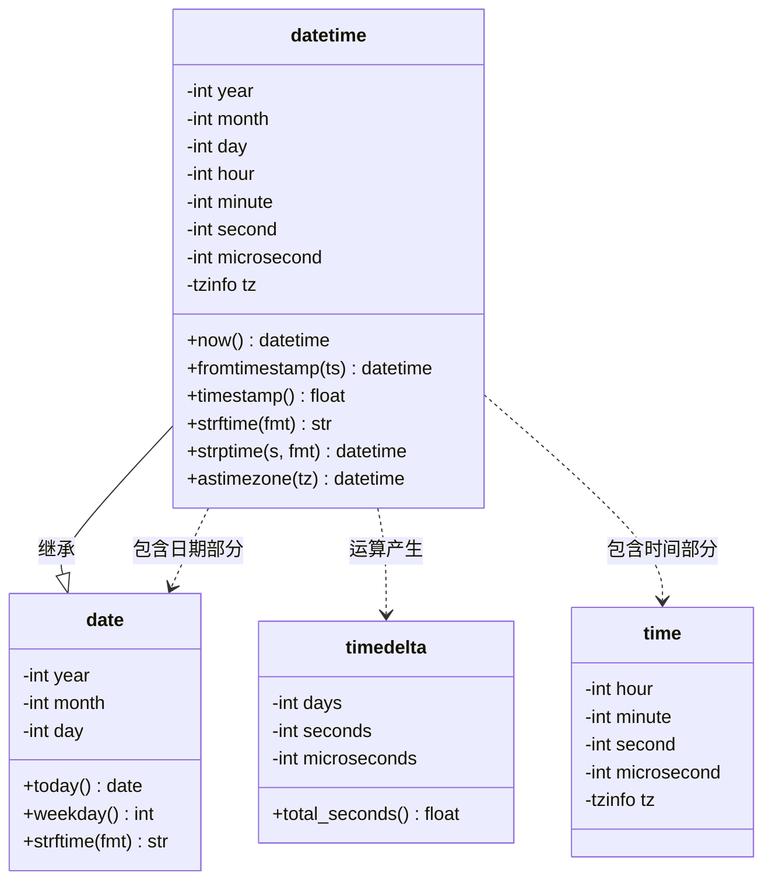
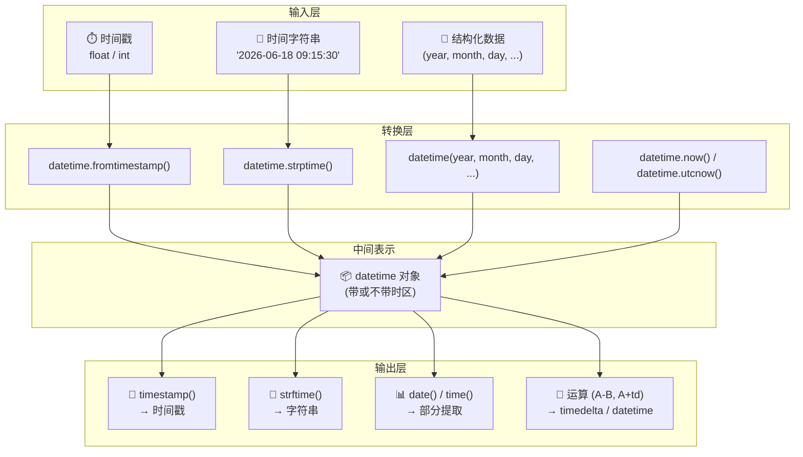
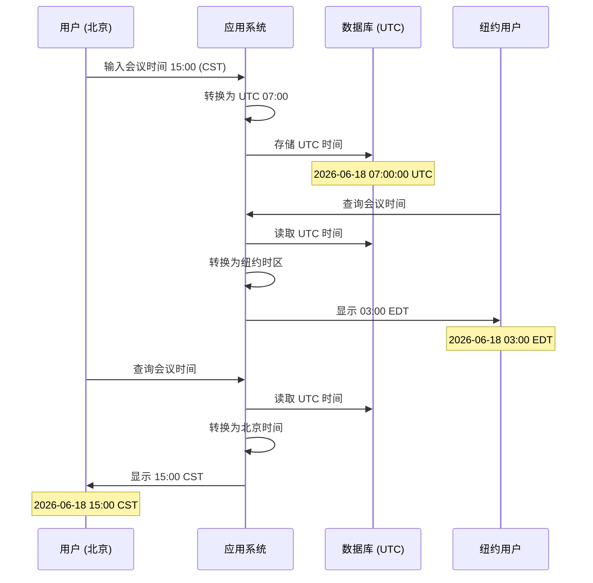
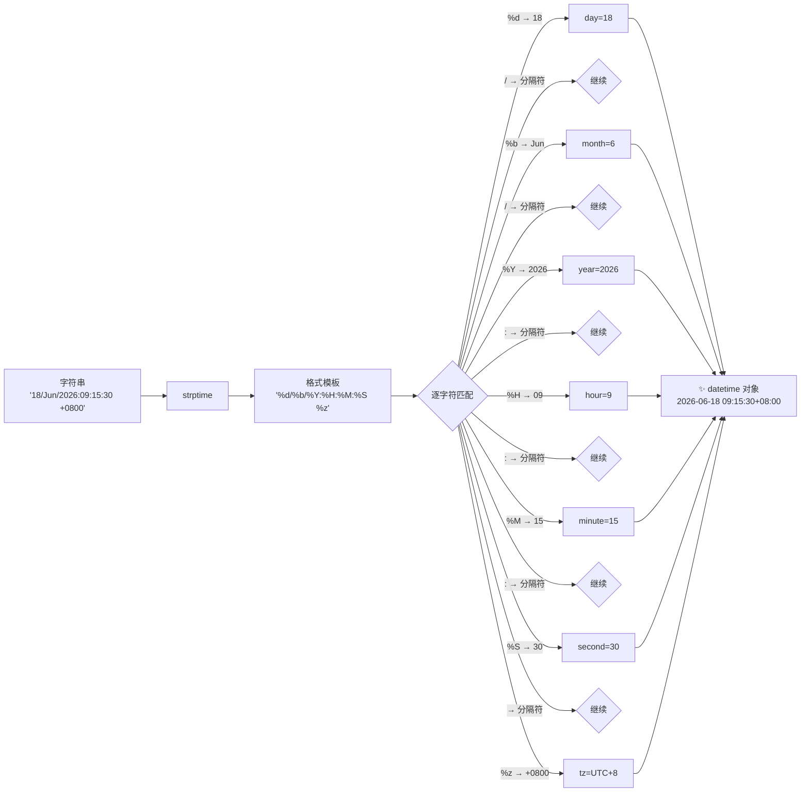

# Day 027 — 图解：时间与日期

本目录包含 Day 027 主题相关的 ASCII 图和 Mermaid 图解。

---

## 图一：datetime 模块对象关系图

### ASCII 版本

```text
                    ┌─────────────────────────────────────────┐
                    │            datetime 模块                  │
                    │  (from datetime import ...)              │
                    └─────────────────────────────────────────┘
                                      │
          ┌───────────────┬───────────┴───────────┬───────────────┐
          │               │                       │               │
          ▼               ▼                       ▼               ▼
   ┌──────────┐    ┌──────────┐           ┌──────────┐    ┌──────────────┐
   │   date   │    │   time   │           │ datetime │    │   timedelta  │
   │ (日期)   │    │ (时间)   │           │ (日期+时间)│   │ (时间差)     │
   │          │    │          │           │          │    │              │
   │ year     │    │ hour     │           │ year     │    │ days         │
   │ month    │    │ minute   │ 继承 date │ month    │    │ seconds      │
   │ day      │    │ second   │──────────►│ day      │    │ microseconds │
   │          │    │ microsec │           │ hour     │    │              │
   │ today()  │    │ tzinfo   │           │ minute   │    │ total_secs() │
   │ weekday()│    │          │           │ second   │    │              │
   └──────────┘    └──────────┘           │ microsec │    └──────────────┘
                                          │ tzinfo   │
                                          │          │
                                          │ now()    │
                                          │ strftime │
                                          │ strptime │
                                          │ timestamp│
                                          └──────────┘
```

### Mermaid 版本



---

## 图二：时间转换流程

### 三种时间形态的相互转换

```text
┌─────────────────────────────────────────────────────────────────────┐
│                    时间的三重形态                                     │
└─────────────────────────────────────────────────────────────────────┘

                      ┌─────────────────┐
                      │    📦 时间戳      │
                      │  (Unix Epoch秒数) │
                      │  1755000000.0    │
                      └────────┬────────┘
                               │
              ┌────────────────┼────────────────┐
              │                │                │
              ▼                ▼                ▼
    ┌─────────────────┐ ┌─────────────────┐ ┌─────────────────┐
    │  fromtimestamp() │ │  fromtimestamp() │ │  fromtimestamp()│
    │  (datetime模块)  │ │  (date模块)      │ │  (time模块)     │
    └────────┬────────┘ └────────┬────────┘ └────────┬────────┘
             │                   │                   │
             ▼                   ▼                   │
    ┌─────────────────┐ ┌─────────────────┐          │
    │  📋 datetime     │ │  📅 date         │          │
    │  2026-06-18      │ │  2026-06-18      │          │
    │  09:15:30        │ │                  │          │
    └────────┬────────┘ └──────────────────┘          │
             │                                        │
             ▼                                        ▼
    ┌─────────────────┐                    ┌─────────────────┐
    │  ✏️ 格式化       │                    │  ⏰ time         │
    │  strftime()     │                    │  09:15:30        │
    │  "2026-06-18..."│                    │                  │
    └─────────────────┘                    └─────────────────┘

               strptime() 反向操作:
               "2026-06-18 09:15:30" ──► datetime对象
```

### Mermaid 流程图



---

## 图三：时区转换示意图

### Naive ↔ Aware 转换

```text
              ⚠️ 不允许直接混合运算！ ⚠️

Naive datetime                    Aware datetime
(tzinfo=None)                     (tzinfo=ZoneInfo(...))
    │                                    │
    │                                    │
    │    ┌─────────────────────┐          │
    │    │  方案 A: 补充时区    │          │
    └───►│  replace(tzinfo=utc)│          │
         │                     │◄─────────┘
         │  方案 B: 去除时区    │
         │  replace(tzinfo=None)│
         └─────────────────────┘
                    │
                    ▼
          ⚡ 统一后的 datetime
          (双方类型一致，可以运算)
```

### 跨时区时间转换

```text
UTC 时间 (数据库存储)
    │
    │  astimezone(ZoneInfo('Asia/Shanghai'))
    ▼
北京时间: 2026-06-18 15:00:00 CST (UTC+8)
    │
    │  astimezone(ZoneInfo('America/New_York'))
    ▼
纽约时间: 2026-06-18 03:00:00 EDT (UTC-4)  [夏令时]

关键原则:
┌────────────────────────────────────────────┐
│  ✅ 存储: UTC                              │
│  ✅ 计算: UTC 统一基准                      │
│  ✅ 显示: 根据用户时区转换                   │
│  ❌ 禁止: naive + aware 混用               │
│  ❌ 禁止: 存储带时区的本地时间                │
└────────────────────────────────────────────┘
```

### Mermaid 时序图



---

## 图四：时间格式解析流程

### strptime 的解析过程

```text
输入: "18/Jun/2026:09:15:30 +0800"
格式: "%d/%b/%Y:%H:%M:%S %z"

解析过程 (从左到右):

位置 0: "1"  → %d 开始, 读入 "18"    → day = 18
位置 2: "/"  → 匹配分隔符 "/"
位置 3: "J"  → %b 开始, 读入 "Jun"   → month = 6
位置 6: "/"  → 匹配分隔符 "/"
位置 7: "2"  → %Y 开始, 读入 "2026"  → year = 2026
位置 11: ":" → 匹配分隔符 ":"
位置 12: "0" → %H 开始, 读入 "09"    → hour = 9
位置 14: ":" → 匹配分隔符 ":"
位置 15: "1" → %M 开始, 读入 "15"    → minute = 15
位置 17: ":" → 匹配分隔符 ":"
位置 18: "3" → %S 开始, 读入 "30"    → second = 30
位置 20: " " → 匹配分隔符 " "
位置 21: "+" → %z 开始, 读入 "+0800" → tz = UTC+08:00

┌────────────────────────────────────────┐
│ 解析结果:                              │
│ datetime(2026, 6, 18, 9, 15, 30,      │
│          tzinfo=timezone(+08:00))      │
└────────────────────────────────────────┘
```

### Mermaid 流程图


