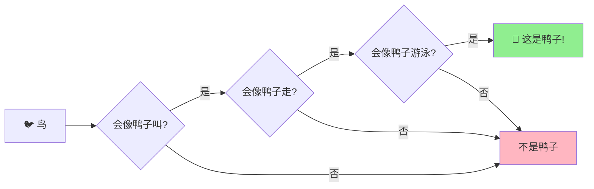
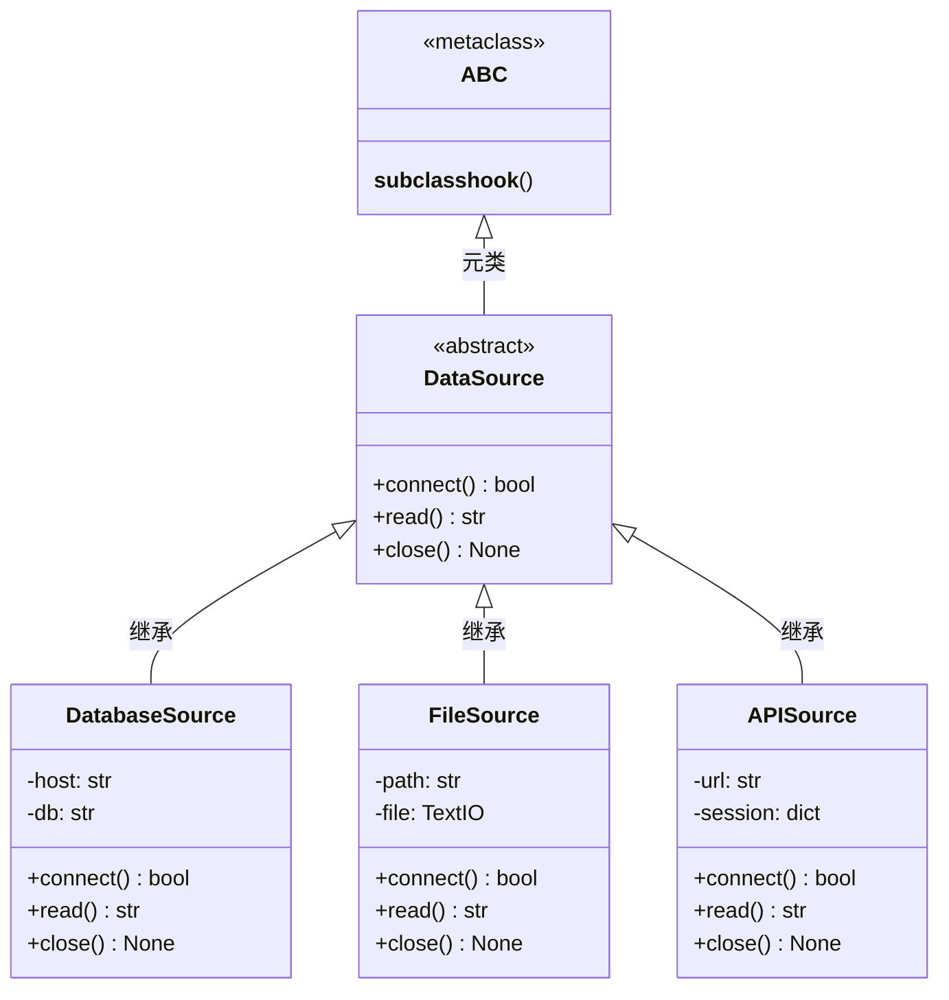
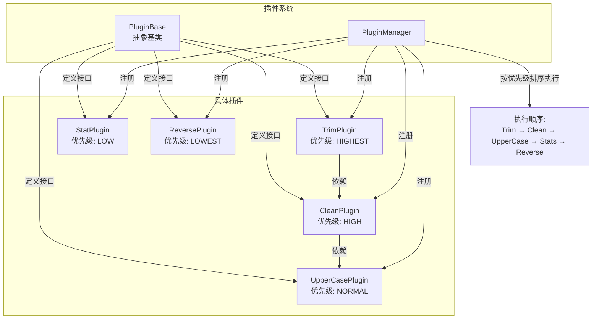
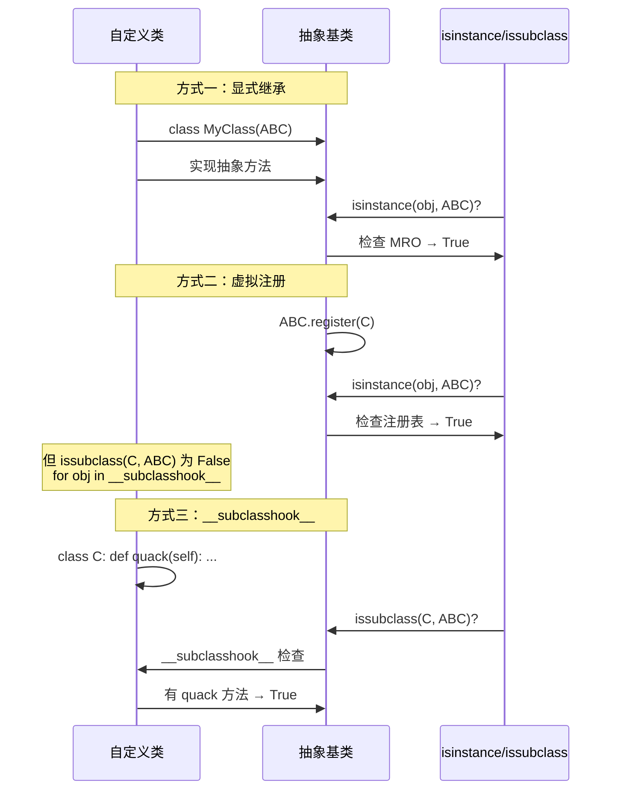

# Day 034 — 多态与鸭子类型：图解

> Mermaid 与 ASCII 示意图，帮助理解多态、鸭子类型、EAFP 和插件系统

---

## 1️⃣ 多态原理

```
方法调用时的动态绑定:

    调用: animal.speak()
                    │
                    ▼
          ┌─────────────────┐
          │  vtable 查找    │ ← 运行时根据对象实际类型查找
          └────────┬────────┘
                   │
         ┌─────────┼──────────┐
         ▼                    ▼
    ┌──────────┐        ┌──────────┐
    │ Dog      │        │ Cat      │
    │ speak()  │        │ speak()  │
    │ → "汪汪!" │         │ → "喵喵~" │
    └──────────┘        └──────────┘
```

### 继承体系 vs 鸭子类型

```
传统继承多态:                  鸭子类型多态:

    ┌─────────┐             ┌─────────┐   ┌─────────┐
    │ Animal  │             │ Duck    │   │ Person  │
    │ speak() │             │ quack() │   │ quack() │
    └────┬────┘             │ walk()  │   │ walk()  │
         │                  │ swim()  │   │ swim()  │
    ┌────┼────┐             └─────────┘   └─────────┘
    ▼    ▼    ▼                  │              │
  ┌──┐ ┌──┐ ┌──┐                └──────┬───────┘
  │Dog│ │Cat│ │Bird│                     │
  └──┘ └──┘ └──┘                  duck_test()
 必须继承 Animal              只要有这些方法就行
```

---

## 2️⃣ 鸭子类型（Duck Typing）



### Python 中的鸭子类型

```
  def duck_test(thing):
      thing.quack()    # 不关心类型
      thing.walk()     # 只关心有没有这个方法
      thing.swim()

  duck_test(Duck)       # ✅ "嘎嘎!"
  duck_test(Person)     # ✅ "嘎嘎!" （人在学鸭子）
  duck_test(RobotDuck)  # ✅ "哔——嘎嘎!"
```

---

## 3️⃣ EAFP 与 LBYL 对比

### 执行流程对比

```
LBYL (先检查后操作):

    检查条件 ──不满足──→ 返回/跳过
        │
       满足
        │
       执行操作 ──仍可能失败──→ 未处理!

    问题: 检查到执行之间，状态可能变化
          (TOCTOU 竞态条件)


EAFP (先操作后处理):

    执行操作 ──成功──→ 返回结果
        │
       失败
        │
       捕获异常 ───→ 处理错误

    优势: 没有竞态条件窗口
          代码更简洁
```

### 常见场景

| 场景 | LBYL | EAFP |
|------|------|------|
| 文件访问 | `os.path.exists()` + `open()` | `try: open()` |
| 字典访问 | `if 'k' in d: d['k']` | `try: d['k']` |
| 属性访问 | `if hasattr(o, 'x'): o.x` | `try: o.x` |
| 类型检查 | `isinstance(x, (int, float))` | `try: x + 1` |

---

## 4️⃣ 抽象基类（ABC）体系



### Python 内置 ABC 层次结构

```
collections.abc

    Iterable         ← 需要 __iter__()
        │
    Iterator         ← 需要 __next__() + __iter__()
        │
    Collection       ← 需要 __contains__() + __iter__() + __len__()
       ─┼─
    Sequence         ← 需要 __getitem__() + __len__()
        │
    MutableSequence  ← Sequence + __setitem__() + __delitem__() + insert()
        │
    list/bytearray

    Mapping          ← 需要 __getitem__() + __len__() + __iter__()
        │
    MutableMapping   ← Mapping + __setitem__() + __delitem__()
        │
    dict

    Set              ← 需要 __contains__() + __iter__() + __len__()
        │
    MutableSet       ← Set + add() + discard()
```

---

## 5️⃣ 插件系统架构



### 执行流程

```
输入: "   Hello   World!   "

  ① TrimPlugin (HIGHEST)
     "Hello   World!"
        ↓
  ② CleanPlugin (HIGH, 依赖 Trim)
     "Hello World!"
        ↓
  ③ UpperCasePlugin (NORMAL, 依赖 Clean)
     "HELLO WORLD!"
        ↓
  ④ StatPlugin (LOW)
     { chars: 12, words: 2, ... }
        ↓
  ⑤ ReversePlugin (LOWEST)
     "!DLROW OLLEH"

输出: "!DLROW OLLEH"
```

### 依赖解析（拓扑排序）

```
插件依赖图:
    Reverse → (无依赖)
    Stats → (无依赖)
    UpperCase → Clean
    Clean → Trim
    Trim → (无依赖)

拓扑排序过程:
    1. 从 Reverse 开始: visited{Reverse}
    2. 从 Stats 开始: visited{Reverse, Stats}
    3. 从 UpperCase 开始: 需要 Clean
    4. 从 Clean 开始: 需要 Trim
    5. 从 Trim 开始: 无依赖, 加入
    6. 回到 Clean: 加入
    7. 回到 UpperCase: 加入
    8. 加入 Stats, Reverse

最终执行顺序 (按优先级):
    Trim(HIGHEST) > Clean(HIGH) > UpperCase(NORMAL)
    > Stats(LOW) > Reverse(LOWEST)
```

---

## 6️⃣ 注册与虚拟子类机制



---

## 7️⃣ 多态 vs 类型检查对比

```
        传统语言 (Java/C++)            Python
        ═══════════════════            ═══════════════════════

  声明:  Duck d = new Duck();          d = Duck()
  调用:  d.quack();                    d.quack()

  多态:  需要接口 or 继承              鸭子类型 —— 不需要继承
         必须显式 implements           只要方法存在就行

  类型:  编译时检查                    运行时检查
  检查:  编译器保证类型安全            isinstance/duck typing

  优势:  更安全，IDE 支持更好           更灵活，代码更简洁
  劣势:  样板代码多                    错误发现较晚
```
