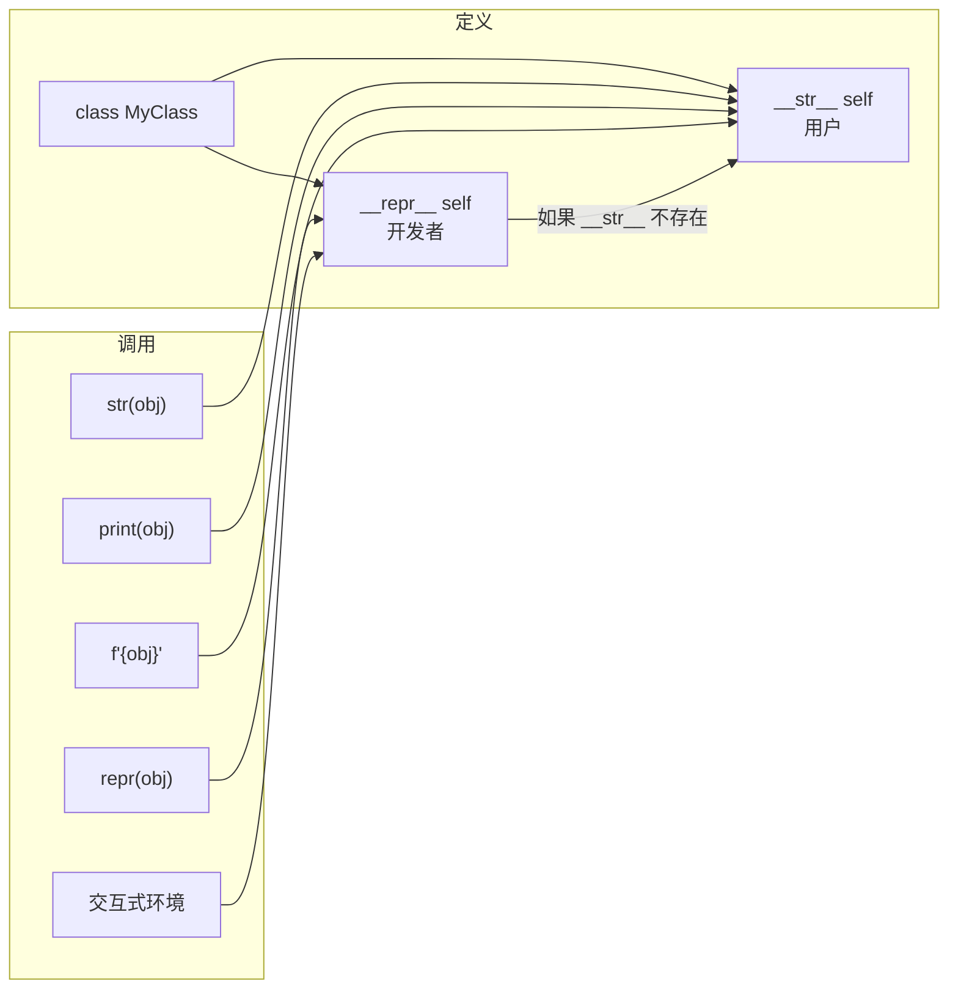
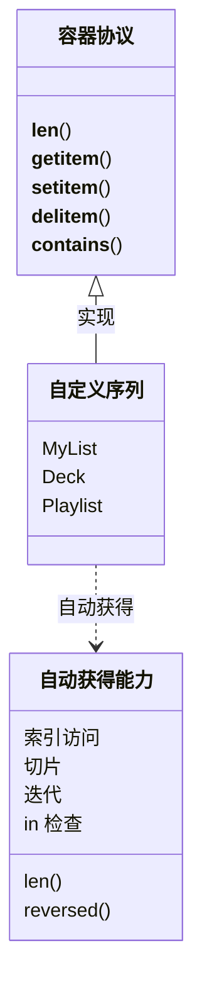
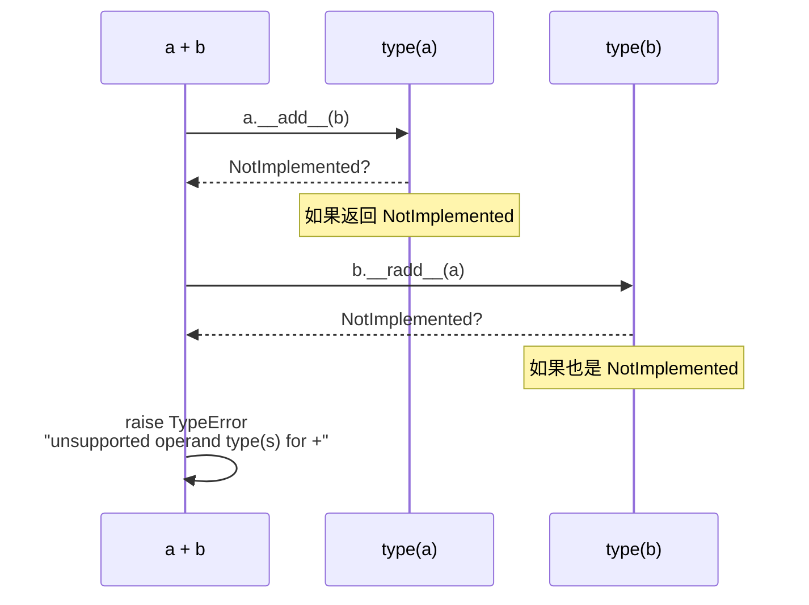
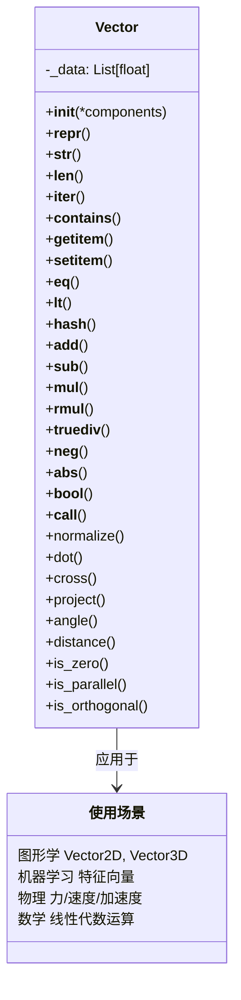

# Day 035 — 特殊方法：图解

> Mermaid 与 ASCII 示意图，帮助理解 Python 特殊方法协议

---

## 1️⃣ 字符串表示协议



### 调用优先级

```
print(obj)
    │
    ├─ __str__() 存在? ──是──→ __str__()
    │
    └─ 否
         │
         └─ __repr__() 存在? ──是──→ __repr__()
              │
              └─ 否 → 默认 <ClassName object at 0x...>
```

---

## 2️⃣ 容器协议



### 索引与切片

```
__getitem__ 行为:

    obj[5]          → obj.__getitem__(5)          ← 整数索引
    obj[1:5]        → obj.__getitem__(slice(1,5)) ← 切片
    obj[1:5:2]      → obj.__getitem__(slice(1,5,2)) ← 带步长切片
    obj["key"]      → obj.__getitem__("key")      ← 字符串键

Python 切片对象:
    slice(stop)
    slice(start, stop[, step])

    slice.indices(length) → (start, stop, step)
    # 将切片调整为给定长度的有效范围
```

---

## 3️⃣ 运算符重载工作原理



### 运算符调度过程

```
表达式: a + b
═══════════════════════════════════════

步骤 1: 调用 a.__add__(b)
  ├── 如果返回 result（非 NotImplemented）→ 返回 result ✅
  ├── 如果返回 NotImplemented → 继续步骤 2
  └── 如果抛出 TypeError → 传播异常

步骤 2: 调用 b.__radd__(a)
  ├── 如果返回 result（非 NotImplemented）→ 返回 result ✅
  └── 如果返回 NotImplemented → 步骤 3

步骤 3: 抛出 TypeError

注意: 如果 a 和 b 类型相同，Python 会先尝试
      b.__radd__(a)，因为对称性。
```

### 一元运算符

```
  -obj  →  obj.__neg__()
  +obj  →  obj.__pos__()
  ~obj  →  obj.__invert__()
  abs(obj)  →  obj.__abs__()
```

---

## 4️⃣ 完整特殊方法映射

```
Python 语法          →    特殊方法调用
═══════════════════════════════════════════════

┌─ 对象创建和销毁 ──────────────────────────┐
│ obj = MyClass()     →  __new__ + __init__ │
│ del obj             →  __del__             │
└───────────────────────────────────────────┘

┌─ 字符串 ─────────────────────────────────┐
│ str(obj)            →  __str__             │
│ repr(obj)           →  __repr__            │
│ format(obj, spec)   →  __format__          │
│ bytes(obj)          →  __bytes__           │
└───────────────────────────────────────────┘

┌─ 容器 ───────────────────────────────────┐
│ len(obj)            →  __len__             │
│ obj[key]            →  __getitem__         │
│ obj[key] = val      →  __setitem__         │
│ del obj[key]        →  __delitem__         │
│ x in obj            →  __contains__        │
│ iter(obj)           →  __iter__            │
│ next(iter)          →  __next__            │
│ reversed(obj)       →  __reversed__        │
└───────────────────────────────────────────┘

┌─ 属性 ───────────────────────────────────┐
│ obj.attr            →  __getattribute__    │
│ obj.attr (不存在)    →  __getattr__        │
│ obj.attr = val      →  __setattr__         │
│ del obj.attr        →  __delattr__         │
└───────────────────────────────────────────┘

┌─ 比较 ───────────────────────────────────┐
│ a == b              →  __eq__              │
│ a != b              →  __ne__              │
│ a < b               →  __lt__              │
│ a <= b              →  __le__              │
│ a > b               →  __gt__              │
│ a >= b              →  __ge__              │
│ hash(obj)           →  __hash__            │
│ bool(obj)           →  __bool__            │
└───────────────────────────────────────────┘

┌─ 算术 ───────────────────────────────────┐
│ a + b               →  __add__ / __radd__  │
│ a - b               →  __sub__ / __rsub__  │
│ a * b               →  __mul__ / __rmul__  │
│ a / b               →  __truediv__         │
│ a // b              →  __floordiv__        │
│ a % b               →  __mod__             │
│ a ** b              →  __pow__             │
│ a @ b               →  __matmul__          │
│ a += b              →  __iadd__            │
│ a -= b              →  __isub__            │
└───────────────────────────────────────────┘

┌─ 类型转换 ───────────────────────────────┐
│ int(obj)             →  __int__            │
│ float(obj)           →  __float__          │
│ complex(obj)         →  __complex__        │
│ bool(obj)            →  __bool__           │
└───────────────────────────────────────────┘

┌─ 可调用 ─────────────────────────────────┐
│ obj(args)            →  __call__           │
└───────────────────────────────────────────┘

┌─ 上下文管理 ─────────────────────────────┐
│ with obj as x:       →  __enter__          │
│                       →  __exit__          │
└───────────────────────────────────────────┘
```

---

## 5️⃣ 向量类设计架构



### 向量运算示意

```
加法:                   标量乘法:
  v1 = (3, 4)             v1 = (3, 4)
  v2 = (1, 2)             v1 * 2 = (6, 8)
  ──────────              ──────────
  +:  (4, 6)              ×:  (6, 8)

点积:                   叉积 (3D):
  v1 · v2                 v3 × v4
  = 3×1 + 4×2             i   j   k
  = 3 + 8                 1   0   0
  = 11                    0   1   0
                          ──────────
                          (0×0-0×1, 0×0-1×0, 1×1-0×0)
                          = (0, 0, 1)
```

---

## 6️⃣ 特殊方法使用频率

```
高频使用 (每天写):
═══════════════════
████████████████    __init__
██████████████      __str__ / __repr__
██████████████      __len__ / __getitem__
████████████        __eq__ / __hash__
████████            __call__

中频使用 (每周):
═══════════════════
████████            __add__ / __mul__
████████            __enter__ / __exit__
████                __iter__ / __next__
████                __bool__
███                 __contains__

低频使用 (每月):
═══════════════════
██                  __setitem__ / __delitem__
██                  __getattr__ / __setattr__
█                   __lt__ / __le__ / __gt__ / __ge__
█                   __format__
█                   __reversed__

极少使用 (特殊需求):
═══════════════════
                    __getattribute__
                    __del__
                    __slots__
                    __index__
                    __bytes__ / __complex__
```
