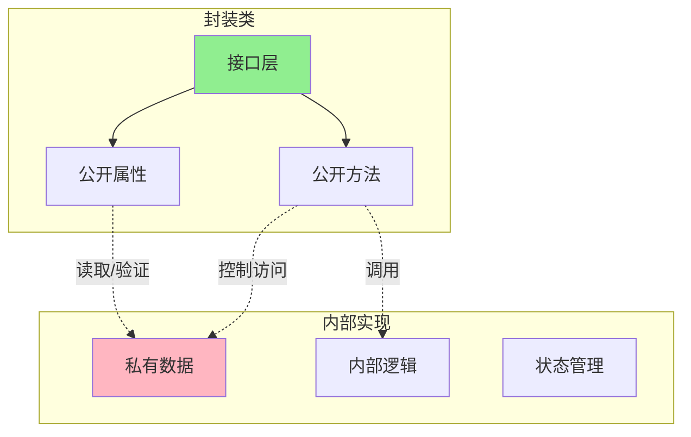
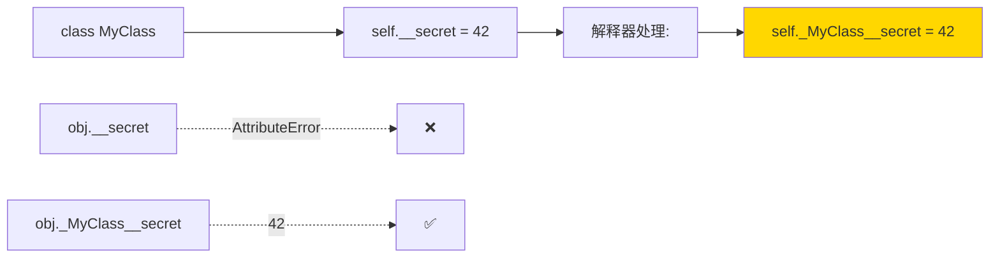
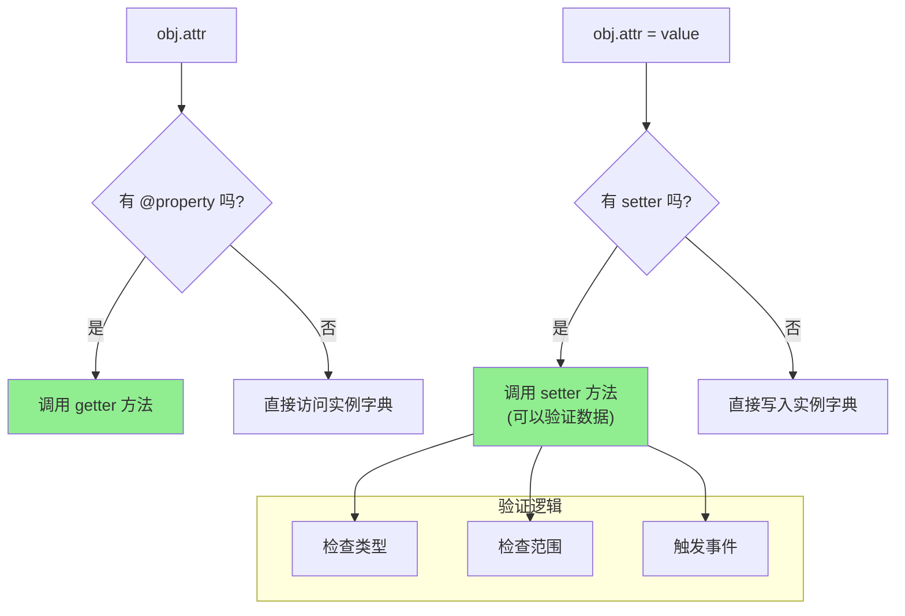
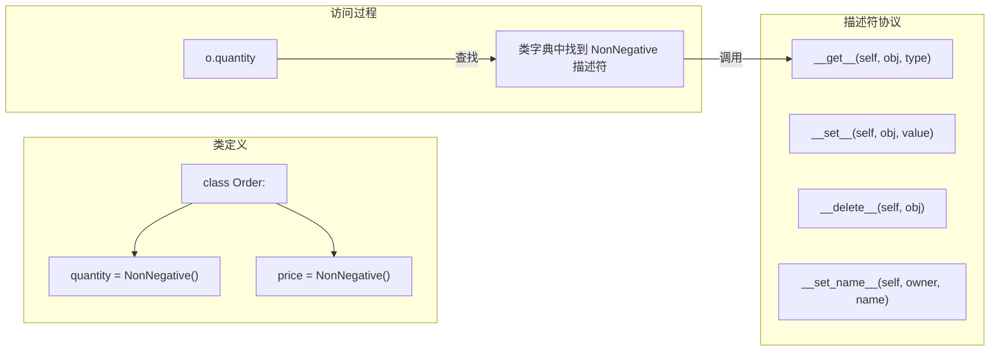
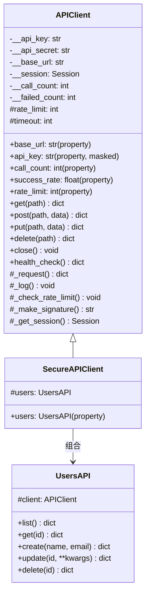

# Day 036 — 封装与数据隐藏：图解

> Mermaid 与 ASCII 示意图，帮助理解封装机制、名称改写、Property 和描述符

---

## 1️⃣ 封装的概念



### 封装的比喻

```
🚗 汽车驾驶 vs 引擎内部

    用户看到:                   用户不关心:
    ┌─────────┐                ┌──────────────────┐
    │ 方向盘   │ ← 接口          │ 燃油喷射系统      │
    │ 油门     │                │ 气缸点火时序      │
    │ 刹车     │                │ 变速箱齿轮比      │
    │ 仪表盘   │                │ ECU 控制算法      │
    └─────────┘                │ 排气催化转化      │
                               └──────────────────┘

    用户通过接口操作               内部实现可以随意修改
    接口保持一致                   不影响用户使用
```

---

## 2️⃣ 名称改写（Name Mangling）机制



### 名称改写规则

```
源代码:                    实际存储:
══════════                ══════════════

public = "公开"            public = "公开"
_protected = "受保护"      _protected = "受保护"
__private = "私有"         _ClassName__private = "私有"
__magic__ = "魔术"         __magic__ = "魔术" (不改写)
```

### 继承链中的名称改写

```mermaid
classDiagram
    class Base {
        +name: str
        _internal: str
        -__secret: str  # _Base__secret
    }

    class Derived {
        -__secret: str  # _Derived__secret
    }

    Base <|-- Derived

    note for Base: Base 的 __secret 是 _Base__secret
    note for Derived: Derived 的 __secret 是 _Derived__secret
    note for Derived: ⚠️ 它们不冲突！
```

```
实例 d = Derived()

d.__dict__:
    _Base__secret = "Base的秘密"     ← 来自 Base.__init__
    _Derived__secret = "Derived的秘密" ← 来自 Derived.__init__

d.get_base_secret():
    访问 _Base__secret → "Base的秘密"

d.get_derived_secret():
    访问 _Derived__secret → "Derived的秘密"
```

---

## 3️⃣ Python 属性约定

```
命名约定层级:

                       公开 API
                     ┌──────────┐
                     │  name    │ ← 公共接口的一部分
                     │  price   │    保证稳定
                     │  get()   │
                     └──────────┘

                   内部实现（约定）
                     ┌──────────┐
                     │  _data   │ ← 内部使用
                     │  _cache  │    可以随时修改
                     │  _init() │    子类可以访问
                     └──────────┘

                   名称改写私有
                     ┌──────────┐
                     │  __key   │ ← 避免子类覆盖
                     │  __secret│    更强的私有暗示
                     └──────────┘

                   魔术方法
                     ┌──────────┐
                     │  __init__│ ← Python 内部协议
                     │  __str__ │    不要自己发明
                     └──────────┘
```

---

## 4️⃣ @property 工作流程



### Property vs 直接属性

```
直接属性访问:                      使用 @property:
═════════════════                  ═══════════════════

class Circle:                      class Circle:
    def __init__(self, r):             def __init__(self, r):
        self.radius = r                    self._radius = r

                                     @property
c = Circle(-5)  # ✅ 可接受负数!     def radius(self):
                                         return self._radius

# 想加验证怎么办?                   @radius.setter
# 改为 set_radius() → 接口变了!     def radius(self, value):
                                         if value <= 0:
                                              raise ValueError(...)
                                     c = Circle(-5)  # ❌ ValueError
                                     c.radius = 10  # ✅ 像属性一样赋值!
```

---

## 5️⃣ 描述符协议



### 描述符访问优先级

```
obj.attr 查找顺序:
1. 数据描述符（定义了 __set__ 或 __delete__）
2. 实例 __dict__
3. 非数据描述符（只定义了 __get__）
4. 类 __dict__
5. __getattr__（如果定义了）

示例：@property 是数据描述符
     @cached_property 是非数据描述符（只定义 __get__）
```

---

## 6️⃣ 安全 API 客户端架构



---

## 7️⃣ 属性控制模式对比

```
模式                     访问控制    验证逻辑    计算属性    内存开销
══════════════════════    ═══════    ═══════    ═══════    ═══════

直接属性访问              无          无          无         低
self.x

单下划线约定              约定         无          无         低
self._x

@property                完全控制    有          有          中
@property.setter

描述符协议                可复用      可复用      可复用      高
class Validator

__getattr__              动态创建    无          N/A         无缓存
__setattr__              完全拦截
```

### 使用建议

| 需求 | 推荐方案 |
|------|---------|
| 简单属性 | `self.name` |
| 内部实现细节 | `self._internal` |
| 需要验证的计算属性 | `@property` + `.setter` |
| 多个类共用验证逻辑 | 描述符 |
| 适应未来变化 | 先 `self._x` + `@property` 后期添加 |
| 避免子类覆盖 | `__name` 名称改写 |
