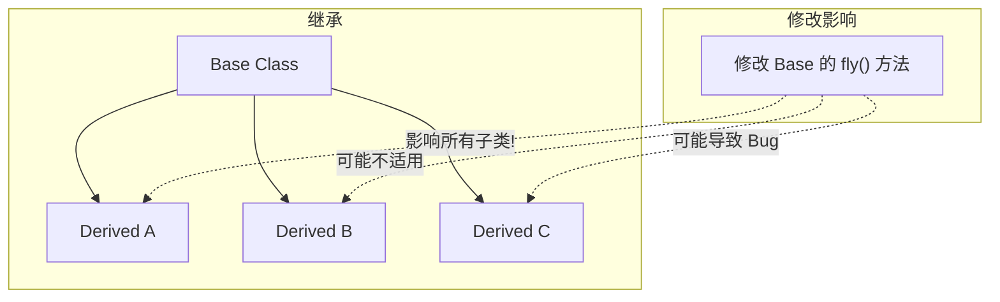
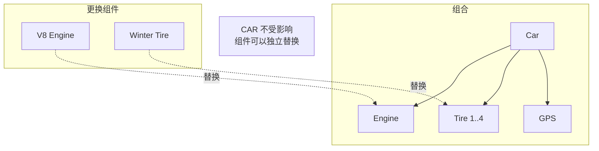
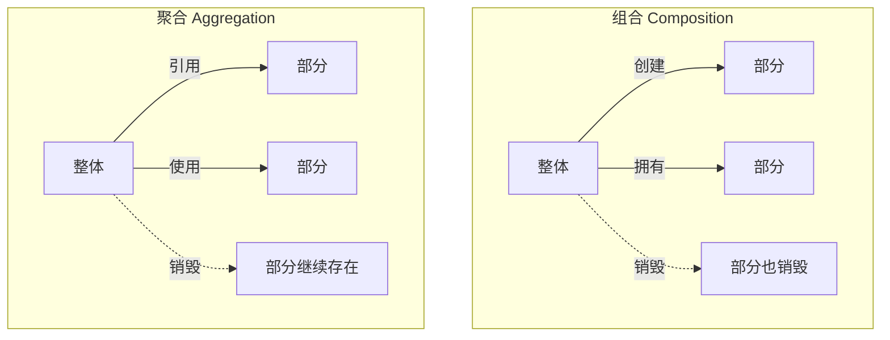
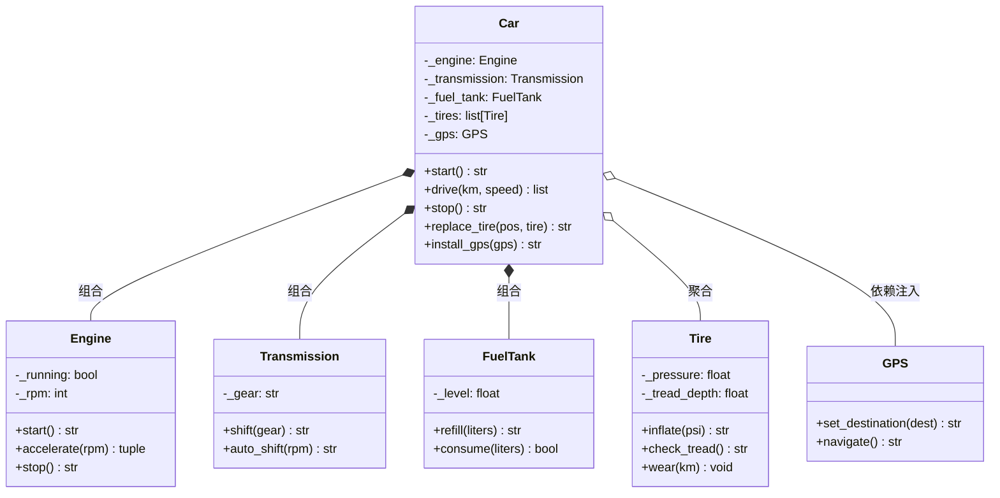

# Day 037 — 组合与聚合：图解

> Mermaid 与 ASCII 示意图，帮助理解组合、聚合、依赖注入和组合优于继承

---

## 1️⃣ 组合 vs 继承

### 继承的「脆弱的基类」问题



### 组合的优势



---

## 2️⃣ 组合（Composition）关系图

```mermaid
classDiagram
    class House {
        +rooms: list[Room]
        +address: str
        +__init__()
    }

    class Room {
        +name: str
        +area: float
        +__init__(name)
    }

    House *-- Room : 组合

    note for House: House 创建 Room
    note for House: House 销毁 → Room 也销毁
    note for Room: Room 不能独立于 House 存在
```

### 组合的生命周期

```
┌─── 时间线 ────────────────────────────────────┐

Car().__init__():
    ├── Engine.__init__()    ← 组合对象在内部创建
    ├── Transmission.__init__()
    └── FuelTank.__init__(55.0)

... 驾驶 ...

del car  (或 car 离开作用域):
    ├── FuelTank.__del__()   ← 组合对象自动销毁
    ├── Transmission.__del__()
    └── Engine.__del__()

✅ 生命周期完全由 Car 管理
```

---

## 3️⃣ 聚合（Aggregation）关系图

```mermaid
classDiagram
    class SchoolClass {
        +name: str
        +add_student(Student)
        +add_course(Course)
        +remove_student(Student)
    }

    class Student {
        +name: str
        +student_id: str
    }

    class Course {
        +name: str
        +code: str
    }

    SchoolClass o-- Student : 聚合
    SchoolClass o-- Course : 聚合

    note for SchoolClass: Student 从外部传入
    note for SchoolClass: SchoolClass 销毁 → Student 继续存在
```

### 聚合的生命周期

```
┌─── 时间线 ────────────────────────────────────┐

外部创建:
alice = Student("Alice", "S001")

class_a = SchoolClass("2026-1")
class_a.add_student(alice)    ← 聚合: 引用外部对象

del class_a                   ← 班级销毁
# alice 仍然存在!              ← 学生继续存在
print(alice.name)             → "Alice"

✅ 部分可以独立于整体存在
```

---

## 4️⃣ 组合 vs 聚合 对比



### 区别总结

```
特征                 组合                    聚合
══════════════       ══════════              ══════════

关系强度             强                      弱
生命周期             整体管理部分             部分独立
创建时机             整体构造时创建           从外部传入
销毁影响             部分一起销毁             部分继续存在
代码实现             构造器中 new             参数传入或 add()
例                   汽车 → 引擎             班级 → 学生
                    HTML → DOM 节点          图书馆 → 书籍
                    订单 → 订单项             公司 → 员工
```

---

## 5️⃣ 依赖注入（Dependency Injection）

```mermaid
flowchart LR
    subgraph 紧耦合
        A["class Service:"]
        A1["    logger = FileLogger()"]
        A1 -->|硬编码| AL["只能使用 FileLogger"]
    end

    subgraph 松耦合（DI）
        B["class Service:"]
        B1["    def __init__(self, logger):"]
        B1 -->|注入| BL["可以使用任意 Logger"]
    end

    subgraph 注入方式
        C1["构造器注入<br/>__init__(self, dep)"]
        C2["Setter 注入<br/>set_dep(self, dep)"]
        C3["方法注入<br/>method(self, dep)"]
    end
```

### 依赖注入的生命周期管理

```
┌─── 依赖注入流程 ──────────────────────────────┐

外部创建依赖:
    logger = FileLogger()
    gps = GPS("高德")

┌─── 注入到服务 ───────────────────┐
│ car = Car(brand, model)          │
│ car.install_gps(gps)   ← 注入     │
└──────────────────────────────────┘

外部管理依赖生命周期:
    # GPS 可以切换到另一个 Car
    car2 = Car("Honda", "Accord")
    car2.install_gps(gps)  ← 复用 GPS

    # 也可以替换
    gps2 = GPS("百度导航")
    car.install_gps(gps2)  ← 替换

✅ 依赖的创建和销毁由外部管理
```

---

## 6️⃣ 「组合优于继承」对比图

```mermaid
flowchart TB
    subgraph 继承方案 ❌
        I1[Bird] --> I2[fly]
        I1 --> I3[eat]
        I1 --> I4[sleep]
        I2 -.->|问题| I5[Penguin 不会飞]
    end

    subgraph 组合方案 ✅
        C1["Bird<br/>- fly_behavior<br/>- eat_behavior<br/>- sleep_behavior"]
        C1 -->|调用| C2[FlyBehavior.fly]
        C1 -->|调用| C3[EatBehavior.eat]
        C1 -->|调用| C4[SleepBehavior.sleep]

        C5["Penguin<br/>- walk_behavior<br/>- eat_behavior<br/>- sleep_behavior"]
        C5 -->|调用| C6[WalkBehavior.walk]
    end
```

### 代码复用对比

```
方案 A：继承                         方案 B：组合（推荐）
════════════════                    ════════════════════

class Bird:                         class FlyBehavior:
    def fly(self): ...                  def fly(self): ...
    def eat(self): ...

                                    class EatBehavior:
class Penguin(Bird):                     def eat(self): ...
    def fly(self):  # ❌ 会飞
        raise ...                    class Bird:
                                       def __init__(self):
class Ostrich(Bird):                      self.fly = FlyBehavior()
    def fly(self):  # ❌ 会飞               self.eat = EatBehavior()
        raise ...

                                    class Penguin:
# 层次越深问题越多                      def __init__(self):
# 违反 LSP 原则                           self.eat = EatBehavior()
                                        self.walk = WalkBehavior()
                                    # ✅ 只组合需要的功能
```

---

## 7️⃣ Car 模型架构



### 关系类型标识

```
┌─────────────────────────┐
│      关系类型图例         │
│                         │
│  *--  组合 Composition   │
│  o--  聚合 Aggregation   │
│  <|-- 继承 Inheritance   │
│  -->  依赖 Dependency    │
│  ..>  使用 Usage         │
└─────────────────────────┘
```
