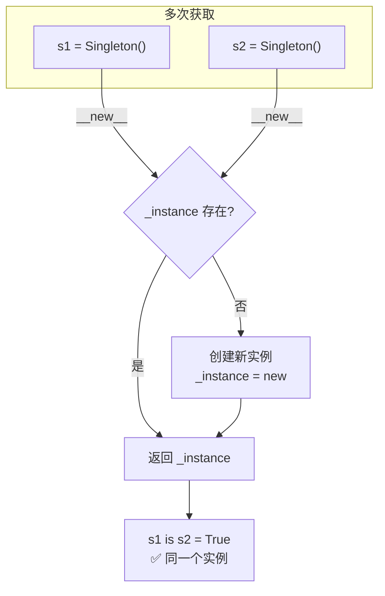
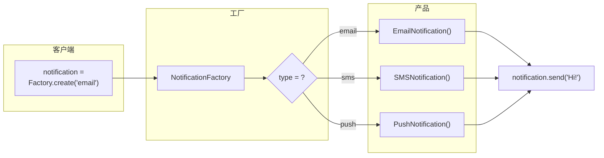
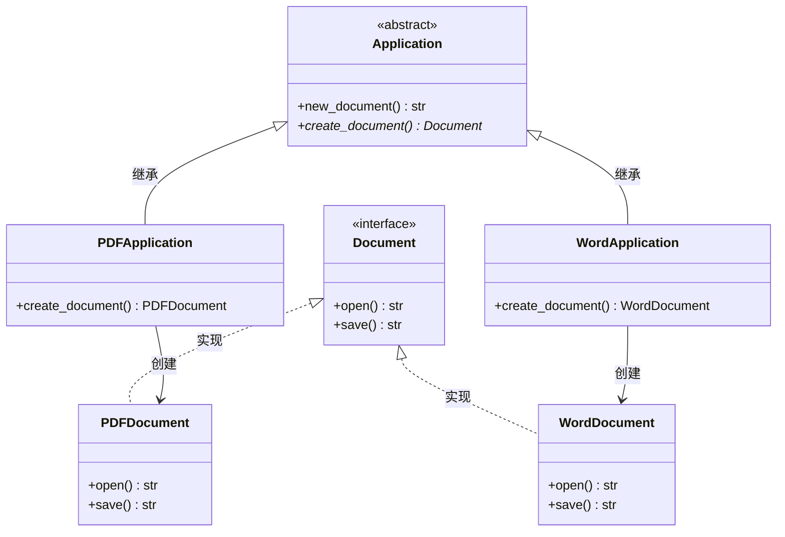
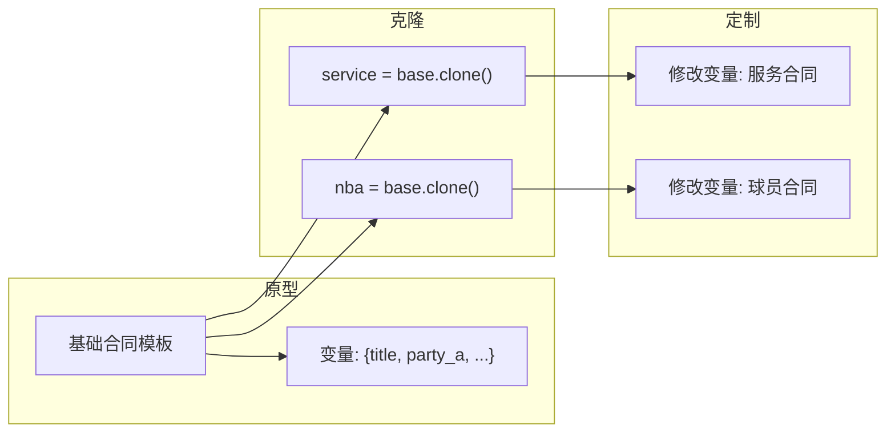
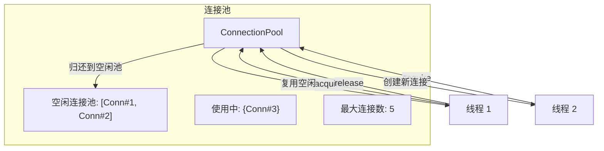
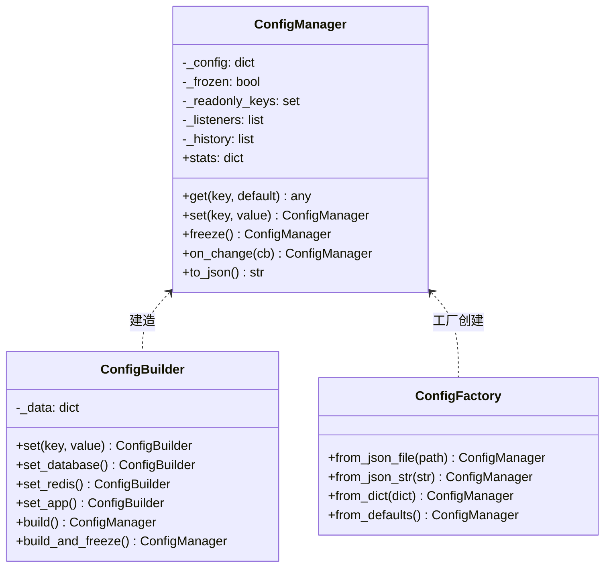

# Day 038 — 创建型设计模式：图解

> Mermaid 与 ASCII 示意图，帮助理解单例、工厂、建造者模式

---

## 1️⃣ 单例模式（Singleton）



### 三种实现方式对比

```
方式一：__new__ 方法
═══════════════════════
class Singleton:
    _instance = None

    def __new__(cls):
        if cls._instance is None:
            cls._instance = super().__new__(cls)
        return cls._instance

✅ 最 Pythonic
✅ 不多余实例化
✅ __init__ 仍会执行（需 _initialized 控制）


方式二：装饰器
═══════════════════════
@singleton
class Config:
    pass

✅ 不入侵类定义
✅ 灵活性高
❌ type(instance) 不会返回 Config


方式三：元类
═══════════════════════
class SingletonMeta(type):
    _instances = {}

    def __call__(cls, *args, **kwargs):
        ...

class Config(metaclass=SingletonMeta):
    pass

✅ type(instance) 正确
✅ 可继承
❌ 复杂度较高
```

---

## 2️⃣ 简单工厂模式



### 工厂解耦

```
❌ 不使用工厂:                     ✅ 使用工厂:

def send_notification(channel, msg, to):
    if channel == "email":            def send_notification(channel, msg, to):
        notifier = EmailNotifier()        notifier = NotificationFactory.create(channel)
    elif channel == "sms":               notifier.send(msg, to)
        notifier = SMSNotifier()
    ...

    ← 创建逻辑混杂在业务逻辑中      ← 创建逻辑集中管理
    ← 新增渠道要改多处代码          ← 新增渠道只改工厂
```

---

## 3️⃣ 工厂方法模式



### 演化过程

```
简单工厂：                    工厂方法：                    抽象工厂：
                                ┌─────────┐               ┌─────────────┐
┌──────────┐    Factory    ┌────┤App A    │   Document   │  WinFactory  │
│ Client   │───→ create()──→│    │create()─→ Doc A       │  ├─ WinButton │
└──────────┘               │    └─────────┘               │  └─ WinCheck  │
        │                  │                              │              │
        ▼                  │    ┌─────────┐               │  MacFactory  │
    ┌──────────┐           └────┤App B    │               │  ├─ MacButton│
    │ Product  │                │create()─→ Doc B         │  └─ MacCheck │
    └──────────┘                └─────────┘               └─────────────┘

    集中管理创建              创建逻辑分散到子类        创建一族相关产品
    扩展性差                  扩展性好                  产品族一致
```

---

## 4️⃣ 建造者模式（Builder）

```mermaid
flowchart TB
    subgraph 建造过程
        B["Builder"] --> S1["size(12)"]
        S1 --> S2["crust('薄脆')"]
        S2 --> S3["sauce('番茄')"]
        S3 --> S4["cheese('马苏里拉')"]
        S4 --> S5["add_topping('培根')"]
        S5 --> S6["well_done()"]
        S6 --> S7["build() → Pizza"]
    end

    subgraph Director（可选）
        D["PizzaChef"] --> T1["make_margherita()"]
        D --> T2["make_pepperoni()"]
        T1 -->|使用 Builder| P1["玛格丽特披萨"]
        T2 -->|使用 Builder| P2["辣香肠披萨"]
    end

    S7 --> P["🍕 定制披萨"]
```

### 不使用 Builder vs 使用 Builder

```
❌ 不使用 Builder:                  ✅ 使用 Builder:

# 参数太多，顺序容易错              # 链式调用，名称明确
Pizza(12, "薄脆", "番茄",           Pizza.builder()
      True, "培根", 14)               .size(12)
                                      .crust("薄脆")
# 第 4 个参数 extra_cheese?           .sauce("番茄")
# 第 5 个参数 topping?                .add_topping("培根")
# 不读文档看不懂！                     .well_done()
                                      .build()
                                  ← 一目了然！
                                  ← 可选参数可省略
```

---

## 5️⃣ 原型模式（Prototype）



### 深拷贝 vs 浅拷贝

```
原型模式本质：克隆已有对象

浅拷贝 (copy.copy):               深拷贝 (copy.deepcopy):
═══════════════════               ═══════════════════════

对象 A ──→ 对象 A'                对象 A ──→ 对象 A'
  │            │                     │              │
  ├─ attr1     ├─ attr1              ├─ attr1       ├─ attr1
  └─ attr2 ──→ 共享引用              └─ attr2 ──→  复制新对象

✅ 快速                        ✅ 完全独立
⚠️ 共享引用可能产生副作用          ❌ 较慢
```

---

## 6️⃣ 连接池（对象池模式）



---

## 7️⃣ 配置管理器设计



### 设计模式在配置管理器中的应用

```
ConfigManager (单例)
  • __new__ 确保全局唯一实例
  • _initialized 确保仅初始化一次
  • 全局访问点：get() / set()

ConfigBuilder (建造者)
  • set_database() / set_app() 等预定义配置
  • 链式调用 self return
  • build() 创建 ConfigManager

ConfigFactory (工厂)
  • from_json_file() 从文件创建
  • from_dict() 从字典创建
  • from_defaults() 创建默认配置
  • 封装不同创建方式
```
