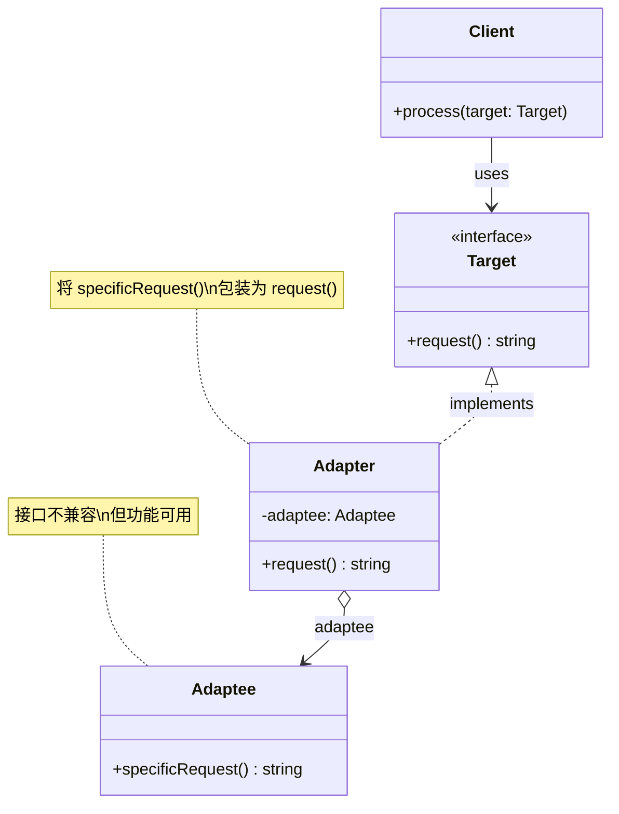
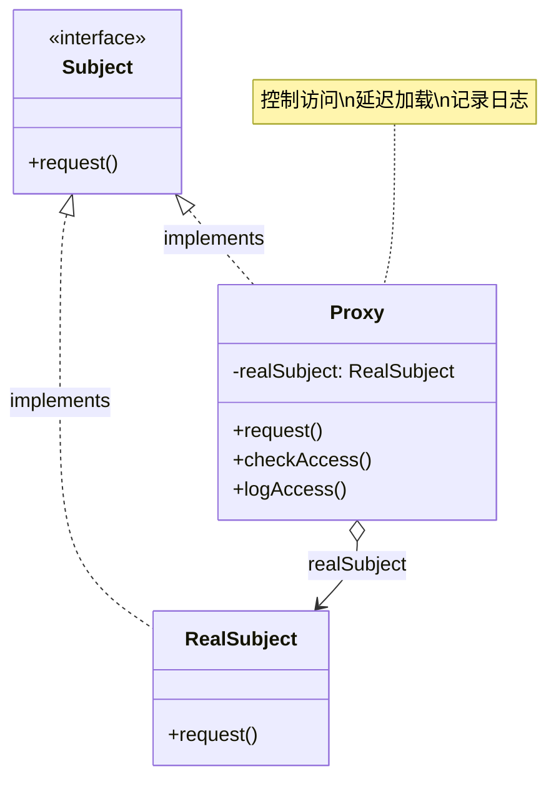
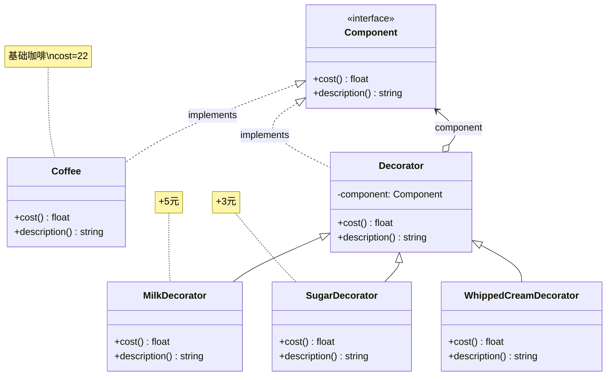

# Day 39 — 结构型模式图解

> 本文档使用 Mermaid 图和 ASCII 图展示三种核心结构型模式的工作原理和关系。

---

## 一、三种模式全景对比

```
┌─────────────────────────────────────────────────────────────────────┐
│                    结构型设计模式全景图                               │
├─────────────────────────────────────────────────────────────────────┤
│                                                                     │
│  适配器模式           代理模式                装饰器模式               │
│  ┌────────┐         ┌────────┐            ┌────────┐               │
│  │客户端  │         │客户端  │            │客户端  │               │
│  └───┬────┘         └───┬────┘            └───┬────┘               │
│      │                  │                     │                    │
│      ▼                  ▼                     ▼                    │
│  ┌────────┐         ┌────────┐            ┌────────┐               │
│  │适配器  │         │ 代理   │            │装饰器A │               │
│  └───┬────┘         └───┬────┘            └───┬────┘               │
│      │ 委派             │ 委派                 │ 委派               │
│      ▼                  ▼                     ▼                    │
│  ┌────────┐         ┌────────┐            ┌────────┐               │
│  │第三方  │         │真实对象│            │装饰器B │               │
│  └────────┘         └────────┘            └───┬────┘               │
│  ↑ 改接口            ↑ 控访问                   │ 委派              │
│                                               ▼                    │
│                                           ┌────────┐              │
│                                           │真实对象│              │
│                                           └────────┘              │
│                                           ↑ 层层叠加功能           │
└─────────────────────────────────────────────────────────────────────┘
```

## 二、适配器模式（Adapter）

### 类图



### 数据流

```
客户端 (期望 XML)        适配器                   第三方 API (JSON)
      │                    │                          │
      │ 1. get_xml_data()  │                          │
      │───────────────────▶│                          │
      │                    │ 2. fetch_weather()       │
      │                    │─────────────────────────▶│
      │                    │ 3. 返回 JSON             │
      │                    │◀─────────────────────────│
      │                    │ 4. 将 JSON 转为 XML       │
      │                    │    (遍历键值对构建 XML)   │
      │ 5. 返回 XML       │                          │
      │◀───────────────────│                          │
      ▼                    ▼                          ▼
   ✅ 收到 XML           适配器完全透明              第三方完全不知
```

## 三、代理模式（Proxy）

### 类图



### 访问流程（虚拟代理 + 保护代理）

```
    客户端                   代理                     真实对象
      │                      │                          │
      │ request()            │                          │
      │─────────────────────▶│                          │
      │                      │                          │
      │                    ┌──┴──┐                      │
      │                    │ 权限检查 │                    │
      │                    └──┬──┘                      │
      │                      │                          │
      │                  ┌────┴────┐                    │
      │                  │ 无权限?  │                    │
      │                  │  → ❌   │                    │
      │                  │ 有权限?  │                    │
      │                  │  → 继续  │                    │
      │                  └────┬────┘                    │
      │                      │                          │
      │                 ┌────┴─────┐                    │
      │                 │ 日志记录  │                    │
      │                 └────┬─────┘                    │
      │                      │                          │
      │                 ┌────┴─────┐                    │
      │                 │ 延迟创建  │                    │
      │                 │ (如未创建)│                    │
      │                 └────┬─────┘                    │
      │                      │                          │
      │                      │ request()                │
      │                      │─────────────────────────▶│
      │                      │                          │
      │                      │◀─────────────────────────│
      │                      │    处理结果              │
      │◀─────────────────────│                          │
      ▼                      ▼                          ▼
```

### 缓存代理流程图

```
                 ┌─────────────────────┐
                 │     客户端请求       │
                 └──────────┬──────────┘
                            │
                            ▼
                 ┌─────────────────────┐
                 │  缓存代理：查缓存    │
                 └──────────┬──────────┘
                            │
                ┌───────────┴───────────┐
                │                       │
            ┌───▼───┐             ┌─────▼─────┐
            │命中缓存│             │未命中缓存  │
            └───┬───┘             └─────┬─────┘
                │                       │
                ▼                       ▼
         ┌──────────┐          ┌────────────────┐
         │是否过期?  │          │ 查真实服务     │
         └──┬───────┘          │ (数据库/API)   │
            │                  └───────┬────────┘
        ┌───┴───┐                      │
        │       │                      ▼
    ┌───▼──┐ ┌──▼───┐          ┌──────────────┐
    │ 未过期│ │ 已过期 │          │ 写入缓存     │
    │ ✅   │ │  删除 │          │ (带TTL)      │
    └───┬──┘ └──────┘          └──────┬───────┘
        │                              │
        ▼                              ▼
    ┌──────────────────────────────────────┐
    │          返回结果给客户端             │
    └──────────────────────────────────────┘
```

## 四、装饰器模式（Decorator）

### 类图



### 层层装饰过程

```
基础咖啡 (22元)
┌──────────────────────────────────────┐
│              美式咖啡                  │
│  cost = 22.0                          │
│  description = "美式咖啡"              │
└──────────────────────────────────────┘
                  │
    加奶泡 (MilkDecorator)
                  │
                  ▼
┌──────────────────────────────────────┐
│           MilkDecorator               │
│  component = 美式咖啡                  │
│  cost = 22.0 + 5.0 = 27.0            │
│  description = "美式咖啡 + 奶泡"       │
└──────────────────────────────────────┘
                  │
    加焦糖 (CaramelDecorator)
                  │
                  ▼
┌──────────────────────────────────────┐
│         CaramelDecorator              │
│  component = MilkDecorator            │
│  cost = 27.0 + 3.0 = 30.0            │
│  description = "美式咖啡 + 奶泡 + 焦糖"│
└──────────────────────────────────────┘
                  │
    客户端拿到最终对象
                  ▼
          总价: 30.0 元
        描述: "美式咖啡 + 奶泡 + 焦糖"
```

### 调用栈

```
client.cost() 的调用链：

1. CaramelDecorator.cost()
   │
   ├─ 3.0 + self.component.cost()
   │        │
   │        └─ MilkDecorator.cost()
   │             │
   │             ├─ 5.0 + self.component.cost()
   │             │        │
   │             │        └─ Coffee.cost() = 22.0
   │             │
   │             └─ 返回 27.0
   │
   └─ 返回 30.0 ✅
```

## 五、三种模式的关系

### 适配器 vs 代理

```
适配器：让 A 和 B 能对话
  A ──▶ 适配器(改接口) ──▶ B

代理：替 A 控制对 B 的访问
  A ──▶ 代理(控访问) ──▶ B

关键区别：适配器改变接口，代理保持接口不变。
适配器解决的是"不兼容"，代理解决的是"控制"。
```

### 代理 vs 装饰器

```
代理：控制对对象的访问
  A ──▶ 代理(加控制) ──▶ 对象

装饰器：给对象动态加功能
  A ──▶ 装饰器A(加功能) ──▶ 装饰器B(加功能) ──▶ 对象

关键区别：
- 代理通常只包装一层，目的是控制访问
- 装饰器可以多层堆叠，目的是扩展功能
- 代理通常创建真实对象（延迟加载），装饰器不创建对象
```

### 三者的代码结构对比

```python
# 适配器模式
class Adapter(Target):
    def __init__(self, adaptee):
        self._adaptee = adaptee  # 不兼容的接口
    def request(self):            # 实现目标接口
        return self._adaptee.specific_request()

# 代理模式
class Proxy(Subject):
    def __init__(self, real_subject=None):
        self._real = real_subject  # 可延迟创建
    def request(self):
        if self.check_access():    # 访问控制
            self._real.request()

# 装饰器模式
class Decorator(Component):
    def __init__(self, component):
        self._component = component  # 已兼容的对象
    def operation(self):
        self._before()               # 前处理
        result = self._component.operation()  # 委派
        self._after()                # 后处理
        return result
```

---

> **记住三句话**：
> - 适配器 ≈ 翻译官（把英语翻译成中文）
> - 代理 ≈ 前台/秘书（帮你挡掉不必要的干扰）
> - 装饰器 ≈ 咖啡加料（基础咖啡 + 奶 + 糖 + 奶油∞）
