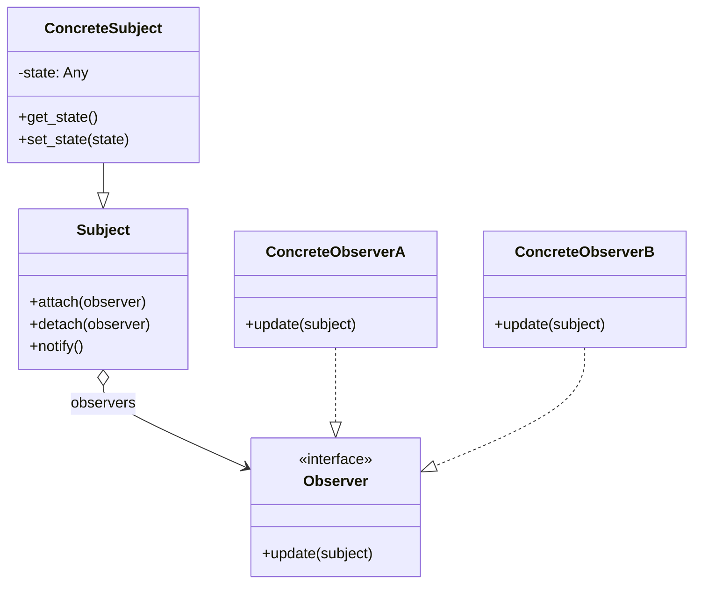
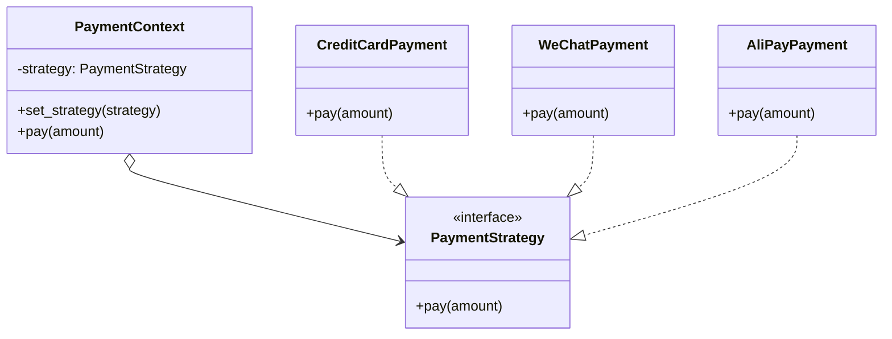
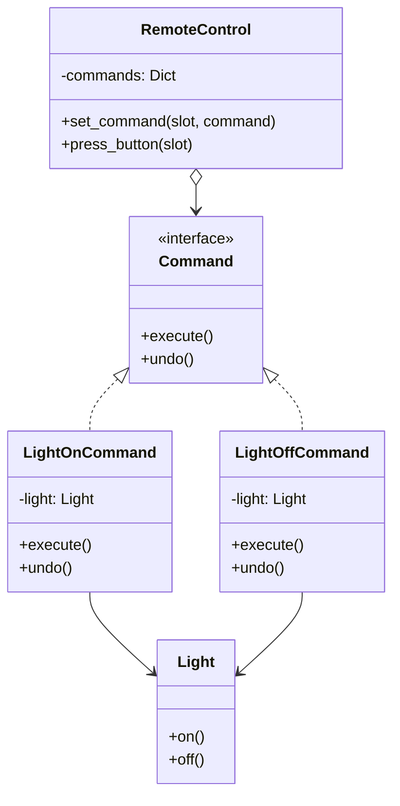

# Day 40：设计模式（行为型）

## 概述

行为型设计模式关注**对象之间的通信与职责分配**。与创建型模式（关注对象如何创建）和结构型模式（关注对象如何组合）不同，行为型模式解决了"谁做什么、如何协作"的问题。

> **核心思想**：将可变的行为从对象内部抽离出来，通过组合与委托实现灵活交互。

---

## 一、观察者模式（Observer Pattern）

### 1.1 概念

观察者模式定义了对象之间**一对多**的依赖关系，当一个对象（被观察者 / Subject）的状态发生变化时，所有依赖它的对象（观察者 / Observer）都会收到通知并自动更新。

```text
现实类比：微信公众号订阅
- 公众号（Subject）发布文章 → 所有订阅者（Observer）收到推送
- 订阅者可随时取消订阅
- 公众号不关心具体有多少订阅者
```

### 1.2 原理深入

观察者模式的底层机制是**事件驱动**的经典实现：

```
┌─────────────────────────────────────────┐
│            Subject（被观察者）             │
│  ┌──────────────────────────────────┐   │
│  │  observers: List[Observer]       │   │
│  │  ────────────────────────────    │   │
│  │  + attach(observer)             │   │
│  │  + detach(observer)             │   │
│  │  + notify(data)                 │   │
│  └──────────────────────────────────┘   │
│              │           │               │
│    ┌─────────┘    ┌──────┘               │
│    ▼              ▼                       │
│  Observer A    Observer B    Observer C   │
│  + update()    + update()    + update()   │
└─────────────────────────────────────────┘
```

**关键设计决策：**

| 机制 | 推模型（Push） | 拉模型（Pull） |
|------|---------------|---------------|
| 通知方式 | Subject 将完整数据推给 Observer | Observer 从 Subject 拉取需要的数据 |
| 优点 | Observer 无需关心数据来源 | 网络开销小，Observer 按需获取 |
| 缺点 | 可能推送不需要的数据 | Observer 需要知晓 Subject 的接口 |
| 适用 | 数据量小、结构稳定 | 数据量大、结构复杂 |

**Python 中的内置支持：**

- `property` descriptor 配合 `__setattr__` 可拦截属性变化
- `asyncio.Queue` 可实现异步观察者
- `signal` 模块可处理系统级事件

### 1.3 适用场景

| 场景 | 说明 |
|------|------|
| ✅ 事件分发系统 | UI 按钮点击、鼠标移动、键盘事件 |
| ✅ 跨系统消息通知 | 订单状态变化通知多个子系统 |
| ✅ 数据同步 | 一个数据源变化 → 多个视图更新 |
| ✅ 分布式事件 | 微服务间的 Pub/Sub 模式 |
| ❌ 观察者过多 | 大量 Observer 会导致通知性能下降 |
| ❌ 循环依赖 | A 观察 B，B 观察 A，可能死循环 |

### 1.4 类图



### 1.5 代码概要

详见 `code/01-observer-pattern.py`

---

## 二、策略模式（Strategy Pattern）

### 2.1 概念

策略模式定义一系列**可互换的算法**，并将每个算法封装在独立的类中，使它们可以在运行时相互替换。

```text
现实类比：导航 App 的路线规划
- 最短路线策略、最快路线策略、避开收费站策略
- 用户可在 App 中随时切换
- 路线规划器（Context）不关心具体算法细节
```

### 2.2 原理深入

策略模式的核心是**组合优于继承**——将算法族抽取为独立的策略接口，上下文（Context）通过委托调用策略：

```
┌───────────────────┐      ┌─────────────────────────┐
│    Context        │      │    Strategy（接口）       │
│  ─────────────    │      │  ──────────────          │
│  - strategy       │─────▶│  + execute(data)         │
│  + set_strategy() │      └─────────────────────────┘
│  + execute()      │                    │
└───────────────────┘         ┌───────────┼───────────┐
                              │           │           │
                              ▼           ▼           ▼
                    ┌───────────┐ ┌───────────┐ ┌───────────┐
                    │StrategyA  │ │StrategyB  │ │StrategyC  │
                    │execute()  │ │execute()  │ │execute()  │
                    └───────────┘ └───────────┘ └───────────┘
```

**策略模式与状态模式的对比：**

| 维度 | 策略模式 | 状态模式 |
|------|---------|---------|
| 目的 | 替换算法 | 改变行为（状态迁移） |
| 切换时机 | 由外部客户端控制 | 由内部状态对象控制 |
| 策略/状态数量 | 通常固定 | 可动态流转 |
| 上下文 | 策略与上下文状态无关 | 状态影响上下文行为 |

### 2.3 适用场景

| 场景 | 说明 |
|------|------|
| ✅ 多种相似算法 | 排序算法、压缩算法、加密算法 |
| ✅ 消除条件分支 | 替代大量 if/elif/else 或 switch |
| ✅ 运行时切换行为 | A/B 测试、功能开关 |
| ✅ 开闭原则 | 新增策略无需修改上下文 |
| ❌ 策略极少变化 | 只有两三个固定算法，过度设计 |
| ❌ 策略间有大量共享代码 | 应考虑模板方法模式 |

### 2.4 类图



### 2.5 代码概要

详见 `code/02-strategy-pattern.py`

---

## 三、命令模式（Command Pattern）

### 3.1 概念

命令模式将**请求封装为对象**，从而使你可以用不同的请求对客户进行参数化、对请求排队或记录请求日志，以及支持可撤销的操作。

```text
现实类比：餐厅点餐
- 顾客（Client）创建订单（Command）
- 服务员（Invoker）收集订单并排队
- 厨师（Receiver）根据订单执行烹饪
- 如需取消，可撤销订单
```

### 3.2 原理深入

命令模式引入**中间层**，将请求发送者与请求接收者解耦：

```
┌──────────┐      ┌─────────────┐      ┌───────────┐
│  Client  │─────▶│  Invoker    │─────▶│ Receiver  │
│          │      │  ─────────  │      │           │
│ create() │      │  execute()  │      │  action() │
└──────────┘      └─────────────┘      └───────────┘
       │                  ▲
       │                  │
       ▼                  │
  ┌───────────────────────┴──┐
  │     Command（接口）       │
  │  ──────────────           │
  │  + execute()              │
  │  + undo()        [可选]   │
  └──────────────────────────┘
              │
     ┌────────┼────────┐
     ▼        ▼        ▼
  ┌──────┐ ┌──────┐ ┌──────┐
  │CmdA  │ │CmdB  │ │CmdC  │
  │exec()│ │exec()│ │exec()│
  │undo()│ │undo()│ │undo()│
  └──────┘ └──────┘ └──────┘
```

**命令模式的四个角色：**

| 角色 | 职责 | Python 实现建议 |
|------|------|----------------|
| Command | 声明执行操作的接口 | `abc.ABC` 或 `typing.Protocol` |
| ConcreteCommand | 实现 execute，调用 Receiver | 普通类，持有 receiver 引用 |
| Invoker | 调用 Command 执行（可排队/记录） | 类内维护命令队列 |
| Receiver | 实际业务逻辑的执行者 | 普通类或函数 |

### 3.3 适用场景

| 场景 | 说明 |
|------|------|
| ✅ 撤销/重做 | 文本编辑器、图像编辑器的 Ctrl+Z |
| ✅ 操作队列 / 日志 | 异步任务队列、操作审计日志 |
| ✅ 事务性操作 | 数据库事务：全部成功或全部回滚 |
| ✅ 宏命令 | 组合多个命令为复合命令 |
| ✅ 远程调用 | RPC、命令模式天然支持序列化传输 |
| ❌ 简单操作 | 只有一个操作时过度设计 |
| ❌ 频繁变更命令签名 | 所有 ConcreteCommand 都要改 |

### 3.4 类图



### 3.5 代码概要

详见 `code/03-event-system.py`（实战：完整的基于命令模式的事件系统）

---

## 四、实战：事件系统

本节实现一个完整的**事件驱动的消息系统**，综合运用观察者模式、策略模式和命令模式：

- **观察者模式**：事件的发布与订阅
- **策略模式**：事件处理策略可插拔
- **命令模式**：事件排队、撤销、日志记录

详细代码见 `code/03-event-system.py`

---

## 五、思考题

1. **观察者模式的性能瓶颈**：如果有 10,000 个观察者同时监听一个 Subject，`notify()` 的性能会如何？如何优化？（提示：异步通知、批处理、分片）

2. **策略模式与简单工厂的区别**：策略模式通过组合替换算法，简单工厂通过条件创建对象。什么时候两者结合使用？请给出一个例子。

3. **命令模式的持久化**：如何将命令序列化保存到数据库，实现操作日志和灾难恢复？（提示：JSON 序列化 + Command ID 注册表）

4. **三种模式如何协同**：在一个 GUI 框架中，用户点击按钮（命令模式）→ 触发事件（观察者模式）→ 根据当前模式执行不同逻辑（策略模式）。请画出这个流程的关系图。

5. **Python 中的一等函数**：Python 中函数是一等公民，可以用函数替代策略模式中的策略类和观察者模式中的回调函数。这种方式的优缺点是什么？

---

## 六、小结

| 模式 | 核心思想 | 解决的痛点 | 关键技巧 |
|------|---------|-----------|---------|
| 观察者模式 | 发布-订阅，一对多通知 | 对象间的耦合通知 | 异步通知、弱引用避免内存泄漏 |
| 策略模式 | 算法封装，运行时替换 | 多重条件分支 | 结合工厂模式创建策略 |
| 命令模式 | 请求封装为对象 | 请求发送者与接收者解耦 | 支持撤销、重做、日志 |

> **一句话总结**：观察者模式告诉"谁来了通知谁"，策略模式决定"用什么方法做"，命令模式把"做什么"包装成对象。
