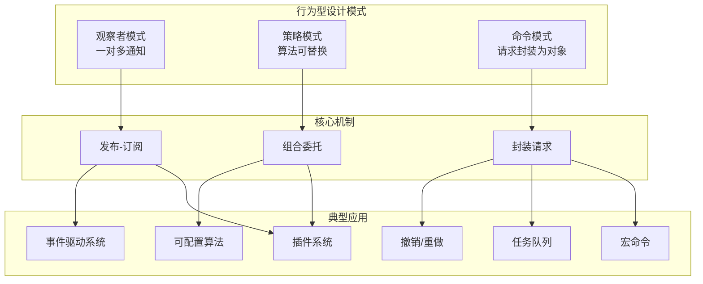
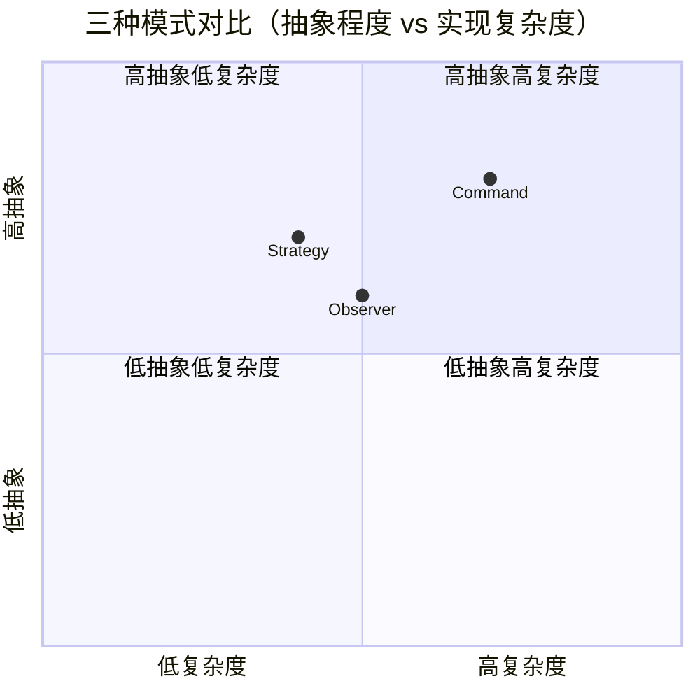

# 行为型模式关系图

## 三种行为型模式的关系



## 观察者模式内部结构

```text
┌─────────────────────────────────────────────────────────────┐
│                     Event Bus（事件总线）                      │
│                                                              │
│  ┌─────────────┐  register    ┌─────────────────────────┐    │
│  │  Publisher  │────────────▶ │     Event Channel       │    │
│  │  (生产者)    │              │   ┌──────────────────┐  │    │
│  └─────────────┘              │   │ event_type → []   │  │    │
│         │                     │   │ "order.create" →  │  │    │
│         │ publish             │   │   [handler1,      │  │    │
│         ▼                     │   │    handler2]      │  │    │
│  ┌─────────────┐  notify      │   │ "order.pay" →    │  │    │
│  │   Event     │────────────▶ │   │   [handler3]      │  │    │
│  └─────────────┘              │   └──────────────────┘  │    │
│                               └─────────────────────────┘    │
│                                            │                  │
│                                            ▼                  │
│                               ┌─────────────────────────┐    │
│                               │    Subscriber（消费者）    │    │
│                               │  - email_notifier        │    │
│                               │  - sms_notifier          │    │
│                               │  - logger                │    │
│                               └─────────────────────────┘    │
└─────────────────────────────────────────────────────────────┘
```

## 策略模式与上下文关系

```text
                          ┌───────────────────┐
                          │    Context        │
                          │  （上下文对象）     │
                          │                   │
                          │  + set_strategy() │
                          │  + execute()      │
                          └────────┬──────────┘
                                   │
                    ┌──────────────┼──────────────┐
                    │              │              │
                    ▼              ▼              ▼
          ┌─────────────────┐ ┌─────────────┐ ┌─────────────┐
          │  Strategy A      │ │ Strategy B  │ │ Strategy C  │
          │  ─────────       │ │ ─────────   │ │ ─────────   │
          │  "简单模式"       │ │ "进阶模式"   │ │ "专家模式"   │
          │  复杂度: O(n)    │ │ 复杂度: O(n²)│ │ 复杂度: O(1)│
          │  准确率: 80%     │ │ 准确率: 95%  │ │ 准确率: 99%  │
          └─────────────────┘ └─────────────┘ └─────────────┘
                         ▲                    ▲
                         │                    │
                         └───── 可互换 ───────┘
```

## 命令模式执行流程

```text
时间线 ──────────────────────────────────────────────────▶

① 创建命令            ② 调用执行           ③ 接收者执行
                      
   Client                  Invoker                 Receiver
   │                        │                        │
   │── create cmd ───────▶ │                        │
   │                        │── execute(cmd) ──────▶│
   │                        │                        │── do_action()
   │                        │◀────── result ────────│
   │                        │                        │
   │                        │   ④ 可选：记录、撤销    │
   │                        │── log(cmd) ──────────▶│
   │                        │── undo_queue.push(cmd) │
   │◀───── 返回结果 ────────│                        │
```

## Python 实现建议

```python
# ── 抽象基类方案（标准 OOP）──
from abc import ABC, abstractmethod

class Observer(ABC):
    @abstractmethod
    def update(self, data): ...

# ── Protocol 方案（鸭子类型）──
from typing import Protocol

class Observer(Protocol):
    def update(self, data): ...

# ── 函数式方案（轻量级）──
# 直接用 Callable[[Any], None] 替代观察者类
from typing import Callable

Observer = Callable[[Any], None]
```

## 三种模式的优劣权衡


