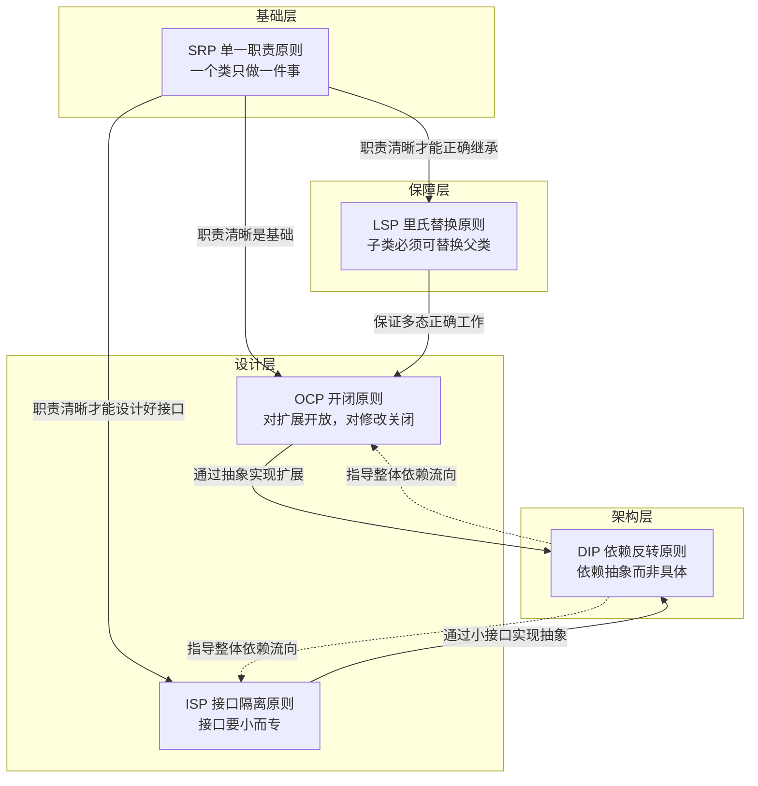
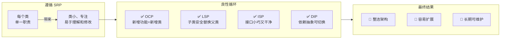
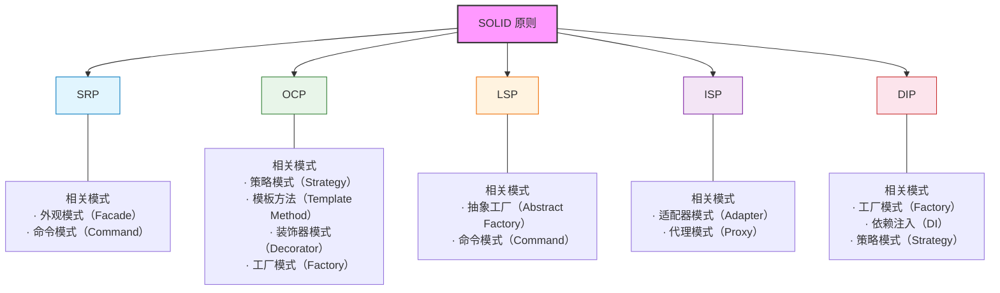
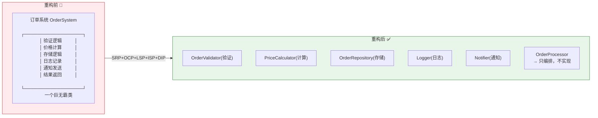

# Day 41 — SOLID 原则关系图解

> 本章节包含 SOLID 五大原则之间的关系图解，帮助理解它们如何协同工作。

---

## 1. SOLID 原则关系总图



---

## 2. 违反 SOLID 的连锁反应


---

## 3. 遵循 SOLID 的良性循环



---

## 4. SOLID 原则与对应设计模式



---

## 5. 每个原则的一句话速记

```
┌──────────────────────────────────────────────────────┐
│                                                      │
│  SRP = 一个类只做一件事，专心才能做得好                  │
│                                                      │
│  OCP = 加功能就加类，改已有的代码要慎重                   │
│                                                      │
│  LSP = 子类得能完全顶替父类，不能偷偷改契约                │
│                                                      │
│  ISP = 接口要小而专，别让用户依赖不需要的东西               │
│                                                      │
│  DIP = 依赖抽象不依赖具体，接口是模块间的桥梁               │
│                                                      │
└──────────────────────────────────────────────────────┘
```

---

## 6. ASCII 关系图

```
                   ╔═══════════════════════════════════╗
                   ║        DIP  依赖反转原则           ║
                   ║     决定模块间的依赖方向            ║
                   ╚═══════════╦═══════════════════╝
                               ║
              ┌────────────────╬────────────────┐
              ║                ║                ║
    ╔═════════╬═══════╗  ╔════╬════════╗  ╔═══╬═════════╗
    ║  OCP           ║  ║   ISP    ║  ║  LSP           ║
    ║ 开闭原则        ║  ║ 接口隔离  ║  ║ 里氏替换        ║
    ║ 扩展开放        ║  ║ 小而专    ║  ║ 可替换性        ║
    ╚════════════════╝  ╚══════════╝  ╚════════════════╝
                               ║
                   ╔═══════════╩═══════════════════╗
                   ║        SRP  单一职责原则       ║
                   ║    所有原则的基础和出发点       ║
                   ╚═══════════════════════════════╝

    关系解读：
    • SRP 是地基：职责清晰才谈得上扩展、替换和隔离
    • OCP 追求弹性：允许无伤新增功能
    • LSP 保证安全：多态替换不出错
    • ISP 讲究精准：接口刚好够用
    • DIP 是顶层架构：控制依赖的方向
```

---

## 7. 重构前后的代码结构对比


