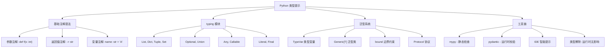
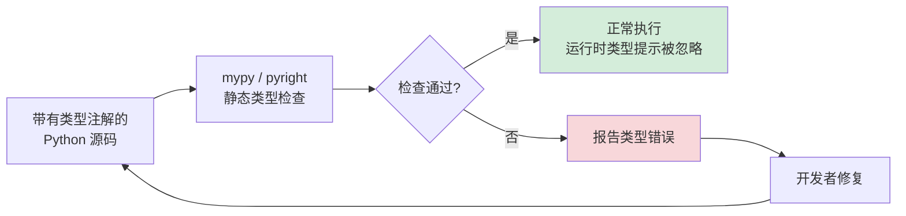

# Day 42：类型提示与检查

> 类型提示让 Python 代码更可读、更可维护，配合类型检查工具可以在开发阶段捕获大量隐藏错误。

---

## 概述

Python 3.5 引入了 `typing` 模块，提供了标准化的类型提示（Type Hints）语法。类型提示**不会影响运行时行为**，但可以被以下工具使用：

- **静态类型检查器**：mypy、pyright、pytype
- **IDE 智能提示**：VS Code（Pylance）、PyCharm
- **运行时验证**：pydantic、typeguard

```python
def greet(name: str) -> str:
    return f"Hello, {name}"
```

`name: str` 表示参数类型为 `str`，`-> str` 表示返回值类型为 `str`。仅此而已。

---

## 1. typing 模块详解

### 1.1 基础容器类型

```python
from typing import List, Dict, Tuple, Set

# 列表
names: List[str] = ["Alice", "Bob"]

# 字典
scores: Dict[str, int] = {"Alice": 95, "Bob": 87}

# 元组（固定长度，每个位置独立类型）
point: Tuple[float, float] = (1.0, 2.0)

# 集合
tags: Set[str] = {"python", "typing"}
```

> **Python 3.9+ 更新**：可以直接使用 `list[str]`、`dict[str, int]` 等内置泛型，不再需要从 `typing` 导入。

### 1.2 Optional 与 Union

```python
from typing import Optional, Union

# Optional[X] 等价于 Union[X, None]
# 表示值可能是 str，也可能是 None
def find_user(uid: int) -> Optional[str]:
    if uid == 1:
        return "Alice"
    return None  # 合法

# Union：多个可能的类型
def process(value: Union[int, float, str]) -> str:
    return str(value)
```

**Optional 的两种写法等价：**

```
Optional[str]  ≡  Union[str, None]  ≡  str | None (3.10+)
```

### 1.3 Any 与 类型逃生口

```python
from typing import Any

# Any 表示"任意类型"——类型检查器会跳过该值
def log(message: Any) -> None:
    print(message)
```

**最佳实践：** 尽量少用 `Any`，它绕过了所有类型检查。

### 1.4 Callable

```python
from typing import Callable

# Callable[[参数类型], 返回值类型]
def execute_handler(handler: Callable[[str, int], bool], data: str) -> None:
    if handler(data, 42):
        print("Handler succeeded")
```

---

## 2. 泛型与 TypeVar

### 2.1 TypeVar：类型变量

```python
from typing import TypeVar, List

T = TypeVar("T")  # 定义类型变量 T

def first(items: List[T]) -> T:
    return items[0]

# first([1, 2, 3]) → T 被推断为 int
# first(["a", "b"]) → T 被推断为 str
```

### 2.2 约束类型变量

```python
from typing import TypeVar

# T 只能是 int 或 float
Number = TypeVar("Number", int, float)

def add(a: Number, b: Number) -> Number:
    return a + b  # 类型检查器知道这里是 int+int 或 float+float
```

### 2.3 带边界的 TypeVar

```python
from typing import TypeVar

class Animal:
    def speak(self) -> str:
        return "..."

class Dog(Animal):
    def speak(self) -> str:
        return "Woof!"

# T 必须是 Animal 或其子类
TAnimal = TypeVar("TAnimal", bound=Animal)

def make_speak(animal: TAnimal) -> TAnimal:
    print(animal.speak())
    return animal  # 返回类型保持了原始类型（Dog 返回 Dog，不是 Animal）
```

### 2.4 自定义泛型类

```python
from typing import Generic, TypeVar, List

T = TypeVar("T")

class Stack(Generic[T]):
    def __init__(self) -> None:
        self._items: List[T] = []
    
    def push(self, item: T) -> None:
        self._items.append(item)
    
    def pop(self) -> T:
        return self._items.pop()

# 使用
int_stack = Stack[int]()
int_stack.push(1)
int_stack.push(2)
value = int_stack.pop()  # 类型推断为 int
```

---

## 3. 图解：类型提示体系



### 类型检查流程



---

## 4. 运行时类型检查：pydantic 简介

类型提示默认只在静态检查时生效，运行时 Python 会忽略它们。但我们可以用 **pydantic** 在运行时验证数据：

```python
from pydantic import BaseModel, ValidationError

class User(BaseModel):
    id: int
    name: str
    age: int
    email: str | None = None  # Python 3.10+ 语法，等价于 Optional[str]

# 有效数据
user = User(id=1, name="Alice", age=30)

# 无效数据 → 抛出 ValidationError
try:
    User(id="not-a-number", name="Bob", age="old")
except ValidationError as e:
    print(e)  # 详细的字段级错误信息
```

**pydantic 的特点：**
- 基于类型注解自动进行数据验证
- 支持 JSON 序列化/反序列化
- 自定义验证器（`@field_validator`）
- 广泛用于 FastAPI 等框架

---

## 5. 实战：类型安全的 API 封装

以下是一个完整的类型安全 HTTP API 客户端示例：

```python
from dataclasses import dataclass
from typing import Optional, Any, Dict, List
import json
import urllib.request
import urllib.error


@dataclass
class GitHubUser:
    """GitHub 用户数据模型"""
    login: str
    id: int
    name: Optional[str] = None
    public_repos: int = 0
    followers: int = 0


@dataclass
class ApiResponse:
    """通用 API 响应"""
    success: bool
    data: Optional[Any] = None
    error: Optional[str] = None


class GitHubClient:
    """类型安全的 GitHub API 客户端"""
    
    BASE_URL = "https://api.github.com"
    
    def _request(self, endpoint: str) -> ApiResponse:
        url = f"{self.BASE_URL}{endpoint}"
        try:
            req = urllib.request.Request(url, headers={"User-Agent": "Python"})
            with urllib.request.urlopen(req) as resp:
                data: Dict[str, Any] = json.loads(resp.read().decode())
                return ApiResponse(success=True, data=data)
        except urllib.error.HTTPError as e:
            return ApiResponse(success=False, error=f"HTTP {e.code}: {e.reason}")
        except Exception as e:
            return ApiResponse(success=False, error=str(e))
    
    def get_user(self, username: str) -> ApiResponse:
        """获取 GitHub 用户信息"""
        return self._request(f"/users/{username}")
    
    def parse_user(self, resp: ApiResponse) -> Optional[GitHubUser]:
        """将 API 响应解析为 GitHubUser"""
        if not resp.success or not resp.data:
            return None
        data: Dict[str, Any] = resp.data
        return GitHubUser(
            login=data.get("login", ""),
            id=data.get("id", 0),
            name=data.get("name"),
            public_repos=data.get("public_repos", 0),
            followers=data.get("followers", 0),
        )
```

完整的可运行代码见 `code/03-type-safe-api.py`。

---

## 6. 最佳实践总结

| 原则 | 说明 |
|------|------|
| **从公共 API 开始** | 优先为导出函数、类方法加类型注解 |
| **避免过度使用 Any** | Any 意味着放弃类型检查 |
| **用 Protocol 替代 Duck Typing** | 定义协议而非继承 |
| **Python 3.10+ 使用 `X \| Y`** | `str \| int` 比 `Union[str, int]` 更简洁 |
| **Python 3.9+ 使用内置泛型** | `list[int]` 而非 `List[int]` |
| **配置 mypy** | 在 `pyproject.toml` 中配置严格模式 |
| **CI 中运行类型检查** | 作为 CI 流水线的一部分 |

---

## 思考题

1. **Optional 的含义**：`Optional[str]` 和 `Union[str, None]` 是完全等价的吗？`str | None` 和它们有什么区别（Python 版本相关）？

2. **类型擦除**：Python 类型提示在运行时会被擦除，那么 `isinstance(x, list[int])` 会怎样？为什么？

3. **TypeVar vs Protocol**：假设你想写一个函数，可以接受任何有 `.speak()` 方法的对象。你会用 `TypeVar(bound=...)` 还是 `Protocol`？为什么？

4. **协变与逆变**：`List[Dog]` 是 `List[Animal]` 的子类型吗？`Callable[[Animal], None]` 和 `Callable[[Dog], None]` 之间有什么类型关系？

5. **运行时 vs 静态**：类型提示能被用作运行时验证吗？pydantic 是如何做到无需显式调用验证器的？

---

> **延伸阅读：** [PEP 483 – The Theory of Type Hints](https://peps.python.org/pep-0483/) | [mypy 官方文档](https://mypy-lang.org/)
