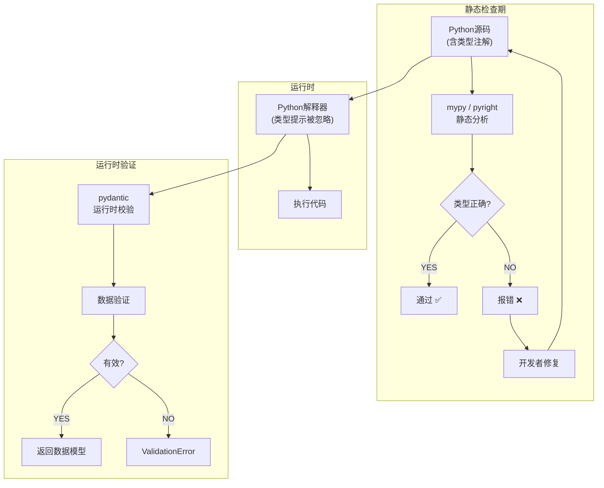
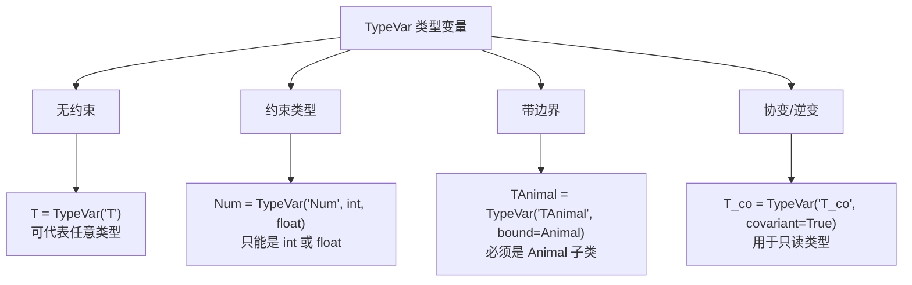

# 类型提示体系图解

## 1. 类型提示全景图



## 2. 常用类型速查表

```mermaid
flowchart LR
    subgraph 容器类型
        A1[list[int]] -->|元素| A2[int]
        B1[dict[str,int]] -->|键| B2[str]
        B1 -->|值| B3[int]
        C1[tuple[str,int,float]] -->|位置0| C2[str]
        C1 -->|位置1| C3[int]
        C1 -->|位置2| C4[float]
    end

    subgraph 特殊类型
        D[Optional[str]] -->|等价| E[Union[str, None]]
        D -->|等价3.10+| F["str | None"]
        G[Any] -->|任意类型| H[跳过检查]
        I[Callable[[int,str],bool]] -->|签名| J["(int, str) → bool"]
    end
```

## 3. TypeVar 系统图解



## 4. 泛型类结构

```
Generic[T]
  │
  ├── class Stack(Generic[T]):
  │       def push(self, item: T) -> None
  │       def pop(self) -> T
  │
  │   stack = Stack[int]()
  │   stack.push(1)     # OK
  │   stack.push("a")   # mypy 报错
  │
  └── 类型推断
        Stack[int] → self._items: List[int]
                    → push(int)  ✅
                    → push(str)  ❌
```

## 5. 类型安全性层级

```
层级 1: 无类型提示
  def add(a, b): return a + b
  → 传字符串也运行，结果可能出乎意料 😱

层级 2: 基础类型提示 (Python 3.5+)
  def add(a: int, b: int) -> int: return a + b
  → 传字符串时 mypy 报错，但运行时照常执行 😊

层级 3: 严格模式 (mypy --strict)
  → 禁止隐式 Any、要求返回值注解、检查 None 安全
  → 代码质量大幅提升 👍

层级 4: 运行时验证 (pydantic)
  → 在边界验证外部数据（API 输入、配置文件、用户提交数据）
  → 类型安全从"建议"变为"强制" 💪
```

## 6. ASCII 备忘：核心类型关系

```
                   ┌───────────────┐
                   │   Iterable    │  ← 协议（可迭代）
                   └───────┬───────┘
                           │
               ┌───────────┼───────────┐
               │           │           │
          ┌────┴────┐ ┌───┴───┐ ┌────┴────┐
          │  List   │ │  Set  │ │  Dict   │  ← 容器类型
          └─────────┘ └───────┘ └─────────┘
                                        │
                                        │  ┌──────────┐
                                        ├──│ DefaultDict│
                                        │  └──────────┘
                                        │  ┌──────────┐
                                        └──│ OrderedDict│
                                           └──────────┘

                   ┌──────────────────┐
                   │   Optional[T]    │  = Union[T, None] = T | None
                   └──────────────────┘

                   ┌──────────────────┐
                   │  TypeVar('T')    │  → 泛型类型变量
                   └──────────────────┘

                   ┌──────────────────┐
                   │  Protocol        │  → 结构子类型（鸭子类型）
                   └──────────────────┘
```
