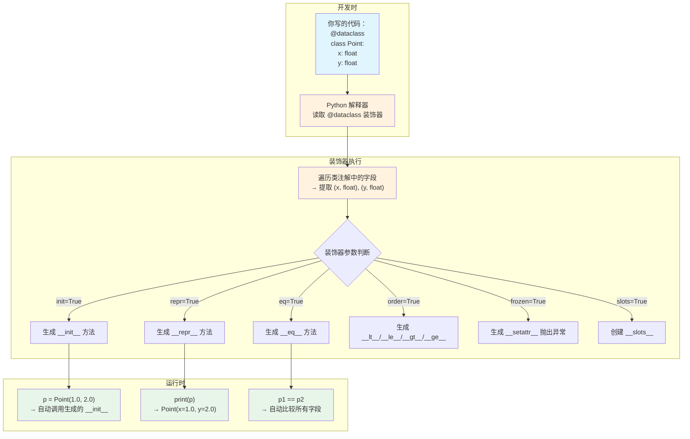
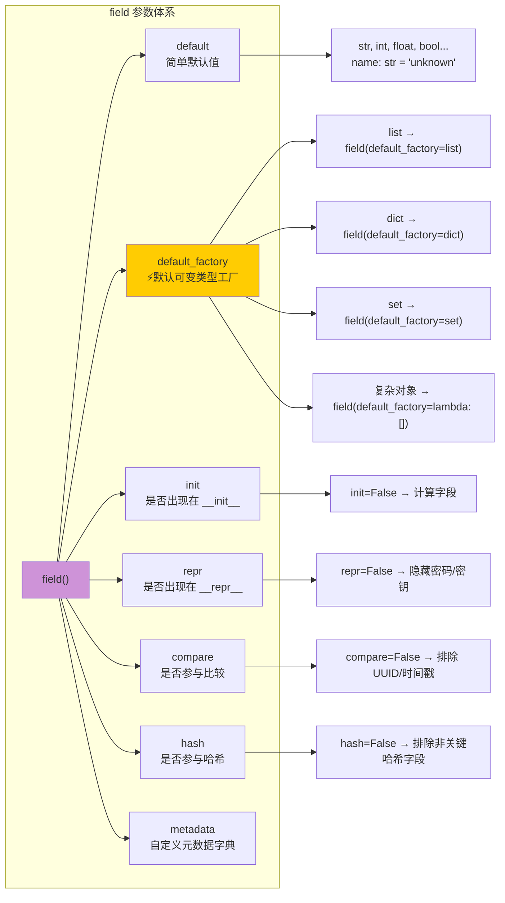
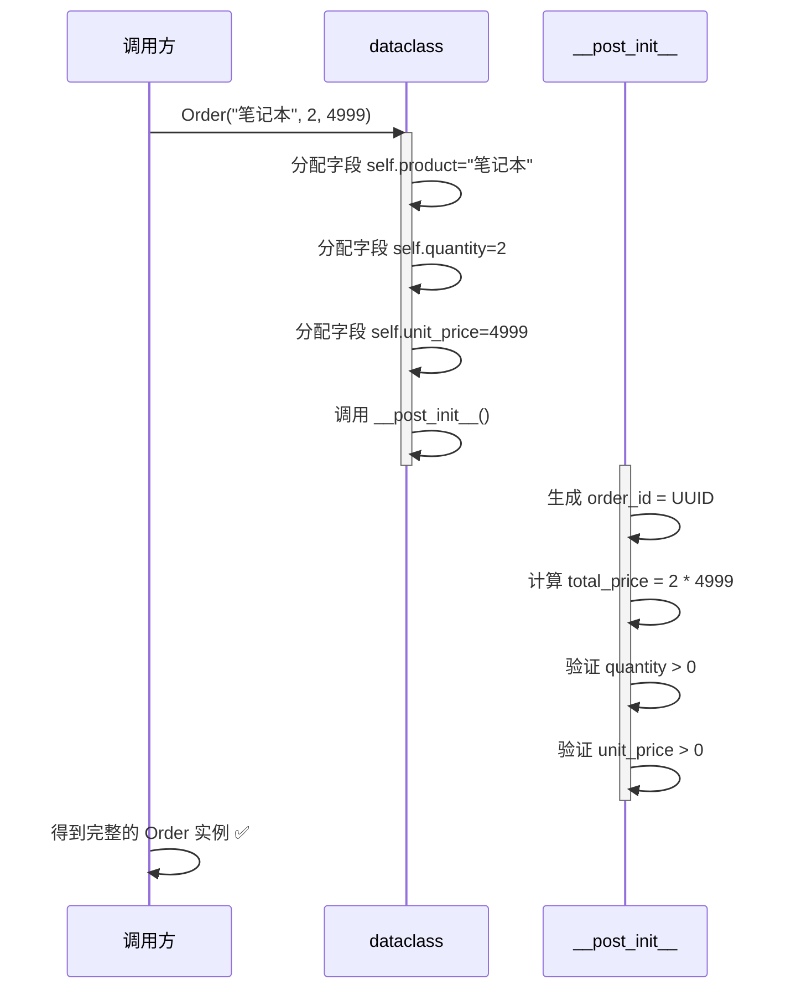
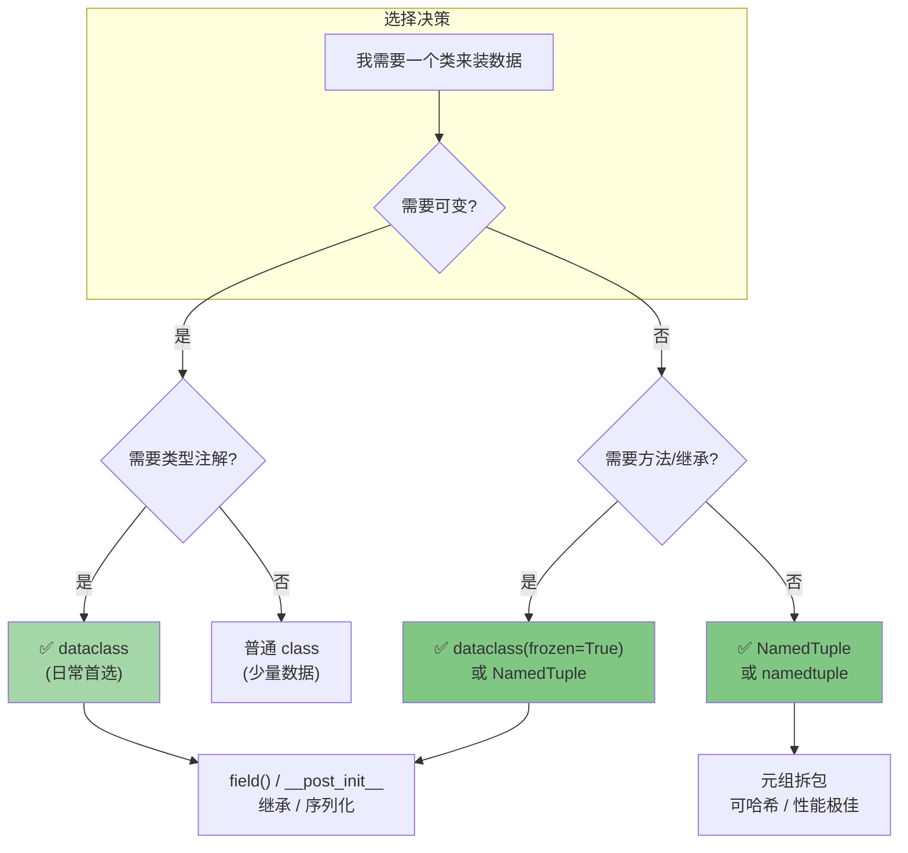
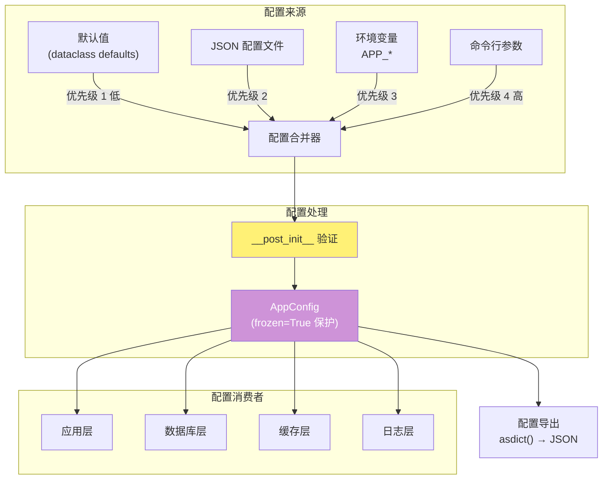

# dataclass 底层实现原理图解

## 1. dataclass 装饰器做了什么？



## 2. field() 参数解析



## 3. __post_init__ 执行流程



## 4. dataclass vs namedtuple vs 普通类



## 5. 可变默认值陷阱图解

```mermaid
flowchart LR
    subgraph ❌ 错误：共享引用
        A1["@dataclass
        class Bad:
            items: list = []

        b1 = Bad()
        b2 = Bad()"] --> A2["b1.items is b2.items
        → True (同一对象!)"]
        A2 --> A3["b1.items.append('x')
        → b2.items 也被修改了！😱"]
    end

    subgraph ✅ 正确：独立副本
        B1["@dataclass
        class Good:
            items: list = field(default_factory=list)

        g1 = Good()
        g2 = Good()"] --> B2["g1.items is g2.items
        → False (独立对象)"]
        B2 --> B3["g1.items.append('x')
        → g2.items 不受影响 ✅"]
    end

    style A3 fill:#ffcdd2
    style B3 fill:#c8e6c9
```

## 6. 配置管理架构图



## 7. ASCII 速查：dataclass 核心概念关系

```
                    ┌─────────────────────────────────┐
                    │         @dataclass               │
                    │  自动生成模板方法               │
                    └──────────┬──────────────────────┘
                               │
              ┌────────────────┼──────────────────┐
              │                │                  │
        ┌─────▼─────┐   ┌─────▼─────┐    ┌───────▼───────┐
        │   field()  │   │__post_init│    │ 装饰器参数    │
        │ 精细字段控制│   │  后处理   │    │ 全局行为控制  │
        └─────┬─────┘   └─────┬─────┘    └───────┬───────┘
              │               │                   │
    ┌─────────┼─────────┐     │              ┌────┴────┐
    │         │         │     │              │         │
  default_factory  compare    │            frozen    order
  (可变默认值)  (排除比较)  验证/转换      (不可变)  (自排序)
    │         │         │     │              │         │
  repr=False  hash=False│     │            slots    unsafe_hash
  (隐藏字段)  (控制哈希) │     │           (内存优化) (强制哈希)
                        │     │
                        ▼     ▼
                   ┌──────────────────┐
                   │ 最终生成的方法集 │
                   │ __init__, __repr__│
                   │ __eq__, __hash__  │
                   │ __lt__~__ge__     │
                   │ __setattr__ (frozen)│
                   └──────────────────┘
```
