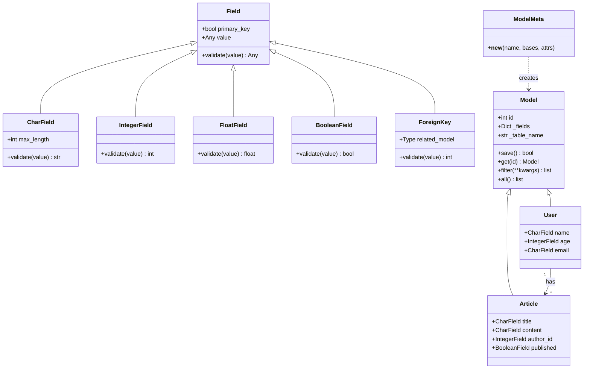
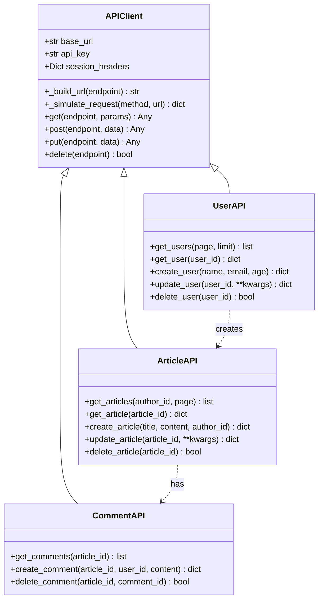
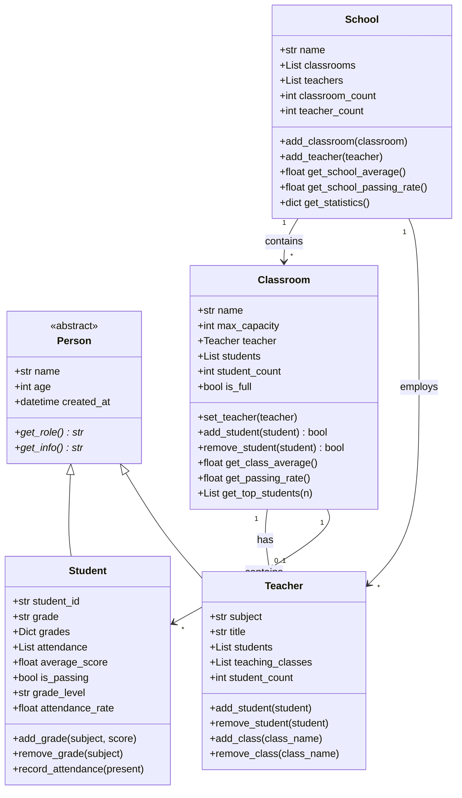
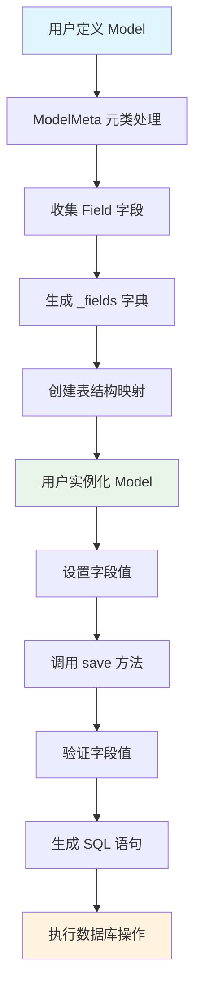
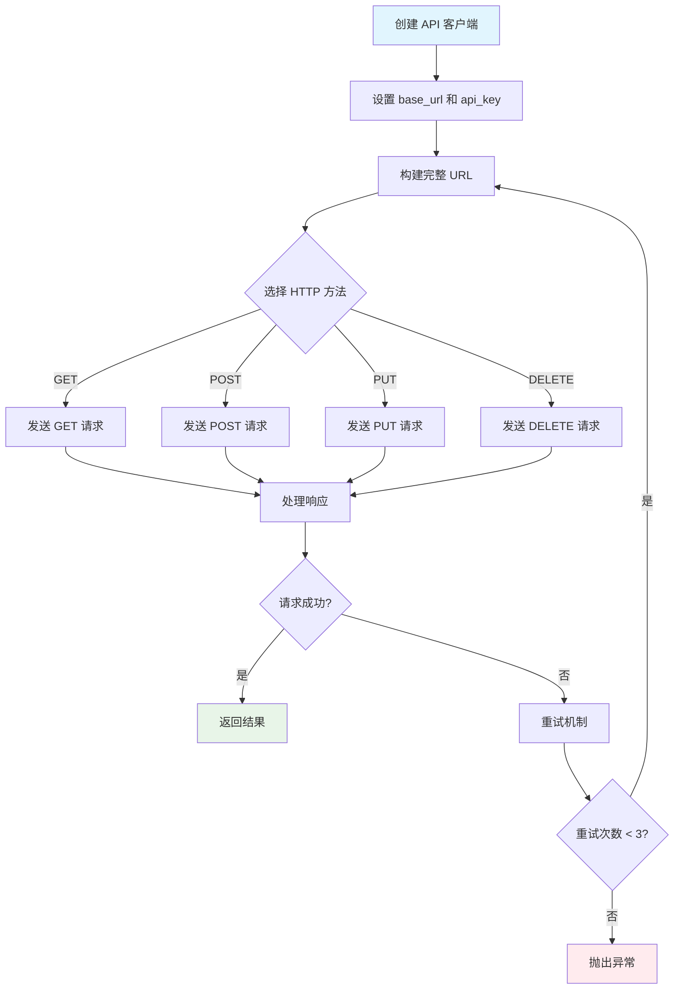
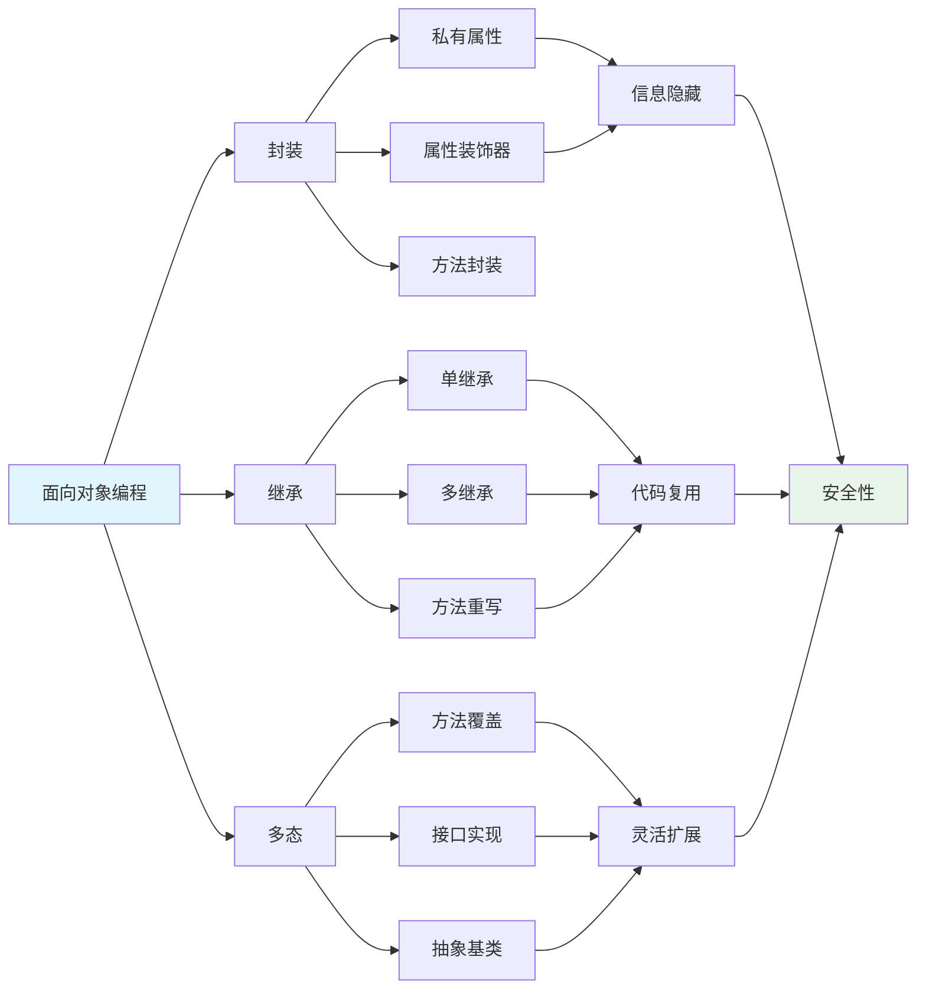

# Day 045 - 图解

## ORM 框架类结构



## REST API 客户端结构



## 学生管理系统结构



## ORM 工作流程



## REST API 请求流程



## 面向对象核心概念关系



---

## 核心设计模式

### 1. 元类模式（ORM 框架）
```
用户代码 → 元类处理 → 类定义 → 实例化 → 使用
```

### 2. 继承模式（API 客户端）
```
基类（通用功能）→ 子类（业务逻辑）→ 使用
```

### 3. 组合模式（学生系统）
```
School → Classroom → Student/Teacher
```

### 4. 装饰器模式（重试机制）
```
函数 → 装饰器包装 → 增强功能 → 调用
```
