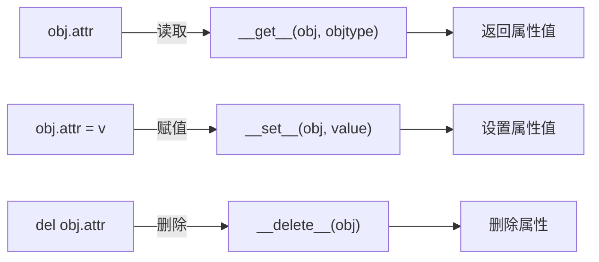
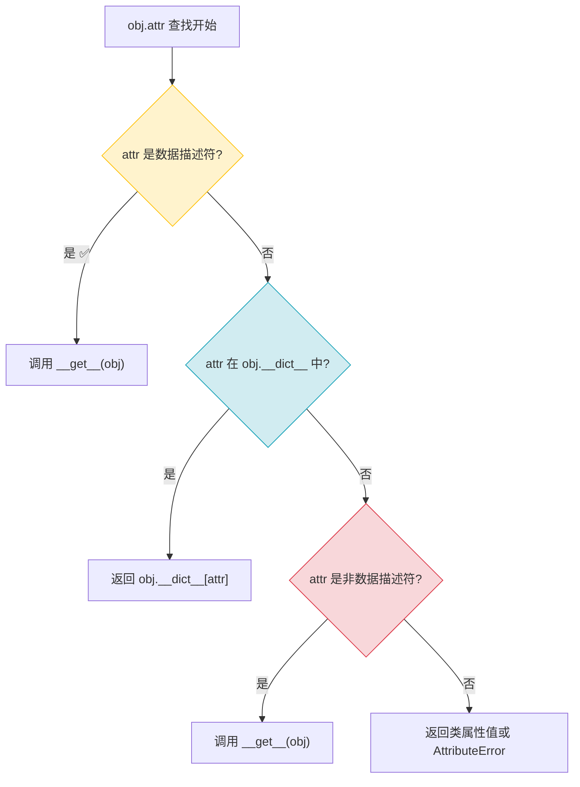
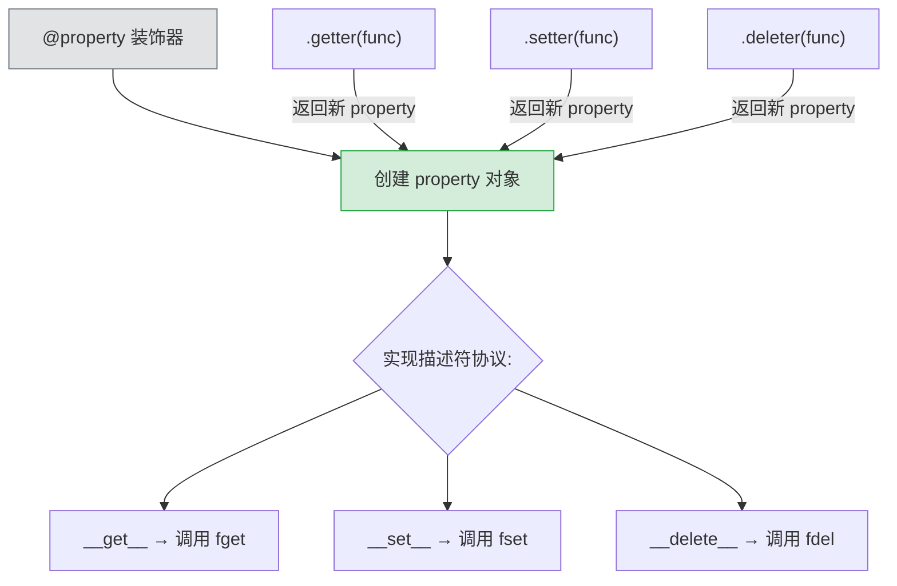
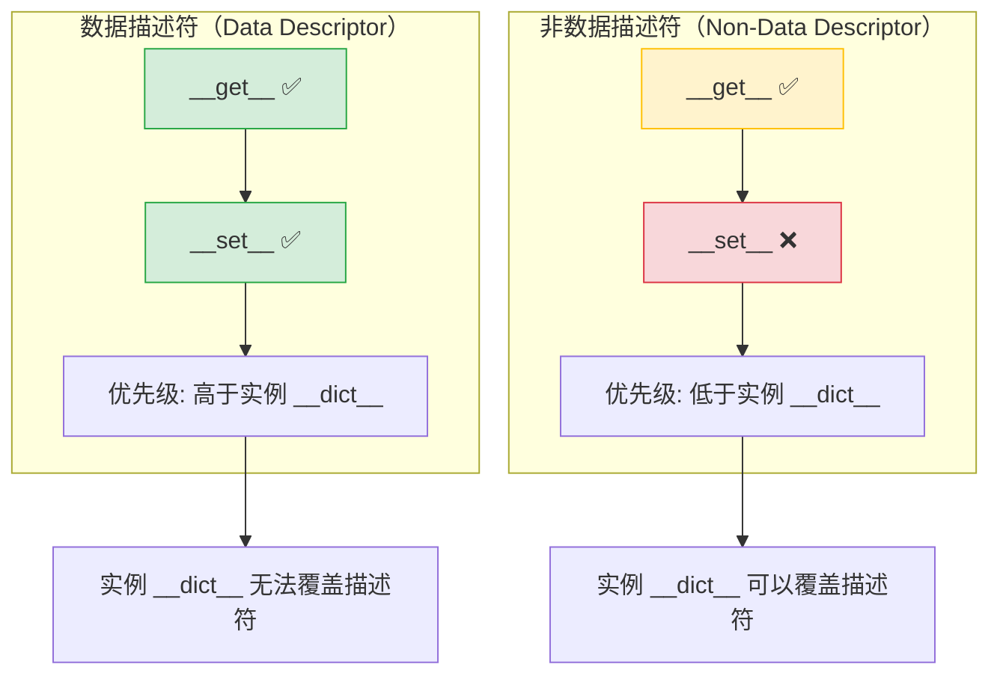
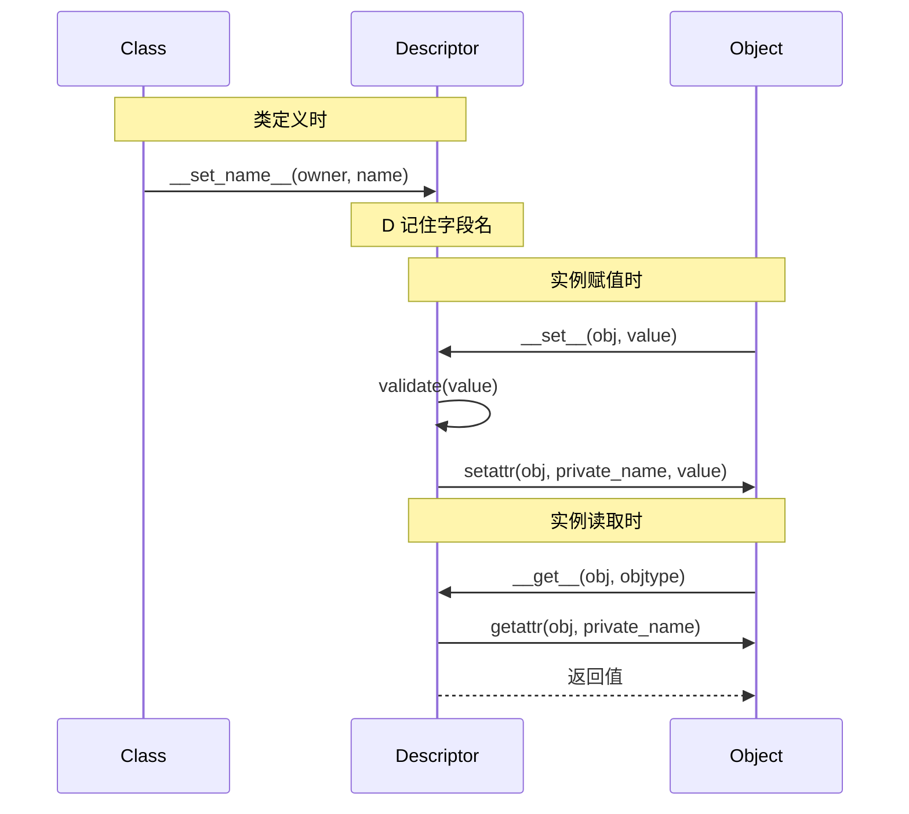
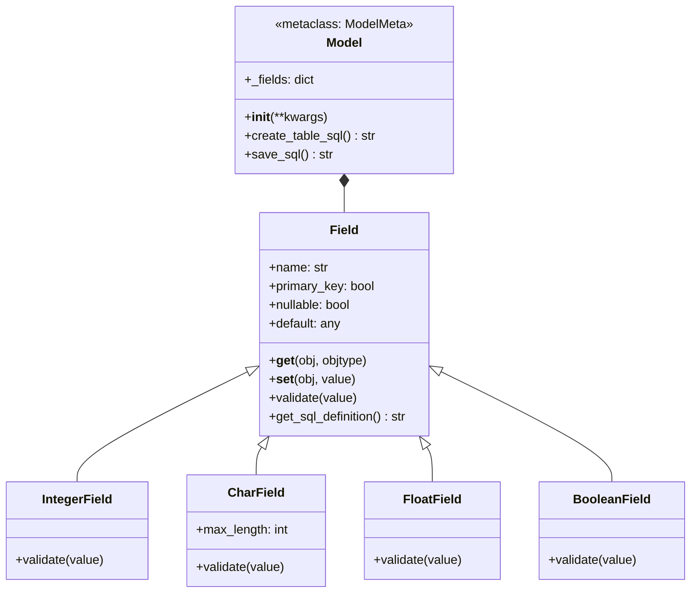

# Day 047 — 描述符（Descriptor）图解

## 1. 描述符协议三大方法

```mermaid
graph LR
    A["obj.attr"] -->|"读取"| B["__get__(obj, objtype)"]
    C["obj.attr = v"] -->|"赋值"| D["__set__(obj, value)"]
    E["del obj.attr"] -->|"删除"| F["__delete__(obj)"]
    B --> G["返回属性值"]
    D --> H["设置属性值"]
    F --> I["删除属性"]
```

## 2. 属性查找优先级

```mermaid
graph TD
    A["obj.attr 查找开始"] --> B{"attr 是数据描述符?"}
    B -->|"是 ✅"| C["调用 __get__(obj)"]
    B -->|"否"| D{"attr 在 obj.__dict__ 中?"}
    D -->|"是"| E["返回 obj.__dict__[attr]"]
    D -->|"否"| F{"attr 是非数据描述符?"}
    F -->|"是"| G["调用 __get__(obj)"]
    F -->|"否"| H["返回类属性值或 AttributeError"]

    style B fill:#fff3cd,stroke:#ffc107
    style D fill:#d1ecf1,stroke:#17a2b8
    style F fill:#f8d7da,stroke:#dc3545
```

## 3. property 底层实现

```mermaid
graph TD
    A["@property 装饰器"] --> B["创建 property 对象"]
    B --> C{"实现描述符协议:"}
    C --> D["__get__ → 调用 fget"]
    C --> E["__set__ → 调用 fset"]
    C --> F["__delete__ → 调用 fdel"]

    G[".getter(func)"] -->|"返回新 property"| B
    H[".setter(func)"] -->|"返回新 property"| B
    I[".deleter(func)"] -->|"返回新 property"| B

    style A fill:#e2e3e5,stroke:#6c757d
    style B fill:#d4edda,stroke:#28a745
```

## 4. 数据描述符 vs 非数据描述符

```mermaid
graph TD
    subgraph "数据描述符（Data Descriptor）"
        A1["__get__ ✅"] --> A2["__set__ ✅"]
        A2 --> A3["优先级: 高于实例 __dict__"]
    end

    subgraph "非数据描述符（Non-Data Descriptor）"
        B1["__get__ ✅"] --> B2["__set__ ❌"]
        B2 --> B3["优先级: 低于实例 __dict__"]
    end

    A3 --> C["实例 __dict__ 无法覆盖描述符"]
    B3 --> D["实例 __dict__ 可以覆盖描述符"]

    style A1 fill:#d4edda,stroke:#28a745
    style A2 fill:#d4edda,stroke:#28a745
    style B1 fill:#fff3cd,stroke:#ffc107
    style B2 fill:#f8d7da,stroke:#dc3545
```

## 5. 描述符生命周期

```mermaid
sequenceDiagram
    participant C as Class
    participant D as Descriptor
    participant O as Object

    Note over C,D: 类定义时
    C->>D: __set_name__(owner, name)
    Note over D: D 记住字段名

    Note over O,D: 实例赋值时
    O->>D: __set__(obj, value)
    D->>D: validate(value)
    D->>O: setattr(obj, private_name, value)

    Note over O,D: 实例读取时
    O->>D: __get__(obj, objtype)
    D->>O: getattr(obj, private_name)
    D-->>O: 返回值
```

## 6. ORM 字段系统架构

```mermaid
classDiagram
    class Field {
        +name: str
        +primary_key: bool
        +nullable: bool
        +default: any
        +__get__(obj, objtype)
        +__set__(obj, value)
        +validate(value)
        +get_sql_definition() str
    }

    class IntegerField {
        +validate(value)
    }

    class CharField {
        +max_length: int
        +validate(value)
    }

    class FloatField {
        +validate(value)
    }

    class BooleanField {
        +validate(value)
    }

    class Model {
        <<metaclass: ModelMeta>>
        +_fields: dict
        +__init__(**kwargs)
        +create_table_sql() str
        +save_sql() str
    }

    Field <|-- IntegerField
    Field <|-- CharField
    Field <|-- FloatField
    Field <|-- BooleanField
    Model *-- Field
```
