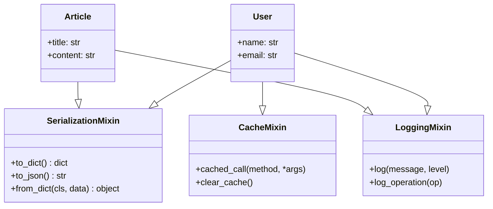
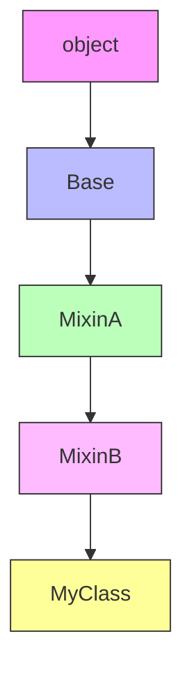

# Day 048 — 混入（Mixin）

## 📚 概念解释

### 什么是 Mixin？

**Mixin（混入）** 是一种设计模式，用于向类添加可复用的功能，而不需要使用传统的继承链。Mixin 本质上是一个**多重继承中的辅助类**，它只提供特定的功能增强，不负责完整的对象构建。

```
┌─────────────────────────────────────────────────┐
│                   主类（User）                    │
├─────────────────────────────────────────────────┤
│  name, email, ...                               │
├─────────────────────────────────────────────────┤
│         + 序列化Mixin（可选能力）                   │
│         + 日志Mixin（可选能力）                    │
│         + 缓存Mixin（可选能力）                    │
└─────────────────────────────────────────────────┘
```

### 为什么需要 Mixin？

传统继承的问题：

```python
# ❌ 继承链过深，职责不清
class Animal:
    pass

class FlyingAnimal(Animal):
    def fly(self): ...

class SwimmingAnimal(Animal):
    def swim(self): ...

class FlyingSwimmingAnimal(FlyingAnimal, SwimmingAnimal):
    def fly(self): ...
    def swim(self): ...
    # 只是为了组合能力，却产生了复杂的继承关系
```

Mixin 的解决方案：

```python
# ✅ Mixin 按需组合能力
class FlyMixin:
    def fly(self): ...

class SwimMixin:
    def swim(self): ...

class Duck(FlyMixin, SwimMixin):
    pass  # 鸭子能飞也能游，但没有深层继承
```

---

## 🔬 原理深入

### Mixin 的 MRO（方法解析顺序）

Python 通过 C3 线性化算法处理多重继承的 MRO：

```python
class A:
    def greet(self): return "Hello from A"

class B(A):
    def greet(self): return "Hello from B"

class C(A):
    def greet(self): return "Hello from C"

class D(B, C):  # D 继承 B 和 C
    pass

print(D.__mro__)
# (<class 'D'>, <class 'B'>, <class 'C'>, <class 'A'>, <class 'object'>)
```

```
MRO 查找顺序（深度优先，但有调整）：

D → B → C → A → object

   D
  / \
 B   C
  \ /
   A
   |
 object
```

### Mixin vs 普通继承的区别

| 特性 | 普通继承 | Mixin |
|------|----------|-------|
| **目的** | "是一种"关系（is-a） | "能做某事"关系（has-capability） |
| **耦合度** | 父类与子类紧密耦合 | Mixin 独立于主类 |
| **职责** | 完整的功能封装 | 单一能力增强 |
| **可复用性** | 通常绑定特定类层次 | 可跨多个不相关类复用 |
| **命名惯例** | 无特殊要求 | 通常以 `Mixin` 结尾 |

### Python 的混入协议

Python 没有语法层面的 Mixin 支持，但有约定俗成的规则：

```python
# ✅ Mixin 的设计原则
class MyMixin:
    """
    1. 不定义 __init__（或定义但调用 super().__init__()）
    2. 不存储实例状态（或只存储 Mixin 自己的状态）
    3. 提供可独立使用的方法
    4. 通常不被直接实例化
    """
    def my_feature(self):
        """提供特定功能"""
        return "I can do this!"
```

### Cooperative Multiple Inheritance（协作式多重继承）

```python
class Base:
    def __init__(self, **kwargs):
        super().__init__(**kwargs)  # 继续传递给下一个 MRO 类
        print(f"Base.__init__ called")

class MixinA:
    def __init__(self, **kwargs):
        super().__init__(**kwargs)
        print(f"MixinA.__init__ called")

class MixinB:
    def __init__(self, **kwargs):
        super().__init__(**kwargs)
        print(f"MixinB.__init__ called")

class MyClass(MixinA, MixinB, Base):
    def __init__(self, **kwargs):
        super().__init__(**kwargs)
        print(f"MyClass.__init__ called")

obj = MyClass()
# 调用顺序：MyClass → MixinA → MixinB → Base
```

---

## 📖 API 速查表

### 常用 Mixin 模式

```python
# 1. 序列化 Mixin（转为字典/JSON）
class SerializationMixin:
    def to_dict(self):
        return {k: v for k, v in self.__dict__.items()
                if not k.startswith('_')}

    def to_json(self):
        import json
        return json.dumps(self.to_dict(), ensure_ascii=False, indent=2)

# 2. 日志 Mixin
import logging
class LoggingMixin:
    def log(self, message, level=logging.INFO):
        logger = logging.getLogger(self.__class__.__name__)
        logger.log(level, message)

# 3. 比较 Mixin
class ComparableMixin:
    def __eq__(self, other):
        return self.__dict__ == other.__dict__

    def __lt__(self, other):
        return str(self) < str(other)

# 4. 缓存 Mixin
class CacheMixin:
    _cache = {}

    def cached_call(self, method_name, *args):
        key = (id(self), method_name, args)
        if key not in self._cache:
            self._cache[key] = getattr(self, method_name)(*args)
        return self._cache[key]
```

---

## 📊 图解

### Mixin 组合模式



### MRO 查找顺序



---

## 💻 实战代码案例

### 案例1：序列化 Mixin

```python
import json
from datetime import datetime


class SerializationMixin:
    """序列化混入 — 将对象转为字典和JSON"""

    def to_dict(self):
        """将对象转为字典（排除私有属性）"""
        result = {}
        for key, value in self.__dict__.items():
            if key.startswith('_'):
                continue
            if isinstance(value, datetime):
                value = value.isoformat()
            elif hasattr(value, 'to_dict'):
                value = value.to_dict()
            elif isinstance(value, list):
                value = [
                    item.to_dict() if hasattr(item, 'to_dict') else item
                    for item in value
                ]
            result[key] = value
        return result

    def to_json(self, indent=2):
        """将对象转为JSON字符串"""
        return json.dumps(
            self.to_dict(),
            ensure_ascii=False,
            indent=indent,
            default=str
        )

    @classmethod
    def from_dict(cls, data):
        """从字典创建对象（需子类实现 _parse_data）"""
        if hasattr(cls, '_parse_data'):
            data = cls._parse_data(data)
        return cls(**data)


class Address(SerializationMixin):
    def __init__(self, city, street, zipcode=""):
        self.city = city
        self.street = street
        self.zipcode = zipcode


class User(SerializationMixin):
    def __init__(self, name, email, address=None, tags=None):
        self.name = name
        self.email = email
        self.address = address  # 可以是另一个 SerializationMixin 对象
        self.tags = tags or []
        self.created_at = datetime.now()


# 使用
address = Address("北京", "朝阳区建国路88号", "100022")
user = User("张三", "zhangsan@example.com", address, ["admin", "vip"])

print("=== 字典格式 ===")
print(json.dumps(user.to_dict(), ensure_ascii=False, indent=2))

print("\n=== JSON 格式 ===")
print(user.to_json())

print("\n=== 类型判断 ===")
print(f"是 SerializationMixin 吗？ {isinstance(user, SerializationMixin)}")
```

### 案例2：日志 Mixin + 属性验证 Mixin

```python
import logging
import time
from functools import wraps


class LoggingMixin:
    """日志混入 — 为任何类添加日志能力"""

    def setup_logger(self):
        if not hasattr(self, '_logger'):
            self._logger = logging.getLogger(self.__class__.__name__)
            if not self._logger.handlers:
                handler = logging.StreamHandler()
                handler.setFormatter(
                    logging.Formatter(
                        '%(asctime)s - %(name)s - %(levelname)s - %(message)s'
                    )
                )
                self._logger.addHandler(handler)
                self._logger.setLevel(logging.INFO)
        return self._logger

    def log(self, message, level=logging.INFO):
        logger = self.setup_logger()
        logger.log(level, message)

    def log_operation(self, operation_name):
        """记录操作执行时间的装饰器"""
        def decorator(func):
            @wraps(func)
            def wrapper(*args, **kwargs):
                self.log(f"开始执行: {operation_name}")
                start = time.time()
                try:
                    result = func(*args, **kwargs)
                    elapsed = time.time() - start
                    self.log(f"完成: {operation_name} (耗时 {elapsed:.3f}s)")
                    return result
                except Exception as e:
                    self.log(f"失败: {operation_name} - {e}", logging.ERROR)
                    raise
            return wrapper
        return decorator


class ValidationMixin:
    """属性验证混入 — 为类添加字段验证能力"""

    def _validate_field(self, field_name, value, rules):
        """通用字段验证"""
        errors = []

        if 'type' in rules and not isinstance(value, rules['type']):
            errors.append(
                f"{field_name}: 期望 {rules['type'].__name__}, "
                f"实际 {type(value).__name__}"
            )

        if 'min_length' in rules and len(str(value)) < rules['min_length']:
            errors.append(
                f"{field_name}: 长度不能少于 {rules['min_length']}"
            )

        if 'max_length' in rules and len(str(value)) > rules['max_length']:
            errors.append(
                f"{field_name}: 长度不能超过 {rules['max_length']}"
            )

        if 'not_empty' in rules and not value:
            errors.append(f"{field_name}: 不能为空")

        return errors


class UserService(LoggingMixin, ValidationMixin):
    """用户服务 — 组合日志和验证能力"""

    def __init__(self):
        self.users = {}

    def add_user(self, name, email):
        # 验证
        errors = []
        errors.extend(self._validate_field('name', name, {
            'type': str, 'min_length': 2, 'not_empty': True
        }))
        errors.extend(self._validate_field('email', email, {
            'type': str, 'not_empty': True
        }))

        if errors:
            self.log(f"添加用户失败: {errors}", logging.WARNING)
            raise ValueError("\n".join(errors))

        # 添加用户
        user_id = len(self.users) + 1
        self.users[user_id] = {'name': name, 'email': email}
        self.log(f"添加用户成功: {name} (ID={user_id})")
        return user_id

    def find_user(self, user_id):
        if user_id not in self.users:
            self.log(f"用户不存在: ID={user_id}", logging.WARNING)
            return None
        return self.users[user_id]


# 使用
service = UserService()
try:
    service.add_user("张三", "zhangsan@example.com")
    service.add_user("", "lisi@example.com")  # 会验证失败
except ValueError as e:
    print(f"错误: {e}")

user = service.find_user(1)
print(f"查找结果: {user}")
```

### 案例3：实战 — 可配置的数据管道 Mixin

```python
from typing import Any, Callable, Dict, List
import time


class TransformMixin:
    """数据转换混入 — 提供数据管道能力"""

    def __init__(self):
        self._transforms: List[Callable] = []

    def add_transform(self, func: Callable, name: str = ""):
        """添加转换函数"""
        transform = {
            'func': func,
            'name': name or func.__name__
        }
        self._transforms.append(transform)
        return self

    def transform(self, data: Any) -> Any:
        """依次应用所有转换"""
        result = data
        for t in self._transforms:
            start = time.time()
            result = t['func'](result)
            elapsed = time.time() - start
            print(f"  [{t['name']}] 完成 ({elapsed:.3f}s)")
        return result


class ValidationPipeline(TransformMixin):
    """带验证的数据管道"""

    def __init__(self):
        super().__init__()
        self._validators: List[Callable] = []

    def add_validator(self, func: Callable, name: str = ""):
        self._validators.append({
            'func': func,
            'name': name or func.__name__
        })
        return self

    def validate(self, data: Any) -> List[str]:
        """验证数据，返回错误列表"""
        errors = []
        for v in self._validators:
            error = v['func'](data)
            if error:
                errors.append(f"[{v['name']}] {error}")
        return errors

    def process(self, data: Any) -> Any:
        """处理数据：先验证，再转换"""
        errors = self.validate(data)
        if errors:
            raise ValueError("验证失败:\n" + "\n".join(errors))
        return self.transform(data)


# === 定义管道 ===

# 数值管道
number_pipeline = ValidationPipeline()

number_pipeline.add_validator(
    lambda x: None if isinstance(x, (int, float)) else "必须是数字",
    name="类型检查"
)
number_pipeline.add_validator(
    lambda x: None if x > 0 else "必须为正数",
    name="正数检查"
)

number_pipeline.add_transform(
    lambda x: x * 2,
    name="翻倍"
)
number_pipeline.add_transform(
    lambda x: round(x, 2),
    name="保留两位小数"
)

# 字符串管道
text_pipeline = ValidationPipeline()
text_pipeline.add_validator(
    lambda x: None if isinstance(x, str) and len(x) > 0 else "不能为空",
    name="非空检查"
)
text_pipeline.add_transform(
    lambda x: x.strip().lower(),
    name="去空格转小写"
)
text_pipeline.add_transform(
    lambda x: x.replace(' ', '_'),
    name="空格转下划线"
)

# 使用
print("=== 数值管道 ===")
result = number_pipeline.process(21)
print(f"结果: 21 → {result}")

print("\n=== 文符串管道 ===")
result = text_pipeline.process("  Hello World  ")
print(f"结果: '  Hello World  ' → '{result}'")

# 错误处理
print("\n=== 错误处理 ===")
try:
    number_pipeline.process(-5)
except ValueError as e:
    print(e)
```

---

## 🧠 思考题

1. **Mixin 的 `__init__` 应该怎么写？** 为什么 Mixin 通常不定义自己的 `__init__`？如果定义了，需要注意什么？

2. **Mixin 与组合（Composition）的区别是什么？** 什么情况下应该用 Mixin，什么情况下应该用组合？

3. **如何避免 Mixin 之间的命名冲突？** 如果两个 Mixin 都定义了同名方法，会发生什么？如何避免？

4. **协作式多重继承中的 `super()` 为什么重要？** 如果 Mixin 的 `__init__` 不调用 `super().__init__()`，会发生什么？

5. **Python 标准库中有哪些 Mixin 的例子？** 查看 `collections.abc` 模块，找出使用 Mixin 模式的类。

---

## 📋 今日小结

| 概念 | 说明 |
|------|------|
| **Mixin** | 通过多重继承为类添加可复用能力的辅助类 |
| **MRO** | C3 线性化算法决定多重继承的方法查找顺序 |
| **协作式继承** | `super().__init__(**kwargs)` 确保所有类都被初始化 |
| **Mixin 命名** | 通常以 `Mixin` 结尾，表明是辅助类 |
| **Mixin vs 组合** | Mixin 是"能做某事"（has-capability），组合是"有一个"（has-a） |
