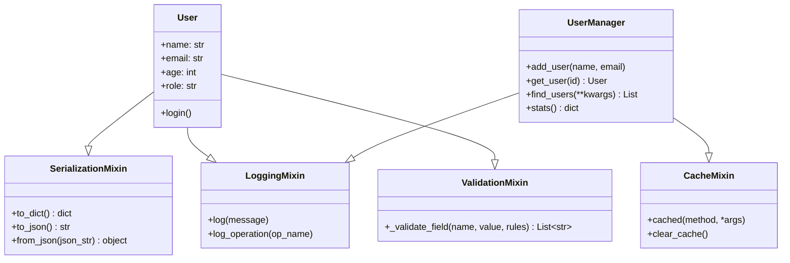

# Day 048 — 混入（Mixin）图解

## Mixin 组合模式



## MRO 查找顺序

```
class D(B, C):
    pass

继承关系图:

    D
   / \
  B   C
   \ /
    A
    |
  object

MRO 顺序: D → B → C → A → object

C3 线性化算法:
- 从左到右合并父类列表
- 检查是否有重复引用
- 确保子类在父类之前
```

## Mixin vs 继承 vs 组合

```
┌──────────────────────────────────────────────────────┐
│                    设计模式对比                        │
├──────────────┬──────────────┬───────────────────────┤
│   继承(Inheritance)    │  Mixin        │  组合(Composition)    │
├──────────────┼──────────────┼───────────────────────┤
│ "是一种"关系  │ "能做某事"   │ "有一个"关系            │
│ (is-a)       │ (can-do)     │ (has-a)               │
├──────────────┼──────────────┼───────────────────────┤
│ 紧耦合       │ 松耦合       │ 独立                   │
│ 父类变化影响 │ Mixin 可独立 │ 组件可替换              │
│ 子类         │ 修改         │                       │
├──────────────┼──────────────┼───────────────────────┤
│ 功能完整     │ 单一能力     │ 功能完整               │
│ 封装         │ 增强         │ 封装                   │
├──────────────┼──────────────┼───────────────────────┤
│ class Dog    │ class Dog    │ class Dog:             │
│   (Animal):  │ (BarkMixin): │   self.bark =          │
│   pass       │   pass       │     BarkBehavior()     │
└──────────────┴──────────────┴───────────────────────┘
```
